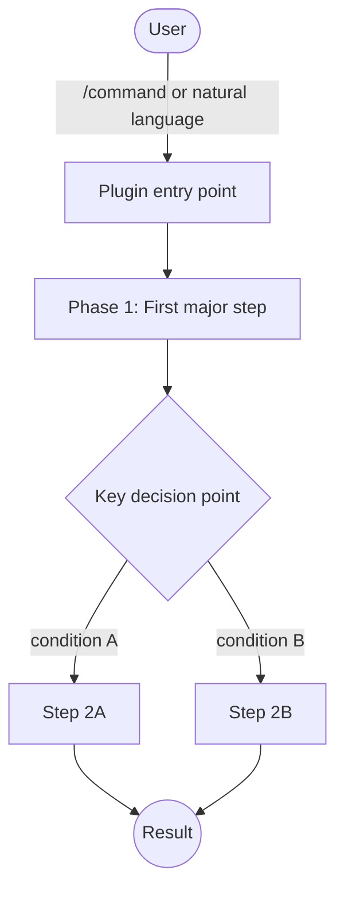

# [Plugin Name]

One-sentence description. Lead with what it does, for whom, and its core value — not its mechanism.

<!--
PLUGIN README TEMPLATE
======================
Required sections (all plugins):
  Summary, Principles, Requirements, Installation, How It Works (Mermaid),
  Usage, Planned Features, Known Issues, Links

Optional sections (include only if applicable):
  - Features        → MCP servers with many tools; plugins where capabilities aren't
                       obvious from the component tables alone
  - Commands        → plugins with slash commands
  - Skills          → plugins with skills
  - Agents          → plugins with custom subagent definitions
  - Hooks           → plugins that register lifecycle hooks
  - Tools           → MCP server plugins
  - Configuration   → plugins with user-configurable settings (config files, env vars)
  - Design Decisions → intentional trade-offs that might look wrong to a reader
  - Plugin Structure → useful when the layout is non-obvious or heavily customized

Delete this comment block before publishing.
-->

## Summary

<!-- 2–4 sentences. Describe the problem this plugin solves, how it approaches the
     problem differently from a naive solution, and the key experience it delivers.
     Avoid repeating the one-liner verbatim. Don't narrate what sections follow. -->

## Principles

<!-- Plugin-specific design principles. These are the standards against which every
     design decision in this plugin is evaluated. Use the numbered [Pn] convention.
     Aim for 3–7 principles. Each should forbid or require something concrete. -->

Design decisions in this plugin are evaluated against these principles.

**[P1] Principle Name**: Describe what this principle requires or forbids, and why.

**[P2] Principle Name**: Describe what this principle requires or forbids, and why.

**[P3] Principle Name**: Describe what this principle requires or forbids, and why.

## Features

<!-- OPTIONAL. Include when capabilities aren't obvious from the component tables alone —
     most useful for MCP servers with many tools where a module-level summary adds value
     above the tool tables. For plugins where Commands/Skills/Hooks tell the full story,
     omit this section to avoid duplication.
     Bold the feature name, dash, then one-sentence description. -->

- **Feature one**: What the user can do and why it matters.
- **Feature two**: What the user can do and why it matters.
- **Feature three**: What the user can do and why it matters.

## Requirements

<!-- List runtime prerequisites: runtime versions, system tools, OS constraints,
     external services (GitHub CLI, Docker, etc.), and access requirements (sudo, PAT).
     If there are no external requirements beyond Claude Code, state: "None beyond Claude Code." -->

- Claude Code (any recent version)
- Node.js 20+ *(if MCP server or TypeScript build required)*
- Python 3.12+ *(if Python-based)*
- `gh` CLI authenticated *(if GitHub API access needed)*
- Linux (Debian/RHEL-based) *(if OS-constrained)*

## Installation

```bash
/plugin marketplace add L3DigitalNet/Claude-Code-Plugins
/plugin install plugin-name@l3digitalnet-plugins
```

For local development or testing without installing:

```bash
claude --plugin-dir ./plugins/plugin-name
```

### Post-Install Steps

<!-- Steps that are not automated by the plugin installer. Delete this subsection if
     there are no post-install steps. Common examples: npm install, config file
     generation, API key setup. -->

Install Node.js dependencies after installation:

```bash
cd ~/.claude/plugins/cache/l3digitalnet-plugins/plugin-name
npm install
```

The `dist/` directory ships prebuilt — a build step is only required if you modify the
TypeScript source.

## How It Works

<!-- Mermaid flowchart showing the plugin's primary execution path.
     Focus on the happy path; error branches can be simplified or omitted.
     Use Claude Code tool names and plugin component names where relevant.
     Common node shapes:
       User([User])               → actor (stadium)
       [Component]                → internal processing step (rectangle)
       {Decision}                 → branching condition (diamond)
       ((Output))                 → terminal result (circle)
     Keep the diagram to ~10 nodes maximum for readability.
     Line breaks in node labels: use <br/> — NOT \n (GitHub renders \n literally). -->



## Usage

<!-- Describe the typical invocation and what the user should expect.
     Use numbered steps for multi-phase workflows. Include natural language
     alternatives if the plugin responds to them. -->

```
/command-name [optional-args]
```

Natural language triggers: *"phrase that activates this plugin"*, *"alternative phrase"*.

Typical workflow:

1. **Step one**: Invoke the command and describe your goal.
2. **Step two**: Review the output or approve the plan.
3. **Step three**: The plugin executes and delivers the result.

## Commands

<!-- One table per component type. Delete sections that don't apply. -->

| Command | Description |
|---------|-------------|
| `/command-name` | What it does and when to use it. |

## Skills

| Skill | Loaded when |
|-------|-------------|
| `skill-name` | On `/command-name` invocation, or when Claude deems it contextually relevant. |

## Agents

| Agent | Description |
|-------|-------------|
| `agent-name` | What it does, what tools it has access to, and what it's isolated from. |

## Hooks

<!-- If no hooks, delete this section.
     Hooks are listed by script name, not by event name. Each script may cover
     multiple event types; note conditional registration logic where relevant. -->

All hooks are registered declaratively via `hooks/hooks.json` — no runtime setup needed.

| Hook | Event | What it does |
|------|-------|-------------|
| `script-name.sh` | PreToolUse / PostToolUse / SessionStart | Behavior when triggered; what it blocks, warns about, or records. |

## Tools

<!-- MCP server plugins only. Group by module if there are many tools.
     Delete this section for non-MCP plugins. -->

| Module | Count | Example Tools |
|--------|-------|--------------|
| Module name | N | `tool_one`, `tool_two`, `tool_three` |

## Configuration

<!-- OPTIONAL. Include for plugins with user-configurable settings (config files,
     environment variables, flags). Show the config file path, how it is generated,
     and what each key setting controls. Delete this section if there is no configuration
     surface — don't invent settings for the sake of the section. -->

A default configuration is generated at `~/.config/plugin-name/config.yaml` on first run.

```yaml
key_setting: default_value   # What this controls
other_setting: true          # Why the default is what it is
```

## Planned Features

<!-- Use imperative phrases. Describe what users will be able to do — not
     implementation details. Omit timelines and version targets. -->

- **Feature name**: What users will be able to do once this is shipped.
- **Feature name**: What users will be able to do once this is shipped.

## Known Issues

<!-- Runtime bugs, unintentional limitations, and missing workarounds. This section is
     for things that are wrong or incomplete, not for intentional trade-offs (those
     belong in Design Decisions). Each entry: bold title, colon, description,
     workaround if one exists. Don't pad with trivial caveats. -->

- **Issue title**: What goes wrong and under what conditions. Workaround: *do X instead*.
- **Issue title**: What goes wrong and under what conditions. No workaround currently.

## Design Decisions

<!-- OPTIONAL. Intentional trade-offs that might look wrong to a reader without context.
     Use this for choices that were actively debated and where the "obvious" alternative
     was rejected for a specific reason. Examples: why a file is large by design, why a
     safety guard doesn't cover a particular tool, why a simpler approach was ruled out.
     Delete this section if there are no non-obvious decisions worth documenting. -->

- **Decision title**: What the choice is, what the alternative was, and why the
  alternative was rejected.

## Links

- Repository: [L3DigitalNet/Claude-Code-Plugins](https://github.com/L3DigitalNet/Claude-Code-Plugins)
- Changelog: [`CHANGELOG.md`](CHANGELOG.md)
- Issues and feedback: [GitHub Issues](https://github.com/L3DigitalNet/Claude-Code-Plugins/issues)
- Design document: [`docs/DESIGN.md`](docs/DESIGN.md) *(if one exists)*
