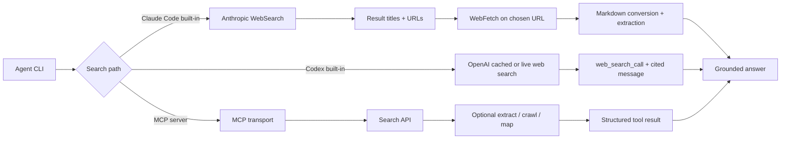
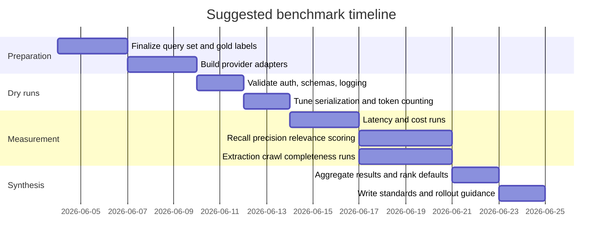

# LLM Coding Agent Search Tools

## Executive summary

As of June 2026, both major coding-agent CLIs now ship with first-party web search out of the box, but they do not behave the same. **Claude Code** includes built-in `WebSearch` and `WebFetch`; `WebSearch` returns titles and URLs from Anthropic’s search backend, while `WebFetch` fetches a page, converts HTML to Markdown, and answers over that content with a small fast model. **Codex CLI** also ships with first-party web search, but for local tasks it defaults to an **OpenAI-maintained cached web index** rather than live fetches; live search is enabled with `--search`, `web_search = "live"`, or full-access sandbox modes. That makes Codex’s default posture safer and often faster, but less fresh than live-only search. citeturn28view0turn18view1turn20view3turn30view0

Among the three MCP options you named, they split cleanly by use case. **Serper** is the thinnest and cheapest high-recall Google wrapper: real-time Google SERP results, two tools only, and very low API pricing. **Tavily** is the most feature-complete web layer for agent workflows, because the current MCP repo exposes search, extract, crawl, map, and research tools; it is the strongest option when the agent must move beyond search into page extraction or whole-site discovery. **Brave** is the most balanced “general-purpose agent search MCP” because its repo exposes broad search primitives plus `brave_llm_context`, which returns bounded, LLM-shaped grounding with explicit token controls, and because Brave’s Search API is flat-priced and backed by an independent index rather than a Google-scraping proxy. citeturn15view2turn36view0turn16view0turn31view0turn31view2turn10search2

If forced to choose a default stack today, I would use **Brave MCP for day-to-day structured agent search**, **Tavily MCP for extraction/crawl-heavy work**, and **Serper MCP when you specifically want Google-like recall at the lowest API cost**. I would use **Claude Code built-ins** when working primarily inside Claude Code and wanting minimal integration overhead, and **Codex built-in search** when working inside Codex and prioritizing safety-by-default plus zero MCP setup. That recommendation is partly architectural, not benchmark-derived: the providers’ docs are strong on features and pricing, but not on cross-provider recall/precision statistics. citeturn26view0turn18view1turn13view1turn36view0turn16view0

## Tooling architectures and out-of-box behavior

Claude Code’s built-in toolset now includes `WebSearch` and `WebFetch` in addition to file, shell, and code-navigation tools. `WebSearch` uses Anthropic’s backend, returns titles and URLs only, does **not** fetch result pages, may perform up to eight backend searches internally to refine results, and supports `allowed_domains` or `blocked_domains`. `WebFetch` is a separate step: it fetches a URL, converts HTML to Markdown, runs an extraction prompt against the page with a small fast model, caches responses for 15 minutes, and is intentionally lossy by design. Anthropic’s docs are explicit that if you want a different provider, you add an MCP server; the built-in backend is not configurable. citeturn26view0turn28view0

Codex CLI ships with a first-party web search tool as well, but its default is materially different. In normal local usage, Codex enables web search and uses an **OpenAI-maintained cache of web results**. That reduces exposure to live prompt injection and often improves responsiveness, but it also means default results can be less fresh than live search. Live search can be forced with `--search` for a single run or `web_search = "live"` in config; full-access / `--yolo` environments also default to live results. OpenAI’s documented output shape for web search is a `web_search_call` item plus a final `message` with inline URL citations; reasoning models also support `open_page` and `find_in_page` actions. citeturn18view1turn20view3turn30view0turn30view1

A practical consequence follows from those design choices. Claude Code’s built-in search is closer to a **search-then-fetch** pipeline, which is good for controlled retrieval but means page understanding depends heavily on `WebFetch`’s lossy extraction pass. Codex’s built-in search is closer to a **cache-first search grounding** model, which is good for safe default coding assistance but weaker when the task needs the absolute latest indexed material unless you explicitly switch to live mode. Neither tool exposes the breadth of crawl/map primitives you get from Tavily, and neither gives you direct control over the underlying search provider in the way an MCP server does. citeturn28view0turn18view1turn20view3



The comparative bottom line is straightforward: built-ins win on **setup friction**, while MCP wins on **provider choice, observability, and retrieval shape**. For coding agents, that tradeoff matters because search is rarely just “search”; it is also about how many tokens the retrieved context consumes, how much of it is controllable, and whether the agent can escalate from “find links” to “extract the relevant part of this docs site.” citeturn26view0turn18view1turn33view2turn31view0

## MCP repo-specific findings

The exact **Serper repo** you linked, `marcopesani/mcp-server-serper`, is intentionally narrow. It exposes only two tools, `google_search` and `scrape`. The search tool’s README advertises rich SERP objects, region/language targeting, time filters, pagination, and advanced search operators such as `site`, `filetype`, `inurl`, `intitle`, `related`, `cache`, `before`, `after`, `exact`, `exclude`, and `or`. The implementation concatenates those operators onto `q` and then POSTs to `https://google.serper.dev/search`; the `scrape` tool POSTs to `https://scrape.serper.dev` and can optionally return Markdown alongside text, metadata, and JSON-LD. Critically, the repo’s actual `inputSchema` marks `q`, `gl`, and `hl` as **required**, even though the README and type definitions describe `gl` and `hl` as optional. That mismatch is not theoretical; it is in the current repo code. The server also returns results to the MCP client as **JSON stringified into `content[0].text`**, not as a typed structured MCP object. citeturn15view2turn7view1turn15view0turn15view1

The current **Tavily MCP repo** is broader than Tavily’s MCP doc page alone would suggest. The doc page highlights search and extract, but the repository code exposes **five tools**: `tavily_search`, `tavily_extract`, `tavily_crawl`, `tavily_map`, and `tavily_research`. It also supports a **keyless mode** when no API key is provided, but the code explicitly says only search and extract are available in that mode; the other tools return an explanatory message requiring an API key. Repo-specific behavior matters here: the current MCP tool schema restricts `topic` to `general` in `tavily_search`, even though Tavily’s broader API family supports more specialized modes elsewhere in the docs. The repo also exposes `DEFAULT_PARAMETERS` for search defaults and `TAVILY_HUMAN_ID`, which Tavily says it hashes server-side with SHA-256 before storage. citeturn7view2turn8view3turn37view6turn33view4

The **Brave MCP repo** is the most “full wrapper” of the three. Its README documents `brave_web_search`, `brave_local_search`, `brave_video_search`, `brave_image_search`, `brave_news_search`, `brave_summarizer`, `brave_place_search`, and `brave_llm_context`. The repo defaults to **STDIO transport** in v2, supports HTTP transport if desired, and lets you whitelist or blacklist tools using environment variables. An important context-efficiency change landed in v2: `brave_image_search` no longer returns base64 image blobs, specifically to reduce latency and avoid wasting context tokens. For agentic search, the standout tool is `brave_llm_context`, which exposes explicit controls like `maximum_number_of_tokens`, `maximum_number_of_urls`, `maximum_number_of_snippets`, and threshold modes. citeturn16view0turn4view0turn3view9

## Comparative matrix

| Tooling option | Search source and freshness | Exposed tools | Response shape | Coverage and reachability | Speed / latency posture | Cost posture | Main limitations |
| --- | --- | --- | --- | --- | --- | --- | --- |
| **Claude Code built-in** | Anthropic backend; built-in `WebSearch` is real-time, while `WebFetch` caches fetched pages for 15 minutes. Backend is not configurable. citeturn26view0turn28view0 | Built-in `WebSearch` + `WebFetch` in Claude Code toolset. citeturn26view0 | `WebSearch` returns result titles + URLs only; `WebFetch` returns an extraction answer over Markdown-converted content rather than raw page text. No standalone public JSON schema is documented for Claude Code tool output. citeturn28view0 | Public web via Anthropic search backend. Domain inclusion/exclusion is supported for search, and per-domain permission prompts apply to fetch. Public Reddit / StackOverflow / GitHub pages are generally plausible if surfaced by search or fetched directly, but Anthropic does not publish per-site guarantees. Full paywalled text is not documented as supported. citeturn28view0 | Good ergonomics; repeated fetches are faster because of 15-minute fetch caching. Latency is harder to predict because search then fetch are separate steps. citeturn28view0 | API usage is $10 per 1,000 searches plus Claude token costs; Pro/Max/Team/Enterprise subscribers see included plan usage rather than per-search billing in `/usage`. citeturn23view1turn27view0 | Opaque backend; lossy fetch; no provider choice; no crawl/map primitives. citeturn28view0 |
| **Codex CLI built-in** | OpenAI cached web index by default for local tasks; live web with `--search`, `web_search = "live"`, or full-access sandbox modes. Cached mode is less fresh but safer. citeturn18view1turn20view3 | First-party web search tool built into Codex CLI. citeturn18view1 | Official output shape is a `web_search_call` item plus a final `message` with URL annotations; reasoning models can also `open_page` and `find_in_page`. `codex exec --json` exposes these items in transcript output. citeturn30view0turn30view1turn18view5 | Public indexed web. OpenAI does not publish site-specific guarantees for Reddit / StackOverflow / GitHub. Paywalled full-text access is not documented; discoverability via titles/snippets is more likely than full extraction. citeturn30view0turn18view1 | Best default posture for safety and setup speed because cached search avoids arbitrary live content unless you opt in. citeturn18view1turn20view3 | Included in ChatGPT plans for interactive use; API-key auth uses standard API pricing, including $10 / 1k web-search calls plus search content tokens billed at model rates. citeturn20view1turn20view2turn20view0 | Default cache can be stale for breaking changes; built-in search is not provider-configurable; no crawl/map semantics. citeturn18view1turn20view3 |
| **Serper MCP** | Real-time Google SERP proxy; Serper states it queries Google directly and does not cache results. citeturn13view1 | Exact repo exposes only `google_search` and `scrape`. citeturn15view2turn7view1 | Search result shape includes `searchParameters`, `knowledgeGraph`, `organic[]`, `peopleAlsoAsk[]`, and `relatedSearches[]`; scrape returns `text`, optional `markdown`, `metadata`, `jsonld`, and `credits`. The MCP server stringifies these JSON objects into plain-text tool output. citeturn15view0turn15view1turn7view1 | Best expected broad-web recall because it rides Google’s index. Public Reddit / StackOverflow / GitHub pages should be reachable if Google indexes them. Paywalled URLs/snippets are usually discoverable if indexed; full content extraction is not something the repo or provider documents as reliable. This repo has no crawl/map/site-graph support. citeturn13view1turn15view2 | Serper advertises 1–2 second typical response times, with occasional 2–4 second retries. citeturn13view1 | Cheapest search API here at volume. Free 2,500 queries; paid topology ranges from $1.00 / 1k down to $0.30 / 1k. citeturn13view3turn13view4 | Exact repo has a schema mismatch: `gl` and `hl` are required in code although described as optional elsewhere. Search-only architecture; crude MCP output typing; Google-scraping business model may be a procurement/compliance concern for some orgs. citeturn7view1turn15view0turn11search1 |
| **Tavily MCP** | Real-time search with explicit date filters; search depth spans `basic`, `advanced`, `fast`, and `ultra-fast`. `advanced` favors relevance over latency. citeturn36view8turn33view0 | Current repo code exposes `tavily_search`, `tavily_extract`, `tavily_crawl`, `tavily_map`, and `tavily_research`; keyless mode supports only search and extract. citeturn7view2turn8view3turn37view6 | Search returns `query`, optional `answer`, `images`, `results[]` with `title`, `url`, `content`, `score`, optional `raw_content` / favicon / images, plus `response_time`, `usage`, and `request_id`. Extract / crawl / map have correspondingly explicit JSON responses. citeturn34view0turn34view1turn34view3turn33view1turn34view7 | Strongest reach for **search + extraction + site discovery**. Docs and repo explicitly support advanced extraction for LinkedIn, protected sites, tables, and embedded content, though that should not be read as a documented paywall bypass. Public Reddit / StackOverflow / GitHub pages are generally in scope if found by search. citeturn8view0turn33view1turn35search5 | Flexible. `fast` / `ultra-fast` are for latency; `advanced` is slower and more expensive. Extract defaults to 10s basic / 30s advanced timeouts. citeturn36view8turn33view1 | More expensive than Serper/Brave for simple search, but uniquely cost-effective when you need extraction/crawl/map in one provider. Free 1,000 credits/month. citeturn36view0turn35search7 | Response sizes can balloon quickly with `include_raw_content`, extract, and crawl. Repo schema narrows `topic` to `general`. Tavily’s MCP docs lag the current repo capabilities. citeturn36view5turn37view6turn33view4 |
| **Brave MCP** | Brave’s independent search index, with general freshness filters and a continuously crawled news index; cached content is returned by default unless `Cache-Control: no-cache` is requested on a best-effort basis. citeturn10search2turn17view2turn32view0 | `brave_web_search`, `brave_local_search`, `brave_video_search`, `brave_image_search`, `brave_news_search`, `brave_summarizer`, `brave_place_search`, `brave_llm_context`. citeturn16view0 | Rich web-search schema with result-type filters; `brave_llm_context` returns `grounding.generic[]` and `sources`, with explicit token/url/snippet budget controls. citeturn32view0turn31view0turn31view1turn31view2 | Broad coverage across web, news, videos, images, FAQs, discussions, infoboxes, and locations. Brave explicitly documents that `LLM Context` can extract forum discussions “e.g. from Reddit” and code/material for technical questions. Public StackOverflow and GitHub pages are therefore a strong expected fit, though not named individually in the docs. Full paywalled text remains undocumented. citeturn32view0turn17view1 | Strong for agents because `brave_llm_context` is single-search, token-bounded, and optimized for speed. Search plan capacity is documented at 50 RPS. citeturn17view1turn10search3 | Flat and predictable: Search is $5 / 1k requests with $5 free monthly credits. Downstream model-token cost is separate from Brave pricing. citeturn10search3 | Independent index can be thinner than Google on some long-tail queries; some features such as extra snippets or full local behavior are plan-gated; query metadata is retained for up to 90 days for billing/troubleshooting. citeturn16view0turn10search0turn10search9 |

A necessary caveat on site coverage: only **Brave** explicitly documents forum-discussion extraction, including Reddit, for its LLM-oriented endpoint. For the other tools, support for Reddit, StackOverflow, GitHub, and paywalled publishers is partly an **inference from public-web indexing plus each product’s extraction design**, not a provider guarantee. That makes live benchmarking mandatory before making a hard enterprise standard around source coverage. citeturn17view1turn13view1turn33view0turn28view0turn30view0

## Pricing and token economics

The cleanest way to think about cost is to separate **provider search/API cost** from **LLM token cost induced by retrieved context**. Claude Code and Codex built-ins combine both because the search tool is part of the model workflow. Serper, Tavily, and Brave charge for API usage, while any tokens consumed after the MCP response enters the agent context are billed by the LLM you attach to that context. Anthropic and OpenAI both price first-party web search at **$10 per 1,000 searches/calls plus model-token charges**. Serper is dramatically cheaper on API cost alone, Brave is mid-priced but flat and predictable, and Tavily is credit-based and becomes expensive only when you move from lightweight search into deeper extraction/crawl. citeturn23view1turn20view0turn13view3turn10search3turn36view0

| Option | Free tier / included access | Official search pricing | Other quota / rate notes | Estimated cost per 1,000 **simple search queries** |
| --- | --- | --- | --- | --- |
| **Claude Code built-in / Anthropic API** | Claude Code subscribers get included plan usage; API users pay per use. citeturn27view0turn20view2 | Web search: **$10 / 1,000 searches** + Claude token costs for search-generated content. Sonnet 4.6 is $3 / MTok input and $15 / MTok output. citeturn23view1turn22view0 | Anthropic bills web search separately inside `server_tool_use.web_search_requests`. citeturn23view0 | **Planning estimate:** about **$11.5–$22.0 / 1,000** one-shot searches on Sonnet 4.6, assuming roughly 0.5M–2.5M input tokens and 0.1M–0.3M output tokens across those 1,000 answers. This is an estimate, not a documented benchmark. Supported by pricing docs and tool behavior. citeturn23view1turn22view0turn28view0 |
| **Codex CLI built-in / OpenAI API** | Codex is included in ChatGPT Free/Go/Plus/Pro/Business/Edu/Enterprise for interactive use; API-key auth uses standard API billing. citeturn20view2turn20view1 | Web search: **$10 / 1,000 calls** + search content tokens billed at model rates. `gpt-5.3-codex` is $1.75 / MTok input and $14 / MTok output. citeturn20view0 | OpenAI docs note `web_search_call` actions and billing per tool call; cached vs live is a mode choice, not a separate price tier in the published pricing page. citeturn30view0turn20view0 | **Planning estimate:** about **$13–$21 / 1,000** simple searches on `gpt-5.3-codex`, assuming roughly 1.0M–4.0M search-content input tokens and 0.1M–0.3M output tokens. This is a planning estimate because OpenAI does not publish Codex-CLI-specific typical token footprints. citeturn20view0turn30view0 |
| **Serper** | **2,500 free queries**, no card required. citeturn13view4 | Top-up pricing from **$1.00 / 1k** down to **$0.30 / 1k** at volume. Starter: $50 for 50k; Standard: $375 for 500k; Scale: $1,250 for 2.5M; Ultimate: $3,750 for 12.5M. citeturn13view3 | Serper states Ultimate default rate limit is **300 QPS**. citeturn13view1 | **$0–$1.00 / 1,000**, depending on whether you are still inside the free tier and which top-up tier you buy. LLM tokens are extra and entirely downstream. citeturn13view3turn13view4 |
| **Tavily** | **1,000 free credits/month**. citeturn36view0 | PAYG is **$0.008 / credit**; monthly plans range from **$0.0075–$0.005 / credit**. Basic Search costs **1 credit**; Advanced Search costs **2 credits**; `fast` and `ultra-fast` are also **1 credit** in the search-endpoint docs. citeturn36view0turn36view8 | Research endpoint is separately capped at **20 RPM**. citeturn33view3 | **Basic/fast/ultra-fast search:** about **$5–$8 / 1,000** depending on plan. **Advanced search:** about **$10–$16 / 1,000**. Extract/crawl/map costs are variable and can dominate if you use them heavily. citeturn36view0turn36view8turn35search7 |
| **Brave Search API via MCP** | **$5 free monthly credits**, which effectively covers about **1,000 Search requests per month** at list price. citeturn10search3 | Search: **$5 / 1,000 requests**. Answers: **$4 / 1,000 queries** + **$5 / 1M input tokens** + **$5 / 1M output tokens**. citeturn10search3 | Search plan documents **50 RPS** capacity; Summarizer endpoint calls are documented as free, with search requests doing the metered work. citeturn10search3turn10search12 | **Search / LLM Context style workloads:** about **$0–$5 / 1,000** from Brave’s side, depending on whether your monthly $5 credit covers it. Downstream model-token cost remains separate. citeturn10search3 |

For token budgeting, the biggest distinction is not raw API price but **context controllability**. Brave is best in this respect because `brave_llm_context` has explicit default and maximum token-budget parameters; the default `maximum_number_of_tokens` is 8,192 and is configurable up to 32,768. Tavily is next-best because its response sizes are shaped by `search_depth`, `max_results`, `include_raw_content`, and crawl/extract parameters. Serper is the least controlled because a typical search response is raw SERP JSON, and the exact repo dumps that JSON verbatim into a text payload. Claude Code and Codex built-ins hide some of this complexity, but that also means less precise budgeting. citeturn31view2turn36view8turn7view1turn28view0turn30view0

**Planning token ranges per query, not vendor-billed facts:** a simple Serper `google_search` result with 10 organic results plus snippets and extras will often occupy roughly **1.2k–2.5k tokens** once serialized into agent context; a Claude Code `WebSearch` result is usually much lighter because it returns titles and URLs only, but `WebFetch` of a normal web page can add about **2,500 tokens** for an average 10 kB page, with large docs pages around **25,000 tokens** and PDFs much higher; Brave `brave_llm_context` gives you a direct hard ceiling; Tavily `basic` search is usually modest, but `include_raw_content`, extract, and crawl can become very large very quickly. Those ranges are analytical estimates grounded in the documented response shapes and published token examples, not measured outputs. citeturn15view0turn28view0turn31view2turn34view0turn33view1

## Recommendations and benchmark plan

For **fast, cheap lookups**, the best default MCP is **Serper** if your primary objective is “give my agent a low-cost Google-quality SERP.” The exact repo is thin and predictable, and Serper’s real-time, non-cached Google results plus very low per-query pricing make it the strongest pure lookup choice. I would not choose it if you need extraction workflows beyond single-page scrape. citeturn13view1turn13view3turn15view2

For **structured search that plays well with agent context**, the best default MCP is **Brave**. The reason is not just price. It is the combination of an independent web index, strong native result-type filtering, a dedicated news index, and most importantly `brave_llm_context`, which gives you raw grounding in a bounded format with explicit token budgets and source metadata. That is exactly what coding agents need when they are gathering technical context without wanting to ingest an entire uncontrolled page. citeturn10search2turn31view0turn31view1turn31view2

For **deep extraction, crawl, and site discovery**, the best default MCP is **Tavily**. The current repo already exposes `search`, `extract`, `crawl`, `map`, and `research`; the product’s pricing model explicitly maps to those operations; and the docs describe when to prefer map versus crawl and how extraction depth changes both cost and latency. In other words, Tavily is the closest thing here to a full web-retrieval substrate rather than just a search endpoint. citeturn7view2turn35search5turn35search7turn33view1turn33view2

A good benchmark should treat **search freshness, technical-source recall, site-specific retrieval, and token efficiency as separate dimensions**. I would use a shared query set with at least these buckets: recent package/library changes, current cloud/vendor docs, GitHub-issue discovery, StackOverflow-style troubleshooting, Reddit/community-workaround discovery, breaking-news queries, and site-scoped documentation discovery. Then measure: **p50/p95 latency**, **recall@k**, **precision@k**, **stale-result rate**, **citation correctness**, **serialized token footprint**, and **cost/query**. That separation matters because Serper may win on broad recall while Brave or Tavily wins on token efficiency or extraction completeness. citeturn13view1turn31view2turn36view8turn28view0turn18view1



A compact Python-like harness is enough to make the results defensible:

```python
# benchmark_search_tools.py
from dataclasses import dataclass
from time import perf_counter
import json

@dataclass
class QueryCase:
    qid: str
    text: str
    category: str
    expected_domains: set[str] | None = None
    freshness_sensitive: bool = False

@dataclass
class RunResult:
    provider: str
    qid: str
    latency_s: float
    http_cost_usd: float | None
    token_estimate: int
    urls: list[str]
    raw: dict | str
    notes: dict

def serialize_token_estimate(obj) -> int:
    # rough planning estimate only; replace with tokenizer-specific implementation
    s = json.dumps(obj, ensure_ascii=False) if not isinstance(obj, str) else obj
    return max(1, len(s) // 4)

def score_recall_precision(urls, expected_domains):
    if not expected_domains:
        return {}
    hits = sum(1 for u in urls if any(dom in u for dom in expected_domains))
    precision = hits / max(1, len(urls))
    recall = min(1.0, hits / max(1, len(expected_domains)))
    return {"hits": hits, "precision": precision, "recall_proxy": recall}

def run_provider(provider_adapter, cases):
    results = []
    for case in cases:
        t0 = perf_counter()
        raw = provider_adapter.search(case.text)
        dt = perf_counter() - t0
        urls = provider_adapter.extract_urls(raw)
        results.append(
            RunResult(
                provider=provider_adapter.name,
                qid=case.qid,
                latency_s=dt,
                http_cost_usd=provider_adapter.estimate_http_cost(raw),
                token_estimate=serialize_token_estimate(raw),
                urls=urls,
                raw=raw,
                notes=score_recall_precision(urls, case.expected_domains),
            )
        )
    return results
```

The adapter contract should mirror the actual interfaces under test. For **Serper**, call the repo’s `google_search` and `scrape` semantics; for **Tavily**, test `tavily_search` plus separate extract/crawl/map phases where relevant; for **Brave**, benchmark both `brave_web_search` and `brave_llm_context`; for **Claude Code** and **Codex**, capture transcript/tool items from their native JSON outputs rather than trying to fake API parity. That ensures you benchmark the actual agent-facing surface, not merely the provider’s raw HTTP endpoint. citeturn7view1turn37view6turn16view0turn18view5turn26view0

## Limitations and open questions

This report is rigorous on **officially documented behavior, repo-exposed tools, and published pricing**, but it is not a live benchmark. I did **not** execute provider API calls against a shared query set here, so conclusions about recall, precision, stale-result rates, and exact site reachability are **informed judgments**, not measured outcomes. That matters most for Reddit, StackOverflow, GitHub, and paywalled publishers, where coverage depends on current indexing and extraction behavior. citeturn17view1turn13view1turn33view0turn30view0turn28view0

There are also a few documentation asymmetries that matter operationally. The current Tavily MCP repo exposes more tools than Tavily’s MCP doc page prominently advertises, so the repo code is the better source of truth for current MCP capabilities. The Serper repo has a real `gl` / `hl` required-vs-optional mismatch. Claude Code’s public docs describe built-in behavior clearly, but not with a standalone JSON schema. Codex’s public docs describe the output item types for web search, but not a Codex-CLI-specific search-result schema separate from the underlying Responses API semantics. citeturn7view2turn33view4turn7view1turn15view0turn28view0turn30view0

The most important open question is therefore empirical: **which provider gives the best answer quality for your actual coding-agent workload**. My expectation is: Serper wins broad-web recall, Brave wins bounded LLM-ready grounding, Tavily wins extraction/crawl workflows, Claude built-ins win lowest integration friction inside Claude Code, and Codex built-in wins safest zero-config default inside Codex. But if you are standardizing across a team, you should still run the benchmark plan above before making it policy. citeturn13view1turn31view0turn33view2turn26view0turn18view1
