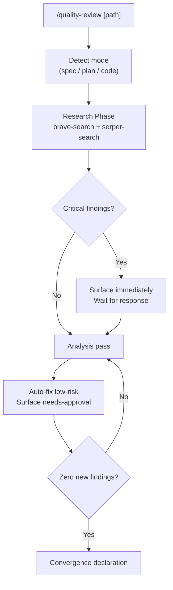

# qdev Plugin Implementation Plan

> **For agentic workers:** REQUIRED SUB-SKILL: Use superpowers:subagent-driven-development (recommended) or superpowers:executing-plans to implement this plan task-by-task. Steps use checkbox (`- [ ]`) syntax for tracking.

**Goal:** Build the `qdev` plugin — two self-contained slash commands for research-first quality review and spec sync across the development lifecycle.

**Architecture:** Pure markdown commands, no scripts/skills/hooks/agents. `quality-review.md` implements the research-first iterative loop; `spec-update.md` implements the one-shot spec sync. All logic is inline in the command files — no external references.

**Tech Stack:** Claude Code plugin system (markdown commands only). No build step, no runtime dependencies beyond MCP servers already configured in the user's environment.

**Spec:** `docs/superpowers/specs/2026-04-13-qdev-design.md`

---

## File Map

| Action | Path | Responsibility |
| --- | --- | --- |
| Create | `plugins/qdev/.claude-plugin/plugin.json` | Plugin manifest — name, version, description, author |
| Create | `plugins/qdev/commands/quality-review.md` | Research-first iterative quality review command |
| Create | `plugins/qdev/commands/spec-update.md` | One-shot spec sync command |
| Create | `plugins/qdev/CHANGELOG.md` | Keep a Changelog format |
| Create | `plugins/qdev/README.md` | Plugin documentation |
| Modify | `.claude-plugin/marketplace.json` | Add qdev entry to the plugin catalog |

---

### Task 1: Scaffold plugin structure

**Files:**

- Create: `plugins/qdev/.claude-plugin/plugin.json`
- Create: `plugins/qdev/CHANGELOG.md`

- [ ] **Step 1: Create plugin.json**

```bash
mkdir -p plugins/qdev/.claude-plugin plugins/qdev/commands
```

Create `plugins/qdev/.claude-plugin/plugin.json`:

```json
{
	"name": "qdev",
	"version": "1.0.0",
	"description": "Research-first quality review and spec sync across the development lifecycle. Two slash commands: /quality-review runs web research then an iterative gap/consistency fix loop until convergence, /spec-update brings a spec file up to date with the current implementation.",
	"author": { "name": "L3DigitalNet", "url": "https://github.com/L3DigitalNet" },
	"homepage": "https://github.com/L3DigitalNet/Claude-Code-Plugins/tree/main/plugins/qdev"
}
```

- [ ] **Step 2: Verify JSON is valid**

```bash
python3 -c "import json; json.load(open('plugins/qdev/.claude-plugin/plugin.json')); print('OK')"
```

Expected output: `OK`

- [ ] **Step 3: Create CHANGELOG.md**

Create `plugins/qdev/CHANGELOG.md`:

```markdown
# Changelog

All notable changes to this project will be documented in this file.

The format is based on [Keep a Changelog](https://keepachangelog.com/).

## [1.0.0] - 2026-04-13

### Added

- `/qdev:quality-review` command: research-first iterative quality review for spec, plan, and code artifacts
- `/qdev:spec-update` command: one-shot sync of a spec file to match current implementation
```

- [ ] **Step 4: Commit**

```bash
git add plugins/qdev/.claude-plugin/plugin.json plugins/qdev/CHANGELOG.md
git commit -m "feat(qdev): scaffold plugin structure"
```

---

### Task 2: Register in marketplace

**Files:**

- Modify: `.claude-plugin/marketplace.json` (add entry before the closing `]`)

- [ ] **Step 1: Add qdev entry to marketplace.json**

In `.claude-plugin/marketplace.json`, add the following entry to the `plugins` array (before the closing `]`). The existing last entry ends with `}` — add a comma after it, then add:

```json
{
	"name": "qdev",
	"description": "Research-first quality review and spec sync across the development lifecycle. /quality-review runs web research then an iterative gap/consistency fix loop until convergence. /spec-update brings a spec file in sync with the current implementation.",
	"version": "1.0.0",
	"author": { "name": "L3DigitalNet", "url": "https://github.com/L3DigitalNet" },
	"source": "./plugins/qdev",
	"homepage": "https://github.com/L3DigitalNet/Claude-Code-Plugins/tree/main/plugins/qdev"
}
```

- [ ] **Step 2: Run marketplace validator**

```bash
./scripts/validate-marketplace.sh
```

Expected: no errors. If any errors are reported, fix them before continuing.

- [ ] **Step 3: Commit**

```bash
git add .claude-plugin/marketplace.json
git commit -m "feat(qdev): add marketplace entry"
```

---

### Task 3: Write quality-review command

**Files:**

- Create: `plugins/qdev/commands/quality-review.md`

- [ ] **Step 1: Create quality-review.md**

Create `plugins/qdev/commands/quality-review.md` with the following complete content:

````markdown
---
name: quality-review
description: Research-first quality review with iterative gap/consistency check and fix loop until convergence. Detects spec, plan, or code mode automatically. Runs comprehensive web research first to establish ground truth, then iterates until zero findings remain.
argument-hint: '[optional: path to file or directory to review]'
allowed-tools:
  - Read
  - Write
  - Edit
  - Glob
  - Grep
  - Bash
  - AskUserQuestion
  - WebFetch
  - mcp__brave-search__brave_web_search
  - mcp__serper-search__google_search
---

# /qdev:quality-review

Research-first quality review with an iterative fix loop until convergence.

## Step 1: Artifact Detection

If `$ARGUMENTS` is provided, use it as the target path.

Otherwise, scan the working directory:

```bash
find . -maxdepth 3 \( -name "*.md" -o -name "*.py" -o -name "*.ts" -o -name "*.js" -o -name "*.go" -o -name "*.rs" -o -name "*.sh" \) -not -path "*/.git/*" -not -path "*/node_modules/*" | sort
```

Apply this priority order to identify mode:

1. `.md` file whose name contains `spec`, `design`, or `architecture` → **spec mode**
2. `.md` file whose name contains `plan`, `implementation`, or `roadmap` → **plan mode**
3. Source files (`.py`, `.ts`, `.js`, `.sh`, `.go`, `.rs`, `.rb`, `.java`, `.cpp`) → **code mode**

If multiple candidates match or the type is ambiguous, use `AskUserQuestion` to present the top candidates as bounded choices. Do not guess.

Announce the detected mode and target before proceeding:

```
Target: <path>
Mode:   <spec | plan | code>
```

## Step 2: Research Phase

Extract every dependency, library, API, framework, protocol, and external tool referenced in the target artifact. For source code, also extract version pins from any lock files, `requirements.txt`, `package.json`, `go.mod`, `pyproject.toml`, or equivalent present in the project.

For each identified dependency or technology, query **both** `mcp__brave-search__brave_web_search` and `mcp__serper-search__google_search` with 10+ results each. Cover:

- **Current official docs**: latest API signatures, configuration options, behavioral changes, deprecations since the version in use
- **Known bugs and CVEs**: open issues, security advisories, version-specific defects relevant to this codebase
- **Community best practices**: patterns the ecosystem currently recommends or has deprecated
- **Common pitfalls**: known footguns, gotchas, version compatibility issues

Compile a **research context** — a structured list of findings grouped by dependency — that will inform all analysis in Step 3.

After compiling, scan the research context for critical findings:

- Known CVE in a dependency version currently in use
- Breaking change in a dependency that makes the current implementation incorrect
- Severe deprecation with no migration path documented

If any critical findings exist, surface them immediately before entering the loop:

```
⚠ Critical finding(s) from research:
  • [VULNERABLE] <dependency>: <CVE or issue summary>
  • [BREAKING] <dependency>: <breaking change description>
```

Then use `AskUserQuestion`:

- question: `"Critical issues found. How would you like to proceed?"`
- options:
  1. label: `"Proceed with review"`, description: `"Continue into the analysis loop with these issues noted"`
  2. label: `"Stop and fix these first"`, description: `"End the review here so you can address the critical issues"`

If `"Stop and fix these first"` is chosen, list the critical findings and stop.

## Step 3: Iterative Analysis + Fix Loop

Initialize a pass counter at 1. Maintain a deferred-findings list (starts empty).

Begin each pass with: `--- Pass N ---`

### 3a. Static Analysis

Read the target artifact(s) in full. Analyze against the research context from Step 2.

**Spec mode checks:**

- **Completeness**: every feature or behavior mentioned anywhere in the spec has its own section with sufficient detail to implement
- **Internal consistency**: no two sections describe the same behavior differently
- **Unambiguous requirements**: flag every "should", "might", "could", "may" — these are weak requirements that cause implementation drift; replace with "must" or remove
- **Scope gaps**: behaviors implied by the spec but not explicitly specified (e.g., error states mentioned but not described, edge cases acknowledged but not handled)
- **Term consistency**: defined terms used consistently throughout — no synonyms for the same concept

**Plan mode checks:**

- **Spec coverage**: every requirement in the referenced spec has at least one plan step that implements it
- **Sequencing**: no step depends on an output that a later step produces; no circular dependencies
- **Missing dependencies**: a step uses a function, file, type, or schema that is defined in a step not listed as a prerequisite
- **Estimability**: each step describes a concrete action — "implement X" without showing how is a gap

**Code mode checks:**

- **Anti-patterns**: patterns the research context flags as deprecated or problematic for this language/framework
- **Naming consistency**: function, variable, and type names follow a consistent convention across all files in scope
- **Dead code**: functions, imports, or variables defined but never referenced
- **Cross-file inconsistencies**: the same concept handled differently in different files without a documented reason
- **Error handling at system boundaries**: external calls, file I/O, and user input without error handling
- **Structural issues**: functions or modules with more than one clear responsibility

Also evaluate deferred findings from prior passes to determine if any are now addressable.

### 3b. Targeted Follow-up Research

Before proposing a fix for any finding that involves an external dependency, API call, or ecosystem pattern not already covered by the Step 2 research context, run targeted searches using both `mcp__brave-search__brave_web_search` and `mcp__serper-search__google_search` to verify the proposed resolution against current official documentation and community standards.

Do not propose fixes based on training knowledge alone when a live source can be consulted.

### 3c. Finding Classification

Classify all findings into two buckets:

**Auto-fixable** (apply silently, count in pass summary):

- Formatting issues (whitespace, punctuation)
- Broken internal cross-references (a section referenced by name that was renamed)
- Minor phrasing gaps where only one correct answer exists and no design decision is required
- Missing punctuation or structural whitespace in documents

**Needs-approval** (present to user one at a time):

- Anything that changes the intent of a requirement or step
- Resolving an ambiguity that requires making a design choice
- Dependency upgrade, patch, or removal decisions
- All research-originated findings: `[OUTDATED]`, `[VULNERABLE]`, `[BEST-PRACTICE]`, `[DOCS-MISMATCH]`
- Removing code — confirm before deleting even dead code

### 3d. Apply Auto-fixes

Apply each auto-fixable finding using the `Edit` tool. Do not announce individual fixes. Accumulate the count for the pass summary.

### 3e. Surface Needs-Approval Findings

For each needs-approval finding, use `AskUserQuestion`:

- header: `"Finding [N]"`
- question: `"[OUTDATED | VULNERABLE | BEST-PRACTICE | DOCS-MISMATCH | STRUCTURAL | GAP | AMBIGUOUS]\n\nIssue: <what the problem is and why it matters>\nSource: <research URL or analysis basis>\nProposed fix: <specific change>"`
- options:
  1. label: `"Apply fix"`, description: `"Implement the proposed change"`
  2. label: `"Apply with modifications"`, description: `"Apply, but I'll describe what to change"`
  3. label: `"Defer"`, description: `"Skip for now, reconsider on the next pass"`
  4. label: `"Skip permanently"`, description: `"Do not raise this finding again"`

For `"Apply with modifications"`: ask a follow-up open-ended question for the modification, then apply.

### 3f. Pass Summary

After all findings in the pass are resolved, emit:

```
Pass N complete: N found / N auto-fixed / N approved / N deferred / N skipped
```

### 3g. Convergence Check

If this pass produced **zero new findings** (deferred items are excluded from this count): proceed to the Convergence Declaration.

Otherwise, begin Pass N+1. Deferred items from prior passes are re-evaluated in 3a of every subsequent pass. They are never silently dropped.

## Convergence Declaration

```
✓ Quality review complete — N passes, N total fixes applied.
Deferred: N items
```

If deferred items exist, list them:

```
Deferred items (not fixed):
  • [Type] <description>
```
````

- [ ] **Step 2: Verify the file was created**

```bash
wc -l plugins/qdev/commands/quality-review.md
```

Expected: 150+ lines.

- [ ] **Step 3: Commit**

```bash
git add plugins/qdev/commands/quality-review.md
git commit -m "feat(qdev): add quality-review command"
```

---

### Task 4: Write spec-update command

**Files:**

- Create: `plugins/qdev/commands/spec-update.md`

- [ ] **Step 1: Create spec-update.md**

Create `plugins/qdev/commands/spec-update.md` with the following complete content:

````markdown
---
name: spec-update
description: One-shot sync that brings a spec or design document up to date with the current implementation. Identifies features added, behaviors changed, sections now stale, and removed features. Proposes all changes before writing anything.
argument-hint: '[optional: path to spec/design file]'
allowed-tools:
  - Read
  - Write
  - Edit
  - Glob
  - Grep
  - AskUserQuestion
---

# /qdev:spec-update

Bring a spec or design document up to date with the current implementation.

## Step 1: Locate Spec

If `$ARGUMENTS` is provided, use it as the spec path. Read the file with the `Read` tool. If the file does not exist, report `File not found: <path>` and stop.

Otherwise, search for spec candidates:

```bash
find . -maxdepth 3 -name "*.md" -not -path "*/.git/*" | xargs grep -l "" 2>/dev/null | sort
```

Filter to files whose name contains `spec`, `design`, or `architecture`. If multiple candidates exist, use `AskUserQuestion` to present them as bounded choices (up to 4). If no candidates are found, report:

```
No spec file found. Provide the path explicitly:
  /qdev:spec-update path/to/spec.md
```

and stop.

## Step 2: Read and Compare

Read the spec file in full.

Locate and read all source files in the project:

```bash
find . -type f \( -name "*.py" -o -name "*.ts" -o -name "*.js" -o -name "*.go" -o -name "*.rs" -o -name "*.sh" -o -name "*.rb" \) \
  -not -path "*/.git/*" -not -path "*/node_modules/*" -not -path "*/__pycache__/*" | sort
```

Also read any `CHANGELOG.md` and files under `docs/` if present.

Compare the spec against the full implementation. Identify:

- **Features added**: behaviors or components present in the code that are absent from the spec
- **Behaviors changed**: code behavior that contradicts what the spec currently describes
- **Sections now stale**: spec language that describes how something worked previously, not how it works now
- **Removed features**: spec sections describing functionality that no longer exists in the codebase

## Step 3: Propose Changes

Before writing anything, present the full list of proposed changes:

```
Proposed spec updates (N changes):
  [ADD]     <section name or location> — document <what needs to be added>
  [UPDATE]  <section name> — <old behavior> → <new behavior>
  [REMOVE]  <section name> — <feature> no longer exists in the codebase
```

If there are no changes needed, report:

```
Spec is up to date — no changes needed.
```

and stop.

Otherwise, use `AskUserQuestion`:

- question: `"How would you like to review these N proposed changes?"`
- options:
  1. label: `"Approve all"`, description: `"Apply all N changes without individual review"`
  2. label: `"Review each one"`, description: `"Approve or skip each change individually"`
  3. label: `"Cancel"`, description: `"Make no changes"`

For `"Review each one"`, present each proposed change with `AskUserQuestion`:

- header: `"Change [N/Total]"`
- question: `"[ADD | UPDATE | REMOVE] <section>\n\n<what changes and why>"`
- options:
  1. label: `"Apply"`, description: `"Make this change"`
  2. label: `"Skip"`, description: `"Leave this section unchanged"`

## Step 4: Apply and Summarize

Apply all approved changes using the `Edit` tool. Use targeted edits — change only the specific section identified in Step 3. Never rewrite the entire file.

After all edits are applied, emit:

```
Spec updated: N additions, N modifications, N removals.
```
````

- [ ] **Step 2: Verify the file was created**

```bash
wc -l plugins/qdev/commands/spec-update.md
```

Expected: 80+ lines.

- [ ] **Step 3: Commit**

```bash
git add plugins/qdev/commands/spec-update.md
git commit -m "feat(qdev): add spec-update command"
```

---

### Task 5: Write README

**Files:**

- Create: `plugins/qdev/README.md`

- [ ] **Step 1: Create README.md**

Create `plugins/qdev/README.md` with the following complete content:

````markdown
# qdev

Research-first quality review and spec sync for every stage of the development lifecycle.

## Summary

Writing a spec, planning an implementation, or reviewing code all have different quality criteria but the same enemy: making decisions with stale or incorrect knowledge. `qdev` addresses this by running comprehensive web research before any analysis, so findings are grounded in current official docs, known CVEs, and live community standards rather than training data. The `/quality-review` command then iterates until it finds nothing left to fix. `/spec-update` handles the other direction: keeping your spec in sync with what you actually built.

## Principles

Design decisions in this plugin are evaluated against these principles.

**[P1] Research Before Analysis**: Web research runs before any gap or consistency check. No finding is proposed based on training data alone when a live source can be consulted.

**[P2] Explicit Invocation Only**: Neither command loads contextually. Both fire only when explicitly called with a slash command.

**[P3] Propose Before Writing**: No spec, plan, or source file is modified without first presenting a specific proposed change and receiving approval for structural changes.

**[P4] Convergence Without Check-ins**: The quality-review loop runs to completion without mid-pass interruptions. Only needs-approval findings surface for human input.

## Requirements

- Claude Code (any recent version)
- `brave-search` MCP server (for `/quality-review` research phase)
- `serper-search` MCP server (for `/quality-review` research phase)

## Installation

```bash
/plugin marketplace add L3DigitalNet/Claude-Code-Plugins
/plugin install qdev@l3digitalnet-plugins
```
````

For local development:

```bash
claude --plugin-dir ./plugins/qdev
```

## How It Works



## Commands

| Command | Description |
| --- | --- |
| `/qdev:quality-review` | Research-first iterative quality review until convergence |
| `/qdev:spec-update` | One-shot sync of a spec file to match current implementation |

### `/qdev:quality-review [path]`

Runs a research-first quality review on a spec, implementation plan, or source code. If no path is given, auto-detects the target from the working directory.

**Modes:**

- **Spec**: completeness, internal consistency, ambiguous requirements, scope gaps, term consistency
- **Plan**: spec coverage, sequencing, missing dependencies, estimability
- **Code**: anti-patterns, naming consistency, dead code, cross-file inconsistencies, error handling at boundaries

**Loop:** Each pass auto-fixes low-risk issues and surfaces structural or ecosystem findings for approval. Runs until a full pass produces zero new findings.

### `/qdev:spec-update [spec-path]`

Compares a spec file against all source files in the project and proposes targeted edits to bring it up to date. Presents all proposed changes before writing anything. Handles additions, updates, and removals.

## Planned Features

- Support for additional artifact types (OpenAPI specs, database schema files)

## Known Issues

None.

## Links

- [Design spec](../../docs/superpowers/specs/2026-04-13-qdev-design.md)
- [Source](https://github.com/L3DigitalNet/Claude-Code-Plugins/tree/main/plugins/qdev)

````bash

- [ ] **Step 2: Commit**

```bash
git add plugins/qdev/README.md
git commit -m "feat(qdev): add README"
````

---

### Task 6: Final validation

**Files:**

- No changes — validation only

- [ ] **Step 1: Run full marketplace validation**

```bash
./scripts/validate-marketplace.sh
```

Expected: no errors. If errors are reported, fix the specific field or entry called out before proceeding.

- [ ] **Step 2: Verify plugin directory structure**

```bash
find plugins/qdev -type f | sort
```

Expected output (exactly these 5 files):

```text
plugins/qdev/.claude-plugin/plugin.json
plugins/qdev/CHANGELOG.md
plugins/qdev/README.md
plugins/qdev/commands/quality-review.md
plugins/qdev/commands/spec-update.md
```

- [ ] **Step 3: Verify command frontmatter is well-formed**

```bash
head -15 plugins/qdev/commands/quality-review.md
head -10 plugins/qdev/commands/spec-update.md
```

Confirm each file starts with `---`, contains `name:`, `description:`, and `allowed-tools:`, and closes with `---` before the body content.

- [ ] **Step 4: Commit any fixes, then push**

If Step 1 or 3 required fixes, stage and commit them:

```bash
git add plugins/qdev/
git commit -m "fix(qdev): address validation findings"
```

Then push:

```bash
git push origin main
```
