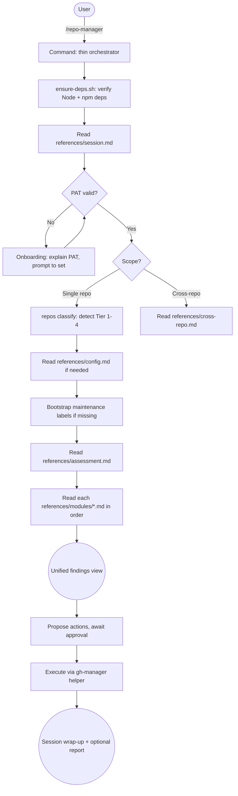

# github-repo-manager References Architecture — Implementation Plan

> **For agentic workers:** REQUIRED SUB-SKILL: Use superpowers:subagent-driven-development (recommended) or superpowers:executing-plans to implement this plan task-by-task. Steps use checkbox (`- [ ]`) syntax for tracking.

**Goal:** Convert github-repo-manager from 15 skills to a single command that reads from `references/` on demand, eliminating skill menu pollution and idle context cost.

**Architecture:** Mechanical migration — skill bodies move to `references/` with frontmatter and architectural comments stripped. The command is rewritten as a thin orchestrator that reads references at the right moment. No domain content changes.

**Tech Stack:** Markdown, bash (validation scripts)

**Spec:** `docs/ux_refresh/2026-03-27-github-repo-manager-design.md`

---

### Task 1: Create references directory structure

**Files:**
- Create: `plugins/github-repo-manager/references/` (directory)
- Create: `plugins/github-repo-manager/references/modules/` (directory)

- [ ] **Step 1: Create directories**

Run:
```bash
mkdir -p plugins/github-repo-manager/references/modules
```

- [ ] **Step 2: Verify**

Run:
```bash
ls -d plugins/github-repo-manager/references/modules
```
Expected: path exists

---

### Task 2: Move top-level orchestration skills to references

**Files:**
- Create: `plugins/github-repo-manager/references/session.md`
- Create: `plugins/github-repo-manager/references/assessment.md`
- Create: `plugins/github-repo-manager/references/command-reference.md`
- Create: `plugins/github-repo-manager/references/config.md`
- Create: `plugins/github-repo-manager/references/cross-repo.md`
- Source: `plugins/github-repo-manager/skills/repo-manager/SKILL.md`
- Source: `plugins/github-repo-manager/skills/repo-manager-assessment/SKILL.md`
- Source: `plugins/github-repo-manager/skills/repo-manager-reference/SKILL.md`
- Source: `plugins/github-repo-manager/skills/repo-config/SKILL.md`
- Source: `plugins/github-repo-manager/skills/cross-repo/SKILL.md`

For each file: read the source skill, strip the YAML frontmatter block (the `---` delimited header), strip any `#`-prefixed architectural comment blocks at the top of the body (lines starting with `#` that describe inter-skill relationships, not markdown headings), then write the remaining content to the target reference file.

- [ ] **Step 1: Create `references/session.md`**

Read `plugins/github-repo-manager/skills/repo-manager/SKILL.md`. Strip the YAML frontmatter (lines 1-4) and the architectural comment block (lines 6-19, the `#` comment lines describing relationships). Write the remaining body starting from `## Overview` to `references/session.md`.

- [ ] **Step 2: Create `references/assessment.md`**

Read `plugins/github-repo-manager/skills/repo-manager-assessment/SKILL.md`. Strip the YAML frontmatter (lines 1-4) and the architectural comment block (lines starting with `#` that describe orchestration relationships and session context). Write the remaining body starting from `## Module Execution Order` to `references/assessment.md`.

- [ ] **Step 3: Create `references/command-reference.md`**

Read `plugins/github-repo-manager/skills/repo-manager-reference/SKILL.md`. Strip the YAML frontmatter (lines 1-4). Write the remaining body to `references/command-reference.md`. This file has no architectural comments to strip.

- [ ] **Step 4: Create `references/config.md`**

Read `plugins/github-repo-manager/skills/repo-config/SKILL.md`. Strip the YAML frontmatter (lines 1-4). Write the remaining body to `references/config.md`.

- [ ] **Step 5: Create `references/cross-repo.md`**

Read `plugins/github-repo-manager/skills/cross-repo/SKILL.md`. Strip the YAML frontmatter (lines 1-4). Write the remaining body to `references/cross-repo.md`.

- [ ] **Step 6: Commit**

```bash
git add plugins/github-repo-manager/references/session.md \
       plugins/github-repo-manager/references/assessment.md \
       plugins/github-repo-manager/references/command-reference.md \
       plugins/github-repo-manager/references/config.md \
       plugins/github-repo-manager/references/cross-repo.md
git commit -m "refactor(github-repo-manager): move orchestration skills to references"
```

---

### Task 3: Move module skills to references/modules

**Files:**
- Create: `plugins/github-repo-manager/references/modules/pr-management.md`
- Create: `plugins/github-repo-manager/references/modules/issue-triage.md`
- Create: `plugins/github-repo-manager/references/modules/security.md`
- Create: `plugins/github-repo-manager/references/modules/release-health.md`
- Create: `plugins/github-repo-manager/references/modules/community-health.md`
- Create: `plugins/github-repo-manager/references/modules/dependency-audit.md`
- Create: `plugins/github-repo-manager/references/modules/notifications.md`
- Create: `plugins/github-repo-manager/references/modules/discussions.md`
- Create: `plugins/github-repo-manager/references/modules/wiki-sync.md`
- Source: corresponding `plugins/github-repo-manager/skills/*/SKILL.md` files

For each of the 9 module skills: read the source, strip the YAML frontmatter block, write the body to the corresponding `references/modules/*.md` file. Module skills have no architectural comment blocks to strip — just frontmatter.

- [ ] **Step 1: Create all 9 module references**

For each module skill, strip frontmatter and write to `references/modules/`:

| Source | Target |
|--------|--------|
| `skills/pr-management/SKILL.md` | `references/modules/pr-management.md` |
| `skills/issue-triage/SKILL.md` | `references/modules/issue-triage.md` |
| `skills/security/SKILL.md` | `references/modules/security.md` |
| `skills/release-health/SKILL.md` | `references/modules/release-health.md` |
| `skills/community-health/SKILL.md` | `references/modules/community-health.md` |
| `skills/dependency-audit/SKILL.md` | `references/modules/dependency-audit.md` |
| `skills/notifications/SKILL.md` | `references/modules/notifications.md` |
| `skills/discussions/SKILL.md` | `references/modules/discussions.md` |
| `skills/wiki-sync/SKILL.md` | `references/modules/wiki-sync.md` |

- [ ] **Step 2: Commit**

```bash
git add plugins/github-repo-manager/references/modules/
git commit -m "refactor(github-repo-manager): move 9 module skills to references/modules"
```

---

### Task 4: Delete the skills directory

**Files:**
- Delete: `plugins/github-repo-manager/skills/` (entire directory — 15 skills)

- [ ] **Step 1: Delete skills directory**

```bash
rm -rf plugins/github-repo-manager/skills
```

- [ ] **Step 2: Verify deletion**

```bash
test ! -d plugins/github-repo-manager/skills && echo "deleted"
```
Expected: `deleted`

- [ ] **Step 3: Commit**

```bash
git add plugins/github-repo-manager/skills/
git commit -m "refactor(github-repo-manager): delete skills directory (moved to references)"
```

---

### Task 5: Rewrite the command as a thin orchestrator

**Files:**
- Modify: `plugins/github-repo-manager/commands/repo-manager.md`

- [ ] **Step 1: Rewrite the command**

Replace the entire content of `commands/repo-manager.md` with:

```markdown
---
description: Activate GitHub repository management. Only runs when explicitly invoked. Does not monitor or intercept normal git operations.
allowed-tools: Bash, Read, Glob, Write, AskUserQuestion
---

# GitHub Repo Manager

You are now in GitHub Repo Manager mode. This mode was explicitly requested via `/repo-manager`. Do NOT apply any repo management logic outside of this explicit invocation. When the owner indicates they are done or changes topic, exit this mode cleanly.

## Step 0: Ensure dependencies

```bash
bash ${CLAUDE_PLUGIN_ROOT}/scripts/ensure-deps.sh
```

If this exits with an error, report the output and stop.

## Step 1: Load session behavior

Read `${CLAUDE_PLUGIN_ROOT}/references/session.md` for complete instructions on:

- How to interpret what the owner is asking for (single-repo vs. cross-repo)
- First-run onboarding flow (PAT check, tier detection, label bootstrapping)
- Tier system and mutation strategy
- Communication style and expertise levels
- Error handling philosophy
- Session wrap-up

Follow the session flow described there. When it refers to the command reference for CLI syntax, read `${CLAUDE_PLUGIN_ROOT}/references/command-reference.md`. When it refers to the configuration system, read `${CLAUDE_PLUGIN_ROOT}/references/config.md`.

## Step 2: Route by scope

**Cross-repo request:** Read `${CLAUDE_PLUGIN_ROOT}/references/cross-repo.md` and follow its instructions.

**Single-repo, narrow check** (owner asks about a specific topic like PRs, security, wiki): Read the relevant module reference from `${CLAUDE_PLUGIN_ROOT}/references/modules/` and follow its instructions. Use the module's own presentation format.

**Single-repo, full assessment:** Read `${CLAUDE_PLUGIN_ROOT}/references/assessment.md` for module execution order, cross-module deduplication rules, and the unified findings format. Then execute modules in the declared order. For each module, read its reference from `${CLAUDE_PLUGIN_ROOT}/references/modules/` as you reach it in the sequence.

## Available module references

| Module | Reference file |
|--------|---------------|
| Security | `references/modules/security.md` |
| Release Health | `references/modules/release-health.md` |
| Community Health | `references/modules/community-health.md` |
| PR Management | `references/modules/pr-management.md` |
| Issue Triage | `references/modules/issue-triage.md` |
| Dependency Audit | `references/modules/dependency-audit.md` |
| Notifications | `references/modules/notifications.md` |
| Discussions | `references/modules/discussions.md` |
| Wiki Sync | `references/modules/wiki-sync.md` |
```

- [ ] **Step 2: Verify the command is valid markdown with frontmatter**

Read back the file and confirm it has the `---` frontmatter block and all reference paths use `${CLAUDE_PLUGIN_ROOT}/references/`.

- [ ] **Step 3: Commit**

```bash
git add plugins/github-repo-manager/commands/repo-manager.md
git commit -m "refactor(github-repo-manager): rewrite command as thin orchestrator"
```

---

### Task 6: Update README.md

**Files:**
- Modify: `plugins/github-repo-manager/README.md`

- [ ] **Step 1: Update the How It Works diagram**

Replace the mermaid flowchart to reflect the new architecture. The key change: "Command loads core skill" becomes "Command reads references on demand".



- [ ] **Step 2: Replace the Skills table with a References section**

Remove the entire `## Skills` section (lines 109-127). Replace with:

```markdown
## References

Domain knowledge loaded on demand by the command. These files are never auto-loaded into context; they enter the conversation only when the command explicitly reads them.

| Reference | Purpose |
|-----------|---------|
| `session.md` | Session flow, tier system, communication style, error handling |
| `assessment.md` | Module execution order, cross-module deduplication, unified findings format |
| `command-reference.md` | `gh-manager` helper CLI syntax and available commands |
| `config.md` | Per-repo and portfolio configuration system |
| `cross-repo.md` | Cross-repository scope inference, batch mutations, portfolio scanning |
| `modules/security.md` | Security posture audit: Dependabot, code scanning, secret scanning, branch protection |
| `modules/release-health.md` | Release health: unreleased commits, CHANGELOG drift, release cadence |
| `modules/community-health.md` | Community health files: README, LICENSE, CODE_OF_CONDUCT, CONTRIBUTING, templates |
| `modules/pr-management.md` | PR triage: staleness, conflicts, review status, merge workflow |
| `modules/issue-triage.md` | Issue triage: labeling, linked PRs, stale issues |
| `modules/dependency-audit.md` | Dependency health via dependency graph and Dependabot PRs |
| `modules/notifications.md` | Notification processing with priority classification |
| `modules/discussions.md` | GitHub Discussions: unanswered questions, stale threads |
| `modules/wiki-sync.md` | Wiki content synchronization: clone, diff, generate, push |
```

- [ ] **Step 3: Commit**

```bash
git add plugins/github-repo-manager/README.md
git commit -m "docs(github-repo-manager): update README for references architecture"
```

---

### Task 7: Update CHANGELOG, bump version, validate

**Files:**
- Modify: `plugins/github-repo-manager/CHANGELOG.md`
- Modify: `plugins/github-repo-manager/.claude-plugin/plugin.json`
- Modify: `.claude-plugin/marketplace.json`

- [ ] **Step 1: Add changelog entry**

Add a new `## [0.4.0]` section at the top of the changelog (after the `# Changelog` header and before the existing `## [0.3.1]` entry). Move the existing `## [Unreleased]` above it.

```markdown
## [Unreleased]

## [0.4.0] - 2026-03-27

### Changed
- Converted 14 skills to on-demand references loaded by the command, following the nominal plugin's architecture pattern
- Rewrote `/repo-manager` command as a thin orchestrator that reads `references/` files at the right moment instead of relying on skill auto-loading
- Organized references into top-level orchestration files and `modules/` subdirectory for the 9 assessment modules

### Removed
- Deleted all 15 skills (14 moved to references, 1 self-test deleted)
- The `skills/` directory no longer exists
```

- [ ] **Step 2: Bump version in plugin.json**

Change `"version": "0.3.1"` to `"version": "0.4.0"` in `plugins/github-repo-manager/.claude-plugin/plugin.json`.

- [ ] **Step 3: Bump version in marketplace.json**

Change the `github-repo-manager` entry's `"version": "0.3.1"` to `"version": "0.4.0"` in `.claude-plugin/marketplace.json`.

- [ ] **Step 4: Validate marketplace**

Run:
```bash
./scripts/validate-marketplace.sh
```
Expected: all checks pass (the only warning should be uncommitted changes).

- [ ] **Step 5: Commit**

```bash
git add plugins/github-repo-manager/CHANGELOG.md \
       plugins/github-repo-manager/.claude-plugin/plugin.json \
       .claude-plugin/marketplace.json
git commit -m "chore(github-repo-manager): bump to 0.4.0 for references architecture"
```

---

### Task 8: Update the UX refresh tracking documents

**Files:**
- Modify: `docs/ux_refresh/plan.md`

- [ ] **Step 1: Check off github-repo-manager in the plan**

In `docs/ux_refresh/plan.md`, check all boxes under the `### 2. github-repo-manager` section. Add a row to the session log table:

```markdown
| 2026-03-27 | github-repo-manager | Complete | 15 skills → 14 references, self-test deleted, command rewritten |
```

- [ ] **Step 2: Commit**

```bash
git add docs/ux_refresh/plan.md
git commit -m "docs: mark github-repo-manager complete in UX refresh plan"
```
