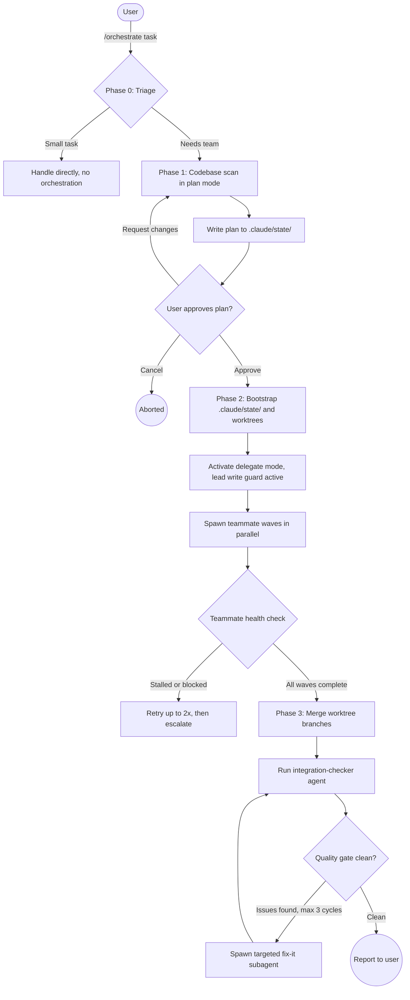

# Agent Orchestrator

General-purpose agent team orchestration with automatic context management, file isolation via git worktrees, and mechanical enforcement hooks.

## Summary

Multi-agent AI work fails in predictable ways: agents clobber each other's files, context windows fill silently, and the lead starts writing code instead of coordinating. This plugin addresses all three failure modes by structurally enforcing file ownership through git worktrees, mechanically blocking the lead from editing source files via a PreToolUse hook, and triggering handoff-before-compaction reminders at read thresholds and compaction events. The result is a repeatable orchestration loop that scales to 5 teammates across multiple execution waves without devolving into ad-hoc coordination.

## Principles

Design decisions in this plugin are evaluated against these principles, as stated in the orchestrate command.

**[P1] Triage before orchestrating**: A Phase 0 gate evaluates whether the task actually warrants a team. Tasks touching 3 or fewer files, with no cross-cutting concerns, sequential by nature, and describable in 3 sentences skip the machinery entirely. Full orchestration for trivial tasks is an anti-pattern this gate prevents.

**[P2] File ownership is structural, not behavioral**: No two teammates ever edit the same file. When multiple teammates touch the codebase, git worktrees make file-ownership conflicts structurally impossible rather than relying on instructions alone.

**[P3] The lead coordinates, never implements**: The lead orchestrator's only job after Phase 2 begins is coordination. The `lead-write-guard.sh` PreToolUse hook mechanically blocks any write to source files when `ORCHESTRATOR_LEAD=1` is set, making this constraint enforceable rather than advisory.

**[P4] Context discipline is mechanically enforced**: Compaction without writing a handoff first loses state permanently. The PreCompact hook fires before every compaction to demand a handoff note. The read-counter hook warns at 10 and 15 file reads, prompting proactive compaction before the window fills.

**[P5] Structured handoff over memory**: Orchestration state survives context loss through `.claude/state/`: the plan is written to disk in Phase 1, each teammate writes a status file and handoff note, and the lead maintains a single-writer ledger. Recovery from compaction or a stalled teammate always starts from these files.

**[P6] Fail predictably, retry sparingly**: Stalled teammates are retried at most twice before escalating to the user. Integration failures cycle through a quality gate at most 3 times. Autonomous workarounds are not attempted on critical failures.

## Requirements

- Claude Code with subagent support
- Git repository (required for worktree-based file isolation; non-git projects fall back to path discipline only)
- `CLAUDE_CODE_EXPERIMENTAL_AGENT_TEAMS=1` set for full parallel agent team mode (optional; falls back to sequential subagent pipelines if unset)
- `python3` in PATH (used by `lead-write-guard.sh` to parse hook stdin JSON)

## Installation

```
/plugin marketplace add L3Digital-Net/Claude-Code-Plugins
/plugin install agent-orchestrator@l3digitalnet-plugins
```

For local development:

```
claude --plugin-dir ./plugins/agent-orchestrator
```

## How It Works



## Usage

Invoke the command from within any project directory:

```
/orchestrate <task description>
```

The orchestrator walks through three phases:

1. **Triage (Phase 0)**: Evaluates task size. Tasks touching 3 or fewer files, sequential by nature, and describable in 3 sentences are handled directly without spinning up any team infrastructure.
2. **Plan (Phase 1)**: Scans the codebase in read-only plan mode, decomposes the work into teammate workstreams with explicit file ownership, designs a git worktree strategy, and presents a full orchestration plan for user approval. The plan is written to `.claude/state/orchestration-plan.md` before the approval prompt so it survives context loss.
3. **Execute (Phase 2)**: Bootstraps `.claude/state/` (ledger, teammate protocol, gitignore entries), creates worktrees, and spawns teammates in dependency waves with the lead-write-guard hook active. The lead monitors health via status files, aggregates results into the ledger, and compacts between waves.
4. Merges worktree branches one at a time, runs the integration-checker agent, and cycles through a quality gate until clean (max 3 cycles). A final summary is presented; state artifacts are optionally cleaned up.

When `CLAUDE_CODE_EXPERIMENTAL_AGENT_TEAMS` is not set, subagent fallback mode activates automatically. Workstreams run sequentially within each wave and cross-workstream communication routes through the lead rather than directly between teammates. The plugin outputs a warning when this mode is active.

## Commands

| Command | Description |
|---------|-------------|
| `/orchestrate` | Decompose and execute a complex task using an agent team with file isolation, wave-based parallelism, and mechanical enforcement. |

## Skills

| Skill | Loaded when |
|-------|-------------|
| `orchestration-context` | A lead or teammate needs to manage context pressure, compact their context window, or write a handoff note before compacting. |
| `orchestration-execution` | Coordinating agent waves, spawning teammates, checking health states, or a teammate appears stalled or blocked. |
| `orchestration-state` | Writing to the shared ledger, navigating worktree paths, or formatting structured scan results and status reports. |

## Agents

| Agent | Description |
|-------|-------------|
| `conflict-resolver` | Resolves git merge conflicts during worktree branch merging. Scoped to conflicting files only (uses `git diff --name-only --diff-filter=U`). Reads teammate handoff notes to understand each side's intent before resolving. Tool access: Read, Write, Edit, Bash, Grep. |
| `integration-checker` | Verifies integration of all teammate outputs after merging. Read-only plus test execution. Reports build, test, import, and type check status in a structured template. Tool access: Read, Grep, Glob, Bash. |

## Hooks

All hooks are registered declaratively via `hooks/hooks.json`; no runtime setup needed.

| Hook | Event | What it does |
|------|-------|--------------|
| `lead-write-guard.sh` | `PreToolUse`: matches `Write\|Edit\|MultiEdit\|NotebookEdit\|mcp__.*__(write\|edit\|create\|update).*` | Blocks all source file writes when `ORCHESTRATOR_LEAD=1` is set. Allows writes only to `.claude/state/`, `.claude/settings*`, and `.gitignore` at the project root. Fails open (exit 0) if file path cannot be determined. |
| `read-counter.sh` | `PostToolUse`: matches `Read\|View` | Counts file reads per session keyed by parent PID. Emits a warning at 10 reads and a critical alert at 15, prompting the agent to write a handoff and compact. |
| `on-pre-compact.sh` | `PreCompact`: matches `auto` | Logs the compaction event (with timestamp) to `.claude/state/compaction-events.log` and injects a reminder into the agent's context to write a handoff note before compaction proceeds. |

## Planned Features

- **Teammate-to-teammate messaging in subagent fallback mode**: In fallback mode, cross-workstream communication routes through the lead. A shared message bus file in `.claude/state/` would let teammates leave findings for each other without the lead as intermediary.
- **Resume from partial failure**: If the lead session crashes mid-wave, the plan and ledger exist on disk but there is no automated recovery path. A `/orchestrate resume` flow that reads `.claude/state/orchestration-plan.md` and reconstructs wave state from status files would cover this gap.
- **Automatic worktree feasibility detection**: The plan notes a non-git or shallow-clone environment as a risk flag, but the plugin does not detect this before proceeding to Phase 2 infrastructure setup.

## Known Issues

- **Worktrees require a non-shallow git clone**: Shallow clones (common in CI) do not support `git worktree add`. The orchestration plan documents this as a risk flag but does not detect it automatically before running the bootstrap script.
- **`ORCHESTRATOR_LEAD=1` must be set before bootstrap**: The lead-write-guard hook checks for this environment variable. If it is not exported before Phase 2 begins, the mechanical write block is silently inactive for the lead session.
- **Read counter does not persist across re-spawns**: The counter file is keyed by parent PID. If a teammate is re-spawned after a stall, its read count resets, so the 10/15-read warnings may not trigger as expected on a second invocation.
- **`merge-branches.sh` stops on first conflict**: The merge script exits on the first merge conflict and must be re-run after each conflict is resolved. Repositories with many teammate branches need multiple manual invocations.
- **Lead write guard does not cover the Bash tool**: The guard blocks `Write|Edit|MultiEdit|NotebookEdit` and matching MCP operations, but the lead can still modify files indirectly via shell commands.

## Design Decisions

**Single-writer ledger**: The ledger at `.claude/state/ledger.md` is written exclusively by the lead. Teammates write only to their own `<name>-status.md` files. This prevents concurrent write corruption without requiring file locking, at the cost of the lead being the coordination bottleneck for all ledger updates.

**Fail-open on unreadable file paths**: Both `lead-write-guard.sh` and the path normalization logic exit 0 (allow) when they cannot determine the target file path from the hook's stdin JSON. This avoids blocking legitimate MCP tool calls whose schema does not include a standard path field, accepting the risk that an unrecognized tool invocation bypasses the guard.

**Maximum 5 teammates**: The decomposition rules cap teams at 5. Beyond this, the command states that coordination overhead exceeds parallelism gains. This is a behavioral constraint in the prompt, not a mechanical one enforced by a hook.

## Links

- Repository: [L3Digital-Net/Claude-Code-Plugins](https://github.com/L3Digital-Net/Claude-Code-Plugins)
- Changelog: [CHANGELOG.md](CHANGELOG.md)
- Issues and feedback: [GitHub Issues](https://github.com/L3Digital-Net/Claude-Code-Plugins/issues)
