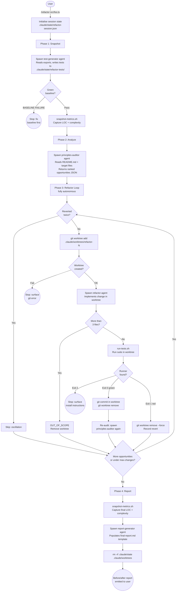

# autonomous-refactor

Test-driven autonomous refactoring against project design principles, with git worktree isolation and automatic revert on test failure.

## Summary

Manual refactoring is a cognitively expensive loop: understand design principles, find violations, change code safely, verify correctness. `autonomous-refactor` automates that cycle. It reads your project's stated design principles from `README.md`, generates a behavioural test baseline, and applies each refactoring opportunity in an isolated git worktree. Only changes that keep tests green are committed; everything else is reverted without human input. The result is a before/after report showing LOC, cyclomatic complexity, and alignment score deltas.

## Principles

**[P1] Snapshot before touching**: A behavioural test suite is generated and confirmed green before any source change. A failing baseline stops the entire session immediately; there is no option to proceed with a red baseline.

**[P2] Isolation per change**: Each refactoring opportunity runs in its own `git worktree`. Green commits merge; red tests trigger a force-remove of the worktree. Failures never touch the working branch.

**[P3] Principle-driven opportunities**: Every opportunity must cite a specific principle from the project `README.md`. Aesthetic or stylistic changes with no principle backing are out of scope. No new external dependencies may be introduced.

**[P4] Convergence without confirmation**: Phase 3 runs fully autonomously until all opportunities are addressed, `--max-changes` is reached, or a hard stop condition (git failure, missing test runner) occurs. `AskUserQuestion` is never called during the loop.

**[P5] Fail transparently**: Test failures, git errors, and missing tools surface immediately with raw output and recovery instructions. The session stops rather than attempting autonomous workarounds.

## Requirements

- Git repository (worktree isolation requires git)
- Python 3 (used by session state management scripts)
- For TypeScript targets: Node.js; test runner detectable via `package.json` scripts, `vitest`, or `jest` (resolved via `npx`)
- For Python targets: `pytest` in PATH
- Optional (for precise complexity metrics):
  - Python: `pip install radon`
  - TypeScript: `npm install -g complexity-report`
  - Without these, complexity falls back to AI-estimated values

## Installation

```
/plugin marketplace add L3Digital-Net/Claude-Code-Plugins
/plugin install autonomous-refactor@l3digitalnet-plugins
```

For local development:

```
claude --plugin-dir ./plugins/autonomous-refactor
```

### Post-Install Steps

The plugin includes a TypeScript metrics helper (`src/metrics.ts`) invoked via `npx tsx`. Install its dependencies once after install:

```bash
cd plugins/autonomous-refactor && npm install
```

The plugin degrades gracefully if this step is skipped; per-file diff summaries in the final report fall back to text descriptions from the session change log.

## How It Works



## Usage

Invoke by name with optional target files and change limit:

```
/refactor src/auth.ts src/users.ts
/refactor src/parser.ts --max-changes=5
refactor the auth module
```

If no target files are specified, the plugin lists `.ts`, `.tsx`, and `.py` files under `src/` (or project root if no `src/` exists) and presents up to 4 bounded choices. If more than 4 candidates exist, the 3 most recently modified are offered plus an "Other" option. This is the only interactive step.

**Numbered workflow phases:**

1. **Snapshot**: `test-generator` generates a behavioural test suite from all exported symbols, runs it to confirm a green baseline, and saves results to `.claude/state/refactor-tests/`. LOC and cyclomatic complexity are snapshotted. Baseline failure stops the session.
2. **Analyze**: `principles-auditor` reads project `README.md`, extracts stated design principles (sections named Principles, Design Principles, Architecture, Guidelines, or labelled P1/P2 etc.), identifies violations and improvement opportunities, scores alignment 0–100, and returns up to 15 ranked opportunities.
3. **Refactor Loop**: Opportunities run autonomously in priority order (high → medium → low), each in a dedicated git worktree. Green tests commit and trigger a re-audit; red tests force-remove the worktree and continue. Two reverts of the same opportunity cause a skip. The loop exits when all opportunities are addressed, `--max-changes` is reached, or a hard stop triggers.
4. **Report**: Final LOC, complexity, and alignment score are captured. `report-generator` populates a before/after template with deltas and a per-change table, then cleans up all session state and worktrees.

## Commands

| Command | Description |
|---------|-------------|
| `/refactor [files...] [--max-changes=N]` | Run a 4-phase autonomous refactoring session. Default max changes: 10. |

## Agents

| Agent | Description | Tools |
|-------|-------------|-------|
| `test-generator` | Phase 1. Reads target files, generates a behavioural test suite covering all exported symbols, runs tests to confirm green baseline, retries up to 3 times on test code failures. Writes tests to `.claude/state/refactor-tests/` only. | `Read`, `Glob`, `Grep`, `Bash` |
| `principles-auditor` | Phase 2 and Phase 3 re-audit. Reads target files and project `README.md`, extracts design principles, scores alignment 0–100, returns ranked JSON list of up to 15 opportunities. Re-invoked after each successful commit to discover opportunities the previous change may have resolved or exposed. | `Read`, `Glob`, `Grep` |
| `refactor-agent` | Phase 3. Receives one opportunity object and a git worktree path, implements the minimal change needed inside that worktree, returns `OUT_OF_SCOPE` if more than 3 files require changes. Does not run tests or commit; the orchestrator handles both. | `Read`, `Write`, `Edit`, `Bash`, `Glob`, `Grep` |
| `report-generator` | Phase 4. Reads session state and baseline/final metrics files, populates the `final-report.md` template with LOC delta, complexity delta, alignment score delta, and per-change outcome table. Optionally runs `src/metrics.ts` via `npx tsx` for per-file diff summaries. | `Read`, `Glob`, `Bash` |

## Planned Features

No unreleased section exists in the changelog. Gaps identified from the implementation:

- Language support beyond TypeScript and Python (the test runner, complexity tool, and file discovery are all language-gated)
- Resumable sessions: session state is cleaned up at the end of Phase 4; a mid-session crash cannot be resumed without manual recovery
- Hook-based post-session notification for CI or changelog integration

## Known Issues

- **Complexity measurement is optional.** Without `radon` (Python) or `complexity-report` (TypeScript) installed, complexity metrics report `null` with an `ai-estimated` tool label. LOC counting is always available.
- **Worktree failures are a hard stop.** If `git worktree add` fails (e.g., due to lock files or leftover worktree directories from a crashed previous session), the session stops immediately. Recovery requires manual `git worktree list` and `git worktree remove --force` invocations.
- **Project principles must be in `README.md`.** The `principles-auditor` only reads the project root `README.md`. Principles documented elsewhere (e.g., `CONTRIBUTING.md`, `ARCHITECTURE.md`) are invisible to the auditor and will produce no findings for those sections.
- **3-file scope limit per opportunity.** Any change requiring more than 3 files is skipped as `OUT_OF_SCOPE`. These opportunities are noted in the final report but not applied.
- **Baseline must be green.** Existing failing tests block the entire session. There is no `--ignore-baseline` override.

## Design Decisions

**Worktree-per-opportunity rather than branch-per-opportunity.** Each opportunity gets its own `git worktree` so the revert path is always `git worktree remove --force`, with no need to track modified files or undo partial edits. The tradeoff is that worktree creation failure is a hard stop rather than a degraded-mode fallback.

**Re-audit after each successful commit.** The `principles-auditor` runs again after every committed change rather than working from a static list. This prevents applying opportunities the previous change already resolved, and surfaces new ones only visible after earlier refactors land. Re-auditing after a revert is explicitly skipped; no code changed, so no new information.

**Orchestrator never reads source files; only the write-capable agent does.** The command file (`refactor.md`) delegates all source-level analysis and modification to agents. The `refactor-agent` is the only write-capable component and is constrained to paths within its assigned worktree, eliminating the possibility of accidental writes to the main working tree.

## Links

- Repository: [L3Digital-Net/Claude-Code-Plugins](https://github.com/L3Digital-Net/Claude-Code-Plugins)
- Changelog: [CHANGELOG.md](CHANGELOG.md)
- Issues: [GitHub Issues](https://github.com/L3Digital-Net/Claude-Code-Plugins/issues)
