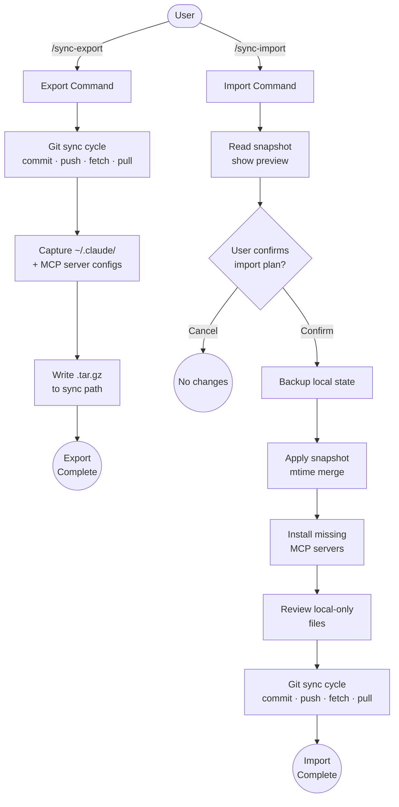

# Claude Sync

Synchronizes the Claude Code environment across multiple Linux workstations via a shared filesystem path and git.

## Summary

Claude Code settings, MCP servers, plugins, and global CLAUDE.md files are all local to a single machine. Working across multiple machines means maintaining divergent environments by hand, which adds friction and causes subtle inconsistencies.

Claude Sync captures the entire `~/.claude/` directory (with explicit exclusions for secrets and session history), extracts MCP server configs from `~/.claude.json`, and writes a `.tar.gz` snapshot to a shared path. On the other machine, the snapshot is applied with mtime-based conflict resolution and missing MCP servers are flagged for installation. Both commands also run a full git sync cycle (commit, push, fetch, pull) on every repository under the configured root, so code state travels via git rather than the snapshot.

## Principles

Design decisions in this plugin are evaluated against these principles.

**[P1] Wholesale Capture**: `~/.claude/` is captured as a complete directory tree with explicit exclusions, not a curated allowlist. New files Claude Code adds in future versions are picked up automatically.

**[P2] Git Is the Source of Truth for Code**: Repository content never travels in the snapshot. Both machines are assumed to have repos cloned; Claude Sync drives git to ensure they're current with the remote.

**[P3] Secrets Never Leave the Machine**: `.credentials.json`, OAuth tokens in `~/.claude.json`, and analytics caches are always excluded. Only the `mcpServers` key is extracted from `~/.claude.json`.

**[P4] Explicit Confirmation Before Destructive Actions**: The import plan is always shown and confirmed before any file is touched. Local-only files are reviewed individually. The backup is written before any changes.

**[P5] Machine-Local Config Stays Local**: Sync path, secret store path, repos root, and exclude list are per-machine values stored in the global CLAUDE.md. They are stripped from snapshots and never overwritten during import.

## Requirements

- Claude Code (any recent version)
- Linux (Debian/Ubuntu, RHEL/Fedora, or similar)
- `jq`: JSON processor (used by the sync scripts)
- `git`: for repository sync operations
- A shared filesystem path accessible from all machines (NFS mount, Syncthing, shared network drive)
- Git repositories already cloned on both machines

## Installation

```bash
/plugin marketplace add L3DigitalNet/Claude-Code-Plugins
/plugin install claude-sync@l3digitalnet-plugins
```

For local development or testing without installing:

```bash
claude --plugin-dir ./plugins/claude-sync
```

## How It Works



## Usage

### First run

On the first invocation of either command, Claude Sync prompts for three values and saves them to the global CLAUDE.md:
1. **Sync path**: shared filesystem location for snapshots
2. **Secret store path**: where credentials are managed
3. **Repos root path**: root directory scanned for git repos

### Typical workflow

1. **On source machine**: run `/claude-sync:sync-export`. All git repos are synced, the environment is captured, and a snapshot is written to the shared path.

2. **On target machine**: run `/claude-sync:sync-import`. The snapshot is previewed, diffed against the local environment, and applied after confirmation. Missing MCP servers are installed, local-only files are reviewed, and git repos are synced.

## Commands

| Command | Description |
|---------|-------------|
| `/claude-sync:sync-export` | Sync all git repos, capture environment, write snapshot to sync path. |
| `/claude-sync:sync-import` | Read snapshot, back up local state, apply with merge, review local-only files, sync git repos. |

## Configuration

Configuration is stored in the global `~/.claude/CLAUDE.md` as a delimited block, created during first-run setup. Each machine maintains its own config with a sync path, secret store path, repos root path, and per-machine exclude list.

The exclude list applies to both file capture and git repo sync. Entries are added via the "keep and exclude" option during import, or manually by editing the config block.

## Plugin Structure

```
claude-sync/
├── .claude-plugin/plugin.json       # Plugin manifest
├── commands/
│   ├── sync-export.md               # Export command — orchestrates git sync + capture
│   └── sync-import.md               # Import command — orchestrates preview + apply + sync
├── references/
│   ├── sync-scope.md                # What gets captured, excluded, and git-synced
│   ├── snapshot-format.md           # Archive structure, manifest schema, merge logic
│   ├── config.md                    # Configuration block format and first-run setup
│   └── ux-templates.md              # All output templates and visual grammar
├── scripts/
│   ├── git-sync.sh                  # Syncs all repos in one call, returns JSON
│   ├── capture-env.sh               # Captures env + writes archive, returns JSON
│   └── parse-snapshot.sh            # Parses snapshot + diffs local state, returns JSON
├── README.md
├── CHANGELOG.md
└── LICENSE
```

Commands orchestrate the flow and handle user interaction. Scripts do the mechanical work (scanning, diffing, archiving) in single calls that return structured JSON, reducing token usage by ~95% vs. individual bash commands. References hold domain knowledge loaded on demand.

## Design Decisions

- **No skills, only commands and references.** Reference knowledge loads only when a command requests it. Between sessions, Claude Sync consumes no context budget and adds nothing to the skills menu.

- **Wholesale directory capture instead of a file allowlist.** New settings files Claude Code introduces are captured automatically without plugin updates.

- **Bash scripts for mechanical operations.** Git sync, environment capture, and snapshot parsing each run as a single script call returning JSON. Without scripts, the git sync alone would require ~6 bash calls per repo; with 20 repos that's ~120 round-trips collapsed to 1.

- **File-level mtime for MCP conflict resolution.** Individual MCP server entries carry no timestamps. The `~/.claude.json` file mtime is the only reliable signal, so the entire `mcpServers` block is replaced or kept as a unit.

- **Both commands sync all repos on every invocation.** The snapshot manifest's repo list is informational. The receiving machine syncs its own repos regardless of what the exporting machine had.

## Planned Features

- **Session history sync**: selective sync of `~/.claude/projects/` session data across machines.
- **Hooks and standalone skills**: capture hooks and skills not installed via plugins.
- **Cross-platform support**: macOS and Windows (WSL) path resolution.

## Known Issues

- **MCP conflict resolution is file-level, not per-server.** If you change one MCP server on machine A and a different one on machine B, the older machine's entire block is overwritten. This is a deliberate v1 simplification.

- **Untracked files are not auto-committed.** The git sync cycle only stages tracked changes. New files must be manually `git add`-ed before running Claude Sync.

## Links

- Repository: [L3DigitalNet/Claude-Code-Plugins](https://github.com/L3DigitalNet/Claude-Code-Plugins)
- Changelog: [`CHANGELOG.md`](CHANGELOG.md)
- Issues and feedback: [GitHub Issues](https://github.com/L3DigitalNet/Claude-Code-Plugins/issues)
