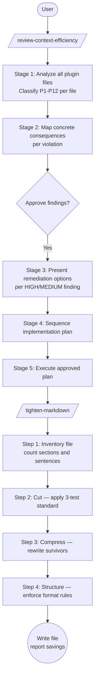

# Context Efficiency Toolkit

Audits Claude Code plugins for token and context efficiency, then rewrites instruction files to be as lean as possible without losing behavioral information.

## Summary

Every token a plugin loads — skill files, command definitions, repeated prose — costs context space that cannot be recovered. As plugins grow, bloated instructions compound across agent turns and risk context exhaustion on large inputs. The Context Efficiency Toolkit provides two structured, approval-gated workflows: a twelve-principle architectural audit that diagnoses and fixes structural inefficiency, and a prose-level rewriting pass that eliminates motivational text, restatements, and hedging from instruction files. The two commands are designed to work in sequence — settle the architecture first, then polish the language.

## Principles

**[P1] Imperative Minimalism** — Every instruction sentence must define a behavior, constrain a choice, or specify a format. Anything else is cut.

**[P2] Format Matches Data Type** — Structured data uses structured formats (YAML, tables). Behavioral rules use natural language. Never encode structured data as prose.

**[P3] Reference Over Repetition** — Define a concept once, name it, reference the name thereafter. Never restate a definition.

**[P4] Lazy Context Loading** — Read the minimum data needed at the moment it is needed. Prefer targeted reads over whole-resource reads.

**[P5] Process and Discard** — Carry forward structured summaries or extracts after reading — not raw content.

**[P6] Output Verbosity Matches Consumer** — Human-facing outputs are clear and readable. Machine-consumed outputs are compact and schema-aligned.

**[P7] Decompose by Scope** — Each subagent's input context must be constructable from a small, targeted briefing. If a subagent requires the orchestrator's full context, the decomposition is wrong.

**[P8] Subagents Return Structured Extracts** — Subagent outputs follow an explicit schema and return results, not reasoning traces.

**[P9] Orchestrator Synthesizes, Does Not Re-Analyze** — The orchestrator routes, integrates, and synthesizes. It does not re-analyze source data the subagent already processed.

**[P10] Fail Fast, Surface Early** — Surface ambiguity, infeasibility, or blockers at the earliest possible point.

**[P11] Choose the Lighter Path** — When multiple valid approaches exist and result quality is comparable, take the one with lower token cost.

**[P12] Verbosity Scales Inverse to Context Depth** — As context window depth grows, reduce tool call frequency and output verbosity.

## Requirements

- Claude Code (any recent version)

## Installation

```
/plugin marketplace add L3DigitalNet/Claude-Code-Plugins
/plugin install context-efficiency-toolkit@l3digitalnet-plugins
```

For local development:

```
claude --plugin-dir ./plugins/context-efficiency-toolkit
```

## How It Works



## Usage

Run `/review-context-efficiency` first for structural and architectural issues, then `/tighten-markdown` for prose-level rewriting. You can run `/tighten-markdown` independently at any time on any instruction file.

**`/review-context-efficiency`**

```
/review-context-efficiency
```

When prompted, provide either the plugin's root directory path (e.g., `plugins/my-plugin`) or paste a file list. The command loads two skills — `CONTEXT_EFFICIENCY_REFERENCE.md` (principle definitions) and `CONTEXT_EFFICIENCY_REVIEW.md` (workflow) — both are required. Claude will not advance past any stage or make any changes without explicit approval.

**`/tighten-markdown`**

```
/tighten-markdown
```

When prompted, provide a specific file path or a directory path. If you provide a directory, Claude lists the markdown files as a numbered list; reply with the numbers of the files to process, in order. Claude processes one file at a time with three approval checkpoints per file (after cut, after compress, before write). A typical instruction file sees 30–50% word count reduction. The command loads `MARKDOWN_TIGHTEN.md`, which contains all behavioral logic.

## Commands

| Command | Description |
|---------|-------------|
| `/review-context-efficiency` | Five-stage structured audit of a plugin against all twelve context efficiency principles, with approval checkpoints at each stage |
| `/tighten-markdown` | Five-step prose rewrite of one or more instruction markdown files: inventory, cut, compress, structure, write |

## Skills

| Skill | Loaded when |
|-------|-------------|
| `CONTEXT_EFFICIENCY_REFERENCE` | Loaded by `/review-context-efficiency`; also loaded independently when a user asks about any principle P1–P12 by name or ID |
| `CONTEXT_EFFICIENCY_REVIEW` | Loaded by `/review-context-efficiency`; provides the five-stage audit workflow |
| `MARKDOWN_TIGHTEN` | Loaded by `/tighten-markdown`; provides all behavioral logic for the five-step rewriting process |

## Planned Features

No unreleased features are currently listed in the changelog.

## Known Issues

- Both commands rely on Claude reading skill files from the plugin's skills directory at runtime. If the plugin is not correctly installed or skill paths are not resolved, commands silently fail to load behavioral instructions. Recovery: verify the plugin is installed with `/plugin list`, reinstall if needed, or paste the skill file contents directly into the session.
- A long structural review followed by tightening multiple files in the same session will accumulate significant context. For plugins with many files, run `/review-context-efficiency` and `/tighten-markdown` in separate sessions.

## Links

- Repository: [L3DigitalNet/Claude-Code-Plugins](https://github.com/L3DigitalNet/Claude-Code-Plugins)
- Changelog: [CHANGELOG.md](CHANGELOG.md)
- Issues: [GitHub Issues](https://github.com/L3DigitalNet/Claude-Code-Plugins/issues)
