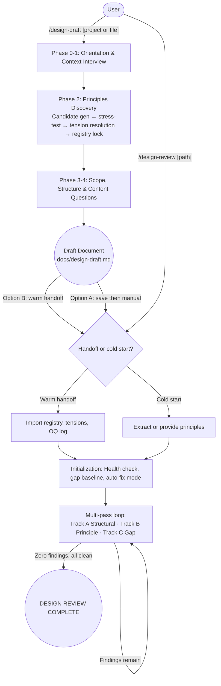

# Design Assistant

Guided design document authoring and iterative principle-enforced review — from blank slate to implementation-ready spec.

## Summary

Design Assistant covers the full lifecycle of a design document: `/design-draft` interviews you to discover, stress-test, and lock design principles before any architecture is written, then generates a structured draft; `/design-review` takes that draft through multi-pass structural analysis, principle compliance enforcement, and gap analysis with optional auto-fix. The two commands share a warm handoff contract so principles, tension resolutions, and open questions discovered during drafting carry over into the review session without re-derivation. Use `/design-draft` for new or undocumented projects; use `/design-review` directly when an existing document needs auditing.

## Principles

**[P1] Principles before architecture** — Every candidate principle is inferred from what you actually said, stress-tested against a forced tradeoff, and locked before any document sections are written. Generic best practices are rejected; a principle with no cost is not a principle.

**[P2] Tensions are resolved, not smoothed** — Contradictions between answers and conflicts between principles are named explicitly and resolved through concrete domain-specific scenarios. Unresolved tensions become the source of the most expensive design arguments later.

**[P3] Convergence without check-ins** — The review loop runs passes until a full pass produces zero findings across all three tracks and principle compliance and gap coverage are both clean. Progress is silent; blockers surface immediately.

**[P4] Principle violations are never auto-fixed** — `PRINCIPLE: Pn` findings always require individual human review regardless of auto-fix mode. Principle violations are design decisions that require conscious author resolution.

**[P5] Every fix is screened before it is offered** — Before any proposed resolution is presented, it is screened against all principles in the registry. A fix that closes one finding while violating an established principle is disqualified from auto-fix and surfaced for manual review.

## Requirements

- Claude Code (any recent version)

## Installation

```
/plugin marketplace add L3DigitalNet/Claude-Code-Plugins
/plugin install design-assistant@l3digitalnet-plugins
```

For local development:

```
claude --plugin-dir ./plugins/design-assistant
```

## How It Works



## Usage

Start a new document with `/design-draft` and an optional project name or seed file:

```
/design-draft "Payment Gateway Redesign"
/design-draft path/to/project-brief.md
```

The command walks you through six phases: orientation, context deep dive (goals, constraints, stakeholders, quality attributes), principles discovery (candidate generation, stress-testing, tension resolution, registry lock), scope and structure confirmation, targeted content questions, and draft generation.

At draft completion you can:
- Save the draft to `[project-folder]/docs/design-draft.md`
- Hand off directly to `/design-review` with full warm context (principles, tensions, and open questions pre-loaded)
- Export the principles registry separately to `[project-folder]/docs/principles-registry.md`

Begin review on an existing document with `/design-review`:

```
/design-review path/to/design-doc.md
```

The command reads the file, builds the principles registry (from the document or the warm handoff block), runs a principle health check, confirms the gap baseline, selects auto-fix mode, and enters the multi-pass loop. Each pass runs three tracks: structural/technical review, principle compliance, and gap analysis. The loop converges when a full pass is clean across all tracks.

Sessions can be suspended with `pause` and resumed by pasting the snapshot into a new session with `continue`.

## Commands

| Command | Description |
|---|---|
| `/design-draft [project-name-or-file]` | Guided design document authoring: interviews the user, discovers and locks design principles, scaffolds and generates a full draft |
| `/design-review [path/to/design-doc.md]` | Iterative review loop with principle enforcement, gap analysis, and optional auto-fix; reads the document from the filesystem |

## Skills

| Skill | Loaded when |
|---|---|
| `design-draft` | User starts a new design from scratch or a project lacks formal design documentation |
| `design-review` | User asks to review, audit, or improve a design document, architecture spec, API contract, or technical plan |

## Hooks

| Hook | Event | What it does |
|---|---|---|
| `read-counter.sh` | PostToolUse (Read tool) | Counts file reads per session using `$PPID` as session key; emits a context notice at 10 reads and a strong context pressure warning at 20 reads |

## Known Issues

- **5+ option prompts fall back to formatted text** — `AskUserQuestion` is bounded at 4 options. Decision points with 5 or more choices (finding resolution modes, tension scenarios, escalation choices, health issue resolution) are presented as formatted text rather than structured bounded-choice UI. This is a deliberate constraint imposed by the `AskUserQuestion` primitive, documented in the interaction conventions of both commands.

- **Context pressure accumulates over long review sessions** — The read-counter hook tracks file reads as a proxy for context growth. The `/design-review` end-of-pass summary also tracks estimated context growth lines with GREEN/YELLOW/RED thresholds (GREEN < 4,000 lines, YELLOW 4,000–8,000 or 3+ consecutive Heavy passes, RED > 8,000 or any Critical-volume pass). For large documents or many passes, pausing and resuming in a fresh session is recommended.

- **Behavioral-only architecture** — Both commands implement their state machines entirely through prompt instructions. There are no compiled state machines, no external databases, and no persistent session files between exchanges. All session state lives in the conversation context; the Pause State Snapshot is the only cross-session persistence mechanism.

## Design Decisions

**Two commands instead of one** — Authoring and review are split into separate commands so each can be invoked independently. A team may already have a document that needs reviewing without having gone through the drafting process; similarly, a completed draft may be reviewed separately from when it was written. The warm handoff contract enables seamless flow between them when used together.

**Warm handoff as plain text block** — The handoff from `/design-draft` to `/design-review` is a structured text block emitted into the conversation context rather than a file or API call. This keeps the architecture behavioral-only (no external state) while allowing `/design-review` to import the full principles registry, tension resolution log, and open questions log without re-deriving them from document text.

**Auto-Fix Heuristics are internal only** — Each principle carries an `auto_fix_heuristic` field used by `/design-review` to generate fixes, but this field is explicitly excluded from all user-facing output and from the rendered design document. The reader-facing fields are `Statement`, `Intent`, `Enforcement Heuristic`, `Cost of Following`, `Tiebreaker`, and `Risk Areas`.

**Phase gates block, not warn** — Every phase in `/design-draft` has a completion check that must pass before the next phase begins. Unanswered questions must become `SKIPPED: [reason]`; all candidates must have verdicts; no Active tension may survive Phase 2C. These are hard gates, not advisory checks, because downstream quality depends on each phase's outputs being complete.

## Links

- Repository: [L3DigitalNet/Claude-Code-Plugins](https://github.com/L3DigitalNet/Claude-Code-Plugins)
- Changelog: [CHANGELOG.md](CHANGELOG.md)
- Issues: [GitHub Issues](https://github.com/L3DigitalNet/Claude-Code-Plugins/issues)
