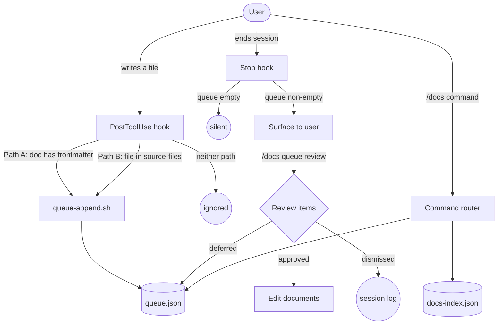

# docs-manager

Documentation lifecycle management: detects changes, queues tasks silently, surfaces them for batch review at session boundaries.

## Summary

docs-manager is a Claude Code plugin that manages the full lifecycle of personal and technical documentation across development, sysadmin, and homelab domains. It solves two intertwined problems: fragmentation (documentation scattered across projects with no central index) and drift (documentation that was accurate when written but has gone stale against the code, configs, or third-party tools it describes). The plugin monitors file changes via hooks, accumulates documentation tasks into a persistent queue without interrupting active work, and surfaces the queue for batch review at session end. Third-party documentation is periodically verified against its upstream authoritative source.

## Principles

**[P1] Domain Libraries, Not a Global Web**: Every document belongs to a named library. Discovery is guaranteed at the library level. Documents cannot be saved without declaring membership.

**[P2] Detection is Automatic; Resolution is Deferred and Batched**: Hooks observe file writes silently and append to a persistent queue. Resolution happens at session boundaries, not mid-task.

**[P3] Staleness is Surfaced at the Point of Use and at Session Close**: Freshness is checked when a project becomes active and enforced when a session ends. Dormant docs are not alarmed; active docs are not allowed to go silently out of date.

**[P4] Templates are Inferred, Not Imposed**: The tool infers the appropriate document structure from context, directory, and user-established patterns. No selection menus.

**[P5] Human-First in Survival Contexts**: Any document a human may need to follow without AI assistance (sysadmin, dev, personal) requires explanatory prose alongside structured data. AI-only artifacts (`audience: ai`) are exempt; token efficiency takes precedence for them.

**[P6] Lighter Than the Problem**: Any workflow the plugin imposes must cost less effort than the documentation problem it solves. The tool carries the intelligence burden; the user approves or declines.

**[P7] Anchor to Upstream Truth**: Documentation describing third-party tools must be periodically verified against its upstream authoritative source. Internal freshness checks are not sufficient when the ground truth is externally maintained.

## Requirements

- Claude Code (any recent version)
- `jq` (for queue and index JSON operations)
- `git` (for the default `git-markdown` index backend)
- Python 3 stdlib (for frontmatter parsing; no external packages required)

## Installation

```
/plugin marketplace add L3Digital-Net/Claude-Code-Plugins
/plugin install docs-manager@l3digitalnet-plugins
```

For local development:

```
claude --plugin-dir ./plugins/docs-manager
```

On first use, docs-manager will prompt for index backend and machine identity, then write `~/.docs-manager/config.yaml` automatically. No manual setup step is required.

## How It Works



## Usage

Invoke `/docs` followed by a subcommand. With no argument, `/docs` runs `status` in brief mode.

```
/docs status              # Operational and library health dashboard
/docs queue               # Show pending queue items
/docs queue review        # Interactive multi-select approval of queued items
/docs new                 # Create a new managed document (template inferred)
/docs onboard <path>      # Register an existing file or directory
/docs find <query>        # Search the documentation index
/docs verify              # Run upstream verification against registered URLs
/docs help                # Full command list
```

On first invocation (if `~/.docs-manager/config.yaml` is absent), the plugin runs a one-time setup conversation to configure the index backend before routing to the requested subcommand.

## Commands

| Command | Description |
|---------|-------------|
| `queue` | Display current queue items as a table |
| `queue review` | Multi-select approval: approve, defer, or dismiss per item |
| `queue clear` | Dismiss all items; a reason is required (prompted or via `--reason`) |
| `status [--test]` | Operational health (hooks, queue, lock, fallback) and library health (doc count, missing fields, overdue verifications) |
| `hook status` | Report last-fired timestamps for PostToolUse and Stop hooks |
| `index init` | Initialize the documentation index on the current machine |
| `index sync` | Pull latest index from remote; apply pending offline writes |
| `index audit` | Find orphaned entries and unregistered documents on disk |
| `index repair` | Resolve `docs-index.json` merge conflicts using union-merge strategy |
| `library [--all-machines]` | List all documentation libraries, grouped by machine |
| `find <query> [--library] [--type] [--machine]` | Search index by title, path, or summary |
| `new` | Create a new managed document with inferred template and frontmatter |
| `onboard <path>` | Register an existing file (single) or directory (batch) into the index |
| `template register --from <path>` | Extract a reusable template skeleton from an existing document |
| `template register --file <path>` | Copy a template file directly to the templates directory |
| `template list` | Show all registered templates |
| `update <path>` | Check source-file freshness and draft updates; update `last-verified` |
| `review <path> [--full]` | Staleness check, P5 compliance, cross-ref integrity, and optional upstream verification |
| `organize <path>` | Move/rename a document; repairs all incoming cross-references |
| `audit [--p5] [--p7]` | Library-wide quality audit: missing fields, survival-context compliance, third-party docs without upstream-url |
| `dedupe [--across-libraries]` | Find near-duplicate documents by title and content similarity |
| `consistency` | Verify cross-refs are symmetric and source-files exist on disk |
| `streamline <path>` | Identify and suggest condensation of redundant sections |
| `compress <path>` | Compress to token-efficient format (AI-audience docs only; refuses on survival-context) |
| `full-review` | Comprehensive sweep: audit + consistency + upstream verification (delegates to agent) |
| `verify [path] [--all] [--tier <N>]` | Upstream verification; tiered by criticality (critical / standard / reference) |
| `help` | Show command list and usage summary |

## Skills

| Skill | Loaded when |
|-------|-------------|
| `doc-creation` | Claude is about to create a new `.md` file; checks if the target directory is a managed library and suggests `/docs new` instead |
| `project-entry` | Claude detects a new project directory context; checks for registered libraries, flags stale docs, and injects a brief queue notice if items are pending |
| `session-boundary` | Claude detects session-end intent in conversation (e.g. "let's wrap up", "commit and push"); complements the Stop hook with a conversational reminder |

## Agents

| Agent | Description |
|-------|-------------|
| `bulk-onboard` | Scans a directory, classifies all `.md` files by inferred library, adds frontmatter in batch, and registers entries in the index. Returns a summary (N imported, N skipped, N needing upstream-url). |
| `full-review` | Comprehensive quality sweep: index audit, field completeness, P5 compliance, cross-reference integrity, and upstream verification for all registered documents. Returns a prioritized findings report (Critical / Standard / Informational). |
| `upstream-verify` | Fetches each document's `upstream-url`, compares key elements (config keys, version requirements, deprecated options), and classifies each as match / discrepancy / uncertain / unreachable. Returns a per-document JSON report. |

## Hooks

| Hook | Event | What it does |
|------|-------|--------------|
| `post-tool-use.sh` | PostToolUse (Write, Edit, MultiEdit) | Detects documentation-relevant file changes via two paths: Path A (file has docs-manager frontmatter) and Path B (file appears in a registered document's `source-files`). Appends queue items silently. Warns if queue exceeds 20 items. Writes `~/.docs-manager/hooks/post-tool-use.last-fired`. |
| `stop.sh` | Stop | Checks queue length at session end. If non-empty, injects a reminder to run `/docs queue review` or `/docs queue clear`. Writes `~/.docs-manager/hooks/stop.last-fired`. Always exits 0. |

## Scripts

Shell scripts in `scripts/` are called by hooks and commands and run outside the context window.

| Script | Purpose |
|--------|---------|
| `bootstrap.sh` | Creates `~/.docs-manager/` directory structure and empty `queue.json`. Idempotent. |
| `queue-append.sh` | Appends a detection event to `queue.json` with deduplication. Falls back to `queue.fallback.json` on write failure. Always exits 0. |
| `queue-read.sh` | Reads and displays the queue. Merges `queue.fallback.json` first if present. Supports `--json`, `--count`, and `--status` flags. |
| `queue-clear.sh` | Clears queue items with a required reason. |
| `queue-merge-fallback.sh` | Merges fallback queue into the main queue, deduplicating by doc-path and type. |
| `index-register.sh` | Reads frontmatter from a document, acquires a lockfile, appends an entry to `docs-index.json`, rebuilds `docs-index.md`, and releases the lock. |
| `index-query.sh` | Queries `docs-index.json` with filters: `--library`, `--doc-type`, `--search`, `--path`, `--source-file`, `--machine`. Returns a JSON array. |
| `index-rebuild-md.sh` | Regenerates the human-readable `docs-index.md` mirror from the structured index. Never edited manually. |
| `index-source-lookup.sh` | Given a file path, returns all registered documents that list it in `source-files`. Used by the PostToolUse hook for Path B detection. |
| `index-lock.sh` / `index-unlock.sh` | Acquire and release the `~/.docs-manager/index.lock` exclusive lockfile for safe concurrent writes. |
| `frontmatter-read.sh` | Parses YAML frontmatter from a Markdown file using Python 3 stdlib (no pyyaml dependency). |
| `is-survival-context.sh` | Canonical P5 classification: returns `true` if `doc-type` is sysadmin/dev/personal AND `audience` is human/both. `audience: ai` always returns `false`. Single shared implementation called by hooks, template inference, and document creation. |
| `template-register.sh` | Saves a template to the index templates directory. |
| `post-tool-use.sh` | PostToolUse hook handler. See Hooks table above. |
| `stop.sh` | Stop hook handler. See Hooks table above. |

## State Files

docs-manager maintains state in `~/.docs-manager/`:

```
~/.docs-manager/
  config.yaml                 # Index backend type, location, machine identity
  queue.json                  # Persistent session queue (survives restarts)
  queue.fallback.json         # Fallback queue written when queue.json is locked/unwriteable
  index.lock                  # Exclusive write lock (PID + timestamp)
  hooks/
    post-tool-use.last-fired  # Timestamp written by PostToolUse hook on success
    stop.last-fired           # Timestamp written by Stop hook on success
  cache/
    docs-index.snapshot.json  # Full index snapshot for offline read access
    pending-writes.json       # Queued index writes during offline operation
```

The session queue is machine-local and is never synced. The documentation index (`docs-index.json`) lives in the configured index backend (default: a git repo) and is shared across machines via push/pull.

## Document Frontmatter

All managed documents carry YAML frontmatter. Existing documents receive frontmatter during `/docs onboard`.

**Required fields:**

```yaml
---
library: raspi5-homelab
machine: raspi5
doc-type: sysadmin          # sysadmin | dev | personal | ai-artifact | system
last-verified: 2026-02-18
status: active              # draft | active | archived | deprecated
---
```

**Recommended fields:**

```yaml
upstream-url: https://caddyserver.com/docs/
source-files:
  - /etc/caddy/Caddyfile
cross-refs:
  - ../pihole/README.md
template: homelab-service-runbook
```

**P5 survival-context rule:** A document requires explanatory prose (not just tables or code blocks) when `doc-type` is `sysadmin`, `dev`, or `personal` AND `audience` is `human` or `both`. Setting `audience: ai` exempts any document from this requirement regardless of `doc-type`.

## Planned Features

- `hosted-api` index backend for cross-machine access without git (OQ1 in `docs/design.md`)
- Dismiss policy with session history log (OQ2): format, retention, and audit trail for queue clear operations
- `/docs index unlock` command for manually releasing stale locks

## Known Issues

- Upstream verification requires network access. Headless servers without internet access cannot run `/docs verify` against live upstream URLs.
- The index is read-only when the `git-markdown` backend repository is not cloned on the current machine. Run `/docs index init` to set up a new machine.
- `/docs status` infers hook health from last-fired timestamps rather than querying the Claude Code hook registry directly. A stale timestamp may indicate a hook failure or simply an inactive session; `/docs hook status` provides the detailed diagnostic.
- Queue write failures during concurrent sessions fall back to `queue.fallback.json`. If the fallback file is not merged before the next session, items may appear duplicated in the review flow (deduplication handles this at merge time).

## Links

- Repository: [L3Digital-Net/Claude-Code-Plugins](https://github.com/L3Digital-Net/Claude-Code-Plugins)
- Changelog: [CHANGELOG.md](CHANGELOG.md)
- Design document: [docs/design.md](docs/design.md)
- Issues: [GitHub Issues](https://github.com/L3Digital-Net/Claude-Code-Plugins/issues)
