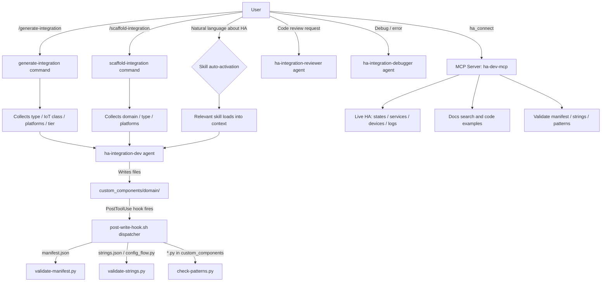

# Home Assistant Dev

A comprehensive Claude Code plugin for building, reviewing, and debugging Home Assistant custom integrations: covering all 52 Integration Quality Scale rules, HACS compliance, and HA 2025+ patterns.

## Summary

This plugin provides every layer of tooling needed for HA integration development: two interactive commands for generating complete integrations at configurable quality tiers, 27 skills that auto-activate on contextually relevant conversations, three specialized subagents for development, code review, and debugging, automated validation hooks that fire on every write, and an MCP server that connects live to a Home Assistant instance for state queries, service calls, documentation search, and code pattern detection.

## Principles

**Act on Intent**: Commands collect requirements up front (type, IoT class, platforms, tier) and generate the full integration without mid-task confirmation gates. Gate only on the initial "confirm before writing" step where scope is first established.

**Scope Fidelity**: `generate-integration` produces every required file for the selected quality tier in one pass (manifest, coordinator, config flow, entity files, translations, and optionally diagnostics and discovery) without sub-task confirmations.

**Use the Full Toolkit**: Commands use `AskUserQuestion` with bounded choices (not open-ended prompts) for integration type, IoT class, platforms, and target tier. Multi-select for non-exclusive options like platforms and optional features.

**Succeed Quietly, Fail Transparently**: The PostToolUse hook runs validation silently on every write and surfaces warnings only when issues are found. MCP tool errors return structured `isError: true` responses with the full error message.

## Requirements

- Claude Code (any recent version)
- Python 3.12+ (HA 2025+ requires Python 3.13 for new integrations)
- Home Assistant development environment for integration testing (optional; required only for MCP server live connection features)
- Node.js 18+ (bundled MCP server is pre-built; no `npm install` needed post-install)

## Installation

```
/plugin marketplace add L3DigitalNet/Claude-Code-Plugins
/plugin install home-assistant-dev@l3digitalnet-plugins
```

For local development:

```bash
claude --plugin-dir ./plugins/home-assistant-dev
```

### Post-Install Steps

The MCP server ships as a pre-built bundle (`mcp-server/dist/server.bundle.cjs`); no `npm install` is required after plugin installation. The server registers automatically as `ha-dev-mcp` via `.mcp.json`.

To connect to a live Home Assistant instance, call `ha_connect` with your instance URL and a long-lived access token.

## How It Works



## Usage

**Starting a new integration:** Use `/home-assistant-dev:generate-integration` for a fully guided experience with quality-tier selection, or `/home-assistant-dev:scaffold-integration` for a faster Silver-tier scaffold. Both commands collect requirements interactively and confirm before writing any files.

**Skills auto-activate** when your conversation mentions relevant HA concepts; e.g., discussing `DataUpdateCoordinator` loads the coordinator skill, mentioning HACS loads the HACS metadata skill. You do not need to invoke skills manually.

**Agents** are spawned automatically by commands but can also be addressed directly: "act as ha-integration-reviewer and review my config_flow.py" or "use ha-integration-debugger to diagnose this error."

**Validation** runs automatically on every write to integration files via the PostToolUse hook. Warnings appear inline in the agent response when issues are detected.

**MCP tools** are available to Claude as `ha-dev-mcp` once connected. Call `ha_connect` with your HA URL and token to enable live integration features.

## Commands

| Command | Description |
|---------|-------------|
| `generate-integration` | Fully guided generation of a complete integration. Collects type, IoT class, platforms, optional features (options flow, reauth, diagnostics, discovery), and target quality tier (Bronze/Silver/Gold). Generates all required files plus HACS metadata. |
| `scaffold-integration` | Faster scaffold targeting Silver tier. Collects domain, integration type, platforms, and GitHub username, then generates the standard file set without tier selection. |

Invoke as `/home-assistant-dev:generate-integration` or `/home-assistant-dev:scaffold-integration`.

## Skills

Skills load automatically when conversation content matches their trigger patterns. All 27 are listed below, grouped by domain area.

### Core Integration Architecture

| Skill | When it activates |
|-------|-------------------|
| `ha-architecture` | Questions about the `hass` object, event bus, state machine, service registry, or how integrations load |
| `ha-integration-scaffold` | Creating a new custom component, scaffolding, or starting an integration |
| `ha-async-patterns` | Mentioning `async`, `await`, `executor`, blocking code, or performance in HA |
| `ha-entity-lifecycle` | Entity registration, `async_added_to_hass`, `device_info`, identifiers, or restoring state |

### Data Flow and Polling

| Skill | When it activates |
|-------|-------------------|
| `ha-coordinator` | Mentioning coordinator, `DataUpdateCoordinator`, polling, `_async_update_data`, `_async_setup`, `UpdateFailed` |
| `ha-entity-platforms` | Creating entities, adding platforms, implementing sensors, switches, lights, climate, or any HA entity type |
| `ha-service-actions` | Calling services, `hass.services.async_call`, `turn_on`, `turn_off`, or service action registration |

### Setup and Configuration

| Skill | When it activates |
|-------|-------------------|
| `ha-config-flow` | Creating or debugging `config_flow.py`, the setup wizard, `unique_id` handling, or `strings.json` |
| `ha-options-flow` | Adding or fixing an options flow or reauth flow after initial setup |
| `ha-config-migration` | Incrementing `VERSION` or `MINOR_VERSION`, implementing `async_migrate_entry`, migrating entry data |
| `ha-migration` | Upgrading an integration to a newer HA version or resolving migration warnings (entry point to `ha-config-migration` and `ha-deprecation-fixes`) |
| `ha-deprecation-fixes` | Encountering deprecated imports, type annotations, or patterns for HA 2024.x/2025.x |

### Quality, Review, and Compliance

| Skill | When it activates |
|-------|-------------------|
| `ha-quality-review` | Reviewing against the IQS, quality check, assessing for core PR or HACS submission (covers all 52 rules across Bronze/Silver/Gold/Platinum) |
| `ha-hacs` | Preparing or validating HACS metadata files (`hacs.json`, manifest fields, repository structure) |
| `ha-hacs-publishing` | Publishing to HACS: GitHub Actions validation, release workflow, brand submission |
| `ha-testing` | Writing tests, pytest, `hass` fixture, mocks, or preparing for core submission |
| `ha-debugging` | Errors, debug, tracebacks, unavailable entities, `ConfigEntryNotReady`, `UpdateFailed` |

### Advanced Features

| Skill | When it activates |
|-------|-------------------|
| `ha-diagnostics` | Implementing `diagnostics.py`, debug information download, or redacting sensitive data (Gold IQS requirement) |
| `ha-repairs` | Implementing repair issues, issue registry, user notifications, or actionable alerts (Gold IQS requirement) |
| `ha-device-triggers` | Implementing `device_trigger.py`, automations triggered by hardware events like button presses or motion |
| `ha-device-conditions-actions` | Implementing `device_condition.py` or `device_action.py` for automation conditions and actions |
| `ha-websocket-api` | Custom WebSocket API commands, frontend integration, or real-time data to custom panels |
| `ha-recorder` | History, statistics, long-term stats, recorder exclusion, or historical data queries |

### YAML Authoring

| Skill | When it activates |
|-------|-------------------|
| `ha-yaml-automations` | Writing or fixing YAML automations, choosing trigger types, or structuring automation logic |
| `ha-scripts` | Creating YAML scripts: reusable, callable action sequences with parameters |
| `ha-blueprints` | Building blueprints, defining blueprint inputs, or creating shareable automation templates |
| `ha-documentation` | Generating README, HACS info pages, or HA docs pages for an integration |

## Agents

| Agent | Description |
|-------|-------------|
| `ha-integration-dev` | Full integration development specialist. Enforces DataUpdateCoordinator, config flow, `runtime_data`, unique IDs, and device info patterns. Guides through architecture decisions and produces complete working examples. Loaded skills: `ha-architecture`, `ha-integration-scaffold`, `ha-config-flow`, `ha-coordinator`, `ha-entity-platforms`, `ha-service-actions`, `ha-async-patterns`. |
| `ha-integration-reviewer` | Code reviewer against Integration Quality Scale standards. Runs `ruff` and `mypy` if available, then produces a structured report with Critical Issues, Warnings, and Suggestions, each with specific before/after code examples. Loaded skills: `ha-quality-review`, `ha-testing`, `ha-debugging`. |
| `ha-integration-debugger` | Systematic debugging specialist. Categorizes issues (config flow, coordinator, entity, async, import), isolates root cause, provides targeted before/after fixes, and suggests regression tests. Loaded skills: `ha-debugging`, `ha-coordinator`, `ha-async-patterns`. |

## Hooks

| Hook | Event | What it does |
|------|-------|-------------|
| `post-write-hook.sh` | `PostToolUse` (Write, Edit, MultiEdit, NotebookEdit) | Dispatcher that reads the modified file path from stdin JSON and routes to the appropriate validation script. Validates `manifest.json` only for paths under `custom_components/` or `integrations/`. Runs `validate-strings.py` on `strings.json` and `config_flow.py`. Runs `check-patterns.py` on any `.py` file under `custom_components/`. Validation failures surface as warnings in the agent context; the hook never blocks writes. |

## MCP Server

The `ha-dev-mcp` MCP server (`mcp-server/dist/server.bundle.cjs`) provides 12 tools across three categories. It ships as a pre-built esbuild bundle and requires no post-install steps.

### Home Assistant Tools (require `ha_connect` first)

| Tool | Description |
|------|-------------|
| `ha_connect` | Connect to a Home Assistant instance via WebSocket using URL and long-lived access token |
| `ha_get_states` | Query entity states, filterable by domain, entity ID, or area |
| `ha_get_services` | List available services, filterable by domain |
| `ha_call_service` | Call a HA service: dry-run by default, with a configurable safety blocklist for destructive services |
| `ha_get_devices` | Query the device registry, filterable by manufacturer, model, or integration |
| `ha_get_logs` | Retrieve HA logs filtered by integration domain, log level, line count, or timestamp |

### Documentation Tools

| Tool | Description |
|------|-------------|
| `docs_search` | Full-text search across pre-indexed HA developer documentation (core, frontend, architecture, API sections) |
| `docs_fetch` | Fetch a specific documentation page by path |
| `docs_examples` | Retrieve canonical code examples for patterns: coordinator, config_flow, entity, service, sensor, switch, binary_sensor, light, climate |

### Validation Tools

| Tool | Description |
|------|-------------|
| `validate_manifest` | Validate a `manifest.json` file against HACS or core requirements |
| `validate_strings` | Validate `strings.json` and check sync with `config_flow.py` step names |
| `check_patterns` | Scan a file or directory for 20+ known anti-patterns and deprecations |

## Planned Features

No unreleased features are currently staged in the changelog.

## Known Limitations

- **Live HA connection is optional.** MCP HA tools require a running Home Assistant instance and a valid long-lived access token. Skills and commands function fully without a live connection.
- **`ha_call_service` dry-runs by default.** Set `dry_run: false` explicitly to execute service calls against a real instance.
- **Targets HA 2025.2+ / Python 3.13.** Generated code uses modern type syntax (`list[str]`, `X | None`) and 2025 import paths. Earlier HA versions may require adjustments to generated imports (see `ha-deprecation-fixes` skill).
- **Validation scripts require Python 3.** The PostToolUse hook calls `python3`; if your environment uses `python`, the hook silently skips validation.

## Links

- Repository: [L3DigitalNet/Claude-Code-Plugins](https://github.com/L3DigitalNet/Claude-Code-Plugins)
- Changelog: [CHANGELOG.md](CHANGELOG.md)
- Issues: [GitHub Issues](https://github.com/L3DigitalNet/Claude-Code-Plugins/issues)
