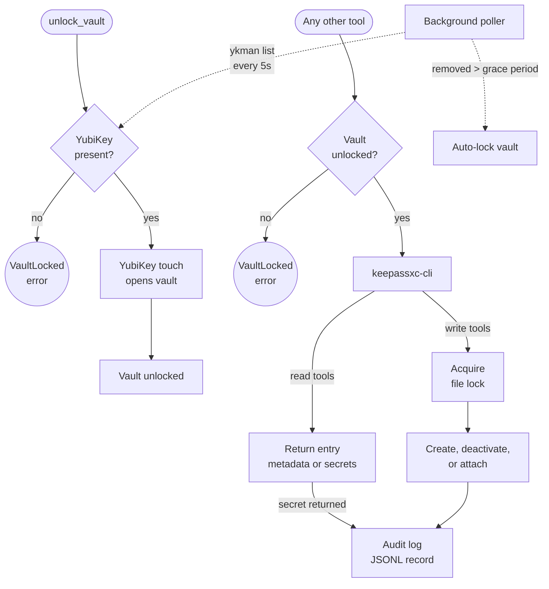

# keepass-cred-mgr

KeePassXC Credential Manager for Claude Code. Exposes a KeePass `.kdbx` vault via 10 MCP tools, authenticated by YubiKey HMAC-SHA1 challenge-response, with credential-type skills and guided rotation commands.

## Summary

keepass-cred-mgr gives Claude Code direct, audited access to a KeePass vault for credential retrieval, storage, and rotation. Instead of pasting secrets into conversation or hardcoding them in config files, Claude reads credentials from the vault and writes them to their intended destination (`.env` files, SSH configs, SDK setups) without ever displaying them.

Unlocking the vault starts a persistent `keepassxc-cli open` REPL process; one YubiKey touch per session. All subsequent tool calls send commands through that REPL's stdin/stdout without re-authenticating. A background poller watches for YubiKey removal and locks the vault (killing the REPL) after a configurable grace period. Write operations are file-locked, secret-returning calls are audit-logged, and temporary files used for attachment import are overwritten with zeros before deletion. Structured logging via `structlog` provides key-value event records throughout.

## Principles

**[P1] Physical Presence Gates All Access**: The vault opens only after a YubiKey touch. No password fallback, no auto-unlock. Prompt injection cannot bypass a physical gate.

**[P2] Secrets Never Surface**: Returned credentials are written directly to their destination. They never appear in conversation output, comments, logs, or code. The audit log records which entries were accessed, never the values themselves.

**[P3] Soft Delete, No Destruction**: Claude can create entries and deactivate them (prefix with `[INACTIVE]`), but cannot overwrite or delete. Permanent deletion happens in the KeePassXC GUI, where the user has full visibility.

**[P4] Group Allowlist Is the Perimeter**: Only groups listed in `allowed_groups` are visible to any tool. Unlisted groups are invisible regardless of what Claude requests.

**[P5] Audit Everything That Returns a Secret**: Every `get_entry` and `get_attachment` call writes a structured JSONL record with timestamp, tool, entry title, group, and whether secret material was returned.

## Features

- **Vault state machine**: YubiKey presence polling with configurable grace period; auto-lock on removal, explicit touch required to re-unlock
- **10 MCP tools**: 1 auth (`unlock_vault`), 5 read (list groups, list entries, search, get entry, get attachment), and 4 write (create entry, deactivate entry, add attachment, bulk import)
- **Credential-type skills**: Per-service rules for cPanel, FTP/SFTP, SSH keys, Brave Search API, and Anthropic API credentials
- **Guided rotation**: `/keepass-rotate` walks through create-then-deactivate with safety checks at each step
- **Audit logging**: Structured JSONL log for all secret-returning operations
- **Secure attachment handling**: Temp files are `chmod 600`, imported via CLI, then zero-filled and unlinked

## Requirements

- Python 3.12+
- KeePassXC (provides `keepassxc-cli`)
- YubiKey Manager (`ykman`)
- YubiKey 5C Nano (or any YubiKey supporting HMAC-SHA1 challenge-response on slot 2)
- Linux or macOS with full disk encryption recommended

## Installation

```
/plugin marketplace add L3DigitalNet/Claude-Code-Plugins
/plugin install keepass-cred-mgr@l3digitalnet-plugins
```

For local development:

```
claude --plugin-dir ./plugins/keepass-cred-mgr
```

### Post-Install Steps

1. Complete the manual setup steps in [`docs/keepass-cred-mgr-setup.md`](docs/keepass-cred-mgr-setup.md): YubiKey programming, database creation, group structure, SSH agent integration.

2. Create the config file:

```bash
mkdir -p ~/.config/keepass-cred-mgr
cp config.example.yaml ~/.config/keepass-cred-mgr/config.yaml
# Edit paths to match your setup
```

3. Create the audit log directory:

```bash
mkdir -p ~/.local/share/keepass-cred-mgr
```

The MCP server resolves its Python dependencies automatically via `uv run` on first launch; no manual `pip install` step required.

## How It Works



The server runs as a stdio MCP process spawned by Claude Code via `scripts/start-server.sh`, which resolves Python dependencies through `uv run` and starts the FastMCP server. On startup it loads the YAML config, initializes the YubiKey poller, and registers all 10 tools. The vault starts locked; call `unlock_vault` first to verify YubiKey presence and perform a physical touch. `unlock_vault` opens a persistent `keepassxc-cli open` REPL process; that single touch covers all subsequent tool calls in the session. Commands are dispatched through the REPL's stdin/stdout with Qt-style double-quote argument escaping; the REPL stays alive until the vault locks. Removal of the YubiKey starts a grace timer (default 10 seconds); if the key isn't reinserted in time, the vault locks (killing the REPL process), and all subsequent tool calls fail with `VaultLocked` until `unlock_vault` is called again.

## Usage

Most interactions happen through natural language. Ask Claude to retrieve a credential, store a new API key, or rotate an SSH password, and it invokes the appropriate tools.

```
"Get the cPanel credentials for example.com"
"Store this Anthropic API key: sk-ant-..."
"Rotate the SSH key for the production server"
```

For structured workflows, use the slash commands:

```
/keepass-status          # Vault state, accessible groups, inactive entries
/keepass-rotate          # Guided credential rotation with safety checks
/keepass-audit           # List all deactivated entries with timestamps
```

## Tools

| Tool | Parameters | Returns | Notes |
|------|-----------|---------|-------|
| `unlock_vault` | (none) | Confirmation | Must be called before any other vault tool; requires YubiKey touch; starts persistent REPL session |
| `list_groups` | (none) | Group names | Filtered to `allowed_groups` |
| `list_entries` | `group?`, `include_inactive?` | Title, username, URL per entry | REPL-dispatched; `ls` + `show` per entry; capped at `page_size` |
| `search_entries` | `query`, `group?`, `include_inactive?` | Matching entry metadata | Filtered to allowed groups |
| `get_entry` | `title`, `group?` | Full entry including password | Audit logged; blocked on `[INACTIVE]` entries |
| `get_attachment` | `title`, `attachment_name`, `group?` | Attachment content (base64) | Audit logged; blocked on `[INACTIVE]` entries |
| `create_entry` | `title`, `group`, `username?`, `password?`, `url?`, `notes?` | Confirmation | Rejects duplicates and titles with `/` |
| `deactivate_entry` | `title`, `group?` | Confirmation | Adds `[INACTIVE]` prefix and timestamp to notes |
| `add_attachment` | `title`, `attachment_name`, `content`, `group?` | Confirmation | Secure temp file; shredded after import |
| `import_entries` | `entries` (list of `{group, title, ...}`) | Confirmation | Bulk import via XML → staging KDBX → merge; 2 YubiKey touches regardless of entry count; vault locks after import |

## Commands

| Command | Description |
|---------|-------------|
| `/keepass-status` | Show vault state (locked/unlocked), accessible groups, and inactive entries pending review |
| `/keepass-rotate` | Guided multi-step credential rotation: collect new values, create new entry, deactivate old entry |
| `/keepass-audit` | List all `[INACTIVE]` entries across accessible groups with deactivation timestamps |

## Skills

| Skill | Loaded when |
|-------|-------------|
| `keepass-hygiene` | Any vault interaction; enforces secret handling rules and rotation safety |
| `keepass-credential-cpanel` | Storing or retrieving cPanel hosting credentials |
| `keepass-credential-ftp` | Working with FTP, FTPS, or SFTP credentials; enforces plain FTP security warning |
| `keepass-credential-ssh` | SSH key retrieval; enforces agent-first resolution (check ssh-agent before vault) |
| `keepass-credential-brave-search` | Storing or retrieving Brave Search API keys |
| `keepass-credential-anthropic` | Storing or retrieving Anthropic API keys; elevated sensitivity rules for billing keys |

## Configuration

The server reads `~/.config/keepass-cred-mgr/config.yaml` (override via `KEEPASS_CRED_MGR_CONFIG` env var).

```yaml
database_path: /path/to/your/primary.kdbx
yubikey_slot: 2
grace_period_seconds: 10
yubikey_poll_interval_seconds: 5
write_lock_timeout_seconds: 10
page_size: 50
log_level: INFO

allowed_groups:
  - Servers
  - SSH Keys
  - GPG Keys
  - Git
  - API Keys
  - Services

audit_log_path: ~/.local/share/keepass-cred-mgr/audit.jsonl
```

| Field | Type | Default | Description |
|-------|------|---------|-------------|
| `database_path` | str | required | Absolute path to the `.kdbx` file |
| `yubikey_slot` | int | `2` | HMAC-SHA1 challenge-response slot |
| `grace_period_seconds` | int | `10` | Seconds after YubiKey removal before auto-lock |
| `yubikey_poll_interval_seconds` | int | `5` | How often to check YubiKey presence via `ykman list` |
| `write_lock_timeout_seconds` | int | `10` | Max seconds to wait for the database file lock |
| `page_size` | int | `50` | Max entries returned per `list_entries` or `search_entries` call |
| `log_level` | str | `INFO` | Logging level (`DEBUG`, `INFO`, `WARNING`, `ERROR`, `CRITICAL`) |
| `allowed_groups` | list | required | Groups visible to all tools; unlisted groups are invisible |
| `audit_log_path` | str | required | Path to the JSONL audit log; parent directory must exist |

## Design Decisions

- **`keepassxc-cli` over `pykeepass`**: Using the CLI means the MCP server has no direct database access; KeePassXC owns the file format, locking, and YubiKey integration. `unlock_vault` opens a persistent `keepassxc-cli open` REPL process; all subsequent commands are dispatched through that process's stdin/stdout without re-authenticating. `list_entries` still issues one `ls` plus one `show` per entry (for metadata), but all within a single session rather than spawning a subprocess per call. Binary attachment exports use a separate subprocess since raw bytes cannot pass through the text REPL without corruption.

- **`ykman list` for presence polling**: `keepassxc-cli` requires a physical touch on every invocation. Using `ykman list` (pure USB enumeration, no touch) allows continuous polling without interrupting the user.

- **Soft delete only**: Claude can prefix entries with `[INACTIVE]` but cannot overwrite or delete. This prevents prompt injection from causing irreversible credential loss. The user reviews and deletes inactive entries in the KeePassXC GUI.

- **Grace period on YubiKey removal**: The YubiKey 5C Nano sits flush in a USB-C port and can be briefly dislodged. A 10-second grace window prevents spurious vault locks during normal use while keeping the security posture tight.

- **Two-database architecture**: A primary database (YubiKey-only, used by the MCP server) and a backup database (password-only, never used by the server) kept in sync via KeePassXC's merge function. If the YubiKey is lost, the backup provides recovery without compromising the primary's auth model.

## Planned Features

- **Credential provisioning agent**: A purpose-built subagent for setting up new project environments; audits existing vault entries, generates missing credentials, and stores them with consistent naming.
- **Pagination controls**: Cursor-based pagination for `list_entries` and `search_entries` to handle vaults with hundreds of entries per group.
- **Entry update tool**: Modify fields on existing entries without the deactivate-then-recreate cycle (requires careful conflict handling).

## Known Issues

- **N+1 REPL commands on list operations**: `keepassxc-cli ls` returns titles only. Fetching username and URL metadata requires a `show` command per entry, all dispatched through the open REPL (no re-authentication). Large groups hit the `page_size` cap; results beyond the cap are silently truncated with a server-side log warning.
- **No entry deletion or overwrite**: By design, Claude cannot delete or overwrite entries. Credential rotation requires a create-then-deactivate sequence, and stale `[INACTIVE]` entries accumulate until manually removed in KeePassXC.
- **Titles with slashes are unsupported**: `keepassxc-cli` uses `/` as a path separator (`Group/Title`). Titles containing `/` produce undefined CLI behavior; `create_entry` rejects them with an error.
- **`edit --notes` replaces the entire field**: Appending a deactivation timestamp to notes requires reading the existing notes first, then writing the combined string. If the notes update fails after a successful rename, the entry is still deactivated (renamed to `[INACTIVE]`) but the deactivation timestamp in notes may be missing. A warning is logged in this case.

## Security Model

The primary threat this plugin defends against is **prompt injection** triggering unintended credential retrieval. The physical YubiKey touch requirement is the core defense: even if malicious content in a file or webpage instructs Claude to call `get_entry`, the vault won't open without the user physically touching the key.

Secondary defenses:
- **Group allowlist** limits which entries are visible, regardless of what Claude requests
- **`[INACTIVE]` blocking** prevents deactivated credentials from being used
- **Audit log** provides a forensic trail of every secret-returning operation
- **No delete/overwrite** prevents credential destruction via injection

This plugin is designed for trusted local machines with full disk encryption. It does not add transport encryption (stdio is local-only) or multi-user isolation.

## Links

- Repository: [L3DigitalNet/Claude-Code-Plugins](https://github.com/L3DigitalNet/Claude-Code-Plugins)
- Changelog: [`CHANGELOG.md`](CHANGELOG.md)
- Setup Guide: [`docs/keepass-cred-mgr-setup.md`](docs/keepass-cred-mgr-setup.md)
- Design Document: [`docs/keepass-cred-mgr-design.md`](docs/keepass-cred-mgr-design.md)
- Issues and feedback: [GitHub Issues](https://github.com/L3DigitalNet/Claude-Code-Plugins/issues)
