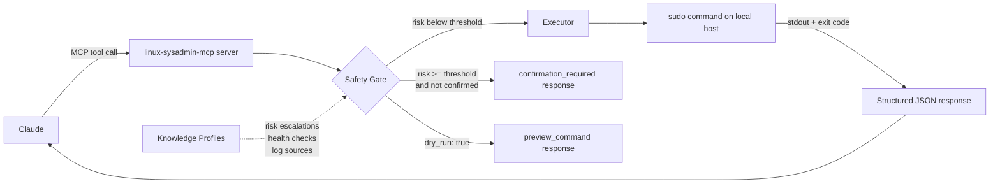

# linux-sysadmin-mcp

A Claude Code MCP plugin for Linux system administration. It exposes 18 tools across 5 modules (session, services, security, cron, docs) through a structured, knowledge-profile-driven interface that complements Claude Code's built-in Bash tool.

## Summary

linux-sysadmin-mcp exposes 18 tools across 5 modules as MCP tools, focused on capabilities that Claude Code's Bash tool cannot replicate: knowledge-profile-driven health checks and diagnostics, config validation sweeps, dependency impact analysis, port/firewall correlation audits, pure-JS cron expression computation, structured security audits with profile enrichment, and git-backed documentation generation.

The server auto-detects the host's distro family (Debian/RHEL/Arch) and maps commands accordingly. A knowledge base of service profiles (sshd, ufw, nginx, etc.) enriches health checks, log queries, and risk escalations with service-specific context.

## Principles

**[P1] Act on Intent**: Invoking a tool is consent to its implied scope. Routine operations execute without confirmation gates. Only operations at or above the configured risk threshold pause for confirmation.

**[P2] Dry Run Before Destruction**: Every state-changing tool (except a handful of firewall enable/disable operations) accepts `dry_run: true`, which returns `preview_command` without executing. The default safety gate treats `dry_run: true` as automatic confirmation bypass.

**[P3] Degrade, Never Fail Silently**: When passwordless sudo is unavailable, the server registers only read-only tools and reports `degraded_mode: true` in `sysadmin_session_info`. Unrecognized distro families log a warning before falling back to Debian commands.

**[P4] Structured Output, Categorized Errors**: Tool responses are JSON with typed fields, not raw command output. Errors include `error_code`, `error_category`, and `remediation` steps. All state-changing responses include `command_executed` and `duration_ms`.

**[P5] Knowledge Profiles Enrich Context**: YAML service profiles add service-aware health checks, log sources, and risk escalations (e.g., editing `/etc/ssh/sshd_config` escalates risk to `high` via the sshd profile's interaction rules).

**[P6] Complement, Never Duplicate**: Claude Code can already run any shell command via its Bash tool. MCP tools exist only to provide capabilities Bash cannot: knowledge-profile-driven health checks, service-aware log discovery, structured documentation generation, and computation without a system equivalent (e.g., cron expression validation). If Claude can do it with a one-liner, it does not belong here.

## Features

- **session**: Host context, distro info, sudo status, detected knowledge profiles, per-module tool count. Always call `sysadmin_session_info` first.
- **services**: Service status enriched with knowledge-profile health checks; log retrieval that consults profile-defined log sources beyond journalctl; config validation sweeps using profile-declared validators; dependency cascade impact analysis; three-way port/firewall correlation audits; profile-guided troubleshooting with symptom-to-cause correlation.
- **security**: Composite security audit that runs parallel checks (failed services, listening ports, SSH warnings) and evaluates health checks from all active knowledge profiles.
- **cron**: Pure-JS cron expression validation and next-run calculation (no system dependency).
- **docs**: Git-backed documentation repo: init, generate host and service READMEs, back up config files, diff, history, and disaster recovery guide generation.

## Requirements

- Node.js 20+
- Linux system (Debian/RHEL-based; Arch is partially supported)
- Passwordless `sudo` for state-changing tools (the server degrades to read-only mode without it)

## Installation

```
/plugin marketplace add L3Digital-Net/Claude-Code-Plugins
/plugin install linux-sysadmin-mcp@l3digitalnet-plugins
```

For local development:

```
claude --plugin-dir ./plugins/linux-sysadmin-mcp
```

### Post-Install Steps

The MCP server ships as a pre-built esbuild bundle (`dist/server.bundle.cjs`); no `npm install` or build step is required after plugin installation. The server registers automatically as `linux-sysadmin-mcp` via `.mcp.json`.

If you modify the TypeScript source, rebuild with:

```bash
cd ~/.claude/plugins/cache/l3digitalnet-plugins/linux-sysadmin-mcp
npm install && npm run build
```

## How It Works



The server runs as a stdio MCP process spawned by Claude Code. On startup it detects the distro family, verifies sudo access, loads active systemd units, resolves knowledge profiles, and registers all tool modules. Tool registrations are filtered in degraded mode: only `read-only` tools are exposed when passwordless sudo is unavailable.

## Usage

Start any session by calling `sysadmin_session_info`; it returns the host, distro, sudo status, active knowledge profiles, and per-module tool counts.

**Example prompts:**

```
Check the status of nginx and run its health checks.
Run a security audit and flag anything unusual.
Validate this cron expression: 0 */6 * * 1-5
When will "30 2 * * 0" next run? Show me the next 10 times.
Generate documentation for the sshd service.
```

## Tools

| Module | Count | Tools |
|--------|-------|-------|
| session | 1 | `sysadmin_session_info` |
| services | 6 | `svc_status`, `svc_logs`, `svc_config_validate`, `svc_dependency_impact`, `svc_port_audit`, `svc_troubleshoot` |
| security | 1 | `sec_audit` |
| cron | 2 | `cron_validate`, `cron_next_runs` |
| docs | 8 | `doc_status`, `doc_init`, `doc_generate_host`, `doc_generate_service`, `doc_backup_config`, `doc_diff`, `doc_history`, `doc_restore_guide` |
| **Total** | **18** | |

## Knowledge Profiles

Built-in profiles loaded from the `knowledge/` directory. Each profile provides service-specific log sources, health checks, config paths, and risk escalation rules. Profiles are auto-activated when their associated systemd unit is running.

| Profile | Service |
|---------|---------|
| `sshd` | OpenSSH Server |
| `ufw` | Uncomplicated Firewall |
| `nginx` | Nginx web server |
| `docker` | Docker daemon |
| `fail2ban` | Fail2ban intrusion prevention |
| `crowdsec` | CrowdSec security engine |
| `pihole` | Pi-hole DNS/ad blocker |
| `unbound` | Unbound DNS resolver |

Custom profiles can be added via `knowledge.additional_paths` in the config file. Profiles can be selectively disabled via `knowledge.disabled_profiles`.

## Configuration

The config file is auto-generated on first run at `~/.config/linux-sysadmin/config.yaml`. All values shown are defaults; omit any key to inherit the default.

```yaml
# Integration mode: standalone | complementary | override
# Hint to Claude about how aggressively to use MCP tools vs. built-in knowledge.
integration_mode: complementary

privilege:
  method: sudo
  degrade_without_sudo: true   # Register read-only tools only if sudo unavailable

output:
  default_limit: 50            # Max rows returned by listing tools
  log_default_limit: 100       # Max log lines returned

errors:
  max_retries: 3
  retry_backoff_seconds: 2
  command_timeout_ceiling: 0   # 0 = no ceiling above per-tool defaults

safety:
  confirmation_threshold: high # read-only | low | moderate | high | critical
  dry_run_bypass_confirmation: true  # dry_run: true skips the confirmation gate

ssh:
  keepalive_interval: 15
  keepalive_max_missed: 3
  auto_reconnect: true
  max_reconnect_attempts: 3

knowledge:
  additional_paths: []          # Paths to directories with additional .yaml profiles
  disabled_profiles: []         # Profile IDs to suppress (e.g. ["docker"])

documentation:
  repo_path: null               # Path to git repo for doc_* tools; null = docs module disabled
  auto_suggest: true            # Emit documentation_action hints after state-changing tools
  commit_prefix: "doc"
  config_backup:
    auto_backup_on_change: true
    preserve_metadata: true

# Distro override — auto-detected if omitted
# distro:
#   family: debian
#   package_manager: apt
#   firewall_backend: ufw
```

Set `LINUX_SYSADMIN_CONFIG` environment variable to override the config file path.

## Known Issues

- **Arch Linux support is partial**: distro detection targets Debian and RHEL families; Arch falls back to Debian commands with a warning.
- **Documentation tools require a pre-configured git repo**: `doc_*` tools return an error until `documentation.repo_path` is set in the config and `doc_init` is run.

## Links

- Repository: [L3Digital-Net/Claude-Code-Plugins](https://github.com/L3Digital-Net/Claude-Code-Plugins)
- Changelog: [CHANGELOG.md](CHANGELOG.md)
- Issues: [GitHub Issues](https://github.com/L3Digital-Net/Claude-Code-Plugins/issues)
