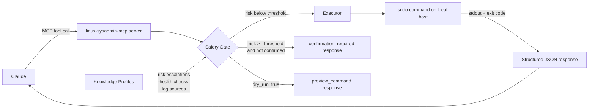

# linux-sysadmin-mcp

A Claude Code MCP plugin providing comprehensive Linux system administration — packages, services, users, firewall, networking, security, storage, containers, and more — through a structured, risk-aware tool interface.

## Summary

linux-sysadmin-mcp exposes 116 tools across 15 modules as MCP tools, giving Claude the ability to read system state and execute state-changing commands with a built-in safety gate. Every state-changing operation is classified by risk level and passes through a three-step safety check before execution — tool default risk, knowledge profile escalation, and configurable threshold — so routine operations proceed without friction while high-impact commands require explicit confirmation.

The server auto-detects the host's distro family (Debian/RHEL/Arch) and maps commands accordingly. A knowledge base of service profiles (sshd, ufw, nginx, etc.) enriches health checks, log queries, and risk escalations with service-specific context.

## Principles

**[P1] Act on Intent** — Invoking a tool is consent to its implied scope. Routine operations execute without confirmation gates. Only operations at or above the configured risk threshold pause for confirmation.

**[P2] Dry Run Before Destruction** — Every state-changing tool (except a handful of firewall enable/disable operations) accepts `dry_run: true`, which returns `preview_command` without executing. The default safety gate treats `dry_run: true` as automatic confirmation bypass.

**[P3] Degrade, Never Fail Silently** — When passwordless sudo is unavailable, the server registers only read-only tools and reports `degraded_mode: true` in `sysadmin_session_info`. Unrecognized distro families log a warning before falling back to Debian commands.

**[P4] Structured Output, Categorized Errors** — Tool responses are JSON with typed fields, not raw command output. Errors include `error_code`, `error_category`, and `remediation` steps. All state-changing responses include `command_executed` and `duration_ms`.

**[P5] Knowledge Profiles Enrich Context** — YAML service profiles add service-aware health checks, log sources, and risk escalations (e.g., editing `/etc/ssh/sshd_config` escalates risk to `high` via the sshd profile's interaction rules).

**[P6] Graceful Coexistence** — `integration_mode` (standalone/complementary/override) is a behavioral hint for Claude describing how aggressively to use MCP tools vs. built-in knowledge. Runtime MCP server detection is not currently implemented.

## Features

- **session** — Host context, distro info, sudo status, detected knowledge profiles, per-module tool count. Always call `sysadmin_session_info` first.
- **packages** — List, search, inspect, install, remove, purge, update, rollback, and audit history. Supports apt and dnf.
- **services** — List, status, start, stop, restart, enable, disable, and log retrieval for systemd units. Status enriched from knowledge profiles. Includes `timer_list`.
- **performance** — System overview, top processes, memory breakdown, disk I/O, network throughput, uptime, and heuristic bottleneck analysis.
- **logs** — Query (parsed journalctl), search (grep + journal), summarize errors by unit, and show log disk usage.
- **security** — Full security audit, SSH config audit and hardening, security update check, MAC system status, listening port audit, SUID/SGID binary scan.
- **storage** — Disk usage by filesystem, largest directories, mount listing, fstab management, LVM status, LV creation, and LV resize.
- **users** — List, inspect, create, modify, and delete users and groups. Check and set file permissions/ownership.
- **firewall** — Status, rule listing, add and remove rules, enable and disable. Supports ufw and firewalld.
- **networking** — Interface listing, active connections, DNS and routing table inspection and modification, connectivity tests (ping/traceroute/dig).
- **containers** — List, inspect, logs, start, stop, restart, remove containers; manage images; Docker Compose up/down/status.
- **cron** — List, add, remove, and validate crontab entries. Preview next N scheduled runs for a cron expression.
- **backup** — List, create (tar/rsync), restore, schedule, and verify backups.
- **ssh** — SSH transport diagnostics, client config listing, key listing, connectivity tests, key generation, authorized key inspection.
- **docs** — Git-backed documentation repo: init, generate host and service READMEs, back up config files, diff, history, and disaster recovery guide generation.

## Requirements

- Node.js 20+
- Linux system (Debian/RHEL-based; Arch is partially supported)
- Passwordless `sudo` for state-changing tools (the server degrades to read-only mode without it)

## Installation

```
/plugin marketplace add L3DigitalNet/Claude-Code-Plugins
/plugin install linux-sysadmin-mcp@l3digitalnet-plugins
```

For local development:

```
claude --plugin-dir ./plugins/linux-sysadmin-mcp
```

### Post-Install Steps

The MCP server ships as a pre-built esbuild bundle (`dist/server.bundle.cjs`) — no `npm install` or build step is required after plugin installation. The server registers automatically as `linux-sysadmin-mcp` via `.mcp.json`.

If you modify the TypeScript source, rebuild with:

```bash
cd ~/.claude/plugins/cache/l3digitalnet-plugins/linux-sysadmin-mcp
npm install && npm run build
```

## How It Works



The server runs as a stdio MCP process spawned by Claude Code. On startup it detects the distro family, verifies sudo access, loads active systemd units, resolves knowledge profiles, and registers all tool modules. Tool registrations are filtered in degraded mode — only `read-only` tools are exposed when passwordless sudo is unavailable.

## Usage

Start any session by calling `sysadmin_session_info` — it returns the host, distro, sudo status, active knowledge profiles, and per-module tool counts.

**Example prompts:**

```
Show me what's running on this system and flag anything unusual.
Install nginx and enable it at boot.
Check the firewall rules and add a rule to allow port 8080 from 192.168.1.0/24.
What are the top 10 directories consuming disk space under /var?
Create a daily backup of /etc to /backup/etc.
Audit the SSH server config for security issues.
```

**Confirmation flow:**

State-changing tools at or above the configured `confirmation_threshold` (default: `high`) return a `confirmation_required` response with a command preview. Re-invoke the tool with `confirmed: true` to proceed:

```json
{ "tool": "pkg_remove", "packages": ["nginx"], "confirmed": true }
```

**Dry-run preview:**

Pass `dry_run: true` to any state-changing tool (except `fw_enable`/`fw_disable`) to receive the command that would execute without making changes:

```json
{ "tool": "user_delete", "username": "deploy", "dry_run": true }
```

## Tools

| Module | Count | Example Tools |
|--------|-------|---------------|
| session | 2 | `sysadmin_session_info` |
| packages | 11 | `pkg_list_installed`, `pkg_install`, `pkg_remove`, `pkg_purge`, `pkg_update`, `pkg_rollback`, `pkg_history` |
| services | 7 | `svc_list`, `svc_status`, `svc_start`, `svc_stop`, `svc_restart`, `svc_logs`, `timer_list` |
| performance | 8 | `perf_overview`, `perf_top_processes`, `perf_memory`, `perf_disk_io`, `perf_network_io`, `perf_bottleneck` |
| logs | 5 | `log_query`, `log_search`, `log_summary`, `log_disk_usage` |
| security | 8 | `sec_audit`, `sec_check_ssh`, `sec_harden_ssh`, `sec_update_check`, `sec_mac_status`, `sec_check_suid` |
| storage | 9 | `disk_usage`, `disk_usage_top`, `mount_list`, `mount_add`, `lvm_status`, `lvm_create_lv`, `lvm_resize` |
| users | 11 | `user_list`, `user_create`, `user_modify`, `user_delete`, `group_list`, `group_create`, `group_delete`, `perms_check`, `perms_set` |
| firewall | 7 | `fw_status`, `fw_list_rules`, `fw_add_rule`, `fw_remove_rule`, `fw_enable`, `fw_disable` |
| networking | 8 | `net_interfaces`, `net_connections`, `net_dns_show`, `net_routes_show`, `net_test`, `net_dns_modify`, `net_routes_modify` |
| containers | 12 | `ctr_list`, `ctr_images`, `ctr_inspect`, `ctr_logs`, `ctr_start`, `ctr_stop`, `ctr_remove`, `ctr_compose_up`, `ctr_compose_down` |
| cron | 6 | `cron_list`, `cron_add`, `cron_remove`, `cron_validate`, `cron_next_runs` |
| backup | 6 | `bak_list`, `bak_create`, `bak_restore`, `bak_schedule`, `bak_verify` |
| ssh | 7 | `ssh_session_info`, `ssh_config_list`, `ssh_key_list`, `ssh_test_connection`, `ssh_key_generate`, `ssh_authorized_keys` |
| docs | 9 | `doc_status`, `doc_init`, `doc_generate_host`, `doc_generate_service`, `doc_backup_config`, `doc_diff`, `doc_restore_guide` |
| **Total** | **116** | |

## Knowledge Profiles

Built-in profiles loaded from the `knowledge/` directory. Each profile provides service-specific log sources, health checks, config paths, and risk escalation rules. Profiles are auto-activated when their associated systemd unit is running.

| Profile | Service |
|---------|---------|
| `sshd` | OpenSSH Server |
| `ufw` | Uncomplicated Firewall |
| `nginx` | Nginx web server |
| `docker` | Docker daemon |
| `fail2ban` | Fail2ban intrusion prevention |
| `crowdsec` | CrowdSec security engine |
| `pihole` | Pi-hole DNS/ad blocker |
| `unbound` | Unbound DNS resolver |

Custom profiles can be added via `knowledge.additional_paths` in the config file. Profiles can be selectively disabled via `knowledge.disabled_profiles`.

## Configuration

The config file is auto-generated on first run at `~/.config/linux-sysadmin/config.yaml`. All values shown are defaults; omit any key to inherit the default.

```yaml
# Integration mode: standalone | complementary | override
# Hint to Claude about how aggressively to use MCP tools vs. built-in knowledge.
integration_mode: complementary

privilege:
  method: sudo
  degrade_without_sudo: true   # Register read-only tools only if sudo unavailable

output:
  default_limit: 50            # Max rows returned by listing tools
  log_default_limit: 100       # Max log lines returned

errors:
  max_retries: 3
  retry_backoff_seconds: 2
  command_timeout_ceiling: 0   # 0 = no ceiling above per-tool defaults

safety:
  confirmation_threshold: high # read-only | low | moderate | high | critical
  dry_run_bypass_confirmation: true  # dry_run: true skips the confirmation gate

ssh:
  keepalive_interval: 15
  keepalive_max_missed: 3
  auto_reconnect: true
  max_reconnect_attempts: 3

knowledge:
  additional_paths: []          # Paths to directories with additional .yaml profiles
  disabled_profiles: []         # Profile IDs to suppress (e.g. ["docker"])

documentation:
  repo_path: null               # Path to git repo for doc_* tools; null = docs module disabled
  auto_suggest: true            # Emit documentation_action hints after state-changing tools
  commit_prefix: "doc"
  config_backup:
    auto_backup_on_change: true
    preserve_metadata: true

# Distro override — auto-detected if omitted
# distro:
#   family: debian
#   package_manager: apt
#   firewall_backend: ufw
```

Set `LINUX_SYSADMIN_CONFIG` environment variable to override the config file path.

## Known Issues

- **Arch Linux support is partial** — distro detection and command dispatch target Debian and RHEL families; Arch falls back to Debian commands with a warning.
- **Remote host support is not yet implemented** — all tools run on the local host where the MCP server is spawned. The `ssh` module provides connectivity tools but does not route other tool calls over SSH.
- **`timer_create` and `timer_modify` are not implemented** — `timer_list` is the only systemd timer tool currently available; cron-based scheduling uses `bak_schedule` and `cron_add` instead.
- **`sudoers_list` and `sudoers_modify` are not implemented** — sudoers management is planned but absent from the current release.
- **Documentation tools require a pre-configured git repo** — `doc_*` tools return an error until `documentation.repo_path` is set in the config and `doc_init` is run.

## Links

- Repository: [L3DigitalNet/Claude-Code-Plugins](https://github.com/L3DigitalNet/Claude-Code-Plugins)
- Changelog: [CHANGELOG.md](CHANGELOG.md)
- Issues: [GitHub Issues](https://github.com/L3DigitalNet/Claude-Code-Plugins/issues)
