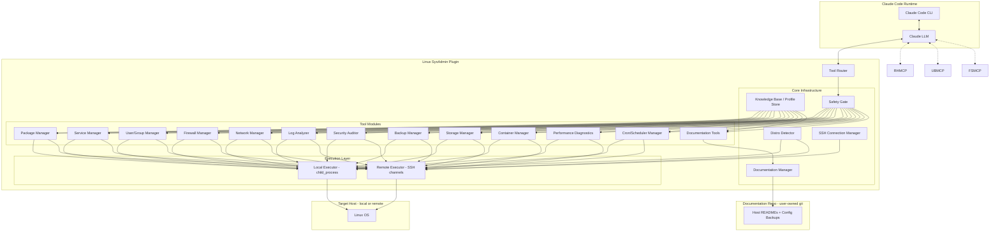
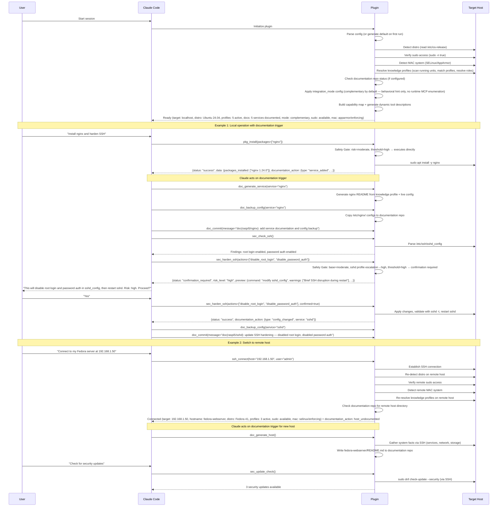

# Linux SysAdmin — Claude Code Plugin Design Document

**Version:** 1.1.0 (Implemented — 2026-02-20)
**Status:** Implemented — sections marked *[Planned]* describe features not yet implemented
**Target Runtime:** Claude Code (CLI)
**Implementation:** TypeScript / Node.js >= 20 LTS
**Distribution:** npm package (`linux-sysadmin-mcp`)
**License:** Apache 2.0

---

## 1. Executive Summary

Linux SysAdmin is a Claude Code plugin that provides a comprehensive, composable toolkit for Linux system administration. Every capability is exposed as a discrete, atomic tool — package management, service control, firewall configuration, security hardening, and disaster recovery are all independent operations that Claude assembles into complex workflows on the fly, not monolithic mega-commands.

The plugin ships with an embedded knowledge base of universal tool knowledge — standard config paths, management commands, log locations, health checks, and dependency patterns. Eight built-in YAML profiles cover the most common sysadmin services (nginx, sshd, docker, ufw, fail2ban, pihole, unbound, crowdsec); users can add custom profiles for other services. This knowledge is generic to each tool, not specific to any environment. Users supply environment-specific details through configuration and custom profiles.

Documentation is a first-class output of every state-changing operation. Every configuration change Claude makes is reflected in human-readable, git-versioned documentation that captures not just what is configured but why. The documentation is structured so that a human can fully recreate a working system from bare metal using only the documentation repo and its backed-up config files.

The plugin adapts to any supported Linux distribution by detecting and abstracting over package managers, init systems, firewall backends, and filesystem conventions at runtime. It targets a single host per session — either the local machine or a remote host connected via SSH.

The plugin operates standalone, using Claude Code's built-in tools (Read, Write, Edit, Bash) for all file I/O and shell execution. It prioritizes operational safety through mandatory confirmation gates and dry-run previews for all state-changing operations.

The target audience spans home lab enthusiasts managing a handful of machines to enterprise/professional sysadmins responsible for production infrastructure.

---

## 2. Design Principles

1. **Composable, Not Monolithic** — Each tool does one thing well. Complex workflows are composed by Claude from atomic tools, not baked into mega-commands.
2. **Universal Tool Knowledge, Not Environment-Specific Configuration** — The plugin's embedded knowledge contains only facts that are true for any standard installation of a tool on any supported distro: default config paths, standard management commands, well-known ports, conventional log locations, and typical dependency roles. It never encodes IP addresses, hostnames, VLAN layouts, custom scripts, mount points, user-created automation, or anything tied to a particular deployment. Environment-specific details are the user's responsibility and live in the plugin's config file, SSH host definitions, and user-authored knowledge profiles.
3. **Documentation-Driven Reproducibility** — Every system Claude administers must be fully reproducible from its documentation alone. Configuration changes produce documentation as a first-class output — not as an afterthought, not as optional, not as a log to be read later. The documentation captures what is configured, why it was configured that way, and how to rebuild it from scratch. A human with a fresh OS install and the documentation repo can reconstruct the entire working system without Claude's assistance. Documentation is the disaster recovery plan.
4. **Distro-Agnostic** — Abstract over package managers, init systems, firewall backends, and filesystem conventions. Detect and adapt; never assume.
5. **Safety by Default** — Destructive or state-changing operations require explicit confirmation. Dry-run is always available. When rollback or audit capabilities are needed, the plugin works with the user to use OS-native tools (package manager history, filesystem snapshots, journald, auditd) rather than building parallel infrastructure.
6. **Graceful Coexistence** — Detect and defer to existing MCP servers when present. Fill gaps rather than duplicate. Operate fully standalone when they are absent.
7. **Observable** — Every tool returns structured output that Claude can reason over. No silent failures; no ambiguous states.
8. **Least Privilege** — Request only the permissions needed for the specific operation. Escalate explicitly and visibly.
9. **Sudo-First Execution** — All commands requiring elevated privileges are executed via `sudo`. The plugin never assumes it is running as root directly. Users are responsible for configuring appropriate sudoers rules for the service account or user running the plugin.

---

## 3. High-Level Architecture

### 3.1 System Diagram



The Tool Router dispatches to the Safety Gate, which classifies each operation by risk level and enforces confirmation for moderate-and-above operations before allowing execution. The SSH Connection Manager is infrastructure, not a tool module — it provides the remote execution channel that all tool modules use when the target host is remote. Tool modules are agnostic to whether they are executing locally or remotely. Documentation tools route through the Documentation Manager for repo writes. The Knowledge Base is consumed by all tool modules for profile-informed command construction, dependency awareness, and risk escalation.

### 3.2 Core Components

**Tool Router** — Entry point for all tool invocations. Resolves which module handles a request, injects distro context, and enforces the safety pipeline (safety gate → execution).

**Distro Detector** — Runs once at session start (and can be re-invoked). Parses `/etc/os-release`, identifies the distribution family (RHEL/Fedora, Debian/Ubuntu), version, package manager, init system, firewall backend, and mandatory access control system (SELinux, AppArmor, or none). Exposes a `DistroContext` object consumed by all tool modules.

**Knowledge Base** — Read-only data layer of structured YAML profiles for common sysadmin tools and services. Consumed by tool modules at runtime to inform command construction, log path lookup, dependency analysis, health checks, and risk escalation. Profiles are loaded at startup: built-in profiles from the plugin's `knowledge/` directory, user profiles from `~/.config/linux-sysadmin/knowledge/` and any additional configured paths. See Section 5 for full specification.

**Safety Gate** — Intercepts state-changing operations. Classifies each operation by risk level (read-only, low-risk, moderate, high, critical). Operations at or above the configured threshold (default: `high`) require explicit user confirmation. All state-changing operations support a `dry_run` parameter that previews what would happen without executing. See Section 7.4 for the full confirmation flow, dry-run behavior, and risk classification pipeline.

**SSH Connection Manager** — Infrastructure component that provides the remote execution channel. When connected to a remote host, tool invocations submit commands through SSH rather than local `child_process`. See Section 6.10 for the full connection lifecycle, keepalive, and auto-reconnect behavior.

**Documentation Manager** — Manages the user's documentation repository. Writes and updates host-level and per-service READMEs, copies config file backups, and commits changes via git. Receives documentation triggers from other tool modules after state-changing operations and surfaces suggested documentation actions in tool responses for Claude to act on. See Section 6.13 for full specification.

**Execution Layer** — Executes commands via Node.js `child_process`. Handles subprocess timeouts using each tool's declared duration category (Section 7.1). Remote SSH execution is planned for a future release.

### 3.3 Privilege Model

The plugin assumes all privileged operations are executed via `sudo`. It never runs as root directly and never attempts `su`. Each tool module's command builder prefixes commands with `sudo` when the operation requires elevated privileges (anything beyond read-only on user-accessible paths).

The user is responsible for configuring sudoers to grant the account running the plugin passwordless access to the commands it needs. Per Principle 8, the plugin ships with a reference sudoers fragment per module (e.g., a minimal sudoers file granting only the commands needed for package management) to help users apply least-privilege access. Each fragment grants the narrowest possible command set — a user who only needs backup functionality does not need to grant sudo access to package management commands.

At session start, the Distro Detector runs a `sudo -n true` check to verify passwordless sudo is available. If it fails, the plugin reports this clearly and continues in a degraded mode where only non-privileged tools (read-only operations on user-accessible paths) are available.

### 3.4 Distribution Format

The plugin is distributed primarily as a **standalone MCP server** that users register in their Claude Code configuration (`~/.claude/settings.json` or project-level `.mcp.json`). This is the canonical form and provides full access to all tool modules.

*[Planned]* A set of **Claude Code slash-commands** may be provided as a convenience layer on top of the MCP server. These would offer shortcuts for common workflows and would be implemented as thin wrappers composing underlying atomic MCP tools (Principle 1). Slash-commands are not included in v1.0.x.

**Alias Syntax:** Aliases are strings of tool names separated by `+`. Each tool name can include parameters as `key=value` pairs in parentheses. The plugin parses the alias and issues the tool calls sequentially, collecting all results into a single combined response. This is simple sequential composition, not a pipeline — each tool runs independently and no tool's output feeds into another's input. Example: `status: "perf_overview + svc_list(filter='failed') + disk_usage"` runs three tools and returns their combined output. Aliases are defined in `config.yaml` (Section 9.2).

**Transport Mode:**

The MCP server communicates via **stdio** (stdin/stdout), the standard transport for Claude Code where Claude Code spawns the MCP server as a child process. Zero configuration required beyond the Claude Code config entry.

SSE (Server-Sent Events) transport for networked/shared deployments is deferred to a future release. SSE introduces significant security considerations (authentication, TLS, network exposure of privileged operations) that require dedicated design work beyond v1 scope.

The server is launched via the bundled CJS entry point:

```
node dist/server.bundle.cjs
```

Config path is read from the `LINUX_SYSADMIN_CONFIG` environment variable (if set) or defaults to `~/.config/linux-sysadmin/config.yaml`.

```text
Installation:

1. MCP Server (required):
   Add to Claude Code config (.mcp.json or ~/.claude/settings.json):
   {
     "mcpServers": {
       "linux-sysadmin-mcp": {
         "command": "node",
         "args": ["/path/to/plugin/dist/server.bundle.cjs"]
       }
     }
   }

   When installed via the Claude Code plugin system, the path resolves
   automatically to ${CLAUDE_PLUGIN_ROOT}/dist/server.bundle.cjs.

2. [Planned] Slash Commands (optional):
   # Not yet implemented — planned for a future release
```

### 3.5 Implementation Language

The MCP server is implemented in **TypeScript** running on **Node.js**. This choice is driven by alignment with the broader MCP ecosystem — the MCP SDK, most reference MCP servers, and Claude Code itself are TypeScript-based. This maximizes compatibility, contributor accessibility, and access to the best-documented MCP patterns.

Key dependencies:

- **@modelcontextprotocol/sdk** — MCP server framework, tool registration, transport handling
- **zod** — Input validation for all tool parameters
- **pino** — Structured logging for operational diagnostics
- **yaml** — Configuration file parsing

*[Planned, not yet included]*: **ssh2** for remote SSH execution.

The plugin shells out to native system commands (`apt`, `dnf`, `systemctl`, `ufw`, `firewall-cmd`, etc.) rather than reimplementing their logic. This keeps the codebase focused on orchestration and structured output rather than duplicating distro-level functionality.

**Deployment:** Distributed as an npm package (`linux-sysadmin-mcp`) with a `bin` entry point. Users install globally via `npm install -g linux-sysadmin-mcp` and register it in their Claude Code config. Node.js >= 20 LTS is required.

### 3.6 Secret and Credential Handling

The plugin does not implement its own secret management. All credential handling is delegated to the operating system and user environment:

- **SSH authentication** — The plugin relies on the SSH agent (`ssh-agent` / `SSH_AUTH_SOCK`) for key-based authentication when connecting to remote hosts. Users add keys to their agent before starting a session. The plugin reads `~/.ssh/config` for host-specific identity file references. Password-based SSH authentication is not supported.
- **Sudo credentials** — The plugin requires passwordless sudo (via sudoers `NOPASSWD` rules). It never prompts for or handles sudo passwords.
- **Backup destination credentials** — rsync/scp destinations authenticate via the same SSH agent. NFS/CIFS shares are expected to be pre-mounted or use system-level credential files (`/etc/fstab`, `/etc/fstab.d/`, or `/etc/samba/credentials`).
- **Environment variables** — For any tool that needs credentials not covered above, the plugin reads from environment variables. These are documented per-tool where applicable.

This approach keeps the plugin's attack surface minimal and avoids storing sensitive material on disk. Users who need more sophisticated secret management (HashiCorp Vault, SOPS, `pass`) can integrate those tools into their environment externally and expose credentials via agent forwarding or environment variables.

---

## 4. Distro Abstraction Layer

Per Principle 4, the plugin never calls `apt` or `dnf` directly in tool logic. Instead, each tool module calls through an abstraction that maps intent to the correct distro-specific command. Tool modules express what they want to do (install a package, add a firewall rule); the abstraction layer translates that into the correct distro-specific invocation at runtime.

| Capability | Debian/Ubuntu | Fedora/RHEL | Detection Key |
|---|---|---|---|
| Package install | `apt install` | `dnf install` | `ID_LIKE` in os-release |
| Package search | `apt search` | `dnf search` | Same as above |
| Service control | `systemctl` | `systemctl` | Shared (systemd) |
| Firewall | `ufw` / `nftables` | `firewalld` / `nftables` | Probe for installed backend |
| User management | `adduser` / `deluser` | `useradd` / `userdel` | Shared (both provide useradd; Debian adds adduser/deluser wrappers) |
| Cron | `crontab` / systemd timers | `crontab` / systemd timers | Shared |
| Container runtime | `docker` / `podman` | `docker` / `podman` | Probe for installed runtime |
| Log system | `journalctl` / rsyslog | `journalctl` / rsyslog | Probe |
| MAC system | AppArmor | SELinux | Probe for `/sys/module/apparmor` or `getenforce` |

The abstraction layer produces a `DistroContext` object at session start, consumed by all tool modules for command construction:

```typescript
interface DistroContext {
  family: "debian" | "rhel";               // Distribution family
  name: string;                            // e.g., "Ubuntu", "Fedora", "Debian"
  version: string;                         // e.g., "24.04", "41"
  codename: string | null;                 // e.g., "noble", null for Fedora
  package_manager: "apt" | "dnf";          // Resolved package manager
  init_system: "systemd";                  // v1 only supports systemd
  firewall_backend: "ufw" | "firewalld" | "nftables" | "none";
  mac_system: "apparmor" | "selinux" | "none";
  mac_mode: "enforcing" | "permissive" | "complaining" | "disabled" | null;
  container_runtime: "docker" | "podman" | "none";
  log_system: "journald" | "rsyslog" | "both";
  user_management: "adduser" | "useradd";  // Preferred user management commands
}
```

When the user provides a `distro:` override in `config.yaml` (Section 9.2), the overridden fields replace the auto-detected values in the `DistroContext`. Only explicitly set fields are replaced; omitted fields retain their detected values.

**Command Dispatch Interface:**

Tool modules never construct distro-specific command strings directly. Instead, they call methods on a `DistroCommands` dispatch layer that translates intent into the correct native command for the detected distro:

```typescript
interface Command {
  argv: string[];              // e.g., ["sudo", "apt", "install", "-y", "nginx"]
  env?: Record<string, string>; // additional environment variables
  stdin?: string;              // optional stdin content (e.g., for heredoc-style input)
}

interface DistroCommands {
  // Package management
  packageInstall(packages: string[], options?: { dryRun?: boolean }): Command;
  packageRemove(packages: string[], options?: { purge?: boolean; dryRun?: boolean }): Command;
  packageSearch(query: string): Command;
  packageInfo(pkg: string): Command;
  packageListInstalled(filter?: string): Command;
  packageCheckUpdates(): Command;
  packageUpdate(packages?: string[], options?: { dryRun?: boolean }): Command;
  packageHistory(): Command;

  // Firewall
  firewallAddRule(rule: FirewallRule, options?: { dryRun?: boolean }): Command;
  firewallRemoveRule(rule: FirewallRule): Command;
  firewallListRules(): Command;
  firewallEnable(): Command;
  firewallDisable(): Command;

  // User management
  userCreate(params: UserCreateParams): Command;
  userDelete(username: string, options?: { removeHome?: boolean }): Command;
  userModify(username: string, params: UserModifyParams): Command;

  // Service management (shared across distros via systemctl)
  serviceControl(unit: string, action: "start" | "stop" | "restart" | "reload" | "enable" | "disable"): Command;
  serviceStatus(unit: string): Command;
}
```

Each method returns a `Command` object that the Execution Layer dispatches to either the local executor or the SSH remote executor. The dispatch layer handles all distro-specific flag differences (e.g., `apt install -y` vs `dnf install -y`, `DEBIAN_FRONTEND=noninteractive` for apt). Tool modules operate purely in terms of intent ("install these packages") and never see distro-specific syntax.

**Scope:** `DistroCommands` covers domains where the entire command vocabulary changes between distro families (package management, firewall, user management). Modules for commands that are shared across all supported distros (systemctl, LVM, cron, mount) or that vary by installed runtime rather than distro family (docker vs podman) read the relevant `DistroContext` fields directly (e.g., `ctx.container_runtime`) and construct their own commands. This keeps `DistroCommands` focused on genuine distro divergence rather than becoming a wrapper for every system command.

The abstraction layer is extensible — adding a new distro family (e.g., Arch, SUSE) means implementing the `DistroCommands` interface for that family without touching tool module logic.

---


## 5. Embedded Knowledge Base

The plugin ships with structured knowledge profiles for common Linux sysadmin tools and services. This eliminates the need for Claude to web-search for basic operational knowledge — config file locations, management commands, log paths, health checks, and inter-service dependencies are available immediately.

### 5.1 Purpose and Design

Without embedded knowledge, Claude must either guess at tool-specific details or search the web for every interaction. This creates latency, inconsistency, and failure modes when offline. The knowledge base solves this by providing:

- **Config file locations** for each tool, so the plugin can read/backup/diff configs without guessing paths.
- **Management commands** (status, restart, reload, validate) that the plugin can invoke directly through appropriate tool modules.
- **Log locations** so the log analyzer module knows where to look.
- **Health check commands** that the security auditor and service manager can run.
- **Dependency maps** so the plugin can inform Claude when stopping a service would cascade.
- **Port/protocol declarations** so the firewall and network modules understand what each service exposes.

The knowledge base is a **read-only data layer** consumed by tool modules at runtime. It does not execute commands itself — it informs tool modules what commands to build.

Per Principle 2, profiles contain only universal tool knowledge — facts true for any standard installation. The boundary between what belongs in a built-in profile versus user configuration is strict: if a detail could differ between two people running the same tool, it belongs in the user's config file (Section 9.2) or a user-authored profile (Section 5.6), not in the built-in profile. Dependencies between services use **abstract roles** (e.g., `upstream_dns`, `reverse_proxy`, `log_aggregator`) rather than hard-coding specific service names. The profile resolution step (Section 5.5) maps these roles to the actual services detected on the host at runtime.

### 5.2 Profile Schema

Each tool profile is a YAML file in the plugin's `knowledge/` directory. The schema:

```yaml
# knowledge/pihole.yaml
id: pihole
name: "Pi-hole"
schema_version: 1                          # profile format version (for upgrade handling)
version_notes: "v6+ uses pihole.toml; v5 used setupVars.conf"
category: dns                              # dns, ntp, firewall, ids, monitoring, proxy, etc.
homepage: "https://pi-hole.net"

service:
  unit_names: ["pihole-FTL"]               # systemd unit(s)
  type: notify                             # simple, forking, notify, oneshot
  restart_command: "systemctl restart pihole-FTL"
  reload_command: "systemctl restart pihole-FTL"  # no native reload for FTL
  reload_notes: "FTL requires full restart for TOML config changes"

config:
  primary: "/etc/pihole/pihole.toml"       # main config file
  additional:                              # other config files
    - path: "/etc/pihole/gravity.db"
      description: "Blocklist database"
      mutable: false                       # plugin should not edit this directly
  validate_command: null                   # no built-in config validator
  backup_paths:                            # paths to include in config backup
    - "/etc/pihole/pihole.toml"            # intentional subset of config paths — excludes gravity.db
                                           # which is large, mutable, and not useful for restore

logs:
  - path: "/var/log/pihole/pihole.log"
    description: "Query log"
  - path: "/var/log/pihole/FTL.log"
    description: "FTL engine log"
  - journald_unit: "pihole-FTL"

ports:
  - port: 53
    protocol: "tcp/udp"
    scope: "network"
    description: "DNS"
  - port: 80
    protocol: "tcp"
    scope: "network"
    description: "Web interface (default; often changed when coexisting with other web servers)"

health_checks:
  - command: "pihole status"
    description: "Overall Pi-hole status"
    expect_exit: 0
  - command: "dig @127.0.0.1 example.com +short"
    description: "DNS resolution test"
    expect_output: true
  - command: "dig @127.0.0.1 ads.google.com"
    description: "Ad blocking verification"
    expect_contains: "0.0.0.0"

cli_tools:
  - command: "pihole"
    subcommands:
      - "status"
      - "enable"
      - "disable"
      - "-g"                               # update gravity/blocklists
      - "-q <domain>"                      # query domain
      - "-t"                               # live tail query log
      - "setpassword '<password>'"
      - "-r"                               # repair/reconfigure

dependencies:
  requires:
    - role: "upstream_dns"                 # abstract role, not a specific service
      reason: "Upstream DNS resolver (configured in pihole.toml)"
      impact_if_down: "All DNS queries fail"
      typical_services: ["unbound", "cloudflared", "stubby"]
  required_by:
    - role: "dns_clients"
      reason: "Network-wide DNS resolution and ad blocking"

interactions:
  - trigger: "restart pihole-FTL"
    warning: "Brief DNS outage for all network clients during restart"
    risk_escalation: "high"                # escalate from default moderate
  - trigger: "edit /etc/pihole/pihole.toml"
    warning: "Requires pihole-FTL restart to take effect"

troubleshooting:
  - symptom: "DNS queries failing"
    checks:
      - "systemctl is-active pihole-FTL"
      - "dig @127.0.0.1 example.com"
      - "ss -ulnp | grep :53"             # verify listening
    common_causes:
      - "Upstream resolver not running (check configured upstream in pihole.toml)"
      - "pihole-FTL crashed — check journalctl -u pihole-FTL"
      - "Port 53 conflict with systemd-resolved or another DNS service"
  - symptom: "Ads not being blocked"
    checks:
      - "pihole status"
      - "dig @127.0.0.1 ads.google.com"
      - "pihole -g"                        # rebuild gravity
    common_causes:
      - "Blocking disabled (pihole disable was run)"
      - "Gravity database empty or corrupted"
      - "Client bypassing Pi-hole (hardcoded DNS)"
```

A second example demonstrates how the schema handles multi-component services with external dependencies:

```yaml
# knowledge/crowdsec.yaml
id: crowdsec
name: "CrowdSec"
schema_version: 1
version_notes: "v1.x; bouncer is a separate package and service"
category: ids                              # intrusion detection/prevention
homepage: "https://www.crowdsec.net"

service:
  unit_names: ["crowdsec", "crowdsec-firewall-bouncer"]  # multi-unit service
  type: notify
  restart_command: "systemctl restart crowdsec"
  reload_command: "systemctl reload crowdsec"
  reload_notes: "Reload re-reads scenarios/parsers; bouncer may need separate restart"

config:
  primary: "/etc/crowdsec/config.yaml"
  additional:
    - path: "/etc/crowdsec/bouncers/crowdsec-firewall-bouncer.yaml"
      description: "Firewall bouncer configuration"
    - path: "/etc/crowdsec/parsers/"
      description: "Log parser definitions (directory)"
      mutable: false
    - path: "/etc/crowdsec/scenarios/"
      description: "Detection scenario definitions (directory)"
      mutable: false
  validate_command: null
  backup_paths:
    - "/etc/crowdsec/config.yaml"
    - "/etc/crowdsec/bouncers/crowdsec-firewall-bouncer.yaml"

logs:
  - journald_unit: "crowdsec"
  - journald_unit: "crowdsec-firewall-bouncer"
  - path: "/var/log/crowdsec.log"
    description: "Acquisition log (if file logging enabled)"

ports:
  - port: 8080
    protocol: "tcp"
    scope: "localhost"
    description: "Local API (agent ↔ bouncer communication)"
  - port: 6060
    protocol: "tcp"
    scope: "localhost"
    description: "Prometheus metrics (if enabled)"

health_checks:
  - command: "cscli version"
    description: "CrowdSec agent reachable"
    expect_exit: 0
  - command: "cscli bouncers list"
    description: "Bouncer registered and connected"
    expect_output: true
  - command: "systemctl is-active crowdsec-firewall-bouncer"
    description: "Firewall bouncer running"
    expect_output: "active"

cli_tools:
  - command: "cscli"
    subcommands:
      - "metrics"                          # overview of parsed lines and decisions
      - "alerts list"                      # recent alerts
      - "alerts list --since 24h"
      - "decisions list"                   # active blocks
      - "decisions add --ip <ip> --reason '<reason>'"
      - "decisions delete --ip <ip>"
      - "bouncers list"                    # registered bouncers
      - "hub update"                       # update hub index
      - "hub upgrade"                      # upgrade installed items
      - "collections list"                 # installed collections
      - "scenarios list"
      - "parsers list"
      - "console status"                   # enrollment status

dependencies:
  requires:
    - role: "firewall"
      reason: "Bouncer needs iptables/nftables to enforce decisions"
      impact_if_down: "Decisions made but not enforced"
      typical_services: ["ufw", "firewalld", "nftables", "iptables"]
    - role: "log_source"
      reason: "Agent parses log files to detect attacks"
      impact_if_down: "No local detection (community blocklists still applied)"
  required_by:
    - role: "network_security"
      reason: "Proactive blocking of known malicious IPs"

interactions:
  - trigger: "restart crowdsec"
    warning: "Brief gap in log analysis during restart; existing blocks remain"
    risk_escalation: null                  # default moderate is fine
  - trigger: "restart crowdsec-firewall-bouncer"
    warning: "Active firewall blocks may briefly lapse during bouncer restart"
    risk_escalation: "high"
  - trigger: "cscli decisions add"
    warning: "Immediately blocks the specified IP across all bouncer-protected chains"
    risk_escalation: "moderate"

troubleshooting:
  - symptom: "Alerts generated but IPs not blocked"
    checks:
      - "systemctl is-active crowdsec-firewall-bouncer"
      - "cscli bouncers list"              # verify bouncer registered
      - "iptables -L crowdsec-blacklists"  # check iptables chain exists
    common_causes:
      - "Bouncer not running or not registered"
      - "Bouncer API key mismatch (re-register with cscli bouncers add)"
      - "iptables/nftables not available or misconfigured"
  - symptom: "No alerts being generated"
    checks:
      - "cscli metrics"                    # check if lines are being parsed
      - "journalctl -u crowdsec --since '1 hour ago'"
      - "cscli parsers list"
    common_causes:
      - "Acquisition config not pointing to correct log files"
      - "No matching scenarios installed for the log type"
      - "Log file permissions prevent reading"
```

### 5.3 Built-in Profiles

The following 8 profiles ship with v1.0.x and are validated by the test suite. They are derived from common homelab and server deployments and cover the most frequently encountered tools.

| Profile ID | Name | Category | Service Units |
|---|---|---|---|
| `crowdsec` | CrowdSec | IDS/IPS | `crowdsec`, `crowdsec-firewall-bouncer` |
| `docker` | Docker | Container | `docker`, `containerd` |
| `fail2ban` | Fail2ban | IDS/IPS | `fail2ban` |
| `nginx` | nginx | Web/Proxy | `nginx` |
| `pihole` | Pi-hole | DNS | `pihole-FTL` |
| `sshd` | OpenSSH Server | Remote Access | `ssh` / `sshd` |
| `ufw` | UFW | Firewall | `ufw` |
| `unbound` | Unbound | DNS | `unbound` |

#### Planned Profiles (not yet implemented)

The following profiles are planned for future releases. The knowledge directory will be populated as each profile is authored and validated:

`caddy`, `traefik`, `chrony`, `firewalld`, `nftables`, `aide`, `lynis`, `rkhunter`, `rsyslog`, `lldpd`, `kismet`, `uptime-kuma`, `unattended-upgrades`, `podman`, `wireguard`, `postfix`, `samba`, `nfs`, `prometheus`, `grafana`, `postgresql`, `mariadb`, `home-assistant`, `mosquitto`

### 5.4 Knowledge Integration Points

The knowledge base is consumed by tool modules at several integration points:

**Service Manager (`svc_*` tools)** — When stopping or restarting a service, the tool module looks up the service's dependency map. If `required_by` roles exist, Claude is informed of potential cascade effects. The `svc_status` tool enriches its output with health check results from the profile.

**Log Analyzer (`log_query`, `log_search`)** — When Claude asks to check logs for a service, the log analyzer consults the profile for log file paths and journald unit names rather than requiring the user to specify them.

**Security Auditor (`sec_*` tools)** — The security audit module runs health checks from profiles and reports services that fail their expected checks. The `sec_audit` tool aggregates health check results across all detected profiles.

**Firewall Manager (`fw_*` tools)** — When adding or modifying firewall rules, the firewall module can reference port declarations from profiles to validate that rules align with actual service requirements.

**`interactions` section** — The `interactions` entries in profiles provide warnings about service-specific risks (e.g., "restarting Pi-hole causes a brief DNS outage for all network clients"). These are included in tool responses so Claude can relay them to the user. The `risk_escalation` field overrides a tool's default risk level for service-specific operations — for example, restarting a DNS server that all network clients depend on escalates from the default moderate to high, requiring explicit user confirmation via the Safety Gate (Sections 3.2, 7.4).

**`sysadmin_session_info` context tool (Section 6.0)** — At session start, the plugin scans running systemd units against known profile service units. Detected services are reported in the session info response, giving Claude immediate awareness of the installed stack.

### 5.5 Profile Resolution

On session startup, the plugin:

1. Lists running systemd units (`systemctl list-units --type=service --state=running`).
2. Matches unit names against all profile `service.unit_names` entries.
3. For matched profiles, verifies the primary config file exists.
4. Resolves abstract dependency roles to concrete services. For each active profile's `dependencies.requires` entries, the plugin checks `typical_services` against the active profile set to determine which service actually fills each role on this host (e.g., `upstream_dns` → `unbound`). Unresolved roles are flagged in the session info response.
5. Builds an active profile set with resolved role mappings, stored in memory for the session. The full set — including each profile's status, resolved roles, and any unresolved roles — is surfaced in the `sysadmin_session_info` response (Sections 6.0, 8.3, 9.1).

This detection is lightweight (one systemctl call + file existence checks + in-memory role matching) and runs as part of the first-run/startup sequence (Section 9.1).

Profiles for services that are not installed or not running are still available — Claude can reference them if the user asks about a tool they plan to install. But only detected profiles contribute to automated health checks and dependency analysis.

### 5.6 User-Extensible Profiles

Users can add custom profiles or override built-in ones by placing YAML files in `~/.config/linux-sysadmin/knowledge/`. User profiles take precedence over built-in profiles with the same `id`.

**Validation:** Profiles are validated against the expected schema at load time. If a profile has invalid YAML syntax or is missing required fields (`id`, `name`, `service.unit_names`), it is skipped with a warning included in the `sysadmin_session_info` response. This ensures a single malformed profile does not prevent the plugin from starting. Built-in profiles are validated at build time and should never fail at runtime.

This is the intended mechanism for environment-specific knowledge (Principle 2). Built-in profiles capture universal tool facts; user profiles capture everything else:

- Profiles for niche, internal, or custom services not covered by the built-in set.
- Overrides for non-standard installations (e.g., Pi-hole installed via Docker with different paths, or a service listening on a non-default port).
- Organization-specific dependency maps, interaction warnings, or health checks.

The config file (Section 9.2) supports a `knowledge.additional_paths` list for loading profiles from other directories.

```yaml
# In config.yaml
knowledge:
  additional_paths:
    - /opt/my-org/sysadmin-profiles/
  disabled_profiles:                       # opt out of built-in profiles
    - docker                               # not using Docker on this host
```

### 5.7 Profile Maintenance

Built-in profiles are versioned with the plugin release. Each profile includes a `schema_version` field so the plugin can detect and handle format changes during upgrades. Profiles are conservative — they include only stable, well-documented paths and commands that are unlikely to change between minor versions of the profiled tools.

When a profiled tool has a major version change (e.g., Pi-hole v5 to v6 changed config from `setupVars.conf` to `pihole.toml`), the profile's `version_notes` field documents this, and the profile resolution logic may check the tool's version to select the correct paths.

---

## 6. Tool Module Specifications

Each tool module exposes one or more discrete tools to Claude. Tools follow a consistent schema: they accept structured input and return structured output. Each tool declares a risk level (read-only, low, moderate, high, critical) that the Safety Gate (Sections 3.2, 7.4) enforces at invocation time. Operations at or above the configured threshold (default: `high`) require explicit user confirmation before execution. All state-changing tools support a `dry_run` parameter that returns a preview of what would happen without executing (Section 7.4).

**Analysis Response Pattern:** Tools that perform diagnostic or audit functions (e.g., `log_summary`, `perf_bottleneck`, `sec_audit`, `sec_mac_status`) return a hybrid response containing both structured data and a pre-computed `summary` field. The structured data gives Claude the raw facts to reason over, while the summary provides a starting-point interpretation that Claude can refine, challenge, or expand upon using its broader context about the user's goals. Example:

```json
{
  "status": "success",
  "tool": "perf_bottleneck",
  "target_host": "localhost",
  "duration_ms": 1830,
  "command_executed": "multiple (top, vmstat, iostat)",
  "data": {
    "cpu_usage_pct": 92.3,
    "top_process": {"name": "mysqld", "pid": 4821, "cpu_pct": 87.1},
    "memory_available_mb": 3420,
    "disk_io_wait_pct": 1.2,
    "load_average": [8.7, 6.2, 4.1]
  },
  "summary": "CPU is the primary bottleneck at 92.3% utilization, driven almost entirely by mysqld (PID 4821, 87.1% CPU). Memory and disk I/O are healthy. Load average is trending upward over the last 15 minutes.",
  "severity": "high"
}
```

This pattern ensures Claude always has enough raw data to form its own analysis while benefiting from tool-side heuristics that can catch patterns (like rising load averages) that are easier to detect programmatically.

**Output Size Management:** Tools that return lists or large data sets follow a summary-first, detail-on-demand pattern to avoid overwhelming Claude's context window. Every list-returning tool accepts optional `limit` (default: 50) and `filter` (string match) parameters, and returns a structured envelope:

```json
{
  "status": "success",
  "tool": "pkg_list_installed",
  "target_host": "localhost",
  "duration_ms": 412,
  "command_executed": "dpkg-query -W -f '${Package}\\t${Version}\\t${Architecture}\\n'",
  "total": 1847,
  "returned": 50,
  "truncated": true,
  "filter": null,
  "data": [
    {"name": "accountsservice", "version": "22.08.8-6", "arch": "amd64"},
    {"name": "acl", "version": "2.3.1-3", "arch": "amd64"}
  ]
}
```

When `truncated` is true, Claude knows results are incomplete and can narrow the search by re-calling with a filter (`pkg_list_installed(filter="nginx")`) or increase the window (`pkg_list_installed(limit=200)`). This approach avoids silent data loss — the `total` count is always accurate — while keeping default responses compact. Log tools (`log_query`, `log_search`) apply the same pattern with a default limit of 100 lines, plus `since` and `until` time-range parameters for scoping.

**Standard Response Envelope:** Every tool returns a consistent top-level shape regardless of success or failure. This allows Claude to parse responses uniformly without per-tool special casing.

**Canonical Schema:**

Every response contains these core fields:

| Field | Type | Always Present | Description |
|---|---|---|---|
| `status` | string | Yes | `success`, `error`, `blocked`, or `confirmation_required` |
| `tool` | string | Yes | Tool name that produced this response |
| `target_host` | string | Yes | Hostname or IP of the target (localhost or remote) |
| `duration_ms` | number | Yes | Wall-clock time for the operation |
| `command_executed` | string \| null | Yes | The exact command that was run (null if no command was dispatched) |

Additional fields appear based on `status` and tool type:

| Field | Type | Present When | Description |
|---|---|---|---|
| `connection_restored` | boolean | Always (remote sessions) | Whether auto-reconnect occurred before execution |
| `connection_downtime_seconds` | number | When `connection_restored: true` | Duration of the connection interruption |
| `data` | object | `status: success` | Tool-specific structured data |
| `summary` | string \| null | Analysis tools | Pre-computed interpretation for Claude to build on |
| `severity` | string \| null | Analysis tools | `info`, `warning`, `high`, `critical` |
| `total` | number \| null | List-returning tools | Total count before truncation |
| `returned` | number \| null | List-returning tools | Count returned in this response |
| `truncated` | boolean | List-returning tools | Whether results were truncated |
| `filter` | string \| null | List-returning tools | The filter string applied to this query (echoed from input) |
| `documentation_action` | object \| null | State-changing tools | Suggested documentation update (Section 6.13.3) |
| `error_code` | string | `status: error` or `blocked` | Machine-readable error identifier |
| `error_category` | string | `status: error` or `blocked` | Category from error table (Section 7.2) |
| `message` | string | `status: error` or `blocked` | Human-readable error description |
| `transient` | boolean | `status: error` | Whether this error type is transient |
| `retried` | boolean | `status: error` | Whether retries were attempted |
| `retry_count` | number | `status: error` | Number of retry attempts made |
| `remediation` | string[] | `status: error` or `blocked` | Actionable remediation steps |
| `lock_info` | object | `status: blocked` | Lock holder details (Section 7.3) |
| `source` | string | Delegated errors (Section 8.6) | MCP server that produced the original error |
| `original_error` | string | Delegated errors (Section 8.6) | Upstream error message preserved for debugging |
| `risk_level` | string | `status: confirmation_required` | The operation's effective risk level |
| `dry_run_available` | boolean | `status: confirmation_required` | Whether dry-run is supported |
| `preview` | object | `status: confirmation_required` | What would happen (see Section 7.4) |
| `dry_run` | boolean | Dry-run responses | `true` when this is a dry-run result |

**Success example:**

```json
{
  "status": "success",
  "tool": "svc_status",
  "target_host": "192.168.1.50",
  "duration_ms": 245,
  "command_executed": "systemctl status nginx",
  "connection_restored": false,
  "data": {
    "service": "nginx",
    "active_state": "active",
    "sub_state": "running",
    "enabled": true,
    "pid": 12034,
    "memory_mb": 48.2,
    "started_at": "2025-02-15T08:30:00Z",
    "uptime_hours": 30.1
  }
}
```

**Error example:**

```json
{
  "status": "error",
  "tool": "pkg_install",
  "target_host": "localhost",
  "duration_ms": 1203,
  "command_executed": null,
  "error_code": "PERMISSION_DENIED",
  "error_category": "privilege",
  "message": "sudo: a password is required",
  "transient": false,
  "retried": false,
  "retry_count": 0,
  "remediation": [
    "Verify passwordless sudo is configured for this user",
    "Add 'username ALL=(ALL) NOPASSWD: /usr/bin/apt' to /etc/sudoers.d/linux-sysadmin",
    "Run 'sudo -n true' to test sudo access"
  ]
}
```

Null or absent contextual fields are omitted rather than set to null — the core fields are always present, and Claude checks for the presence of contextual fields based on the `status` value. Exception: boolean fields that carry meaning in both states (`connection_restored` in remote sessions) are always present, since their absence would be ambiguous.

### 6.0 Session Context

The plugin provides a session context tool that gives Claude full awareness of the current environment. This is the first tool Claude calls in every session and can be re-invoked at any time to refresh context.

| Tool | Description | Risk Level |
|---|---|---|
| `sysadmin_session_info` | Full session context: target host, distro, sudo status, MAC system, detected knowledge profiles with resolved dependency roles, documentation repo status, integration mode (behavioral hint for coexistence) | Read-only |

`sysadmin_session_info` is a core infrastructure tool, not specific to any module. It is documented here because it spans all modules and is the primary mechanism for Claude to understand the plugin's state. Its full response shape is shown in Sections 8.3 (complementary mode) and 9.1 (first-run).

The response has a stable base schema (target host, distro, sudo status, MAC system, profiles, documentation status, integration mode) shown in Section 8.3. Note: `integration_mode` is a behavioral hint string passed to Claude indicating the intended coexistence strategy — the plugin does not perform runtime enumeration of other MCP servers (no standard discovery API exists). Additional conditional fields appear based on context:

- **First-run fields** (`first_run`, `config_generated`, `setup_hints`) — present only when the plugin generated a default config file on this startup. See Section 9.1.
- **Degraded-mode fields** (`degraded_mode`, `degraded_reason`) — present whenever passwordless sudo is unavailable, not only on first run.
- **Profile validation warnings** — present when user-authored profiles failed schema validation at load time (Section 5.6).

**Parameters:** `sysadmin_session_info` accepts an optional `show_sudoers_reference` boolean parameter (default: false). When true, the response includes a `sudoers_reference` field containing the per-module sudoers fragments the user can install to enable least-privilege access (Section 3.3).

### 6.1 Package and Update Management

| Tool | Description | Risk Level |
|---|---|---|
| `pkg_list_installed` | List installed packages, optionally filtered | Read-only |
| `pkg_search` | Search available packages by name/keyword | Read-only |
| `pkg_info` | Show detailed info for a specific package | Read-only |
| `pkg_install` | Install one or more packages | Moderate |
| `pkg_remove` | Remove a package (preserve config) | High |
| `pkg_purge` | Remove a package and its config files | Critical |
| `pkg_update` | Update specific packages or all packages | Moderate |
| `pkg_check_updates` | List available updates without applying | Read-only |
| `pkg_history` | Show package transaction history | Read-only |
| `pkg_rollback` | Roll back to a previous package version | High |

`pkg_rollback` accepts `package` (string, required) and `version` (string, optional). On dnf, if `version` is omitted, it uses `dnf history undo` on the most recent transaction involving that package; if `version` is provided, it downgrades to that specific version via `dnf downgrade`. On apt, it installs the specified version via `apt install package=version`; if `version` is omitted, it installs the previous version from the repository cache. The `pkg_history` tool's output includes the transaction IDs (dnf) or available versions (apt) that inform this tool's parameters.

### 6.2 User, Group, and Permissions Management

| Tool | Description | Risk Level |
|---|---|---|
| `user_list` | List system users with details | Read-only |
| `user_info` | Detailed info for a specific user | Read-only |
| `user_create` | Create a new user account | Moderate |
| `user_modify` | Modify user properties (shell, groups, etc.) | Moderate |
| `user_delete` | Delete a user account | Critical |
| `user_lock` / `user_unlock` | Lock or unlock a user account | Moderate |
| `group_list` | List all groups and their members | Read-only |
| `group_create` | Create a new group | Moderate |
| `group_delete` | Delete a group | High |
| `perms_check` | Check permissions on files/directories | Read-only |
| `perms_set` | Set permissions/ownership on files/directories | Moderate |
| `sudoers_list` | *[Planned]* Show sudoers configuration | Read-only |
| `sudoers_modify` | *[Planned]* Modify sudoers entries | Critical |

`sudoers_modify` accepts `action` (add | remove | modify), `target_file` (defaults to `/etc/sudoers.d/linux-sysadmin`; the tool never touches `/etc/sudoers` directly), and a structured `rule` object: `user` (string, or `%groupname` for group rules), `hosts` (default "ALL"), `runas` (default "ALL"), `commands` (string array of allowed command paths), `nopasswd` (boolean, default false), `comment` (string, optional). The tool always writes to drop-in files in `/etc/sudoers.d/` and validates the result with `visudo -cf <file>` before activating. If validation fails, the change is reverted and the error is returned with the specific syntax issue. The tool refuses to modify `/etc/sudoers` directly — users must do that manually. This protects against the most dangerous failure mode in sudoers management: a syntax error that locks all users out of sudo.

### 6.3 Service and Systemd Management

| Tool | Description | Risk Level |
|---|---|---|
| `svc_list` | List all services and their states | Read-only |
| `svc_status` | Detailed status of a specific service | Read-only |
| `svc_start` / `svc_stop` / `svc_restart` | Control service state | Moderate |
| `svc_enable` / `svc_disable` | Enable/disable service at boot | Moderate |
| `svc_logs` | Retrieve recent logs for a service. Convenience tool that consults the service's knowledge profile to automatically query all log sources (journald unit names + file paths from the profile's `logs` section) and returns a unified view. For general-purpose log queries on explicit paths or units, use the log tools in Section 6.5. | Read-only |
| `svc_create_unit` | Create a new systemd unit file | Moderate |
| `svc_edit_unit` | Edit an existing unit file | High |

`svc_create_unit` accepts structured parameters (`name`, `description`, `exec_start`, `user`, `working_directory`, `after`, `wanted_by`, `restart`, `type`) and generates a properly formatted systemd unit file at `/etc/systemd/system/<name>.service`. It also accepts an optional `raw_content` string parameter for cases where Claude wants to write a complete unit file directly — when `raw_content` is provided, the structured parameters are ignored. `svc_edit_unit` reads the existing unit file, accepts the same field-level parameters as `svc_create_unit` (only provided fields are modified), and writes the updated file. Both tools run `systemctl daemon-reload` after writing the file.

| `timer_list` | List systemd timers and their schedules | Read-only |
| `timer_create` | *[Planned]* Create a new systemd timer unit | Moderate |
| `timer_modify` | *[Planned]* Modify an existing systemd timer | Moderate |

### 6.4 Firewall and Network Configuration

| Tool | Description | Risk Level |
|---|---|---|
| `fw_status` | Show current firewall rules and status | Read-only |
| `fw_list_rules` | List all rules in detail | Read-only |
| `fw_add_rule` | Add a firewall rule | Moderate (reversible — fw_remove_rule undoes exactly) |
| `fw_remove_rule` | Remove a firewall rule | Moderate (reversible — fw_add_rule re-adds the same rule) |
| `fw_enable` | Enable the firewall | Critical |
| `fw_disable` | Disable the firewall | Critical |

`fw_add_rule` and `fw_remove_rule` operate on a unified `FirewallRule` schema that abstracts over both ufw and firewalld backends:

| Parameter | Type | Required | Description |
|---|---|---|---|
| `action` | string | Yes | `allow`, `deny`, or `reject` |
| `direction` | string | Yes | `in` or `out` |
| `port` | number or string | Yes | Port number or range (e.g., `443`, `8000:8999`) |
| `protocol` | string | No | `tcp`, `udp`, or `any` (default: `any`) |
| `source` | string | No | Source CIDR (e.g., `192.168.2.0/24`). Omit for any source. |
| `destination` | string | No | Destination CIDR. Omit for any destination. |
| `comment` | string | No | Human-readable description of the rule's purpose |

On ufw, this maps to `ufw allow/deny/reject [in|out] [from <source>] [to <destination>] port <port> proto <protocol> comment '<comment>'`. On firewalld, this maps to rich rules via `firewall-cmd --permanent --add-rich-rule='rule family="ipv4" source address="<source>" port port="<port>" protocol="<protocol>" accept/reject/drop'` followed by `firewall-cmd --reload`. The `fw_list_rules` tool returns rules in this same normalized schema regardless of backend, so Claude always works with a consistent model. Backend-specific features not covered by the unified schema (e.g., firewalld zones) can be accessed via raw commands through Claude's shell access.

| `net_interfaces` | List network interfaces and their config | Read-only |
| `net_connections` | Show active connections (like ss/netstat) | Read-only |
| `net_dns_show` | Show current DNS configuration (resolv.conf, systemd-resolved) | Read-only |
| `net_dns_modify` | Modify DNS configuration | Moderate |
| `net_routes_show` | Show current routing table | Read-only |
| `net_routes_modify` | Modify routing table entries | High |
| `net_test` | Connectivity test (ping, traceroute, dig) | Read-only |

### 6.5 Log Analysis and Monitoring

These are general-purpose log tools that operate on explicit journald units, log file paths, or broad system-wide queries. For service-specific log retrieval that automatically discovers all log sources from the knowledge profile, use `svc_logs` (Section 6.3).

| Tool | Description | Risk Level |
|---|---|---|
| `log_query` | Query journalctl / log files with filters | Read-only |
| `log_search` | Search logs by pattern/regex | Read-only |
| `log_summary` | Summarize log activity (errors, warnings, frequency) | Read-only |
| `log_disk_usage` | Report log storage consumption | Read-only |

### 6.6 Security Hardening and Auditing

Each security check is exposed as an independent, atomic tool so Claude can run exactly the checks relevant to the user's question. `sec_audit` is a convenience aggregation that runs all checks and returns a unified report — it is composed from the same atomic checks, not a separate implementation.

| Tool | Description | Risk Level |
|---|---|---|
| `sec_audit` | Convenience aggregation: runs all `sec_check_*` tools and returns a unified security report with per-check results | Read-only |
| `sec_check_ssh` | Audit SSH config against best practices | Read-only |
| `sec_check_users` | Find accounts with no password, expired, etc. | Read-only |
| `sec_check_suid` | Find SUID/SGID binaries | Read-only |
| `sec_check_listening` | Report on all listening ports and processes | Read-only |
| `sec_harden_ssh` | Apply SSH hardening recommendations | Moderate (knowledge profile may escalate to High for sshd restart) |

`sec_harden_ssh` accepts an explicit list of named hardening actions to apply. It does not make autonomous decisions about what to change — the user and Claude agree on the actions, then Claude invokes the tool with those specific actions. The supported actions are:

| Action | Effect |
|---|---|
| `disable_root_login` | Set `PermitRootLogin no` |
| `disable_password_auth` | Set `PasswordAuthentication no` |
| `disable_empty_passwords` | Set `PermitEmptyPasswords no` |
| `restrict_key_exchange` | Set `KexAlgorithms` to current best-practice set |
| `restrict_ciphers` | Set `Ciphers` to current best-practice set |
| `restrict_macs` | Set `MACs` to current best-practice set |
| `set_max_auth_tries` | Set `MaxAuthTries 3` |
| `disable_x11_forwarding` | Set `X11Forwarding no` |
| `set_login_grace_time` | Set `LoginGraceTime 60` |
| `disable_agent_forwarding` | Set `AllowAgentForwarding no` |

The tool validates the sshd config after modification (`sshd -t`) and reverts the change if validation fails. The `sec_check_ssh` tool's output includes a `recommended_actions` array containing the applicable action names for the current config, so Claude can present findings and then invoke `sec_harden_ssh(actions=["disable_root_login", "disable_password_auth"])` with the user-approved subset.

| `sec_fail2ban_status` | Check fail2ban status and banned IPs | Read-only |
| `sec_fail2ban_configure` | Configure fail2ban jails | High |

`sec_fail2ban_configure` accepts `jail` (string, the jail name, e.g., "sshd"), `action` (one of: `create`, `modify`, `enable`, `disable`, `delete`), and a structured `config` object with optional fields: `enabled` (boolean), `port` (string or number), `filter` (string), `logpath` (string), `maxretry` (integer), `bantime` (string, e.g., "1h"), `findtime` (string, e.g., "10m"). It writes to `/etc/fail2ban/jail.local` (never modifies `jail.conf` directly, preserving the package default) and reloads fail2ban via `fail2ban-client reload`. The `sec_fail2ban_status` tool's output includes the current jail configuration, so Claude can present the existing state before proposing changes.

| `sec_update_check` | Check for security-relevant package updates | Read-only |
| `sec_mac_status` | Report MAC system type (SELinux/AppArmor/none), mode (enforcing/permissive/complaining), and any recent denials | Read-only |

### 6.7 Backup and Disaster Recovery

Backups support three destination types: local filesystem paths, remote hosts via rsync/scp, and NFS/CIFS network shares. The destination is specified as a URI-style string in each tool's parameters (e.g., `local:///mnt/backups`, `rsync://backuphost:/backups/server01`, `nfs://nas.local/backups`). Cloud storage (S3, GCS) is deferred to a future release.

| Tool | Description | Risk Level |
|---|---|---|
| `bak_snapshot_config` | Snapshot all config files in /etc | Low |
| `bak_create` | Create a backup of specified paths to a destination | Low |
| `bak_list` | List available backups at a destination | Read-only |
| `bak_restore` | Restore from a backup | Critical |
| `bak_schedule` | Schedule a recurring backup job via cron. Adds a cron entry invoking the plugin's backup command on the specified schedule. Includes retention policy to remove backups older than a configured number of days. Users who want a systemd timer instead can create one manually with `cron_add` or `timer_create` (Section 6.3, *[Planned]*). | Moderate |
| `bak_verify` | Verify backup integrity by comparing file counts, sizes, and checksums between a backup and the live system. Reports missing files, size mismatches, and corrupted files. | Read-only |
| `bak_destinations` | List and validate configured backup destinations | Read-only |

**Backup Format and Naming:**

`bak_create` produces timestamped rsync mirrors at the destination, structured as `<hostname>-<YYYY-MM-DD-HHMMSS>/`. rsync is used for all destination types (local paths, remote hosts via SSH, mounted NFS/CIFS shares), providing incremental transfers on repeat backups. `bak_list` returns these timestamped directories with metadata (size, file count, creation time). `bak_restore` copies files back from a selected backup directory, with dry-run support to preview which files would be restored and whether any would overwrite newer files.

`bak_snapshot_config` is a lightweight variant that creates a single compressed archive (`<hostname>-etc-<YYYY-MM-DD-HHMMSS>.tar.gz`) of `/etc` at the destination. This is designed for quick config snapshots before major changes, not full system backups.

**Backup Tool Parameters:**

`bak_create` accepts `paths` (string array, required — directories or files to back up), `destination` (URI string, required — e.g., `local:///mnt/backups`, `rsync://backuphost:/backups/server01`), `exclude` (string array, optional — rsync exclude patterns like `["*.log", "cache/"]`), and `label` (string, optional — appended to the timestamp directory name for human identification, e.g., `pre-upgrade` produces `raspi5-2026-02-18-143000-pre-upgrade/`).

`bak_list` accepts `destination` (URI string, required) and returns the timestamped backup directories with metadata (size, file count, creation time, label if present).

`bak_restore` accepts `backup_id` (string, required — the timestamped directory name from `bak_list`), `destination` (URI string, required — where to restore from), `target_path` (string, optional — restore to a specific path instead of the original locations; useful for staged restores), and `dry_run` (boolean). Dry-run mode previews which files would be restored and flags any that would overwrite newer files on the live system.

### 6.8 Storage, LVM, and Disk Management

| Tool | Description | Risk Level |
|---|---|---|
| `disk_list` | List block devices, partitions, mount points | Read-only |
| `disk_usage` | Filesystem usage report (like df) | Read-only |
| `disk_health` | SMART health check on drives | Read-only |
| `lvm_list` | List PVs, VGs, LVs | Read-only |
| `lvm_create_lv` | Create a logical volume | High |
| `lvm_resize` | Resize a logical volume | Critical |
| `lvm_snapshot` | Create an LVM snapshot | Moderate |

`lvm_create_lv` accepts `vg_name` (string, the volume group), `lv_name` (string), `size` (string, e.g., "10G", "500M", or "100%FREE" to use all remaining space), and optional `filesystem` (ext4 | xfs | none, default ext4). When `filesystem` is not "none", the tool creates the filesystem on the new LV after creation.

`lvm_resize` accepts `lv_path` (string, e.g., "/dev/vg0/data"), `size` (string, absolute size like "20G" or relative like "+5G" / "-5G"), and `resize_filesystem` (boolean, default true). Shrink operations are always escalated to Critical risk regardless of the base level, and the tool refuses to shrink an xfs volume (xfs does not support shrinking). When `resize_filesystem` is true, grow operations automatically resize the filesystem after extending the LV (`resize2fs` for ext4, `xfs_growfs` for xfs). Shrink operations resize the filesystem first, then shrink the LV.

| `mount_list` | Show current mounts and fstab | Read-only |
| `mount_add` | Add a persistent mount (fstab entry + immediate mount) | High |
| `mount_remove` | Unmount and remove fstab entry | High |
| `fstab_validate` | Validate fstab syntax | Read-only |

`mount_add` accepts `device` (string, block device path or UUID like "UUID=abc-123"), `mount_point` (string), `fs_type` (string, e.g., "ext4", "xfs", "nfs", "cifs"), `options` (string, default "defaults"), `dump` (number, default 0), and `pass` (number, default 0). It validates the proposed fstab entry with `mount -f` (fake mount, syntax check only) before writing. On success, it writes the fstab entry and runs `mount <mount_point>` to mount immediately. `mount_remove` unmounts the filesystem (`umount`) and removes the corresponding fstab entry. Both tools run `fstab_validate` automatically after modifying fstab to ensure no syntax errors were introduced.

### 6.9 Container Management (Docker/Podman)

| Tool | Description | Risk Level |
|---|---|---|
| `ctr_list` | List running and stopped containers | Read-only |
| `ctr_images` | List container images | Read-only |
| `ctr_inspect` | Inspect container configuration | Read-only |
| `ctr_logs` | Retrieve container logs | Read-only |
| `ctr_start` / `ctr_stop` / `ctr_restart` | Control container lifecycle | Moderate |
| `ctr_run` | Run a new container | Moderate |

`ctr_run` accepts `image` (string, required), `name` (string, optional — auto-generated if omitted), `ports` (array of "host:container" strings, e.g., `["8080:80", "443:443"]`), `volumes` (array of "host:container:mode" strings, e.g., `["/data:/app/data:rw"]`), `env` (key-value object), `network` (string, e.g., "bridge", "host", or a named network), `restart` (one of: "no", "always", "unless-stopped", "on-failure"; default "no"), `detach` (boolean, default true), and `command` (string array, optional command override). These map directly to `docker run` / `podman run` flags. For complex multi-container deployments, Claude should recommend Compose files via `ctr_compose_up` instead.

| `ctr_remove` | Remove a container | High |
| `ctr_image_pull` | Pull a container image | Moderate |
| `ctr_image_remove` | Remove a container image | High |
| `ctr_compose_status` | Show Docker/Podman Compose project status | Read-only |
| `ctr_compose_up` | Start a Compose project | Moderate |
| `ctr_compose_down` | Stop and remove a Compose project | High |

### 6.10 SSH and Remote Host Management

The plugin operates on a single target host per session, which can be either the local machine or a remote host accessed via SSH. The SSH connection manager handles establishing, maintaining, and tearing down connections for the session. When connected to a remote host, all other tool modules (packages, services, firewall, etc.) execute their commands over the active SSH connection rather than locally.

**Connection Lifecycle:**

1. Session starts targeting localhost by default
2. User can direct the plugin to connect to a remote host via `ssh_connect`
3. Once connected, all subsequent tool invocations execute on the remote host
4. User can disconnect and return to localhost or connect to a different host
5. Only one target host is active at any time

| Tool | Description | Risk Level |
|---|---|---|
| `ssh_connect` | Establish SSH connection to a remote host, making it the active target | Moderate |
| `ssh_disconnect` | Close active SSH connection, revert target to localhost | Low |
| `ssh_session_info` | SSH transport-level diagnostics: current target host, connection status, connection uptime, round-trip latency, cipher and key exchange in use, channel count, keepalive status. Use this for debugging connection issues. For general session context (distro, profiles, documentation status), use `sysadmin_session_info` (Section 6.0). | Read-only |
| `ssh_test_connection` | Test SSH connectivity to a host without making it the active target | Read-only |
| `ssh_config_list` | List SSH client config entries | Read-only |
| `ssh_config_add` | Add/modify SSH config entry | Moderate |
| `ssh_key_list` | List SSH keys on the local system | Read-only |
| `ssh_key_generate` | Generate a new SSH key pair | Low |
| `ssh_authorized_keys` | View/modify authorized_keys on the active target | High |
| `ssh_copy_id` | Copy public key to a remote host | Moderate |

**Connection Parameters:**

`ssh_connect` accepts: hostname (or SSH config host alias), port (default 22), user, and identity file. It reads `~/.ssh/config` for all host-level settings including aliases, identity files, ProxyJump/ProxyCommand directives, and custom ports. The plugin does not implement its own jump host or bastion logic — users define multi-hop connectivity in their SSH config and the plugin references hosts by alias. This keeps the plugin simple and leverages the full power of OpenSSH configuration that users have already set up.

Example: to reach a server behind a bastion, the user configures `~/.ssh/config`:

```
Host bastion
    HostName bastion.example.com
    User admin
    IdentityFile ~/.ssh/bastion_key

Host prod-db
    HostName 10.0.1.50
    User deploy
    ProxyJump bastion
    IdentityFile ~/.ssh/prod_key
```

Then simply: `ssh_connect(host="prod-db")`. The plugin passes the alias to the ssh2 library, which resolves the full connection chain from the config.

Authentication is key-based only via the SSH agent (see Section 3.6). Password-based SSH authentication is not supported.

**Persistent Connection Model:**

The plugin maintains a single persistent SSH connection for the duration of the remote session. All tool invocations reuse this connection rather than establishing a new one per command. This significantly reduces latency for multi-step workflows (e.g., audit SSH config, then harden it, then verify the result — three commands that would otherwise pay the connection setup cost three times).

The persistent connection uses the ssh2 library's channel multiplexing to execute commands concurrently-safe over a single TCP connection. Each tool invocation opens a new exec channel on the existing connection, executes its command, collects output, and closes the channel — without tearing down the underlying connection.

**Connection Health and Auto-Reconnect:**

The connection manager monitors the persistent connection's health:

- **Keepalive:** The plugin sends SSH keepalive packets every 15 seconds (configurable) to detect stale connections promptly. If 3 consecutive keepalives go unanswered, the connection is considered dead.
- **Pre-execution check:** Before each tool invocation on a remote host, the connection manager verifies the connection is alive. If the connection has dropped, it triggers the auto-reconnect flow before executing the command.

**Auto-reconnect behavior:**

When the connection drops (network interruption, remote host reboot, idle timeout), the plugin attempts to re-establish it automatically using the original connection parameters:

1. First reconnect attempt immediately
2. Second attempt after 2 seconds
3. Third attempt after 5 seconds
4. If all three attempts fail, the plugin returns a structured connection error and reverts the target to localhost

On successful reconnect, the plugin re-runs the Distro Detector, sudo verification, and profile resolution on the remote host to ensure the environment context is still consistent. The tool that triggered the reconnect then executes normally. Claude is informed of the reconnection via a `connection_restored` flag in the tool's response:

```json
{
  "status": "success",
  "tool": "pkg_check_updates",
  "target_host": "prod-db",
  "duration_ms": 6420,
  "command_executed": "sudo dnf check-update",
  "connection_restored": true,
  "connection_downtime_seconds": 4.2,
  "data": { "..." : "..." },
  "summary": "..."
}
```

This allows Claude to mention the reconnection to the user if relevant (e.g., "I noticed the connection to prod-db briefly dropped but was re-established") without requiring user intervention.

**Connection Failure During State-Changing Operations:**

If the connection drops during a state-changing command that has already been dispatched (e.g., a package install is in progress on the remote host), the plugin cannot know whether the command completed, partially completed, or failed. In this case:

- The plugin reports the connection loss and the uncertain state of the operation
- It does not automatically retry the state-changing command after reconnect (risk of double-execution)
- It suggests diagnostic steps: check the operation's status on the remote host (e.g., `pkg_info` to see if the package was installed, `svc_status` to check service state)

**Remote Execution Model:**

When connected to a remote host, tool modules execute their commands over the SSH connection's exec channels rather than via local `child_process`. The Distro Detector re-runs on the remote host to populate a fresh `DistroContext`, and profile resolution re-runs to detect the remote host's installed services and resolve dependency roles.

### 6.11 Performance Diagnostics

| Tool | Description | Risk Level |
|---|---|---|
| `perf_overview` | System overview: CPU, memory, disk I/O, load | Read-only |
| `perf_top_processes` | Top processes by CPU/memory | Read-only |
| `perf_memory` | Detailed memory breakdown | Read-only |
| `perf_disk_io` | Disk I/O statistics | Read-only |
| `perf_network_io` | Network throughput statistics | Read-only |
| `perf_uptime` | Uptime, boot time, load averages | Read-only |
| `perf_bottleneck` | Heuristic analysis of likely bottleneck | Read-only |

### 6.12 Cron and Scheduled Task Management

| Tool | Description | Risk Level |
|---|---|---|
| `cron_list` | List all crontab entries for a user or all users | Read-only |
| `cron_add` | Add a crontab entry | Moderate |
| `cron_remove` | Remove a crontab entry | Moderate |
| `cron_validate` | Validate cron expression syntax | Read-only |
| `cron_next_runs` | Show next N scheduled execution times | Read-only |

### 6.13 Documentation and Config Backup

The plugin maintains living, human-readable documentation of the host it administers. Every configuration change, service installation, or system modification that Claude performs is reflected in documentation that a human could use to fully recreate the working system from scratch. This is not an afterthought — documentation is a first-class output of every state-changing operation.

The documentation system serves two purposes: **future reference** (understanding why a system is configured the way it is) and **disaster recovery** (rebuilding the system from bare metal using only the documentation and backed-up config files).

| Tool | Description | Risk Level |
|---|---|---|
| `doc_status` | Show documentation state: repo path, last updated, services documented, config backup freshness | Read-only |
| `doc_generate_host` | Generate or regenerate the host-level README from current system state | Low |
| `doc_generate_service` | Generate or regenerate documentation for a specific service | Low |
| `doc_backup_config` | Copy a service's live config files to the documentation repo | Low |
| `doc_diff` | Compare live config against the documented/backed-up version | Read-only |
| `doc_validate` | Check documentation completeness and freshness across all documented services | Read-only |
| `doc_commit` | Commit pending documentation changes to the git repo with a descriptive message | Low |
| `doc_log` | Show documentation change history (git log of the documentation repo) | Read-only |
| `doc_restore_guide` | Generate a complete, ordered restore procedure for the entire host | Read-only |

**6.13.1 Design Philosophy**

Per Principle 3, the documentation is the disaster recovery plan. It is not a database dump, a changelog, or a configuration management tool. It is prose documentation written for a human operator who may be rebuilding under pressure during an outage. Every README explains not just *what* is configured but *why* — the rationale behind each decision. This context is what separates useful disaster recovery documentation from raw config file backups. The test for documentation quality is simple: can a competent sysadmin who has never seen this system rebuild it from the documentation alone?

The documentation repo is a standard git repository that the user provides and controls. The plugin writes to it; the user owns it. The plugin never initializes its own repo, never pushes to remotes, and never manages git credentials. The user is responsible for the repo location, remote configuration, and push schedule. The plugin commits locally and the user syncs however they choose (manual push, cron-based push, git hooks).

**6.13.2 Three-Tier Documentation Structure**

The plugin generates documentation in a three-tier hierarchy within the user's documentation repo:

```
<repo_root>/
├── <hostname>/                          # One directory per administered host
│   ├── README.md                        # Host-level overview
│   ├── <service>/                       # One directory per service
│   │   ├── README.md                    # Service documentation
│   │   └── <config-files>              # Backed-up config files
│   ├── <service>/
│   │   ├── README.md
│   │   └── <config-files>
│   ├── dotfiles/                        # System-level configs
│   │   ├── README.md
│   │   └── <system-config-files>
│   └── scripts/                         # Custom automation (if any)
│       ├── README.md
│       └── <script-files>
```

**Tier 1: Host-Level README** (`<hostname>/README.md`)

Generated by `doc_generate_host`. Contains:

- **System Overview** — Hardware, OS, kernel, RAM, storage, IP address, hostname. Populated from distro detection and system probes at session start.
- **Services Table** — Every documented service with its purpose, live config path, and backup directory. Matches detected knowledge profiles plus any additional services Claude has documented.
- **Network Access** — Listening ports, firewall rules summary, which networks can reach which services. Derived from `fw_status`, `net_connections`, and `sec_check_listening`.
- **Service Details** — Brief per-service summaries with architecture notes, organized by category (DNS, security, monitoring, etc.).
- **Management Quick Reference** — Common commands for checking status, viewing logs, and performing routine tasks across all services.

**Tier 2: Per-Service Documentation** (`<hostname>/<service>/README.md`)

Generated by `doc_generate_service`. Each service README follows a standardized template:

```markdown
# <Service Name>

<One-line description of what this service does.>

## Dependencies

| Service | Purpose | Impact if Unavailable |
|---------|---------|----------------------|
| ...     | ...     | ...                  |

## Dependents

| Service/Resource | Impact if <Service> Stops |
|------------------|--------------------------|
| ...              | ...                       |

## Purpose

<Why this service exists on this host. What problem it solves.
Not just "it's a DNS server" but "it blocks ads and trackers
at the DNS level for all network clients, eliminating the need
for per-device ad blockers.">

## Architecture

<Data flow diagram showing how this service connects to others.>

```
Example: Clients → Pi-hole (:53) → Unbound (:5335) → DoT → Upstream
```

## Configuration

| File | Live Location | Description |
|------|---------------|-------------|
| ...  | ...           | ...         |

## Configuration Rationale

<For each significant configuration choice, explain WHY it was
set that way. This is the most valuable section for disaster
recovery — it captures the reasoning that would otherwise be
lost when the person who configured it is unavailable.>

## Management

```bash
# Common operational commands
```

## Restore Procedure

<Numbered, step-by-step instructions to install and configure
this service from scratch on a fresh OS install. Must be
self-contained — a human following only this section should
end up with a working service.>

## Verification

```bash
# Commands to confirm the service is working correctly
```

## Troubleshooting

```bash
# Common issues and diagnostic commands
```

## Log Locations

| Log | Path |
|-----|------|
| ... | ...  |
```

**Tier 3: Config File Backups** (`<hostname>/<service>/<config-files>`)

Alongside each service README, the plugin stores copies of the service's live configuration files. These are the actual files from the system, not summaries or excerpts. The `doc_backup_config` tool copies them from the live paths declared in the service's knowledge profile (Section 5) into the documentation repo directory.

Config backups are the disaster recovery safety net. The READMEs explain how to restore; the config files provide the exact state to restore to.

When `config_backup.preserve_metadata` is enabled (default: true), each backed-up config file is accompanied by a `.meta` sidecar file recording the original file's ownership (user:group), permissions (octal mode), and SELinux/AppArmor context if applicable. This ensures that a human restoring from backups can set the correct permissions — a config file with wrong ownership or mode can cause a service to fail silently. Example sidecar:

```
# pihole.toml.meta
owner: pihole:pihole
mode: 0644
selinux_context: null
backed_up: 2026-02-17T01:30:00Z
source_host: raspi5
source_path: /etc/pihole/pihole.toml
```

**System-Level Documentation** (`<hostname>/dotfiles/`)

System-level configurations (hostname, network, SSH hardening, kernel parameters, fstab, sudoers, swap) are documented in a `dotfiles/` directory with its own README and backed-up config files. This covers the base system prerequisites that must be in place before any services are installed. The dotfiles README includes a dependency-ordered restore sequence for the entire host.

**Remote Host Documentation:**

The documentation repo lives on the machine running the plugin (the local machine where Claude Code runs), not on the target host. When Claude connects to a remote host via SSH (Section 6.10), documentation for that host is written to a `<remote-hostname>/` directory in the same repo. The plugin reads config files and system state from the remote host over SSH, then writes the resulting documentation and config backups to the local repo.

This means a single documentation repo can contain documentation for multiple administered hosts:

```
<repo_root>/
├── raspi5/                    # Local host documentation
│   ├── README.md
│   ├── pihole/
│   └── ...
├── fedora-webserver/          # Remote host documentation
│   ├── README.md
│   ├── nginx/
│   └── ...
└── prod-db/                   # Another remote host
    ├── README.md
    ├── postgresql/
    └── ...
```

When `ssh_connect` establishes a connection to a host that has no documentation directory in the repo, the `documentation_action` in the connection response prompts Claude to run `doc_generate_host` for the new host. The hostname used for the directory is derived from the target's `/etc/hostname` (detected during distro detection), not from the SSH connection alias or IP address, ensuring consistency regardless of how the host is reached.

**6.13.3 Automatic Documentation Triggers**

Documentation updates are triggered automatically by state-changing operations. When Claude performs an action through the plugin's tool modules, the documentation system evaluates whether the change warrants a documentation update.

**Trigger Matrix:**

| Operation | Documentation Action |
|---|---|
| `pkg_install` / `pkg_remove` / `pkg_purge` | Update host README services table if the package is a documented service. Prompt Claude to update or create the service README. |
| `pkg_update` / `pkg_rollback` | If a documented service's package version changed, prompt Claude to update the service README version notes. |
| `svc_create_unit` / `svc_edit_unit` | Prompt Claude to document the new or modified service. |
| `svc_enable` / `svc_disable` | Update the service README (enabled at boot is a configuration fact relevant to restore procedures). |
| `fw_add_rule` / `fw_remove_rule` / `fw_enable` / `fw_disable` | Update the host README network access section. Update the firewall service README. Backup current ruleset. |
| `sec_harden_ssh` | Update SSH documentation with new hardening settings and rationale. Backup sshd config. |
| `sec_fail2ban_configure` | Update Fail2ban service README with new jail configuration and rationale. Backup jail config. |
| Config file edits (any tool that modifies a file in a documented service's config paths) | Backup the new config file. Prompt Claude to update the service README's configuration rationale. |
| `ssh_connect` (new host) | If no documentation directory exists for this host, prompt Claude to run `doc_generate_host` after initial exploration. |
| `ssh_config_add` | Update dotfiles/SSH documentation with new host entry. |
| `cron_add` / `cron_remove` | Update the scripts/automation documentation if applicable. |
| `timer_create` / `timer_modify` | Update the relevant service or scripts documentation with the new timer configuration. |
| `mount_add` / `mount_remove` | Update dotfiles/fstab documentation and backup. |
| `user_create` / `user_modify` / `user_delete` | Update dotfiles README user account section. |
| `sudoers_modify` | Update dotfiles README sudoers section and backup sudoers file. This is a critical config change. |
| `perms_set` (on documented service paths) | Prompt Claude to note the permission change in the relevant service's Configuration Rationale. |
| `net_dns_modify` / `net_routes_modify` | Update host README network section and dotfiles/network documentation. |
| `lvm_create_lv` / `lvm_resize` / `mount_add` | Update dotfiles/storage documentation with new volume/mount configuration. |
| `bak_schedule` | Update scripts/automation documentation with the new backup schedule. |
| `ssh_authorized_keys` | Update SSH service documentation on the target host with authorized_keys changes. |
| `ctr_run` / `ctr_compose_up` (new service) | If deploying a persistent service via container, prompt Claude to create service documentation. |

The plugin does not silently generate documentation. When a trigger fires, the plugin includes a `documentation_action` field in the tool response that tells Claude what documentation should be updated. Claude then decides whether to act on it immediately or defer. Example response after installing a package:

```json
{
  "status": "success",
  "tool": "pkg_install",
  "target_host": "raspi5",
  "duration_ms": 12450,
  "command_executed": "sudo apt install -y prometheus",
  "data": { "packages_installed": [{"name": "prometheus", "version": "2.48.0"}] },
  "documentation_action": {
    "type": "service_added",
    "service": "prometheus",
    "suggested_actions": [
      "doc_generate_service(service='prometheus') — Create service documentation",
      "doc_backup_config(service='prometheus') — Backup config files",
      "doc_generate_host() — Update host services table"
    ]
  }
}
```

Claude can act on these suggestions, ask the user if they want documentation updated, or skip them if the operation was temporary or exploratory. The documentation system advises; Claude decides.

**6.13.4 Git Integration**

The documentation repo is a standard git repository. The plugin interacts with it through git CLI commands (not a git library) to keep dependencies minimal and behavior predictable.

**Commit workflow:**

1. After documentation tools write or update files, the changes are staged but not committed.
2. Claude calls `doc_commit` with a descriptive message when a logical unit of documentation work is complete.
3. The plugin runs `git add -A` in the documentation repo, then `git commit -m "<message>"`.
4. The plugin never runs `git push`. The user controls when and how documentation is pushed to a remote.

**Commit message conventions:**

The plugin generates structured commit messages that indicate what changed:

```
doc(raspi5/prometheus): add service documentation and config backup
doc(raspi5): update host README — added prometheus to services table
doc(raspi5/ufw): update firewall rules — added port 9090 for prometheus
doc(raspi5/dotfiles): update fstab — added NFS mount for backups
```

**Git state awareness:**

`doc_status` reports the git state of the documentation repo: current branch, uncommitted changes, last commit timestamp, and whether the repo has a configured remote. This helps Claude advise the user about pending documentation changes that should be committed or pushed.

**No git initialization:** If the configured documentation path is not a git repository, the plugin reports this in `doc_status` and suggests the user initialize one. The plugin never runs `git init` — the repo structure is the user's choice.

**6.13.5 Documentation Generation from Current State**

`doc_generate_host` and `doc_generate_service` can generate documentation from the current live system state even if the system was set up manually (without the plugin). This is the bootstrapping path for users who adopt the plugin on an existing system.

The generation process:

1. **Gather facts** — The tool reads the detected knowledge profiles (Section 5), runs health checks, queries `fw_status`, `net_connections`, `svc_list`, `disk_usage`, and other read-only tools to build a complete picture of the system.
2. **Build structure** — Creates the directory hierarchy and populates the template sections with discovered facts.
3. **Flag gaps** — Sections that require human knowledge (Purpose, Configuration Rationale, Architecture diagrams) are populated with placeholder text that Claude will fill in by asking the user or inferring from context.
4. **Backup configs** — Copies all config files for detected services into the documentation repo.
5. **Return summary** — Reports what was generated, what sections need human input, and what services were documented.

Claude fills in the rationale sections by combining its knowledge of the tool (from the embedded knowledge base), the actual configuration values it can read, and conversation with the user about why things are set up the way they are. Over time, as Claude performs more operations and the user explains their reasoning, the documentation grows richer.

**Prose Section Authoring:** The `doc_generate_host` and `doc_generate_service` tools create the files; Claude edits them afterward using standard file operations. The plugin does not provide dedicated tools for writing prose into documentation sections — this is intentional. Claude uses its built-in Write and Edit tools to update the generated READMEs with rationale, purpose, and architecture content. This keeps the documentation tools focused on structured generation and backup, while leveraging Claude's natural ability to compose prose through general-purpose file editing.

**6.13.6 Config Drift Detection**

`doc_diff` compares the live system configuration against the backed-up copies in the documentation repo. This catches changes made outside the plugin (manual edits, other tools, package updates that modify configs).

```json
{
  "status": "success",
  "tool": "doc_diff",
  "target_host": "raspi5",
  "duration_ms": 3210,
  "command_executed": "multiple (diff per service config)",
  "data": {
    "services_checked": 12,
    "drifted": 2,
    "drifts": [
      {
        "service": "pihole",
        "file": "/etc/pihole/pihole.toml",
        "backup": "raspi5/pihole/pihole.toml",
        "diff_summary": "3 lines changed in [dns].hosts array",
        "diff": "--- backup\n+++ live\n@@ -42,6 +42,7 @@\n   hosts = [\n     \"192.168.2.2 pihole.example.com\",\n+    \"192.168.2.2 newservice.example.com\",\n   ]"
      },
      {
        "service": "ufw",
        "file": "/etc/ufw/user.rules",
        "backup": "raspi5/ufw/user.rules",
        "diff_summary": "1 rule added (port 9090 from 192.168.2.0/24)"
      }
    ],
    "clean": 10
  },
  "summary": "2 of 12 services have config drift. Pi-hole has new DNS records, UFW has a new firewall rule. Documentation and backups should be updated to reflect these changes."
}
```

When drift is detected, Claude can update the documentation and config backups to reflect the current state, or flag it for user review if the changes were unexpected.

**6.13.7 Documentation Validation**

`doc_validate` checks the completeness and freshness of documentation across all documented services:

- **Completeness** — Are all template sections populated? Are there placeholder/TODO markers remaining?
- **Freshness** — Is the config backup older than the live config file (based on file modification timestamps)? Has the service's package version changed since the documentation was last updated?
- **Coverage** — Are there detected services (from profile resolution) that have no documentation directory?
- **Restore procedure** — Does every documented service have a non-empty Restore Procedure section?
- **Dependency consistency** — Do dependency/dependent tables match across services? (If Service A lists Service B as a dependency, does Service B list Service A as a dependent?)

The output is a structured report that Claude can use to prioritize documentation work:

```json
{
  "status": "success",
  "tool": "doc_validate",
  "target_host": "raspi5",
  "duration_ms": 1840,
  "command_executed": "multiple (stat, diff, dpkg-query per service)",
  "data": {
    "services_checked": 8,
    "completeness": [
      {"service": "pihole", "sections_populated": 10, "sections_total": 10, "todos_remaining": 0},
      {"service": "unbound", "sections_populated": 7, "sections_total": 10, "todos_remaining": 3}
    ],
    "freshness": [
      {"service": "ufw", "issue": "config_stale", "backup_age_hours": 168, "live_modified": "2025-02-14T10:00:00Z"},
      {"service": "prometheus", "issue": "version_mismatch", "documented_version": "2.48.0", "installed_version": "2.51.0"}
    ],
    "coverage_gaps": ["crowdsec", "node_exporter"],
    "missing_restore_procedures": ["unbound"],
    "dependency_inconsistencies": []
  },
  "summary": "8 services documented. 2 have incomplete sections (unbound missing Purpose, Architecture, Restore Procedure). 2 have stale data (ufw config backup is 7 days old, prometheus version mismatch). 2 detected services have no documentation at all (crowdsec, node_exporter)."
}
```

**6.13.8 Restore Guide Generation**

`doc_restore_guide` generates a complete, ordered restore procedure for the entire host by:

1. Reading all per-service Restore Procedure sections.
2. Building a dependency graph from the dependency tables across all services.
3. Topologically sorting the services to determine the correct installation order.
4. Prepending the system-level (dotfiles) restore steps.
5. Producing a single, numbered, end-to-end guide.

The guide starts with base OS installation, system configuration (hostname, network, SSH, sudoers, kernel hardening), then proceeds through services in dependency order (e.g., firewall first, then DNS, then services that depend on DNS). Each step references the per-service README for detailed instructions.

This is the ultimate disaster recovery artifact — a human with a fresh OS install and the documentation repo can follow it sequentially to rebuild the entire system.

**6.13.9 Relationship to Other Plugin Systems**

The documentation system is distinct from but complementary to other plugin capabilities:

- **Knowledge Base (Section 5)** — Knowledge profiles contain universal tool facts (Principle 2). Documentation contains environment-specific facts (Principle 3) — the actual config values, the specific dependencies on this host, the rationale for this deployment's choices. Together, Principles 2 and 3 define a clean separation: the plugin knows *how* tools work universally; the documentation records *how* they are deployed specifically.
- **Config Drift Detection vs. Knowledge Profiles** — `doc_diff` compares live config against the *user's documented state*. Knowledge profiles tell the plugin *where* config files live; `doc_diff` tells it whether they match the last known-good state.
- **OS-Level Audit and Rollback** — The plugin does not maintain its own audit log or rollback infrastructure. When audit trails are needed, Claude can help the user work with OS-native tools: `journalctl` for service logs, `auditd` for system call auditing, `etckeeper` for config change tracking, and package manager history (`dnf history`, `apt` logs) for package operations. When rollback is needed, Claude and the user determine the right approach together — whether that is package manager rollback, restoring from a documentation config backup, LVM/btrfs snapshots, or manual reversal. The documentation system's config backups (Section 6.13) serve as the permanent, versioned record of known-good state.

**External Change Limitation (Principle 3 + Principle 6):** If Claude uses built-in Bash commands to make system changes instead of plugin tools (e.g., `Bash(sudo ufw allow 443)` instead of `fw_add_rule`), the documentation trigger never fires and the change is undocumented. Mitigation: skills and prompts guide Claude to prefer plugin tools when documentation tracking matters. Users can also run `doc_diff` periodically to catch config drift from any source — including manual edits, direct Bash commands, or package updates.

**Remote Host Documentation:** When the active target is a remote host, the documentation tools operate across a boundary: they read config files from the remote host (via the SSH execution layer, like any other tool) and write documentation and config backups to the local documentation repo. The documentation repo is always local to the machine running the plugin. This means `doc_backup_config` fetches file contents over SSH and writes them locally, and `doc_generate_service` gathers facts from the remote host's tools and profiles but writes the README to the local repo under the remote host's directory (`<repo_root>/<remote_hostname>/`).

---

## 7. Execution Management

### 7.1 Command Timeout Management

Each tool self-declares its expected duration category. The plugin uses this to set appropriate timeouts automatically, rather than applying a single global timeout to operations with vastly different expected runtimes.

| Duration Category | Timeout | Examples |
|---|---|---|
| `instant` | 10 seconds | `svc_status`, `perf_uptime`, `disk_usage`, `cron_validate` |
| `quick` | 30 seconds | `pkg_info`, `fw_list_rules`, `user_list`, `net_connections`, `log_disk_usage`, `doc_commit`, `doc_status` |
| `normal` | 120 seconds | `pkg_install` (single package), `svc_restart`, `sec_check_ssh`, `fw_add_rule`, `doc_generate_service`, `doc_backup_config` |
| `slow` | 600 seconds | `pkg_update` (all packages), `sec_audit`, `log_search` (large range), `bak_snapshot_config`, `doc_generate_host`, `doc_diff` (many services) |
| `long_running` | 1800 seconds | `bak_create` (large paths), `pkg_update` (major upgrade), `bak_restore` |

The duration category is declared in each tool's metadata and used by the execution engine to set the subprocess timeout. If a command exceeds its timeout, it is terminated and returns a `timeout` error with the duration category noted, so Claude can advise the user (e.g., "This backup is taking longer than expected for a large path set — you may want to scope it to specific directories").

The `command_timeout_ceiling` value in `config.yaml` acts as an override ceiling — if set, no tool can exceed it regardless of its declared category. Setting it to `0` disables all timeouts (useful for known-slow environments but not recommended for production).

### 7.2 Error Handling

Every tool returns a structured response object, whether the operation succeeds or fails (see Standard Response Envelope in Section 6 intro). The plugin never raises unstructured exceptions to Claude.

**Error Response Example:**

```json
{
  "status": "error",
  "tool": "pkg_install",
  "target_host": "localhost",
  "duration_ms": 52,
  "command_executed": null,
  "error_code": "PERMISSION_DENIED",
  "error_category": "privilege",
  "message": "sudo: a password is required",
  "transient": false,
  "retried": false,
  "retry_count": 0,
  "remediation": [
    "Verify passwordless sudo is configured for this user",
    "Add 'username ALL=(ALL) NOPASSWD: /usr/bin/apt' to /etc/sudoers.d/linux-sysadmin",
    "Run 'sudo -n true' to test sudo access"
  ]
}
```

**Error Categories and Behavior:**

| Category | Examples | Transient | Auto-Retry | Behavior |
|---|---|---|---|---|
| `privilege` | Permission denied, sudo failure | No | No | Return error with sudoers remediation guidance |
| `not_found` | Package not in repos, service does not exist | No | No | Return error with search suggestions |
| `dependency` | Unmet dependencies, conflicting packages | No | No | Return error with dependency resolution options |
| `resource` | Disk full, out of memory | No | No | Return error with resource cleanup suggestions |
| `lock` | dpkg lock held, rpm db locked | No | No | Detect lock holder, return structured advisory (see Section 7.3) |
| `network` | Repository unreachable, DNS failure | Yes | Yes (3 retries, exponential backoff) | Retry, then return error with connectivity diagnostics |
| `timeout` | Command exceeded time limit | Yes | Yes (1 retry) | Retry once with extended timeout, then return error |
| `validation` | Invalid input, malformed parameters | No | No | Return error with corrected parameter suggestions |
| `state` | Service already running, package already installed | No | No | Return current state as informational (not treated as failure) |

**Retry Policy:**

Transient errors are retried automatically before returning to Claude. The retry policy uses exponential backoff starting at 2 seconds, with a maximum of 3 attempts for network errors and 1 attempt for timeouts. Lock contention is not retried — it is handled by the concurrent access detection system (see Section 7.3). The retry count and outcome of each attempt are included in the response so Claude has full visibility.

**Remediation Suggestions:**

Every non-transient error includes a `remediation` array of actionable steps the user or Claude can take. These are context-aware — for example, a privilege error on a Debian system suggests the correct `sudoers.d` path and apt command, while the same error on Fedora references dnf. Claude can present these to the user or attempt automated remediation if the steps fall within its available tool capabilities.

### 7.3 Concurrent Access and Lock Detection

Before executing operations on shared resources, the plugin checks for active locks or competing processes. Rather than waiting silently or failing cryptically, the plugin identifies what holds the lock and advises the user on resolution.

**Lock Detection by Domain:**

| Resource | Detection Method | Advisory Output |
|---|---|---|
| dpkg/apt lock | Check `/var/lib/dpkg/lock-frontend`, `fuser` | Process name, PID, user, duration held, whether it is unattended-upgrades |
| rpm/dnf lock | Check `/var/run/dnf.pid`, `/var/lib/rpm/.rpm.lock` | Process name, PID, user |
| Config file being edited | Check for `.swp`, `.lock`, `flock` on target file | Editor process, user, file path |
| systemd unit reload | `systemctl is-system-running` state check | Current systemd state, any in-progress jobs |
| LVM metadata lock | `lvs` lock status flags | Which operation holds the lock |

**Behavior:**

When a lock is detected, the plugin does not retry or wait automatically (unlike transient network errors). Instead, it returns a structured response with `status: blocked`:

```json
{
  "status": "blocked",
  "tool": "pkg_install",
  "target_host": "localhost",
  "duration_ms": 320,
  "command_executed": null,
  "error_code": "RESOURCE_LOCKED",
  "error_category": "lock",
  "lock_info": {
    "resource": "/var/lib/dpkg/lock-frontend",
    "held_by_process": "unattended-upgr",
    "held_by_pid": 12847,
    "held_by_user": "root",
    "held_since": "2025-02-16T14:22:00Z"
  },
  "remediation": [
    "Wait for unattended-upgrades (PID 12847) to complete — typically finishes within a few minutes",
    "Check progress: sudo tail -f /var/log/unattended-upgrades/unattended-upgrades.log",
    "If stuck, consider: sudo kill 12847 (verify the process is safe to terminate first)"
  ]
}
```

The plugin never automatically kills a competing process. That decision is always left to the user.

### 7.4 Safety Gate

The Safety Gate is the enforcement mechanism for Principle 5. It intercepts every state-changing tool invocation, classifies the effective risk level, and requires explicit user confirmation before execution for operations at or above the configured threshold (default: `high`). This section specifies the full confirmation and dry-run flows.

**7.4.1 Risk Classification Pipeline**

When a tool is invoked, the Safety Gate determines the effective risk level through a three-step pipeline:

1. **Tool default** — Each tool declares a base risk level in its metadata (read-only, low, moderate, high, critical). This is the starting point.
2. **Profile escalation** — If the operation matches a knowledge profile's `interactions` entry with a `risk_escalation` value, the risk level is escalated to the higher of the two. For example, `svc_restart` has a base risk of moderate, but restarting `pihole-FTL` escalates to high because the profile declares `risk_escalation: "high"` for that trigger.
3. **Threshold check** — The effective risk level is compared against the user's `safety.confirmation_threshold` in `config.yaml` (default: `high`). If the effective risk is at or above the threshold, confirmation is required.

Risk levels are ordered: `read-only < low < moderate < high < critical`. Escalation can only raise the level, never lower it.

**7.4.2 Confirmation Flow**

When confirmation is required, the tool does not execute. Instead, it returns a `confirmation_required` response:

```json
{
  "status": "confirmation_required",
  "tool": "svc_restart",
  "target_host": "raspi5",
  "duration_ms": 15,
  "command_executed": null,
  "risk_level": "high",
  "dry_run_available": true,
  "preview": {
    "command": "sudo systemctl restart pihole-FTL",
    "description": "Restart the pihole-FTL service",
    "warnings": [
      "Brief DNS outage for all network clients during restart"
    ],
    "affected_services": ["pihole-FTL"],
    "escalation_reason": "Knowledge profile 'pihole' escalates restart from moderate to high: 'Brief DNS outage for all network clients during restart'"
  }
}
```

The `preview` object gives Claude everything it needs to present the operation to the user: the exact command, a description, any profile-derived warnings, and the reason for escalation if the risk was raised above the tool's default.

Claude presents this to the user and, upon approval, re-invokes the same tool with `confirmed: true`:

```
svc_restart(service="pihole-FTL", confirmed=true)
```

The Safety Gate checks `confirmed: true`, verifies the parameters match the original request, and allows execution to proceed. If `confirmed` is absent or false and the risk level is at or above the threshold, the `confirmation_required` response is returned again.

**7.4.3 Dry-Run Flow**

All state-changing tools accept a `dry_run: true` parameter. When set, the tool executes the operation's preview logic (or the underlying command's native dry-run mode where available) and returns the result without making changes:

```json
{
  "status": "success",
  "tool": "pkg_install",
  "target_host": "localhost",
  "duration_ms": 2340,
  "command_executed": "sudo apt install --dry-run nginx",
  "dry_run": true,
  "data": {
    "would_install": [
      {"name": "nginx", "version": "1.24.0-2ubuntu1"},
      {"name": "nginx-common", "version": "1.24.0-2ubuntu1"}
    ],
    "would_download_mb": 1.2,
    "would_require_disk_mb": 4.8,
    "dependency_count": 2
  }
}
```

Dry-run responses use `status: success` with `dry_run: true` to indicate they completed without error but made no changes. The `data` contents are tool-specific but always describe what *would* happen.

When `safety.dry_run_bypass_confirmation` is `true` (the default), dry-run invocations skip the confirmation gate entirely — the user is explicitly asking to preview, not to execute, so no confirmation is needed.

**7.4.4 Native Dry-Run Support**

Where the underlying OS command supports a native dry-run mode, the plugin uses it:

| Tool | Native Dry-Run Command |
|---|---|
| `pkg_install` | `apt install --dry-run` / `dnf install --assumeno` |
| `pkg_remove` / `pkg_purge` | `apt remove --dry-run` / `dnf remove --assumeno` |
| `pkg_update` | `apt upgrade --dry-run` / `dnf upgrade --assumeno` |
| `fw_add_rule` / `fw_remove_rule` | `ufw --dry-run` / `firewall-cmd --permanent` (preview without reload) |

For tools without native dry-run support (e.g., `svc_restart`, `user_create`), the dry-run response is constructed from the tool's preview logic — the command that would be run, the expected effects, and any warnings — without executing anything.

---

## 8. Integration with Claude Code Built-in Tools

The plugin operates standalone, relying on Claude Code's built-in tools for file I/O and general shell execution. No external MCP servers are required.

### 8.1 Architecture

```
Claude Code --> Linux SysAdmin Plugin (distro abstraction + knowledge base)
                 +-- Shell execution via Bash tool (all operations)

Claude Code --> Built-in tools (Read, Write, Edit, Glob, Grep)
                 +-- Direct file I/O (config files, logs, etc.)
```

The plugin provides domain-specific sysadmin tools (package management, service control, firewall configuration, security auditing, etc.) while Claude Code's built-in tools handle general-purpose file operations. This separation avoids tool duplication and keeps the plugin focused on its core value: distro abstraction, knowledge base integration, and structured sysadmin workflows.

### 8.2 Tool Routing

| Domain | Plugin | Claude Code Built-in |
|---|---|---|
| Package management | Yes (distro-abstracted) | — |
| Service management | Yes | — |
| Firewall | Yes (ufw/firewalld/nftables) | — |
| User management | Yes | — |
| Security auditing | Yes | — |
| Backup/recovery | Yes | — |
| LVM/storage | Yes | — |
| Container management | Yes | — |
| Performance diagnostics | Yes | — |
| Documentation & config backup | Yes | — |
| Config file read/write | — | Read, Write, Edit |
| File/directory browsing | — | Glob, Bash(ls), Bash(tree) |
| File search | — | Grep, Glob |
| Log viewing | — | Read, Bash(journalctl) |
| General shell commands | — | Bash |

### 8.3 Session Context Tool

The plugin exposes `sysadmin_session_info`, a read-only tool that returns the current session context:

```json
{
  "target_host": "localhost",
  "distro": {"family": "rhel", "name": "Fedora", "version": "43"},
  "sudo_available": true,
  "mac_system": {"type": "selinux", "mode": "enforcing"},
  "detected_profiles": [
    {"id": "sshd", "name": "OpenSSH Server", "status": "active", "roles_resolved": {}}
  ],
  "unresolved_roles": [],
  "documentation": {
    "enabled": true,
    "repo_path": "~/homelab",
    "host_dir": "workstation",
    "last_commit": "2026-02-17T22:30:00Z"
  }
}
```

---

## 9. Configuration

### 9.1 First-Run Behavior

The plugin is designed to work out of the box with zero configuration. On first startup, if no config file exists at `~/.config/linux-sysadmin/config.yaml`, the plugin:

1. **Creates the config directory and a default config file** with all defaults explicitly written out and commented, so the user can see every available option and customize as needed.
2. **Runs distro detection** and reports the detected environment.
3. **Tests sudo access** via `sudo -n true`. If it fails, the plugin starts in **degraded mode**: all read-only tools work normally, but state-changing tools are unavailable. The session info response clearly reports this, and Claude can advise the user on setting up sudoers. The plugin includes a reference sudoers fragment it can display on request.
4. **Resolves knowledge profiles** by scanning running systemd units against built-in and user-defined profiles. Resolved profiles have their abstract dependency roles mapped to the concrete services detected on this host. Unresolved roles are flagged in the startup summary.
5. **Applies `complementary` integration mode by default** — a behavioral hint that causes Claude to treat this plugin as complementary to other installed tools rather than exclusive. No runtime MCP server enumeration occurs (no standard discovery API exists); `integration_mode` is a config string, not a live detection result.
6. **Detects MAC system** (SELinux/AppArmor) and reports status.
7. **Reports a startup summary** to Claude via the first `sysadmin_session_info` response:

```json
{
  "first_run": true,
  "config_generated": "~/.config/linux-sysadmin/config.yaml",
  "target_host": "localhost",
  "distro": {"family": "debian", "name": "Ubuntu", "version": "24.04", "codename": "noble"},
  "sudo_available": false,
  "degraded_mode": true,
  "degraded_reason": "Passwordless sudo not configured. State-changing tools are disabled.",
  "mac_system": {"type": "apparmor", "mode": "enforcing"},
  "detected_profiles": [
    {"id": "sshd", "name": "OpenSSH Server", "status": "active", "roles_resolved": {}}
  ],
  "unresolved_roles": [],
  "documentation": {
    "enabled": false,
    "reason": "No documentation repo configured. Set documentation.repo_path in config.yaml to enable."
  },
  "integration_mode": "complementary",
  "setup_hints": [
    "To enable full functionality, configure passwordless sudo for this user.",
    "Reference sudoers fragment: run sysadmin_session_info(show_sudoers_reference=true)",
    "Configuration file created at ~/.config/linux-sysadmin/config.yaml — customize as needed.",
    "To enable documentation: set documentation.repo_path in config.yaml to a git repository path."
  ]
}
```

This means a new user can install the plugin, register it in Claude Code, and immediately start using read-only tools (system exploration, diagnostics, security auditing) without any setup. State-changing tools become available once they configure sudoers.

### 9.2 Configuration File

The plugin is configured via a YAML file at `~/.config/linux-sysadmin/config.yaml`:

```yaml
# Integration mode: standalone | complementary | override
integration_mode: complementary

# Privilege escalation
privilege:
  # Method: sudo (only supported method in v1)
  method: sudo
  # Path to a reference sudoers fragment the plugin can suggest installing
  sudoers_reference: /usr/share/linux-sysadmin/sudoers.d/
  # Fail gracefully if sudo is unavailable (read-only mode)
  degrade_without_sudo: true

# Output size defaults
output:
  # Default max items returned by list-type tools
  default_limit: 50
  # Default max lines returned by log tools
  log_default_limit: 100

# Error handling
errors:
  # Max retries for transient errors (network, timeout)
  max_retries: 3
  # Initial backoff in seconds (doubles each retry)
  retry_backoff_seconds: 2
  # Command timeout ceiling in seconds (0 = no ceiling, tools use self-declared durations)
  # Individual tools declare their own duration category (instant/quick/normal/slow/long_running)
  # This value caps all tools regardless of their declared category
  command_timeout_ceiling: 0

# Safety gate
safety:
  # Minimum risk level that requires explicit user confirmation
  # Options: low, moderate, high, critical
  # "high" means high and critical require confirmation; moderate operations run without a gate
  confirmation_threshold: high
  # Allow dry-run to bypass confirmation (user can preview without confirming)
  dry_run_bypass_confirmation: true

# Backup destinations
backup:
  destinations:
    local:
      path: /var/backups/linux-sysadmin
    # rsync:
    #   host: backuphost.local
    #   path: /backups/server01
    #   ssh_key: ~/.ssh/backup_key
    # nfs:
    #   share: nas.local:/backups
    #   mount_point: /mnt/nfs-backups

# SSH connection manager
ssh:
  # Keepalive interval in seconds (0 to disable)
  keepalive_interval: 15
  # Number of missed keepalives before connection is considered dead
  keepalive_max_missed: 3
  # Auto-reconnect on connection drop
  auto_reconnect: true
  # Max reconnect attempts (1-5)
  max_reconnect_attempts: 3

# Slash commands (optional convenience layer)
slash_commands:
  enabled: true
  # Register custom aliases for common workflows
  aliases:
    status: "perf_overview + svc_list(filter='failed') + disk_usage"
    audit: "sec_audit"
    updates: "pkg_check_updates + sec_update_check"

# Knowledge base
knowledge:
  # Additional directories to load user-authored profiles from (Principle 2 boundary)
  additional_paths: []
  #   - /opt/my-org/sysadmin-profiles/
  # Disable specific built-in profiles (e.g., tools not used on this host)
  disabled_profiles: []
  #   - docker
  #   - podman

# Documentation and config backup
documentation:
  # Path to the documentation git repository
  # The plugin writes host documentation and config backups here.
  # Must be a git repository (plugin will not git init).
  # If unset, documentation tools are disabled.
  repo_path: null
  # repo_path: ~/homelab

  # Automatically suggest documentation updates after state-changing operations
  auto_suggest: true

  # Commit message prefix (useful for filtering plugin commits)
  commit_prefix: "doc"

  # Config backup behavior
  config_backup:
    # Automatically backup config files after plugin modifies them
    auto_backup_on_change: true
    # Include file permissions and ownership in backup metadata
    preserve_metadata: true

# Distro override (auto-detected if omitted; see Section 4 DistroContext)
# Only set fields you need to override — omitted fields retain detected values.
# distro:
#   family: debian                    # debian | rhel
#   name: Ubuntu                      # free-form distro name
#   version: "24.04"                  # distro version string
#   codename: noble                   # release codename (null if N/A)
#   package_manager: apt              # apt | dnf
#   firewall_backend: ufw             # ufw | firewalld | nftables | none
#   mac_system: apparmor              # apparmor | selinux | none
#   container_runtime: docker         # docker | podman | none
#   log_system: journald              # journald | rsyslog | both
#   user_management: adduser          # adduser | useradd
```

---

## 10. Session Lifecycle



---

## 11. Testing Strategy

The plugin uses a **container-based** test environment (Podman/Docker) where each distro under test is run as a systemd-enabled container. Containers provide fast reset cycles and match the real package manager and systemd behavior needed to validate tool responses.

### 11.1 Test Matrix

| Distro | Version | Role | Key Coverage |
|---|---|---|---|
| Fedora (latest) | 43 | Primary RHEL-family target | dnf, firewalld, SELinux, systemd |
| Ubuntu 24.04 LTS | Latest | Primary Debian-family target | apt, ufw, AppArmor, systemd |
| Debian 12 (Bookworm) | Stable | Debian-specific divergences | apt, nftables, AppArmor, systemd |

### 11.2 Test Tiers

**Layer 1 — Structural validation** — Python/pytest, no container required. Validates plugin manifest, MCP configuration, bundle existence, TypeScript source file count, knowledge profiles (schema + required fields), package.json fields, and cross-references between README and implementation.

**Layer 2 — MCP server startup** — Launches the server inside a container, captures pino log output, and asserts on: startup timing (<5s), tool count, all 15 modules registered, no duplicate registrations, distro detection, knowledge base load count, config file creation, and firstRun flag.

**Layer 3 — Tool execution** — Calls every tool against the live container via the MCP JSON-RPC protocol. Validates:
- All read-only tools return `status: "success"` with valid data shape
- All state-changing tools without `confirmed: true` return `status: "confirmation_required"`
- All state-changing tools with `confirmed: true` execute and return either a valid success or a structured error response (both are acceptable — infrastructure-dependent tools return errors in minimal containers)

**Layer 4 — Safety gate** — Unit tests covering risk classification, confirmation bypass, dry-run bypass, profile escalation, and response shape. E2E tests verify gate behavior against the live MCP server.

**Layer 5 — Knowledge base** — Unit tests covering YAML parsing, profile resolution, dependency role resolution, escalation extraction, and user profile override.

### 11.3 Container Management

Test containers are Podman (or Docker) containers with systemd as PID 1 (`--systemd=true`). Each distro image is provisioned with: Node.js, passwordless sudo for the test user, and test fixtures (cron entries, sample users, sample log data, nginx/sshd running). The MCP server binary is bind-mounted from the host build output. Containers are reset between test layers by stopping and re-starting from the base image.

### 11.4 CI Pipeline

CI runs on every pull request and merge to main. The pipeline:

1. Builds the TypeScript bundle (`npm run build`)
2. Runs Layer 1 structural validation (fast, no container)
3. Starts the test container for the primary target (Fedora latest)
4. Runs Layers 2–5 against the container
5. Reports pass/fail counts per layer with structured output

---

## 12. Future Considerations (Post-v1)

These items are explicitly out of scope for v1 but should inform architectural decisions now:

- **Multi-host fleet management** — Execute operations across multiple hosts in parallel or sequentially. Builds on the v1 SSH connection manager (Section 6.10) by adding an inventory system and the ability to hold multiple simultaneous connections rather than one at a time.
- **Role-based access control (RBAC)** — Define roles (viewer, operator, admin) with different permission levels for team environments.
- **Compliance frameworks** — Built-in CIS Benchmark and DISA STIG checks with automated remediation.
- **Alerting and monitoring integration** — Tie into Prometheus, Grafana, or Nagios for ongoing monitoring rather than point-in-time diagnostics.
- **Playbook system** — Reusable, version-controlled sequences of operations (similar to Ansible playbooks but Claude-native).
- **Additional distro families** — Arch Linux, openSUSE/SLES, Alpine.
- **SELinux/AppArmor management** — Full tooling for managing MAC policies, custom modules, troubleshooting denials, and switching enforcement modes. v1 provides detection and status reporting only (see `sec_mac_status`).
- **Cloud backup destinations** — S3, GCS, and Azure Blob Storage as backup targets. v1 supports local, rsync/scp, and NFS/CIFS only.
- **SSE transport mode** — Network-accessible MCP server via Server-Sent Events for shared team deployments and centralized management. Requires authentication (token or mTLS), TLS, and access control design. v1 is stdio-only.
- **Telemetry** — Optional, opt-in usage telemetry (tool invocation frequency, error rates, distro distribution) to guide development priorities. Deferred to post-v1 based on community feedback. Must be fully transparent and disabled by default.

---

## 13. Resolved Design Decisions

All original open questions have been resolved through collaborative review:

| Decision | Resolution | Section |
|---|---|---|
| Privilege escalation | Sudo-first. Passwordless sudo required. Degrades to read-only without it. | 3.3 |
| Plugin distribution | MCP server primary + optional slash-commands | 3.4 |
| MCP transport | stdio only in v1. SSE deferred (requires auth/TLS design). | 3.4, 12 |
| Implementation language | TypeScript / Node.js >= 20 LTS | 3.5 |
| Secret management | No built-in management. SSH agent, env vars, system keyring. | 3.6 |
| Embedded knowledge base | YAML tool profiles with universal tool knowledge (Principle 2). Dependencies use abstract roles, resolved at startup. Auto-detect installed services. User-extensible. Not environment-specific. | 2, 5 |
| Output size management | Summary-first with count + default limit (50) + filter/re-request. | 6 (intro) |
| Standard response envelope | Consistent shape for all responses: status, tool, target_host, data, plus contextual fields. | 6 (intro) |
| Analysis pattern | Hybrid: structured data + summary field for Claude to build on | 6 (intro) |
| Risk level annotations | Each tool declares risk level. Profile `interactions` provide service-specific warnings and risk escalation. Safety Gate enforces confirmation for high+ operations (default threshold; configurable) via three-step classification pipeline. Dry-run available on all state-changing tools. | 3.2, 5.4, 6 (intro), 7.4 |
| Command timeouts | Tools self-declare duration category. Plugin adjusts timeout automatically. Config ceiling available. | 7.1 |
| Error handling | Structured errors + auto-retry transient + remediation suggestions | 7.2 |
| Concurrent access | Detect lock holder and advise. Never auto-kill. | 7.3 |
| Audit and rollback | No plugin-level audit log or rollback manager. Rely on OS-native tools (journald, auditd, etckeeper, package manager history, filesystem snapshots). Claude and user determine the right approach per situation. Documentation config backups serve as permanent known-good state. | 2 (P5), 6.13.9 |
| Safety gate | v1 feature. Intercepts state-changing operations. Classifies risk level via three-step pipeline (tool default → profile escalation → threshold check). High+ operations require explicit user confirmation (default threshold; configurable). Dry-run available on all state-changing tools. Dynamic risk escalation from knowledge profile `interactions` entries. | 3.2, 5.4, 7.4 |
| SELinux/AppArmor | Detection and status only in v1. Management in future. | 6.6, 12 |
| Backup destinations | Local, rsync/scp, NFS/CIFS in v1. Cloud in future. | 6.7, 12 |
| SSH/remote hosts | Connection manager as core infrastructure, not a tool module. Single active target. | 3.2, 6.10 |
| SSH session model | Persistent connection reused for all commands. Channel multiplexing. | 6.10 |
| SSH failure handling | Auto-reconnect (3 attempts) + notify Claude. Uncertain state for in-flight ops. | 6.10 |
| SSH jump hosts | Delegate to user's ~/.ssh/config. No native bastion logic. | 6.10 |
| First-run experience | Zero-config startup: auto-generate config, degrade gracefully without sudo, report setup hints. | 9.1 |
| MCP routing | Advisory: dynamic tool descriptions + sysadmin_session_info context tool. Claude decides. | 8.1, 8.3 |
| MCP error boundary | Unified: plugin normalizes all delegated MCP errors into structured format. | 8.6 |
| MCP Claude awareness | Dynamic tool descriptions at registration + session context tool. | 8.3 |
| Testing strategy | Container-based (Podman) per-distro test environment. Unit + integration tiers. | 11 |
| License | Apache 2.0 | Header |
| Documentation system | Core principle (Principle 3). Three-tier structure (host → service → config backups). Git-backed, user-owned repo. Auto-triggered by state-changing ops. Captures rationale, not just state. Reproducibility test: can a human rebuild from docs alone? | 2, 6.13 |
| Telemetry | Deferred to post-v1 based on community feedback | 12 |
| Distro dispatch interface | `DistroCommands` interface returns `Command` objects. Tool modules express intent; dispatch layer translates to distro-specific commands. Scoped to genuinely divergent domains (packages, firewall, users). Shared commands (systemctl, LVM, cron) read `DistroContext` directly. | 4 |
| DistroContext schema | 12-field TypeScript interface populated at session start. Config.yaml overrides replace individual fields. | 4 |
| Firewall rule abstraction | Unified `FirewallRule` schema (action, direction, port, protocol, source, destination, comment) maps to both ufw and firewalld. `fw_list_rules` normalizes output to same schema. | 6.4 |
| Sudoers modification safety | Drop-in files in `/etc/sudoers.d/` only. `visudo -cf` validation before activation. Auto-revert on validation failure. Never touches `/etc/sudoers` directly. | 6.2 |
| Backup format and naming | Timestamped rsync mirrors (`<hostname>-<timestamp>/`). Config snapshots as tar.gz. Dry-run restore with overwrite preview. | 6.7 |
| Slash command alias syntax | Tool names separated by `+`, parameters as `key=value` in parentheses. Sequential composition, not pipeline. | 3.4 |
| Tool parameter schemas | All state-changing tools have defined parameter schemas: pkg_rollback, sec_harden_ssh, sec_fail2ban_configure, svc_create_unit/edit_unit, sudoers_modify, fw_add_rule/remove_rule, lvm_create_lv/resize, mount_add/remove, ctr_run, bak_create/restore. | 6.1–6.9 |

---

*Design finalized 2026-02-18 after four review passes (42 findings identified and resolved). Implementation complete as of v1.1.0. This document describes the implemented system.*
