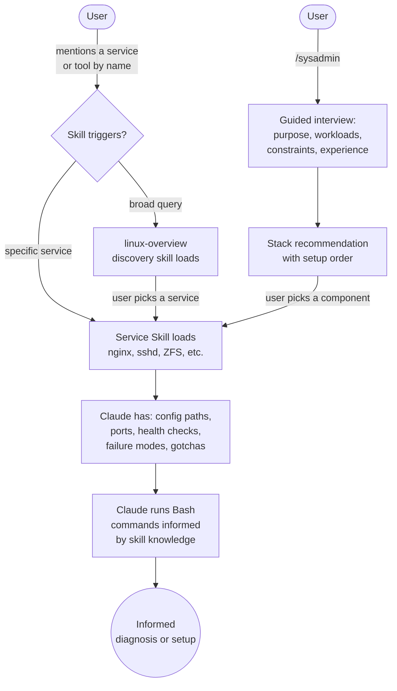

# linux-sysadmin

Linux system administration knowledge base: per-service skills with annotated configs, troubleshooting guides, and a guided `/sysadmin` stack design workflow.

## Summary

When debugging nginx, setting up WireGuard, or tuning ZFS, the hard part isn't running commands; it's knowing *which* commands, *what the output means*, and *what the gotchas are*. This plugin gives Claude that domain knowledge as skills: one per service, tool, or filesystem.

Each skill contains the config paths, expected ports, health checks, common failure modes, and pain points for its service. Reference files provide full annotated configs (every directive commented), invocation cheatsheets, and upstream doc links. Claude loads only the relevant skill when you mention a service, then uses its own Bash tool to act on it.

The `/sysadmin` command takes a different approach: it runs an interactive interview to understand your needs, then recommends a complete server stack with setup order.

## Principles

Design decisions in this plugin are evaluated against these principles.

**[P1] Knowledge Over Tooling**: Provide information Claude needs to reason, not tools that replace reasoning. A skill that teaches Claude what sshd_config options mean is more valuable than an MCP tool that wraps `systemctl status sshd`.

**[P2] One Skill, One Service**: Each service gets its own skill file. No categories, no bundling. The discovery skill handles cross-cutting "what should I use?" queries.

**[P3] Complete Config References**: Annotated config files document *every* directive with its default, recommended value, and when to change it. Partial references force Claude to guess or search the internet.

**[P4] Task-Organized, Not Alphabetical**: Cheatsheets and reference files are organized by what you're trying to accomplish, not by flag name. "How do I scan a subnet?" beats `-sn` as an entry point.

## Requirements

- Claude Code (any recent version)
- Linux system (for Bash commands in skills to be useful)
- No build step, no dependencies, no MCP server

## Installation

```bash
/plugin marketplace add L3Digital-Net/Claude-Code-Plugins
/plugin install linux-sysadmin@l3digitalnet-plugins
```

For local development or testing:

```bash
claude --plugin-dir ./plugins/linux-sysadmin
```

No post-install steps required.

## How It Works



## Usage

**Natural language** (skills load automatically):

> "My nginx keeps returning 502"
> "How do I set up WireGuard?"
> "What filesystem should I use for my NAS?"

**Guided workflow**:

```
/sysadmin
/sysadmin homelab media server
```

The `/sysadmin` command walks through:

1. **Purpose**: what kind of system you're building
2. **Workloads**: which capabilities you need (web, DB, VPN, monitoring, etc.)
3. **Constraints**: hardware, distro, existing stack, security posture
4. **Experience level**: adjusts recommendation complexity
5. **Output**: recommended stack with rationale and ordered setup sequence

## Commands

| Command | Description |
|---------|-------------|
| `/sysadmin` | Interactive system architecture interview with stack recommendations |

## Skills

| Skill | Loaded when |
|-------|-------------|
| `linux-overview` | Broad queries: "web server", "database", "what should I use for..." |
| Per-service skills | Mentioned by name: "nginx", "ZFS", "nmap", "fail2ban", etc. |

**Service categories covered:**

Web/Proxy, Containers/Virtualization, DNS, Security/Firewall, Databases, Monitoring, System Services, Storage/Backup, Filesystems, Network Services, Mail, Self-Hosted Apps, IoT/Home Automation, Certificates, CLI Monitoring Tools, Network Diagnostics, Disk Tools, Process/Debug, Text/Data, Misc Utilities.

See the [design document](../../docs/plans/2026-03-01-linux-sysadmin-design.md) for the full service inventory.

## Planned Features

- **Per-service skills**: ~75 skills covering services, CLI tools, and filesystems (in progress)
- **Annotated config files**: complete default configs with every option documented
- **Invocation cheatsheets**: task-organized CLI tool references
- **Filesystem property references**: full option tables for ZFS, Btrfs, ext4, XFS

## Known Issues

- **Skill coverage is incremental**: services are being added in phases. Check the skills directory for current coverage.

## Design Decisions

- **Skills over MCP**: The predecessor plugin (`linux-sysadmin-mcp`) was a TypeScript MCP server with 18 tools. It was replaced because Claude's Bash tool plus skill-provided knowledge achieves the same outcomes without the build step, runtime process, or MCP overhead.
- **Full annotated configs over curated subsets**: larger files, but Claude can find any option without needing to search upstream docs. Context is only loaded when the skill triggers.

## Links

- Repository: [L3Digital-Net/Claude-Code-Plugins](https://github.com/L3Digital-Net/Claude-Code-Plugins)
- Changelog: [`CHANGELOG.md`](CHANGELOG.md)
- Issues and feedback: [GitHub Issues](https://github.com/L3Digital-Net/Claude-Code-Plugins/issues)
- Design document: [`docs/plans/2026-03-01-linux-sysadmin-design.md`](../../docs/plans/2026-03-01-linux-sysadmin-design.md)
