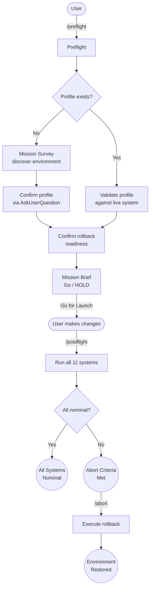

# Nominal

Structured verification routine for infrastructure changes. Three slash commands enforce a session contract ensuring every change begins with a validated environment and ends with a fully verified outcome.

## Summary

Infrastructure changes break things in subtle ways: a new service silently consumes resources, a firewall rule opens an unintended port, a backup configuration misses a new database. Nominal runs 11 verification systems after every change session, catching the failures that targeted checks miss. The name comes from the aerospace term for "all systems operating within expected parameters."

The plugin discovers your environment automatically on first run, stores the profile alongside your code, and maintains an append-only flight log of every verification run. It works on any Linux server, VM, or container host without modification.

## Principles

Design decisions in this plugin are evaluated against these principles.

**[P1] Full Suite, Every Time**: All 11 postflight systems run on every `/postflight`. No scoped or targeted check mode. Subtle failures are caught by comprehensive coverage, not by guessing which systems to check.

**[P2] Evidence Over Assertion**: Every check, pass or fail, shows the command run and the output observed. A pass without evidence is just a promise.

**[P3] Observe, Don't Act**: The systems check is read-only. Nominal makes changes only when the user explicitly selects "Fix forward" at an anomaly, or when writing the three data files it manages.

**[P4] Fail Loudly, Pass Quietly**: Anomalies get full diagnostic treatment. Clean passes get a single line. The final verdict is unambiguous.

**[P5] Survive Interruptions**: Rollback procedures persist in `abort.json` across sessions. The flight log is append-only. The environment profile is committed to version control. No critical state lives only in memory.

## Requirements

- Claude Code (any recent version)
- Linux environment (Debian, Ubuntu, RHEL, Alpine, or similar)
- Standard system tools (`systemctl`, `ss`, `ip`, `ufw`/`iptables`/`nft`, `git`)
- Infrastructure tooling varies by environment (Nominal adapts to what is present)

## Installation

```bash
/plugin marketplace add L3DigitalNet/Claude-Code-Plugins
/plugin install nominal@l3digitalnet-plugins
```

For local development or testing without installing:

```bash
claude --plugin-dir ./plugins/nominal
```

## How It Works



## Usage

### Typical workflow

1. **Before making changes**: run `/nominal:preflight`. Nominal validates your environment and confirms a rollback path. You get a Go for Launch or HOLD signal.

2. **Make your infrastructure changes** as normal.

3. **After changes are complete**: run `/nominal:postflight`. Nominal runs all 11 verification systems and produces a final verdict.

4. **If something went wrong**: run `/nominal:abort` at any time. Nominal executes the confirmed rollback procedure.

### First run

On the first `/preflight` in a repository, Nominal runs a Mission Survey: an automated discovery pass that profiles your environment (OS, services, network, monitoring, backups, security tooling, and more). The profile is saved to `.claude/nominal/environment.json` and used as the baseline for all future verification.

### Refreshing the profile

```
/nominal:preflight refresh
```

Forces a full re-discovery and shows a diff of what changed vs. the existing profile.

## Commands

| Command | Description |
|---------|-------------|
| `/nominal:preflight` | Pre-session validation: discover or validate environment, confirm rollback, produce Go/HOLD signal. |
| `/nominal:preflight refresh` | Force a full re-discovery of the environment profile with diff view. |
| `/nominal:postflight` | Post-session systems check: run all 11 verification systems, produce nominal/not-nominal verdict. |
| `/nominal:abort` | Abort and rollback: execute confirmed rollback procedure, verify restoration, terminate session. |

## Verification Systems

All 11 systems run on every postflight. System 0 (rollback readiness) is verified during preflight.

| System | Name | What it verifies |
|--------|------|------------------|
| 0 | Rollback readiness | Confirmed rollback path exists (preflight only) |
| 1 | Operational scripts & automation | Backup hooks, uptime monitors, lifecycle management |
| 2 | Backup integrity | Backup actually running and capturing data |
| 3 | Credential & secrets hygiene | Secrets in canonical store, not exposed |
| 4 | Reachability & access correctness | Services reachable from correct channels only |
| 5 | Security posture | Firewall, open ports, FIM baseline, IPS |
| 6 | Performance & resource baselines | CPU, memory, disk, OOM events, container limits |
| 7 | Service lifecycle & boot ordering | Autostart, dependency ordering, restart policies |
| 8 | Observability completeness | Monitoring data actively flowing |
| 9 | DNS & certificate lifecycle | DNS resolution, cert validity, renewal automation |
| 10 | Network routing correctness | Direct inter-node connectivity, binding, VPN routing |
| 11 | Documentation & state | Git status, profile freshness |

Grounded in ITIL Change Enablement, CIS Controls v8, NIST SP 800-190, Google SRE PRR, and HashiCorp/OWASP secrets management.

## Data Files

Nominal creates three files in your repository under `.claude/nominal/`. All are committed to version control by default.

| File | Format | Purpose |
|------|--------|---------|
| `environment.json` | JSON | Environment profile: host, network, services, tooling |
| `abort.json` | JSON | Persistent rollback procedures |
| `runs.jsonl` | JSONL | Append-only flight log of every verification run |

## Design Decisions

- **Always run all systems.** Targeted checks miss subtle failures. The trigger type label is context for the flight log, not a scope selector.

- **abort.json is a separate file.** Rollback procedures must survive session interruptions and profile updates. Storing them separately prevents accidental overwriting.

- **Abort terminates the session contract.** After a rollback, environment state is uncertain. A fresh preflight ensures a clean baseline.

- **No skills, only commands.** The reference knowledge loads only when a command requests it. Between sessions, Nominal consumes no context budget and adds nothing to the skills menu.

- **Flight log is never trimmed.** Simplest approach; file stays small for typical use; users retain full audit history.

## Planned Features

- **Inter-service authentication checks**: verify mutual TLS or token auth between dependent services (natural extension of Domain 3).
- **Patch currency assessment**: optional check for pending security updates (excluded from v1 as too slow for post-change verification).

## Known Issues

- **First-run discovery takes time.** The Mission Survey examines the full environment; expect a few minutes on complex setups. Subsequent preflight runs are fast spot-checks.

## Links

- Repository: [L3DigitalNet/Claude-Code-Plugins](https://github.com/L3DigitalNet/Claude-Code-Plugins)
- Changelog: [`CHANGELOG.md`](CHANGELOG.md)
- Issues and feedback: [GitHub Issues](https://github.com/L3DigitalNet/Claude-Code-Plugins/issues)
