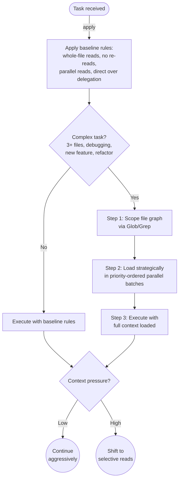

# opus-context

Teaches Claude Code Opus 4.6 to use its full 1M token context window instead of defaulting to conservative behaviors designed for smaller models.

## Summary

Claude Code defaults to reading files in small chunks, delegating searches to subagents, and re-reading files it already has in context. These habits make sense for 200K-token models but waste Opus 4.6's capacity. This plugin provides always-on behavioral rules that override those defaults: read whole files, read directly instead of delegating, pre-load dependencies before editing, and track what's already loaded.

## Principles

**[P1] Read More, Not Less**: With 1M tokens, a 500-line file costs ~0.1% of context. The cost of missing context from partial reads exceeds the cost of loading the full file.

**[P2] Own Your Context**: Read files directly rather than delegating to subagents that return summaries. Summaries lose nuance; source code doesn't.

**[P3] Load Before You Leap**: Read a file's dependency graph (imports, callers, tests) before editing it. Never discover mid-edit that you need context you don't have.

**[P4] Budget Awareness**: Read aggressively early; shift to selective reading as context fills. Don't run out of context on long sessions.

## Requirements

None beyond Claude Code with Opus 4.6 (1M context).

## Installation

```bash
/plugin marketplace add L3DigitalNet/Claude-Code-Plugins
/plugin install opus-context@l3digitalnet-plugins
```

For local development or testing without installing:

```bash
claude --plugin-dir ./plugins/opus-context
```

## How It Works



## Usage

This skill is always-on. It activates automatically via skill description matching whenever Claude Code processes a task. No manual invocation needed.

Optional CLAUDE.md reinforcement (add to your global `~/.claude/CLAUDE.md`):

```markdown
## Context Management

When running on Opus 4.6 (1M context), always consult the `opus-context:deep-context` skill for file reading, delegation, and pre-loading decisions.
```

## Skills

| Skill | Loaded when |
|-------|-------------|
| `deep-context` | Always, via broad description matching. Governs file reading, subagent delegation, and pre-loading decisions. |

## Hooks

All hooks are registered declaratively via `hooks/hooks.json`.

| Hook | Event | What it does |
|------|-------|-------------|
| `session-start.sh` | SessionStart | Prints a terminal banner confirming 1M context mode is active. Terminal-only; does not inject into AI context. |

## Design Decisions

- **Always-on via description, not SessionStart injection**: SessionStart hook stdout goes to the terminal, not AI context. The skill's broad `description` field is the primary activation mechanism, with optional CLAUDE.md reinforcement as a second trigger path.

- **Heuristic budget thresholds instead of percentages**: Claude can't measure its exact context usage. Budget awareness uses observable signals (file count, conversation length, compaction events) instead of precise percentages.

- **No model detection gate**: The skill's rules are framed around having abundant context. A smaller-context model that loads the skill will naturally hit budget awareness thresholds and shift conservative sooner.

## Planned Features

- **PreCompact hook**: Save a context summary before compaction so post-compaction sessions retain awareness of what was loaded.
- **Read tracking**: PostToolUse hook that counts Read calls and warns when context is getting heavy.

## Known Issues

- **No runtime model detection**: The skill cannot programmatically verify it's running on Opus 4.6. If loaded on a smaller-context model, the aggressive reading rules may fill context faster than intended. The budget awareness heuristics mitigate this.

## Links

- Repository: [L3DigitalNet/Claude-Code-Plugins](https://github.com/L3DigitalNet/Claude-Code-Plugins)
- Changelog: [`CHANGELOG.md`](CHANGELOG.md)
- Issues and feedback: [GitHub Issues](https://github.com/L3DigitalNet/Claude-Code-Plugins/issues)
