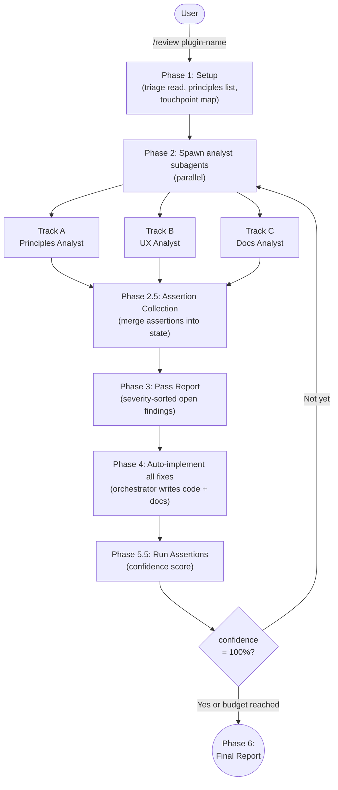

# plugin-review

Plugin quality review covering principles alignment, terminal UX, and documentation freshness via orchestrated subagents.

## Summary

`plugin-review` runs a multi-pass, assertion-driven audit of any Claude Code plugin. Four read-only analyst subagents work in parallel across four tracks (principles alignment, Track A; terminal UX quality, Track B; documentation freshness, Track C; and context efficiency, Track D) then report findings back to the orchestrator, which auto-implements all fixes and re-audits until the assertion confidence score reaches 100% or the pass budget is exhausted. An optional `--autonomous` flag adds a fifth subagent (regression guard), tier-classified auto-fixing, and build/test validation after each implementation pass.

## Principles

**[P1] Act on Intent**: Invoking `/review` is consent to run the full multi-pass loop. The orchestrator never inserts approval gates during the loop; fixes are auto-implemented and re-audited without interruption.

**[P2] Scope Fidelity**: The orchestrator does not read full plugin source files. Subagents analyze; the orchestrator implements. This boundary is structural; analyst agents have read-only tool restrictions (`tools: Read, Grep, Glob`) enforced in their YAML frontmatter.

**[P3] On-Demand Template Loading**: Templates are loaded by the component that uses them, not pre-loaded by the orchestrator. The orchestrator passes template paths to subagents; subagents read them at analysis time. This keeps the orchestrator's context footprint minimal.

**[P4] Bounded User Interaction**: Every user-facing decision point uses `AskUserQuestion` with explicit options. During the review loop itself no interaction occurs; the loop is fully automated from invocation to final report.

**[P5] Convergence is the Contract**: The loop drives toward 100% assertion confidence without check-ins. It stops only when confidence reaches 100%, the pass budget is exhausted, a plateau is detected, or divergence occurs.

**[P6] Documentation Co-mutation**: Every implementation change must include corresponding documentation updates. A PostToolUse hook (`doc-write-tracker.sh`) mechanically warns when implementation files are modified without a corresponding documentation write.

**[P7] Analyst/Orchestrator Separation**: Three categories of subagents are held strictly apart: read-only analysts (principles-analyst, ux-analyst, docs-analyst, efficiency-analyst, regression-guard) that only produce findings; write-capable fixers (fix-agent, build-fix-agent) that implement minimal targeted fixes; and the orchestrator command that synthesizes results and implements the main body of changes.

**[P8] Enforcement Layers**: Principle enforcement is evaluated against a three-tier hierarchy: Mechanical (hooks that block/warn deterministically) > Structural (file organization, agent tool restrictions) > Behavioral (prompt instructions). A principle that claims mechanical enforcement but relies solely on behavioral instructions is flagged as a gap.

**[P9] Read-Only Analyst Enforcement**: Analyst subagents must not gain write tools. A PostToolUse hook (`validate-agent-frontmatter.sh`) warns when Write, Edit, Bash, or other disallowed tools are added to analyst agent YAML frontmatter.

## Requirements

- Claude Code (any recent version)

## Installation

```
/plugin marketplace add L3Digital-Net/Claude-Code-Plugins
/plugin install plugin-review@l3digitalnet-plugins
```

For local development:

```bash
claude --plugin-dir ./plugins/plugin-review
```

## How It Works



In `--autonomous` mode, a fourth subagent (Regression Guard) runs on every Pass 2+ in parallel with the analysts, and Phase 4.5 runs build/test validation after each implementation pass.

## Usage

Invoke `/review` with an optional plugin name:

```
/review
/review my-plugin
/review my-plugin --max-passes=3
/review my-plugin --autonomous
/review my-plugin --autonomous --max-passes=8
```

Without a plugin name, the orchestrator presents a bounded list of available plugins to choose from. `--max-passes=N` overrides the default pass budget of 5. `--autonomous` enables fully autonomous convergence mode with regression guard and build/test validation.

The review loop is fully automated: analysts report findings, the orchestrator auto-implements all fixes, assertions are run, and the loop repeats until convergence or budget exhaustion. No approval gates exist inside the loop.

## Commands

| Command | Description |
|---------|-------------|
| `/review` | Launch a multi-pass plugin quality review. Accepts optional plugin name, `--max-passes=N`, and `--autonomous` flag. |
| `/review-efficiency` | Standalone 5-stage interactive context efficiency review (P1–P12) for a plugin. |
| `/tighten` | Prose tightening workflow for plugin markdown files. |

## Agents

| Agent | Track | Description |
|-------|-------|-------------|
| `principles-analyst` | A | Read-only. Audits plugin implementation files against stated principles and checkpoints. Returns per-principle status (Upheld / Partially Upheld / Violated), enforcement layer assessment, root architectural alignment, and machine-verifiable assertions. |
| `ux-analyst` | B | Read-only. Audits user-facing code paths against terminal UX criteria across four categories: information density, user input, progress/feedback, and terminal-specific patterns. Returns severity-grouped findings and assertions. |
| `docs-analyst` | C | Read-only. Compares documentation files against implementation structure across five drift categories: accuracy, completeness, orphaned references, principle-implementation consistency, and examples. Returns per-file freshness assessment and assertions. |
| `regression-guard` | — | Read-only. Autonomous mode only, Pass 2+. Re-checks previously-fixed findings to verify fixes are still intact after subsequent implementation changes. Returns per-finding holding/regressed status with file-level evidence. |
| `efficiency-analyst` | D | Read-only. Evaluates P1–P12 context efficiency compliance in parallel with Tracks A/B/C. Uses `track-d-criteria.md` to assess context footprint, enforcement layering, and composability across all plugin components. |
| `fix-agent` | (n/a) | Write-capable. Invoked after `run-assertions.sh` finds failures. Implements the minimum change needed to make each failing assertion pass, then returns a structured summary. |
| `build-fix-agent` | (n/a) | Write-capable. Autonomous mode only. Invoked in Phase 4.5 when `run-build-test.sh` reports failures. Implements minimal fixes for build or test breakage introduced during Phase 4. Spawned at most once per pass. |

## Skills

| Skill | Loaded when |
|-------|-------------|
| `scoped-reaudit` | Consulted by the orchestrator at Phase 2 on Pass 2+ to determine which analyst tracks need re-running based on which files changed in the previous pass. Track C always re-runs; Tracks A and B run only when their mapped file types were modified. |
| `context-efficiency-workflow` | Consulted during `/review-efficiency` to drive the approval-gated P1–P12 review workflow. |
| `context-efficiency-reference` | Reference material for P1–P12 principle definitions and layer taxonomy; loaded by the efficiency-analyst and `/review-efficiency`. |
| `markdown-tighten` | Loaded during `/tighten`; provides a five-step prose compression workflow for plugin markdown files. |

## Hooks

| Hook | Event | What it does |
|------|-------|--------------|
| `doc-write-tracker.sh` | PostToolUse — `Write\|Edit\|MultiEdit\|NotebookEdit\|mcp__.*__(write\|edit\|create\|update).*` | Warns when implementation files are modified without a corresponding documentation update. Mechanically enforces the code-change-requires-doc-update contract. |
| `validate-agent-frontmatter.sh` | PostToolUse — `Write\|Edit\|MultiEdit` | Warns when disallowed tools (Write, Edit, Bash, etc.) are added to analyst agent YAML frontmatter. Secondary enforcement for the read-only analyst boundary. |

## Review Tracks

### Track A: Principles Alignment

Evaluated by `principles-analyst` using `templates/track-a-criteria.md`.

Audits every plugin-specific principle (P1–Pn) and root architectural principle from the repo README against the actual implementation. For each principle, the agent determines status (Upheld / Partially Upheld / Violated), identifies the actual enforcement layer, and notes the gap between actual and expected enforcement. Also checks for orphaned principles (stated but unenforced) and undocumented enforcement (hooks enforcing unstated rules).

Includes a `[C1] LLM-Optimized Commenting` checkpoint that evaluates whether in-code comments are written for the AI reader: architectural role headers, intent-over-mechanics explanations, constraint annotations, decision context, and cross-file relationship notes. Flags syntax narration, decorative structure, and stale comments as anti-patterns.

### Track B: Terminal UX Quality

Evaluated by `ux-analyst` using `templates/track-b-criteria.md`.

Audits every user-facing touchpoint (tools that produce output, input collection points, status/progress/error messages, and long-form text blocks) against four UX categories:

- **Information Density**: Is output appropriately compact? No verbose preamble before findings.
- **User Input**: Are decision points bounded choices (`AskUserQuestion`) rather than open-ended prompts?
- **Progress and Feedback**: Are long operations accompanied by progress signals? Are errors surfaced with recovery paths?

Terminal-specific checks also apply: output must respect terminal width, avoid excessive color, and format structured data legibly.

Findings are severity-grouped: High (🔴), Medium (🟡), Low (🟢).

### Track C: Documentation Freshness

Evaluated by `docs-analyst` using `templates/track-c-criteria.md`.

Compares all documentation files against the actual implementation across five drift categories:

1. **Accuracy**: Do described behaviors, parameter names, and examples match the code?
2. **Completeness**: Are all user-facing tools, commands, hooks, and configuration options documented? Required README sections: `Summary`, `Principles`, `Requirements`, `Installation`, `How It Works`, `Usage`, `Planned Features`, `Known Issues`, `Links`.
3. **Orphaned References**: Does the documentation describe features or flags that no longer exist?
4. **Principle-Implementation Consistency**: Do README principle descriptions accurately reflect actual enforcement mechanisms?
5. **Examples and Usage**: Do workflow sequences and code examples match the current phase order and parameter names?

Each finding is classified as `Pre-existing drift` or `Introduced by Pass N changes`; the review process itself must not introduce documentation drift.

### Track D: Context Efficiency

The `efficiency-analyst` agent evaluates all component types against twelve context efficiency principles (P1–P12), covering instruction design, runtime efficiency, agent architecture, and token budget. Track D runs in parallel with Tracks A/B/C on every pass.

### Regression Guard (autonomous mode only)

Evaluated by `regression-guard`.

On every Pass 2+, re-reads files affected by previously-fixed findings and verifies each fix is still intact. Returns `Holding`, `Regressed`, or `Indeterminate` per finding. Regressions extend the convergence loop even if assertion confidence is 100%; both conditions must hold simultaneously to exit in autonomous mode.

## Planned Features

None currently documented in the changelog as unreleased.

## Known Issues

- The `doc-write-tracker.sh` hook does not track writes to `hooks/hooks.json`. Modifications to hook configuration without documentation updates will not trigger the co-mutation warning.
- `validate-agent-frontmatter.sh` is warn-only, not blocking. An analyst agent gaining write tools will generate a warning but the write will proceed. Full blocking enforcement requires a manual pre-completion check.
- `build-fix-agent` is spawned at most once per pass. If its fix attempt fails, the failure is noted in the final report and convergence continues with unresolved build failures rather than looping.
- The scoped re-audit skill always runs Track C on re-audit, even when only implementation files unrelated to documentation changed. This is intentional conservatism but means the docs-analyst is always spawned on Pass 2+.

## Links

- Repository: [L3Digital-Net/Claude-Code-Plugins](https://github.com/L3Digital-Net/Claude-Code-Plugins)
- Changelog: [CHANGELOG.md](CHANGELOG.md)
- Issues: [GitHub Issues](https://github.com/L3Digital-Net/Claude-Code-Plugins/issues)
