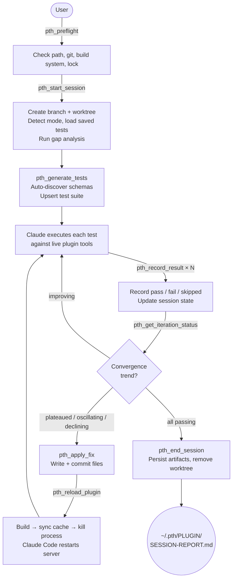

# Plugin Test Harness

An iterative MCP-based test harness for Claude Code plugins and MCP servers.

## Summary

Plugin Test Harness (PTH) runs a structured test/fix/reload loop against a target plugin entirely inside Claude Code. It creates a git session branch and worktree, auto-discovers tool schemas from the live MCP server, generates test cases, executes them via Claude, and applies code fixes, iterating until convergence. Test suites and session artifacts persist across sessions in `~/.pth/PLUGIN_NAME/` so state is never lost when a session ends or a process restarts.

## Principles

**[P1] Act on Intent**: Invoking a session tool is consent to its full scope. Session gates block only the narrow pre-session window; once a session is active, all tools operate without confirmation.

**[P2] Scope Fidelity**: Each tool does exactly one thing: generate, record, fix, reload, or inspect. No tool performs a superset of its stated scope without being asked.

**[P3] Succeed Quietly, Fail Transparently**: Normal iterations emit compact summaries. On critical failures (build error, git conflict, missing tool) PTH stops immediately and surfaces raw output alongside a recovery plan.

**[P4] Use the Full Toolkit**: The convergence trend (`improving`, `plateaued`, `oscillating`, `declining`) is a structured signal, not prose, enabling Claude to pick the right next action without guessing.

**[P5] Convergence is the Contract**: Sessions iterate toward zero failing tests without check-ins. PTH surfaces the trend and a recommended next action at each iteration boundary; the AI drives toward the goal.

**[P6] Composable, Focused Units**: Each MCP tool is independently callable. Orchestration is assembled at runtime by the AI agent, not baked into PTH itself.

## Requirements

- Node.js 20+
- Target plugin must be on the local filesystem inside a git repository
- For `mcp` mode: target server must be startable via its `.mcp.json` (PTH spawns the server to discover tool schemas)
- For `plugin` mode: target plugin must have a `.claude-plugin/` directory

## Installation

```
/plugin marketplace add L3Digital-Net/Claude-Code-Plugins
/plugin install plugin-test-harness@l3digitalnet-plugins
```

For local development:

```bash
claude --plugin-dir ./plugins/plugin-test-harness
```

### Post-Install Steps

PTH is distributed with a pre-built `dist/` directory. If you are running from source or a clean checkout, build first:

```bash
cd ~/.claude/plugins/cache/l3digitalnet-plugins/plugin-test-harness/<version>/
npm install
npm run build
```

## How It Works



## Usage

### Starting a session

```
Call pth_preflight with the absolute path to your plugin.
Then call pth_start_session to create the session branch.
Call pth_generate_tests; schemas are auto-discovered.
Execute each test by calling the plugin's tools, then pth_record_result.
Call pth_get_iteration_status to checkpoint and see the trend.
Apply fixes with pth_apply_fix, reload with pth_reload_plugin, repeat.
End with pth_end_session.
```

### Resuming an interrupted session

If the Claude Code process restarts mid-session, use:

```
pth_resume_session  branch: "pth/my-plugin-2026-02-18-abc123"  pluginPath: "/path/to/plugin"
```

Session branches follow the pattern `pth/<plugin>-<date>-<6-char-hex>`. The branch remains in the git repository after the session ends, preserving the full fix history.

### Session isolation

Each session runs in a git worktree at `/tmp/pth-worktree-<branch-slug>`. The main working tree is never modified during a session. Fix commits land on the session branch; `pth_diff_session` shows the cumulative diff against the branch point.

## Tools

### Session Management

| Tool | Description |
|------|-------------|
| `pth_preflight` | Validate prerequisites: plugin path exists, git repo detected, plugin mode recognized, no active session lock, persistent store status. |
| `pth_start_session` | Create session branch and worktree, detect plugin mode, load saved tests from persistent store, run gap analysis vs last snapshot. |
| `pth_resume_session` | Re-attach to an existing session branch after a process restart. Loads tests from persistent store. |
| `pth_end_session` | Persist tests and artifacts to `~/.pth/`, generate SESSION-REPORT.md, remove worktree, release session lock. |
| `pth_get_session_status` | Current iteration count, pass/fail totals, convergence trend, mode, and start time. |

### Test Management

| Tool | Description |
|------|-------------|
| `pth_generate_tests` | Auto-discover tool schemas by spawning the target MCP server, then generate test cases (valid input + missing-required-field variants). Upserts existing tests rather than duplicating. Accepts optional `tools[]` for gap-targeted generation. |
| `pth_list_tests` | List tests with optional filters: `mode` (mcp/plugin), `status` (passing/failing/pending), `tag`. |
| `pth_create_test` | Add a new test from a YAML definition. |
| `pth_edit_test` | Update an existing test by ID with a new YAML definition. |

### Execution and Results

| Tool | Description |
|------|-------------|
| `pth_record_result` | Record a test outcome (passing/failing/skipped) after Claude executes the test. Accepts optional `durationMs`, `failureReason`, and `claudeNotes`. |
| `pth_get_results` | Full pass/fail listing for all tests with failure reasons. |
| `pth_get_test_impact` | Identify which tests exercise a given set of source files, used to target re-runs after a fix. |
| `pth_get_iteration_status` | Checkpoint the current iteration: snapshot pass/fail counts, advance the iteration counter, emit the convergence table and trend recommendation. |

### Fix Management

| Tool | Description |
|------|-------------|
| `pth_apply_fix` | Write file changes and commit to the session branch with PTH git trailers (`PTH-Test`, `PTH-Category`, `PTH-Iteration`, `PTH-Files`). |
| `pth_sync_to_cache` | Sync worktree changes to the plugin's installed cache directory so hook script changes take effect immediately without a rebuild. |
| `pth_reload_plugin` | Build the plugin, sync the new binary to cache, then send SIGTERM to the MCP server process. Claude Code auto-restarts the server from the updated cache. |
| `pth_get_fix_history` | List all fix commits on the session branch with their PTH trailers. |
| `pth_revert_fix` | Undo a specific fix commit via `git revert`. Handles `session-state.json` conflicts automatically. |
| `pth_diff_session` | Show the cumulative diff of all changes on the session branch vs the branch point (truncated at 200 lines; use `pth_get_fix_history` for a structured summary on large diffs). |

## Modes

| Mode | Detected when | How PTH tests |
|------|---------------|---------------|
| `mcp` | `.mcp.json` present at plugin root | Spawns the MCP server via `.mcp.json`, calls `tools/list` to discover all tool schemas, generates test calls via Claude using the discovered tools |
| `plugin` | `.claude-plugin/` directory present (no `.mcp.json`) | Inspects `commands/`, `skills/`, `agents/` directories; generates file-existence validation tests for hook scripts |

If both signals are present, `mcp` takes precedence.

## Test YAML Format

Tests are defined in YAML and parsed into `PthTest` objects. The `id` field is auto-generated from the name via slugification if not explicitly provided.

### Single MCP tool call

```yaml
id: pkg-info-valid-input          # optional; slugified from name if omitted
name: pkg_info - valid input
mode: mcp
type: single
tool: pkg_info
input:
  package: bash
expect:
  success: true
  output_contains: "Description"
timeout_seconds: 10
tags: [smoke]
```

### Multi-step scenario (captures output between steps)

```yaml
name: pth_get_commit - valid input
mode: mcp
type: scenario
steps:
  - tool: pth_apply_fix
    input:
      files:
        - path: src/stub.ts
          content: "// stub\n"
      commitTitle: "test: stub commit for scenario"
    expect:
      success: true
    capture:
      commitHash: "text:Fix committed: (\\w+)"
  - tool: pth_get_commit
    input:
      commitHash: ${commitHash}
    expect:
      success: true
expect:
  success: true
timeout_seconds: 30
generated_from: schema
```

### Plugin hook script validation

```yaml
name: write-guard.sh - script exists and is readable
mode: plugin
type: validate
checks:
  - type: file-exists
    files: [scripts/write-guard.sh]
expect: {}
generated_from: source_analysis
```

### Custom exec test

```yaml
name: build succeeds
mode: plugin
type: exec
command: npm run build
expect:
  exit_code: 0
  stdout_contains: "Build succeeded"
timeout_seconds: 60
```

### Available `expect` fields

| Field | Type | Description |
|-------|------|-------------|
| `success` | boolean | Tool call returns without error |
| `output_contains` | string | Response text contains substring |
| `output_equals` | string | Response text exact match |
| `output_matches` | string | Response text matches regex |
| `output_json` | any | Response parses as JSON equal to value |
| `output_json_contains` | any | Response JSON contains subset |
| `error_contains` | string | Error message contains substring |
| `exit_code` | number | Process exit code (exec type) |
| `stdout_contains` | string | stdout contains substring (exec type) |
| `stdout_matches` | string | stdout matches regex (exec type) |

## Session Branches

Branch naming: `pth/<plugin-name>-<YYYY-MM-DD>-<6-hex-chars>`

Example: `pth/linux-sysadmin-mcp-2026-02-18-a3f9c2`

Worktrees are created at: `/tmp/pth-worktree-<branch-slug>`

The branch remains in the git repository after `pth_end_session`; you can browse fix history with:

```bash
git log pth/my-plugin-2026-02-18-a3f9c2 --oneline
git show pth/my-plugin-2026-02-18-a3f9c2:src/some-file.ts
```

Each fix commit carries PTH git trailers:

```
fix: handle null group

PTH-Test: pkg_info_missing_required
PTH-Category: runtime-exception
PTH-Iteration: 3
PTH-Files: src/tools/pkg-info.ts
```

## Persistent Store

All session artifacts are written to `~/.pth/<plugin-name>/` at `pth_end_session`:

```
~/.pth/<plugin-name>/
├── index.json                   # metadata + session count
├── tests/                       # authoritative test suite (loaded by pth_start_session)
├── results-history.json         # per-test pass/fail history across all sessions
├── plugin-snapshot.json         # tool schemas + component list for gap analysis
└── sessions/<branch>/
    ├── SESSION-REPORT.md        # iteration table, fix list, final results
    ├── iteration-history.json
    └── fix-history.json
```

Tests in `~/.pth/` are the authoritative source. When resuming or starting a new session, PTH loads the saved test suite; no tests are lost across process restarts.

## Convergence

`pth_get_iteration_status` evaluates the last four iteration snapshots and returns one of five trend values:

| Trend | Meaning | Recommended action |
|-------|---------|-------------------|
| `unknown` | Fewer than two iterations recorded | Keep running tests |
| `improving` | Pass count rising over the window | Continue iterating |
| `plateaued` | Last 2–3 snapshots have identical pass counts | Try a different fix strategy |
| `oscillating` | Direction reverses 2+ times in the window | Use `pth_get_test_impact` to find the regressing fix |
| `declining` | Pass count fell from first to last snapshot | Use `pth_revert_fix` before continuing |

The convergence table rendered by `pth_get_iteration_status`:

```
| Iteration | Passing | Failing | Fixes |
|-----------|---------|---------|-------|
| 1         | 12      | 8       | 0     |
| 2         | 16      | 4       | 2     |
| 3         | 18      | 2       | 1     |
```

## Gap Analysis

When a persistent store exists for a plugin, `pth_start_session` compares the saved plugin snapshot against the current source to surface structural changes without requiring a live server. It flags new tools (present in source but absent from the snapshot), modified tools (source files changed since capture), and removed tools. Tests whose target tool was removed are surfaced as stale test IDs.

Use `pth_generate_tests` with the `tools[]` parameter to generate tests only for new or modified components from the gap report.

## Planned Features

None currently documented in the changelog as unreleased.

## Known Issues

- `pth_reload_plugin` terminates the MCP server process by pattern-matching against `ps` output. On systems where the process pattern cannot be found (non-standard Claude Code installation paths), pass `processPattern` explicitly.
- Convergence trend requires at least two distinct iteration snapshots. A session with a single `pth_get_iteration_status` call always returns `unknown`.
- Plugin mode (`hook-script` and `validate` tests) currently generates only file-existence checks. Behavioral testing of hook scripts requires `exec` type tests written manually via `pth_create_test`.
- The `capture` field in scenario steps uses text regex extraction from the tool response string, not JSON path extraction. Complex output formats may require manual test authoring.

## Links

- Repository: [L3Digital-Net/Claude-Code-Plugins](https://github.com/L3Digital-Net/Claude-Code-Plugins)
- Changelog: [CHANGELOG.md](CHANGELOG.md)
- Issues: [GitHub Issues](https://github.com/L3Digital-Net/Claude-Code-Plugins/issues)
- Design document: [docs/PTH-DESIGN.md](docs/PTH-DESIGN.md)
