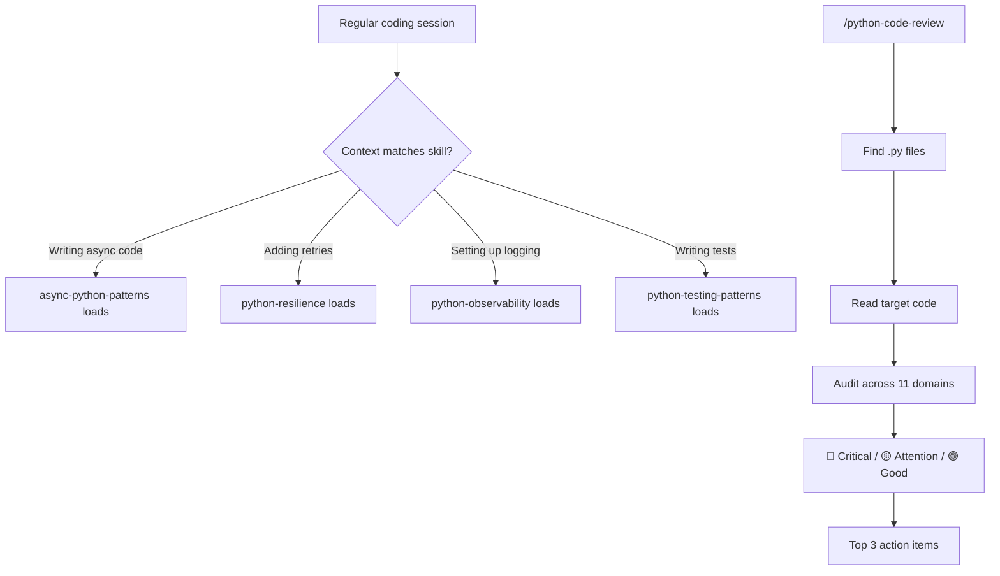

# python-dev

11 Python development skills that load automatically when relevant, plus `/python-code-review` for comprehensive code audits across all domains in one pass.

## Summary

Python projects accumulate quality debt in specific, well-known patterns: no retry on external calls, hardcoded config, missing type annotations, untested error paths. Rather than relying on a developer to remember which domain applies to what they're building, this plugin loads the right guidance automatically: the async skill appears when you write async code, the resilience skill appears when you call external APIs, and so on.

`/python-code-review` brings all 11 domains together into a single structured audit that identifies critical issues, prioritizes what to fix first, and highlights what the code already does well.

## Principles

Design decisions in this plugin are evaluated against these principles.

**[P1] Context-triggered, not explicitly invoked**: Skills load when the AI determines they are relevant to the current task. No user action required for routine coding sessions.

**[P2] Audit without false positives**: The review command checks only for concrete, demonstrable issues, not opinions. Each finding maps to a specific anti-pattern or missing practice with an identifiable location.

**[P3] Domain isolation**: Each skill covers exactly one concern. Overlap between skills is intentional cross-reference, not duplication.

## Requirements

- Claude Code with plugin support
- Python projects (`.py` files) in the working directory for `/python-code-review`

## Installation

```
/plugin marketplace add L3DigitalNet/Claude-Code-Plugins
/plugin install python-dev@l3digitalnet-plugins
```

## How It Works



## Usage

Skills load automatically during coding sessions, with no explicit invocation needed. When you write async code, the `async-python-patterns` skill loads. When you add retries, `python-resilience` loads. The mermaid diagram above shows the general flow.

For a one-pass audit of existing code, run `/python-code-review` with an optional path:

```
/python-code-review                        # audit current directory
/python-code-review src/api/handlers.py    # audit a specific file
/python-code-review src/                   # audit a subdirectory
```

The review works through all 11 domains and emits a prioritized summary at the end.

## Commands

| Command | Description |
|---------|-------------|
| `/python-code-review [path]` | Run a comprehensive quality audit across all 11 Python domains. Path is optional (defaults to current directory). Accepts a file, directory, or glob pattern. |

## Skills

All 11 skills load automatically when the AI determines they apply to the current context. No explicit invocation needed.

| Skill | Triggers on |
|-------|-------------|
| `python-anti-patterns` | Pre-merge review, debugging unknown failures, code cleanup |
| `python-type-safety` | Type annotations, generics, Protocol, mypy/pyright configuration |
| `python-design-patterns` | Class refactoring, dependency injection, composition vs inheritance |
| `python-code-style` | Linter/formatter setup, naming conventions, docstrings, ruff/mypy config |
| `python-resource-management` | Context managers, connection/file handle cleanup, streaming responses |
| `python-resilience` | Retry logic, timeouts, exponential backoff, fault-tolerant external calls |
| `python-configuration` | Environment variables, pydantic-settings, secrets management |
| `python-observability` | Structured logging, Prometheus metrics, OpenTelemetry tracing |
| `python-testing-patterns` | pytest fixtures, mocking, parametrize, async tests, conftest |
| `async-python-patterns` | asyncio, async/await, concurrent I/O, event loop, async frameworks |
| `python-background-jobs` | Celery, RQ, Dramatiq, task queues, job state, idempotency |

## Planned Features

- `python-security` skill covering OWASP patterns, injection, dependency scanning
- `/python-setup` command for scaffolding new projects with ruff, mypy, and pytest configured

## Known Issues

None.

## Links

- [Plugin source](https://github.com/L3DigitalNet/Claude-Code-Plugins/tree/main/plugins/python-dev)
- [Changelog](CHANGELOG.md)
- [Plugin development docs](https://github.com/L3DigitalNet/Claude-Code-Plugins/blob/main/docs/plugins.md)
