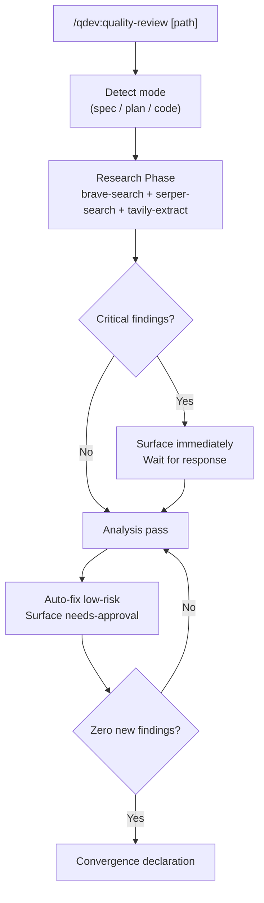
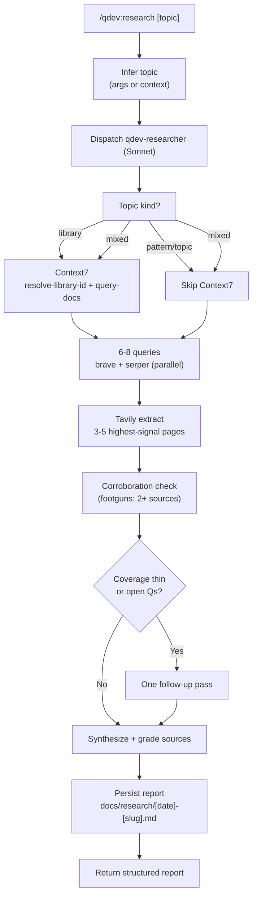

# qdev

Quality review and spec sync for every stage of the development lifecycle.

## Summary

Writing a spec, planning an implementation, or reviewing code all have different quality criteria but the same enemy: making decisions with stale or incorrect knowledge. `qdev` addresses this at every stage. `/research` runs a structured dual-source sweep before you design or build. `/quality-review` iterates until it finds nothing left to fix. `/deps-audit` checks every package manifest against current CVE databases and version registries. `/doc-sync` keeps inline documentation aligned with actual function signatures. `/spec-update` keeps your design spec in sync with what you actually built. The `qdev-grounding` skill auto-fires mid-task when you're stuck or missing current data, doing cheap inline lookups that escalate to a full sweep on failure.

## Principles

Design decisions in this plugin are evaluated against these principles.

**[P1] Research Before Analysis**: Web research runs before any gap or consistency check, and is available as a first-class command before design work begins. No finding is proposed based on training data alone when a live source can be consulted.

**[P2] Explicit Commands, One Controlled Auto-Trigger**: The plugin's commands never load contextually - each fires only when explicitly called with a slash command. The single exception is the `qdev-grounding` skill: the plugin's one deliberate auto-trigger, which fires when the agent is stuck or missing current data, starts with a cheap sanitizer-gated inline lookup, and asks for approval before any risky egress or auto-fired report write.

**[P3] Propose Before Writing**: No spec, plan, or source file is modified without first presenting a specific proposed change and receiving approval for structural changes.

**[P4] Convergence Without Check-ins**: The quality-review loop runs to completion without mid-pass interruptions. Only needs-approval findings surface for human input.

## Requirements

- Claude Code (any recent version)
- `brave-search` MCP server (required for `/qdev:quality-review` and `/qdev:research`)
- `serper-search` MCP server (required for `/qdev:quality-review` and `/qdev:research`)
- `tavily` MCP server (recommended; used for content-heavy queries and JS-rendered page extraction across `/qdev:research`, `/qdev:quality-review`, and `/qdev:deps-audit`)
- `qdev-grounding` uses the same `brave-search` / `serper-search` / `tavily` MCP servers for sanitizer-gated inline lookups.

## Installation

```bash
/plugin marketplace add L3DigitalNet/Claude-Code-Plugins
/plugin install qdev@l3digitalnet-plugins
```

For local development:

```bash
claude --plugin-dir ./plugins/qdev
```

## How It Works





## Usage

Invoke at any stage of a development project. Pass a path to target a specific file, or run without arguments to let the command detect the most relevant artifact in the working directory.

```bash
# Research a technology or topic before starting design work
/qdev:research "Redis pub/sub with Python"

# Research from mid-session context (infers topic automatically)
/qdev:research

# Review a spec file
/qdev:quality-review docs/superpowers/specs/my-feature-design.md

# Review an implementation plan
/qdev:quality-review docs/superpowers/plans/my-feature-plan.md

# Review source code (auto-detects from working directory)
/qdev:quality-review

# Audit all dependencies for CVEs and version lag
/qdev:deps-audit

# Audit dependencies in a specific subdirectory
/qdev:deps-audit services/api

# Sync inline docs for a single file
/qdev:doc-sync src/auth/tokens.py

# Sync inline docs across the whole project
/qdev:doc-sync

# Sync a spec with the current implementation
/qdev:spec-update docs/superpowers/specs/my-feature-design.md
```

## Commands

| Command | Description |
|---------|-------------|
| `/qdev:research` | Dual-source research sweep covering docs, practices, footguns, existing tools, security, and recent changes (dispatches `qdev-researcher`) |
| `/qdev:quality-review` | Research-first iterative quality review until convergence (dispatches `qdev-quality-reviewer`) |
| `/qdev:deps-audit` | Dependency security and freshness audit across all package manifests (dispatches `qdev-deps-auditor`) |
| `/qdev:doc-sync` | Sync inline documentation with current function signatures (dispatches `qdev-doc-syncer`) |
| `/qdev:spec-update` | One-shot sync of a spec file to match current implementation |

## Agents

| Agent | Model | Purpose |
|-------|-------|---------|
| `qdev-researcher` | Sonnet | Tavily-first research with Brave/Serper cross-checks, Context7 docs gating, footgun corroboration (2+ sources), and a single follow-up pass for thin angles. Persists a structured report under `docs/research/`. |
| `qdev-deps-auditor` | Haiku | Manifest discovery + per-dep CVE/version research via dual-source web search. Read-only. |
| `qdev-quality-reviewer` | Sonnet | Research-first iterative review with pass loop + oscillation detection. Applies auto-fixes; surfaces needs-approval findings for the command to drive. |
| `qdev-doc-syncer` | Haiku | Public-symbol inventory + docstring generation matching the codebase's convention. Dry-run and apply modes. |

### `/qdev:research [topic]`

Research a topic, technology, or problem space before designing or building, by dispatching the
`qdev-researcher` subagent. Pass the topic as an argument, or invoke without arguments to have it
inferred from project context and conversation history.

**Coverage:**
- Official documentation (current API, recent changes)
- Community best practices (established patterns, what has replaced older approaches)
- Footguns and gotchas (2+ source corroboration required; single-source items demoted)
- Existing tools (alternatives and prior art; avoid building what already exists)
- Security and compatibility (CVEs, deprecations, advisories)
- Recent changes (breaking changes, ecosystem shifts since the model's cutoff)

**Output:** A structured Markdown report persisted to `docs/research/<YYYY-MM-DD>-<slug>.md`. The
file starts with project-standards `research` frontmatter, and the returned header includes the
canonical path; downstream commands consume the artifact by reading that path rather than re-running
the sweep.

**Depth tiers:** quick (3-4 queries), standard (6-8, default), thorough (12-15). For library/framework topics, the agent routes documentation queries through Context7 before falling back to web search.

#### Research reporting cycle

`qdev-researcher` treats `docs/research/` as a small knowledge base, not a loose artifact pile.
Reports carry project-standards `research` frontmatter; `docs/research/index.md` is regenerated from
that frontmatter by `scripts/build_research_index.py`; `scripts/validate_research_frontmatter.py`
checks the scoped corpus. Before writing a new report, the agent preflights the index, uses
`scripts/dedup.py` to choose update vs new-with-related vs supersede, writes/validates the report,
and regenerates the index.

Routing follows the per-path model: this disposable subagent is the recall engine, so it runs
Tavily-first (`search_depth=basic`), cross-checks high-value claims with Brave, uses Serper for
Google-specific operators, and gates library/API documentation through Context7 when freshness does
not require changelog/CVE/issue search.

#### When to use `/qdev:research` vs other research tools

| You want to | Use |
|-------------|-----|
| Build a feature, run before design — output should feed `/qdev:quality-review` or `superpowers:brainstorming` | `/qdev:research` |
| Compare options, write a market analysis, answer a current-events question with citations | global `research` skill |
| Look up a specific library API quickly | Context7 directly |
| One-off web search | global `search` skill |
| Pull clean Markdown from a known URL | global `extract` skill |

`/qdev:research` is opinionated for development decisions: six fixed angles, footgun corroboration,
frontmatter/index-backed persistence under `docs/research/`. The global `research` skill is broader
and free-form.

#### Handoff protocol

`qdev-researcher` writes its report to `docs/research/<YYYY-MM-DD>-<slug>.md`. Downstream skills
and commands consume the artifact by referencing that path:

- `/qdev:quality-review <artifact>`: pass the research path in the prompt to ground the review
  context.
- `superpowers:brainstorming`: feed the report's Open Questions into the design conversation.
- `feature-dev:feature-dev`: start architecture work with the report linked from the brief.

Reports are not auto-cleaned. The dedup cycle updates, relates, or supersedes overlapping research;
stale reports can still be removed manually when they are no longer useful.

### `/qdev:quality-review [path]`

Runs a research-first quality review on a spec, implementation plan, or source code. If no path is given, auto-detects the target from the working directory.

**Modes:**
- **Spec**: completeness, internal consistency, ambiguous requirements, scope gaps, term consistency
- **Plan**: spec coverage, sequencing, missing dependencies, estimability
- **Code**: anti-patterns, naming consistency, dead code, cross-file inconsistencies, error handling at boundaries

**Loop:** Each pass auto-fixes findings where exactly one correct solution exists (derivable gaps, naming violations, weak requirement words, dead imports). Non-obvious findings — where multiple valid interpretations exist, or a design decision is required — surface for approval. Runs until a full pass produces zero new findings.

### `/qdev:deps-audit [directory]`

Reads every package manifest in the project (`package.json`, `requirements.txt`, `pyproject.toml`, `go.mod`, `Cargo.toml`, and others), researches each dependency for CVEs, abandonment, and version lag using both search tools, and returns a prioritized report grouped by severity (Critical, High, Medium, Info). For Critical and High findings, optionally generates the exact upgrade commands for each affected package.

### `/qdev:doc-sync [path]`

Finds public functions, methods, and classes with no doc comment and documented ones whose signatures have drifted, generates complete documentation in the style already used by the codebase (Google-style Python docstrings, JSDoc, Go doc comments, etc.), and proposes all changes before writing anything. Handles `ADD` and `UPDATE` operations; never rewrites the function body.

### `/qdev:spec-update [spec-path]`

Compares a spec file against all source files in the project and proposes targeted edits to bring it up to date. Presents all proposed changes before writing anything. Handles additions, updates, and removals.

## Planned Features

- Support for additional artifact types (OpenAPI specs, database schema files)
- Cross-session research deduplication (skip queries already covered by recent reports in `docs/research/`)

## Known Issues

None.

## Links

- [Design spec](https://github.com/L3DigitalNet/Claude-Code-Plugins/blob/main/docs/superpowers/specs/2026-04-13-qdev-design.md)
- [Source](https://github.com/L3DigitalNet/Claude-Code-Plugins/tree/main/plugins/qdev)
