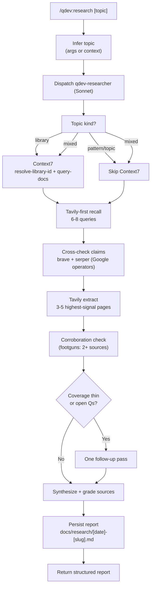

# qdev

Deep web research before you design or build.

## Summary

The enemy of a good design decision is stale or incorrect knowledge. `qdev` addresses that with one focused command: `/research` runs a structured, dual-source web sweep and persists a cited report you can hand to design, planning, or review. It is user-initiated — it never fires contextually. For the lightweight, agent-automatic web lookups that used to live here (the old grounding skill), use the standalone `web-search` skill instead.

## Principles

**[P1] Research Before Analysis**: Live sources beat training data. `/research` is a first-class command meant to run before design work begins; no decision rests on recall alone when a current source can be consulted.

**[P2] Explicit Invocation Only**: `/research` fires only when you call it. There is no auto-trigger and no background search — routine, automatic lookups are a separate concern owned by the `web-search` skill.

**[P3] Persisted, Deduplicated Knowledge**: Every sweep writes a frontmatter-tagged report under `docs/research/` and regenerates `docs/research/index.md`; the dedup cycle updates, links, or supersedes overlapping prior reports rather than piling up duplicates.

## Requirements

- Claude Code (any recent version)
- `tavily` MCP server (primary recall + JS-rendered page extraction; the agent fails soft to Brave/Serper when absent)
- `brave-search` MCP server (cross-check recall source)
- `serper-search` MCP server (Google-operator queries: `site:`, `filetype:`)
- `context7` MCP server (recommended; library/framework documentation gating)

## Installation

```bash
/plugin marketplace add L3DigitalNet/Claude-Code-Plugins
/plugin install qdev@l3digitalnet-plugins
```

For local development:

```bash
claude --plugin-dir ./plugins/qdev
```

## How It Works



## Usage

```bash
# Research a technology or topic before starting design work
/qdev:research "Redis pub/sub with Python"

# Research from mid-session context (infers topic automatically)
/qdev:research
```

## Commands

| Command | Description |
| --- | --- |
| `/qdev:research` | Dual-source research sweep covering docs, practices, footguns, existing tools, security, and recent changes (dispatches `qdev-researcher`); persists a report under `docs/research/` |

## Agents

| Agent | Model | Purpose |
| --- | --- | --- |
| `qdev-researcher` | Sonnet | Tavily-first research with Brave/Serper cross-checks, Context7 docs gating, footgun corroboration (2+ sources), and a single follow-up pass for thin angles. Persists a structured report under `docs/research/`. |

### `/qdev:research [topic]`

Research a topic, technology, or problem space before designing or building, by dispatching the `qdev-researcher` subagent. Pass the topic as an argument, or invoke without arguments to have it inferred from project context and conversation history.

**Coverage:**

- Official documentation (current API, recent changes)
- Community best practices (established patterns, what has replaced older approaches)
- Footguns and gotchas (2+ source corroboration required; single-source items demoted)
- Existing tools (alternatives and prior art; avoid building what already exists)
- Security and compatibility (CVEs, deprecations, advisories)
- Recent changes (breaking changes, ecosystem shifts since the model's cutoff)

**Output:** A structured Markdown report persisted to `docs/research/<YYYY-MM-DD>-<slug>.md`. The file starts with project-standards `research` frontmatter, and the returned header includes the canonical path; downstream skills consume the artifact by reading that path rather than re-running the sweep.

**Depth tiers:** quick (3-4 queries), standard (6-8, default), thorough (12-15). For library/framework topics, the agent routes documentation queries through Context7 before falling back to web search.

#### Research reporting cycle

`qdev-researcher` treats `docs/research/` as a small knowledge base, not a loose artifact pile. Reports carry project-standards `research` frontmatter; `docs/research/index.md` is regenerated from that frontmatter by `scripts/build_research_index.py`; `scripts/validate_research_frontmatter.py` checks the scoped corpus. Before writing a new report, the agent preflights the index, uses `scripts/dedup.py` to choose update vs new-with-related vs supersede, writes/validates the report, and regenerates the index.

#### When to use `/qdev:research` vs other tools

| You want to | Use |
| --- | --- |
| Research before design — output feeds `superpowers:brainstorming` | `/qdev:research` |
| A lightweight, in-the-loop web lookup mid-task (no saved report) | `web-search` skill |
| Compare options or answer a current-events question with citations | global `research` skill |
| Look up a specific library API quickly | Context7 directly |
| Pull clean Markdown from a known URL | global `extract` skill |

`/qdev:research` is opinionated for development decisions: fixed coverage angles, footgun corroboration, and frontmatter/index-backed persistence under `docs/research/`.

#### Handoff protocol

`qdev-researcher` writes its report to `docs/research/<YYYY-MM-DD>-<slug>.md`. Downstream skills consume the artifact by referencing that path:

- `superpowers:brainstorming`: feed the report's Open Questions into the design conversation.
- `feature-dev:feature-dev`: start architecture work with the report linked from the brief.

Reports are not auto-cleaned. The dedup cycle updates, relates, or supersedes overlapping research; stale reports can still be removed manually when they are no longer useful.

## Planned Features

- Support for additional research angles (e.g. licensing/compliance scans)
- Query-level dedup: skip sweep queries already answered by a recent report _before_ searching (the existing dedup cycle reconciles reports only at write time, after the sweep has run)

## Known Issues

None.

## Links

- [Design spec](https://github.com/L3DigitalNet/Claude-Code-Plugins/blob/main/docs/superpowers/specs/2026-04-13-qdev-design.md)
- [Search decoupling spec](https://github.com/L3DigitalNet/Claude-Code-Plugins/blob/main/docs/superpowers/specs/2026-06-07-qdev-search-decoupling-design.md)
- [Source](https://github.com/L3DigitalNet/Claude-Code-Plugins/tree/main/plugins/qdev)
