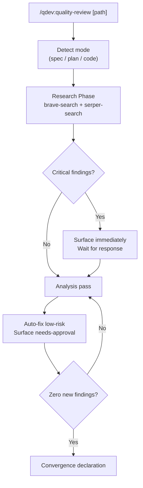
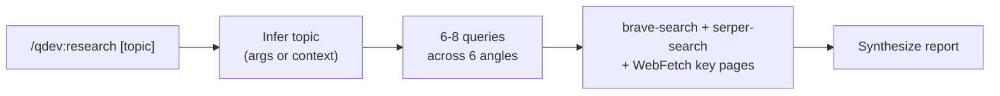

# qdev

Quality review and spec sync for every stage of the development lifecycle.

## Summary

Writing a spec, planning an implementation, or reviewing code all have different quality criteria but the same enemy: making decisions with stale or incorrect knowledge. `qdev` addresses this at every stage. `/research` runs a structured dual-source sweep before you design or build, grounding your decisions in current official docs, live community standards, and known CVEs. `/quality-review` iterates until it finds nothing left to fix. `/spec-update` keeps your spec in sync with what you actually built.

## Principles

Design decisions in this plugin are evaluated against these principles.

**[P1] Research Before Analysis**: Web research runs before any gap or consistency check, and is available as a first-class command before design work begins. No finding is proposed based on training data alone when a live source can be consulted.

**[P2] Explicit Invocation Only**: No command loads contextually. All three fire only when explicitly called with a slash command.

**[P3] Propose Before Writing**: No spec, plan, or source file is modified without first presenting a specific proposed change and receiving approval for structural changes.

**[P4] Convergence Without Check-ins**: The quality-review loop runs to completion without mid-pass interruptions. Only needs-approval findings surface for human input.

## Requirements

- Claude Code (any recent version)
- `brave-search` MCP server (required for `/qdev:quality-review` and `/qdev:research`)
- `serper-search` MCP server (required for `/qdev:quality-review` and `/qdev:research`)

## Installation

```bash
/plugin marketplace add L3DigitalNet/Claude-Code-Plugins
/plugin install qdev@l3digitalnet-plugins
```

For local development:

```bash
claude --plugin-dir ./plugins/qdev
```

## How It Works





## Usage

Invoke at any stage of a development project. Pass a path to target a specific file, or run without arguments to let the command detect the most relevant artifact in the working directory.

```bash
# Research a technology or topic before starting design work
/qdev:research "Redis pub/sub with Python"

# Research from mid-session context (infers topic automatically)
/qdev:research

# Review a spec file
/qdev:quality-review docs/superpowers/specs/my-feature-design.md

# Review an implementation plan
/qdev:quality-review docs/superpowers/plans/my-feature-plan.md

# Review source code (auto-detects from working directory)
/qdev:quality-review

# Sync a spec with the current implementation
/qdev:spec-update docs/superpowers/specs/my-feature-design.md
```

## Commands

| Command | Description |
|---------|-------------|
| `/qdev:research` | Dual-source research sweep covering docs, practices, footguns, and existing tools |
| `/qdev:quality-review` | Research-first iterative quality review until convergence |
| `/qdev:spec-update` | One-shot sync of a spec file to match current implementation |

### `/qdev:research [topic]`

Research a topic, technology, or problem space before designing or building. Pass the topic as an argument, or invoke without arguments to have it inferred from project context and conversation history.

**Coverage:**
- Official documentation (current API, recent changes)
- Community best practices (established patterns, what has replaced older approaches)
- Footguns and gotchas (common mistakes, version traps)
- Existing tools (alternatives and prior art; avoid building what already exists)
- Security and compatibility (CVEs, deprecations, warnings)

Returns a structured report suited for handing off to a design or planning session.

### `/qdev:quality-review [path]`

Runs a research-first quality review on a spec, implementation plan, or source code. If no path is given, auto-detects the target from the working directory.

**Modes:**
- **Spec**: completeness, internal consistency, ambiguous requirements, scope gaps, term consistency
- **Plan**: spec coverage, sequencing, missing dependencies, estimability
- **Code**: anti-patterns, naming consistency, dead code, cross-file inconsistencies, error handling at boundaries

**Loop:** Each pass auto-fixes low-risk issues and surfaces structural or ecosystem findings for approval. Runs until a full pass produces zero new findings.

### `/qdev:spec-update [spec-path]`

Compares a spec file against all source files in the project and proposes targeted edits to bring it up to date. Presents all proposed changes before writing anything. Handles additions, updates, and removals.

## Planned Features

- Support for additional artifact types (OpenAPI specs, database schema files)

## Known Issues

None.

## Links

- [Design spec](https://github.com/L3DigitalNet/Claude-Code-Plugins/blob/main/docs/superpowers/specs/2026-04-13-qdev-design.md)
- [Source](https://github.com/L3DigitalNet/Claude-Code-Plugins/tree/main/plugins/qdev)
