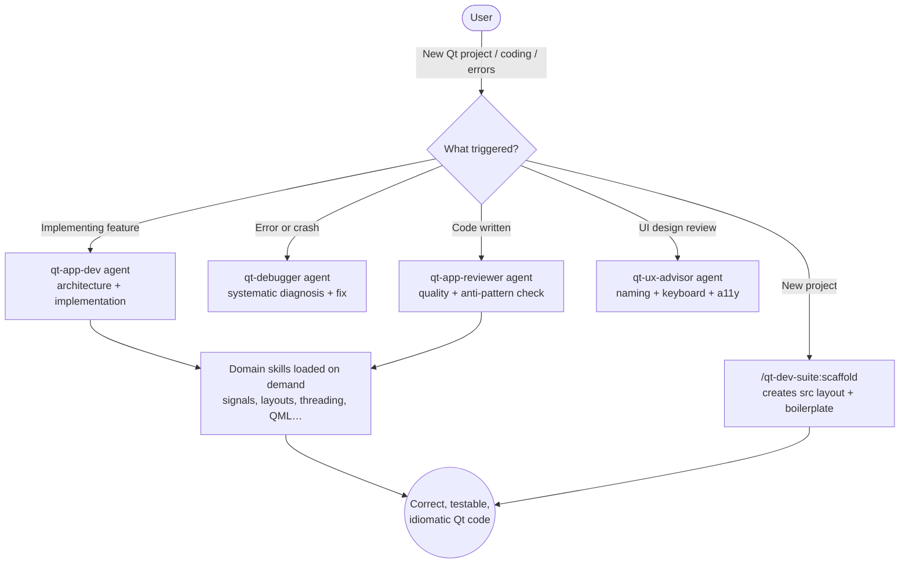

# qt-dev-suite

Companion plugin to `qt-test-suite` for active Qt GUI application development — proactive specialist agents, 13 domain skills, and scaffolding commands for PySide6, PyQt6, and C++/Qt projects.

## Summary

Qt GUI development involves many interacting systems: signals and slots, layout managers, Model/View architecture, threading constraints, and platform packaging — each with non-obvious pitfalls. `qt-dev-suite` loads the right domain knowledge at the right moment, surfaces expert guidance proactively during development, and generates correct boilerplate so you spend time on application logic instead of Qt ceremony.

Where `qt-test-suite` handles the *testing* side (test generation, coverage analysis, headless visual testing), `qt-dev-suite` handles the *development* side — architecture, patterns, component implementation, code review, and UX quality.

## Principles

Design decisions in this plugin are evaluated against these principles.

**[P1] Right knowledge at the right moment** — Skills load contextually; agents trigger proactively. Domain knowledge appears when needed without requiring the user to ask for it explicitly.

**[P2] Testability is a first-class concern** — Every generated component includes `setObjectName()` calls and MVP-compatible structure so `qt-test-suite`'s `gui-tester` can find and interact with all widgets without modification.

**[P3] Complete implementations over pseudocode** — All generated code is runnable as-is. Stubs are clearly marked with `# TODO`. No "add your logic here" placeholders for required structural elements.

**[P4] Binding-agnostic where possible** — Skills and agents work with PySide6, PyQt6, and C++/Qt. Binding-specific differences are documented, not hidden.

## Requirements

- Claude Code (any recent version)
- Python 3.11+ for Python/PySide6 projects
- PySide6 6.6+ or PyQt6 6.6+
- `pyside6-rcc` or `pyrcc6` for resource compilation (optional)

## Installation

```bash
/plugin marketplace add L3DigitalNet/Claude-Code-Plugins
/plugin install qt-dev-suite@l3digitalnet-plugins
```

For local development or testing without installing:

```bash
claude --plugin-dir ./plugins/qt-dev-suite
```

## How It Works



## Usage

### Scaffold a new project

```
/qt-dev-suite:scaffold my-music-app
```

Creates a complete Python/PySide6 project with `pyproject.toml`, `src/` layout, working `QMainWindow`, test configuration, and `.qt-test.json` for `qt-test-suite` compatibility.

### Generate a component

```
/qt-dev-suite:new-component UserProfileWidget widget
/qt-dev-suite:new-component ConfirmDeleteDialog dialog
/qt-dev-suite:new-component DocumentWindow window
```

Natural language triggers (agents activate proactively):
- *"implement a settings panel"*, *"add a table view for my data"* → `qt-app-dev`
- *"my app crashes when..."*, *"widget not showing up"* → `qt-debugger`
- *"review my widget code"*, *"I've finished implementing..."* → `qt-app-reviewer`
- *"is my UI accessible?"*, *"add keyboard navigation"* → `qt-ux-advisor`

## Commands

| Command | Description |
|---------|-------------|
| `/qt-dev-suite:scaffold [app-name]` | Scaffold a new PySide6 project with pyproject.toml, src layout, QMainWindow boilerplate, and qt-test-suite config. |
| `/qt-dev-suite:new-component <name> [widget\|dialog\|window]` | Generate a new Qt component class with correct boilerplate and object names. |

## Skills

| Skill | Loaded when |
|-------|-------------|
| `qt-architecture` | Structuring a Qt app, QApplication setup, project layout, entry points |
| `qt-signals-slots` | Connecting signals, defining custom signals, cross-thread communication |
| `qt-layouts` | Arranging widgets, resize behavior, QSplitter, layout debugging |
| `qt-model-view` | QAbstractTableModel, QTableView, QSortFilterProxyModel, delegates |
| `qt-threading` | QThread, QRunnable, thread safety, keeping UI responsive |
| `qt-styling` | QSS stylesheets, theming, dark/light mode, QPalette |
| `qt-resources` | .qrc files, pyrcc6, embedding icons and assets |
| `qt-dialogs` | QDialog, QMessageBox, QFileDialog, custom dialogs |
| `qt-packaging` | PyInstaller, Briefcase, platform deployment, CI builds |
| `qt-debugging` | Qt crashes, widget visibility, event loop, threading issues |
| `qt-qml` | QML/Qt Quick, QQmlApplicationEngine, exposing Python to QML |
| `qt-settings` | QSettings, persistent preferences, window geometry, recent files |
| `qt-bindings` | PySide6 vs PyQt6 differences, PyQt5 migration guide |

## Agents

| Agent | Description |
|-------|-------------|
| `qt-app-dev` | Proactive Qt development specialist. Triggers when creating new Qt projects, implementing widgets/windows, or building new features. Tools: Read, Write, Edit, Bash, Grep, Glob. |
| `qt-debugger` | Proactive diagnostics for Qt errors and crashes. Triggers on error messages, crashes, frozen UIs, or unexpected widget behavior. Tools: Read, Edit, Bash, Grep, Glob. |
| `qt-app-reviewer` | Proactive code quality reviewer. Triggers after writing or modifying Qt code. Checks for GC risks, threading violations, missing object names, layout anti-patterns. Tools: Read, Grep, Glob, Bash. |
| `qt-ux-advisor` | Proactive UI/UX reviewer. Triggers on UI design review, keyboard navigation requests, or accessibility checks. Bridges `qt-dev-suite` and `qt-test-suite` by enforcing widget naming. Tools: Read, Grep, Glob. |

## Planned Features

- `qt-animation` skill — QPropertyAnimation, state machines, transition effects
- `qt-internationalization` skill — QTranslator, .ts files, lupdate/lrelease workflow
- Example project templates in `examples/`

## Known Issues

- Skills cover PySide6 and PyQt6. C++/Qt coverage in skills is partial — primary focus is Python bindings.
- `qt-packaging` covers PyInstaller and Briefcase; `nuitka` not yet covered.

## Links

- [Changelog](CHANGELOG.md)
- [qt-test-suite](../qt-test-suite/) — companion testing plugin (test generation, coverage, headless GUI testing)
- [PySide6 documentation](https://doc.qt.io/qtforpython-6/)
- [Qt documentation](https://doc.qt.io/)
