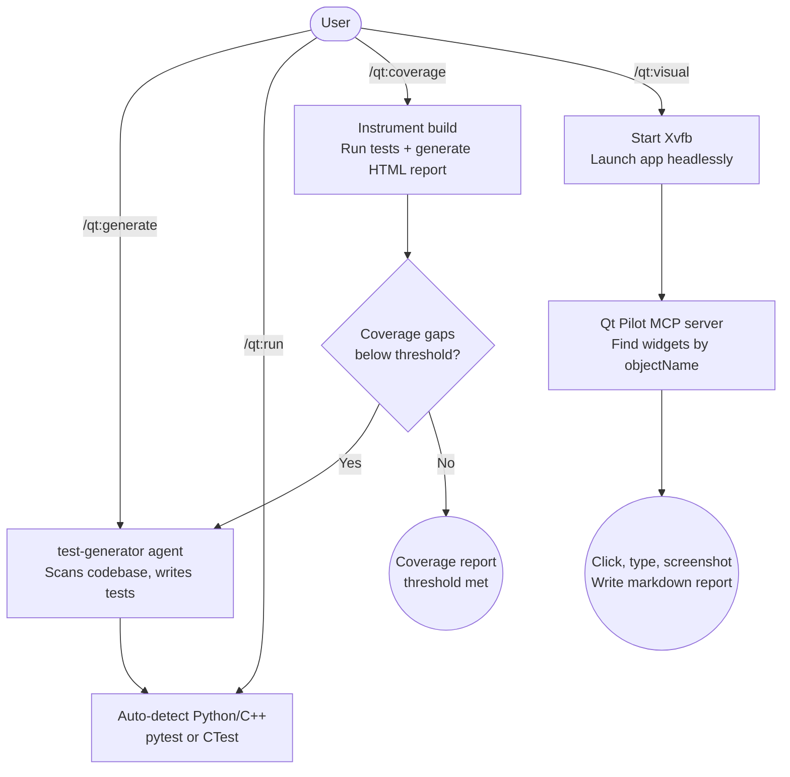

# qt-test-suite

A Claude Code plugin that provides an AI-powered Qt testing pipeline: test generation, coverage-gap analysis, and headless GUI testing for PySide6 and C++/Qt projects.

## Summary

Qt applications present unique testing challenges: C++ templates and signals/slots make unit test scaffolding non-obvious; coverage tools differ between Python and C++ builds; and GUI components require a live display server or a headless substitute. `qt-test-suite` handles all three: it scans your codebase to generate targeted tests, instruments builds for coverage, and drives your PySide6 app visually via Xvfb and the bundled Qt Pilot MCP server. The result is a complete test pipeline (unit, coverage, and GUI) without manual toolchain setup.

## Principles

**[P1] Coverage-driven generation**: Tests are generated from identified coverage gaps, not arbitrary files. The coverage report is the source of truth for what needs testing next.

**[P2] Language-transparent operation**: Commands auto-detect Python/PySide6 vs C++/Qt and adapt toolchains without user configuration. Coverage uses gcov/lcov for C++ and coverage.py for Python; tests use pytest-qt and QTest respectively.

**[P3] Headless-first GUI testing**: Visual tests launch via Xvfb with no display server configuration required. Qt Pilot identifies widgets by `objectName`, falling back to coordinate-based clicks only when names are absent.

**[P4] Testability is a prerequisite**: All scaffolded and generated components include `setObjectName()` calls on interactive elements. Without object names, the GUI tester degrades to fragile coordinate-based interaction.

## Requirements

| Requirement | Purpose | Install |
|-------------|---------|---------|
| Python 3.10+ | Qt Pilot MCP server | System package |
| Xvfb | Virtual display for headless GUI testing | `apt install xvfb` / `dnf install xorg-x11-server-Xvfb` |
| PySide6 | Auto-installed into plugin venv on first run | Automatic |
| mcp | Auto-installed into plugin venv on first run | Automatic |
| lcov | C++ coverage HTML reports | `apt install lcov` (optional for C++ projects) |
| cmake | C++ build/test | `apt install cmake` (optional for C++ projects) |

> Qt Pilot's Python dependencies (PySide6, mcp) are automatically installed into a virtual environment inside the plugin on first use. No manual pip install needed.

Run `bash <plugin-root>/scripts/check-prerequisites.sh` to verify your setup.

## Installation

```bash
/plugin marketplace add L3DigitalNet/Claude-Code-Plugins
/plugin install qt-test-suite@l3digitalnet-plugins
```

For local development:

```bash
claude --plugin-dir ./plugins/qt-test-suite
```

## How It Works



## Usage

```
/qt:generate        # Generate tests for untested files
/qt:run             # Run the full test suite
/qt:coverage        # Run coverage analysis and identify gaps
/qt:visual          # Launch app headlessly and run visual tests
```

Typical workflow:

1. **Generate**: Run `/qt:generate` to scan the project and write initial tests for untested files.
2. **Run**: Run `/qt:run` to execute the suite and see a pass/fail summary.
3. **Coverage**: Run `/qt:coverage` to measure coverage and identify gaps. If gaps are found, the `test-generator` agent is offered to fill them.
4. **Visual**: Run `/qt:visual` to launch the app headlessly and walk through UI flows using the Qt Pilot MCP server.

## Commands

| Command | Description |
|---------|-------------|
| `/qt:generate` | Scan the project and generate unit tests for untested files |
| `/qt:run` | Auto-detect project type and run the full test suite |
| `/qt:coverage` | Run coverage analysis, generate HTML report, identify gaps |
| `/qt:visual` | Launch app headlessly and run visual GUI tests |

## Skills

| Skill | Loaded when |
|-------|-------------|
| `qtest-patterns` | Writing QTest (C++), pytest-qt (Python), or QML TestCase tests |
| `qt-coverage-workflow` | Working with coverage gaps, gcov, lcov, or coverage.py |
| `qt-pilot-usage` | Headless GUI testing, widget interaction, or Qt Pilot MCP usage |

## Agents

| Agent | Description |
|-------|-------------|
| `test-generator` | Coverage-gap-driven test generation. Scans source for untested paths, writes test files targeting the identified gaps, and verifies the new tests pass before completing. Activates after `/qt:coverage` finds gaps. |
| `gui-tester` | Autonomous visual testing via Qt Pilot. Launches the app headlessly via Xvfb, interacts with widgets by `objectName`, captures screenshots at key steps, and writes a structured markdown test report. |

## Configuration

Create `.qt-test.json` in your project root (copy from `templates/qt-test.json`):

```json
{
  "project_type": "python",
  "build_dir": "build",
  "test_dir": "tests",
  "app_entry": "main.py",
  "coverage_threshold": 80,
  "coverage_exclude": ["tests/*"]
}
```

For personal overrides (gitignored), create `.claude/qt-test.local.md`:

```markdown
# Qt Test Suite local overrides
My app entry is src/app.py (not main.py).
Coverage threshold for this machine: 70% (still setting up tests).
```

## Setting Widget Object Names

The Qt Pilot MCP server identifies widgets by their `objectName`. Set names on all interactive elements:

```python
# Python/PySide6
self.save_btn = QPushButton("Save")
self.save_btn.setObjectName("save_btn")

self.filename_input = QLineEdit()
self.filename_input.setObjectName("filename_input")
```

```cpp
// C++
QPushButton *btn = new QPushButton("Save");
btn->setObjectName("save_btn");
```

Without object names, the GUI tester still works but falls back to coordinate-based clicks.

## CI Integration

Copy `skills/qt-coverage-workflow/templates/qt-coverage.yml` to `.github/workflows/` for automated coverage on every push.

Or use the portable shell script:

```bash
bash skills/qt-coverage-workflow/templates/run-coverage.sh --python --threshold 80
```

## Planned Features

No unreleased features are currently tracked in the changelog.

## Known Issues

- **C++/Qt coverage requires a CMake-configured build directory**: Projects using custom build systems must set `build_dir` in `.qt-test.json` manually. `lcov` must also be installed.
- **`pyside6-rcc` not invoked automatically**: Projects relying on compiled `.qrc` resources must pre-compile them before running tests; the plugin does not run `pyside6-rcc` as part of the test pipeline.
- **Xvfb required for visual tests**: Environments without Xvfb (macOS, Windows, minimal CI containers) cannot run `/qt:visual`. No headless fallback is available.
- **C++/Qt support is partial**: Primary development and testing focus is Python/PySide6; C++/Qt paths receive less coverage in the test suite and skill content.

## Links

- Repository: [L3DigitalNet/Claude-Code-Plugins](https://github.com/L3DigitalNet/Claude-Code-Plugins)
- Changelog: [CHANGELOG.md](CHANGELOG.md)
- Issues and feedback: [GitHub Issues](https://github.com/L3DigitalNet/Claude-Code-Plugins/issues)
- Qt Pilot MCP server: [github.com/neatobandit0/qt-pilot](https://github.com/neatobandit0/qt-pilot) (MIT License)
- [qt-dev-suite](../qt-dev-suite/): companion development plugin (agents, skills, scaffolding)
