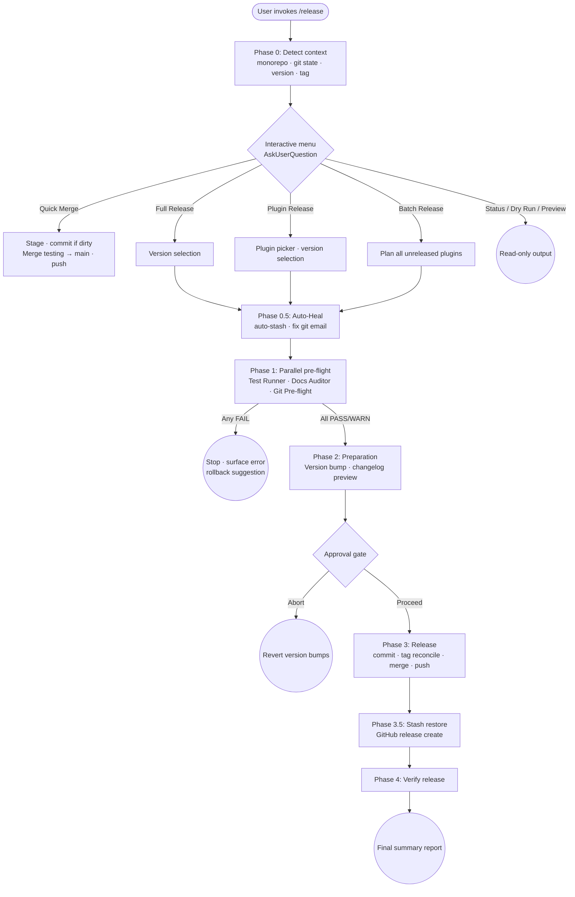

# Release Pipeline

Autonomous release pipeline for Claude Code: interactive menu-driven releases with parallel pre-flight checks, semver suggestion, changelog generation, and GitHub release creation.

## Summary

Release Pipeline presents a context-aware menu at invocation, detects monorepo vs. single-package layout, and suggests the next semver version from commit history. Three pre-flight agents run in parallel before the full release sequence (version bump, changelog, commit, tag, merge, push, GitHub release) executes behind a single approval gate. Seven modes are available, from a quick merge to a batch release of all unreleased plugins at once. Auto-heal quietly resolves dirty working trees and non-noreply git email addresses before pre-flight; tag reconciliation prevents duplicate-tag failures on retry.

## Principles

**[P1] Act on Intent**: Invocation is consent to the implied scope. The single approval gate before irreversible operations (tag, push, GitHub release) is the decision point; routine sub-tasks like staging or committing do not prompt separately.

**[P2] Scope Fidelity**: Execute the full release completely without intermediate confirmation gates. Pre-flight failures stop the pipeline immediately with the full error and a rollback suggestion.

**[P3] Succeed Quietly, Fail Transparently**: Pre-flight agents, auto-build, stash, and the session-start sync hook suppress output when nothing changed. On critical failure, the pipeline stops and surfaces raw output with recovery instructions.

**[P4] Use the Full Toolkit**: Every decision point uses `AskUserQuestion` with bounded options. Version selection always presents a commit-derived suggestion alongside a custom entry option.

**[P5] Convergence is the Contract**: Batch release runs all plugins to completion with quarantine-and-continue semantics; individual plugin failures do not abort the batch.

## Requirements

- Claude Code (any recent version)
- `gh` CLI authenticated (for GitHub releases)
- `git` repository with at least one prior commit
- Conventional commits recommended (`feat:`, `fix:`, `BREAKING CHANGE:`) for accurate semver suggestion
- `rsync` recommended for the session-start sync hook (falls back to `cp`)

## Installation

```
/plugin marketplace add L3DigitalNet/Claude-Code-Plugins
/plugin install release-pipeline@l3digitalnet-plugins
```

For local development:

```
claude --plugin-dir ./plugins/release-pipeline
```

## How It Works



## Usage

```
/release
```

The command auto-detects context before showing the menu. The menu header shows a one-line summary:

```
Branch: testing  |  Last tag: v1.2.0  |  14 commits since last tag  |  uncommitted changes
```

Natural language triggers also route to the menu: "merge to main", "cut a release", "release the plugin".

## Commands

| Command | Description |
|---------|-------------|
| `/release` | Open the interactive release menu with context-aware options |

## Release Options

| Option | When available | Description |
|--------|---------------|-------------|
| Quick Merge | Always | Stage uncommitted changes (if any), merge `testing` into `main`, and push. No version bump or tag. |
| Full Release | Always | Semver release with parallel pre-flight, version bump, changelog, annotated tag, and GitHub release. |
| Plugin Release | Monorepos only | Scoped release for a single plugin. Uses `<plugin-name>/vX.Y.Z` tags, scoped changelog, and stages only that plugin's files. |
| Batch Release | Monorepos only | Release all plugins with unreleased changes sequentially. Failures quarantined; batch continues. |
| Release Status | Always | Read-only view of unreleased commits, last tag, and changelog drift. No changes made. |
| Dry Run | Always | Simulate a full release (version bump preview, changelog preview) without committing, tagging, or pushing. |
| Changelog Preview | Always | Generate and display the changelog entry without writing it. |

## Pre-flight Agents

Three agents run in parallel before any release operation (Phase 1). All three must report PASS or WARN to proceed.

| Agent | Model | Role |
|-------|-------|------|
| `git-preflight` | haiku | Verifies clean working tree, dev branch, noreply git email, remote URL, and local/remote tag availability via `reconcile-tags.sh`. |
| `test-runner` | sonnet | Auto-detects and runs the full test suite; reports pass/fail/skip counts and coverage percentage when available. |
| `docs-auditor` | sonnet | Checks version consistency across `.md` files, broken relative links, and corporate tone flags. Warns on missing README or CHANGELOG. |

Each agent supports per-check waivers via `.release-waivers.json` in the repo root. Waivable checks: `dirty_working_tree`, `protected_branch`, `noreply_email`, `tag_exists`, `missing_tests`, `stale_docs`. Broken links are never waivable.

## Hooks

| Hook | Event | What it does |
|------|-------|-------------|
| `sync-local-plugins.sh` | SessionStart | Rsyncs the local plugin development repo to the Claude Code plugin cache so in-session edits take effect without reinstalling. Discovery order: `$CLAUDE_PROJECT_DIR` first, then `$HOME/projects/Claude-Code-Plugins`. Silent when no files changed. |
| `force-push-guard.sh` | PreToolUse / Bash | Blocks any `git push --force` or `git push -f` command before it executes. Returns a JSON block decision so the reason surfaces in Claude's context. |
| `auto-build-plugins.sh` | PreToolUse / Bash | On `git commit`, checks whether any staged TypeScript files (`plugins/*/src/**/*.ts`) belong to a plugin with a `build` npm script. If so, runs `npm run build`, stages `dist/`, then allows the commit. Blocks with exit 2 if the build fails. |

`force-push-guard.sh` and `auto-build-plugins.sh` are registered sequentially under the same `PreToolUse/Bash` matcher. A block from the force-push guard (exit 2) prevents `auto-build-plugins.sh` from running for that command.

## Supported Test Runners

`detect-test-runner.sh` probes for test frameworks in this order:

1. **Python / pytest**: `pyproject.toml` with `[tool.pytest]`, `pytest.ini`, or `setup.cfg` with `[tool:pytest]`
2. **Node.js**: `package.json` with a `scripts.test` entry (`npm test`)
3. **Rust**: `Cargo.toml` present (`cargo test`)
4. **Make**: `Makefile` with a `test:` target (`make test`)
5. **Go**: `go.mod` present (`go test ./...`)
6. **CLAUDE.md fallback**: extracts the first documented test command from the project's CLAUDE.md

If no runner is detected, the `missing_tests` waiver is checked before reporting FAIL.

## Auto-Heal

Before pre-flight runs in Full Release, Plugin Release, and Batch Release modes, two common blockers are resolved automatically.

A dirty working tree is auto-stashed via `auto-stash.sh stash` before pre-flight and restored after all git operations complete (before the GitHub API call) via `auto-stash.sh pop`. A non-noreply git email is corrected by `fix-git-email.sh`, which parses the remote URL (HTTPS or SSH) to derive the correct `@users.noreply.github.com` address and sets it with `git config --local user.email <address>`.

Both recoveries are noted inline. If either cannot be resolved, the pipeline stops immediately.

## Tag Reconciliation

Before creating a local tag in Phase 3, `reconcile-tags.sh` compares local and remote tag state:

| State | Meaning | Action |
|-------|---------|--------|
| `MISSING` | Tag does not exist anywhere | Proceed to `git tag -a` |
| `LOCAL_ONLY` | Tag exists locally only | Skip `git tag -a`, proceed to push |
| `REMOTE_ONLY` | Tag exists on remote only | Auto-fetch, then treat as `BOTH` |
| `BOTH` | Tag exists on local and remote | Check `tag_exists` waiver or stop |

This prevents duplicate-tag push failures on retry after a partial release.

## API Retry

GitHub CLI calls in Phase 3.5 (release create) and Phase 4 (verify) are wrapped with `api-retry.sh`: up to 3 attempts with exponential backoff and jitter. HTTP 4xx permanent errors (400, 401, 403, 404, 409, 410) abort immediately without retry. HTTP 429 (rate limit) is retried normally.

## Planned Features

No planned features at this time.

## Known Issues

- `sync-local-plugins.sh` defaults to the `l3digitalnet-plugins` marketplace. Set `RELEASE_PIPELINE_MARKETPLACE=<name>` in your environment to override for differently named marketplaces.
- Batch Release runs plugins sequentially, not in parallel. Large monorepos with many unreleased plugins will take proportionally longer.
- Quick Merge always merges `testing` into `main`. Repos using different branch naming must adjust manually.
- Changelog generation uses conventional commit prefixes. Repos without conventional commits produce a generic "other" section with no semver signal.
- Dry Run simulates version bumps and changelog generation but cannot simulate the GitHub release API; actual release creation may still fail after a clean dry run.

## Links

- Repository: [L3DigitalNet/Claude-Code-Plugins](https://github.com/L3DigitalNet/Claude-Code-Plugins)
- Changelog: [CHANGELOG.md](CHANGELOG.md)
- Issues: [GitHub Issues](https://github.com/L3DigitalNet/Claude-Code-Plugins/issues)
