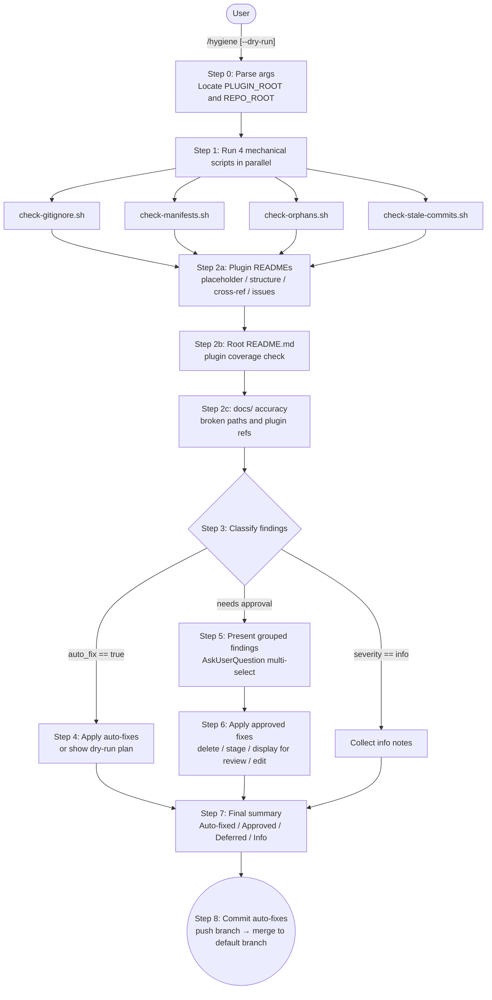

# repo-hygiene

Autonomous maintenance sweep for any git repository.

## Summary

`/hygiene` runs four parallel mechanical checks against the repository and Claude Code's local plugin state, then performs a three-phase semantic pass for Claude Code plugin marketplace repos: plugin READMEs (leaf-to-root), the root README.md, and the `docs/` directory. The plugin auto-detects the repository type — checks that require a Claude Code plugin layout run only when the relevant files are present. Findings are classified automatically: safe corrections (missing `.gitignore` patterns, trailing slashes in `marketplace.json`) are applied without confirmation; destructive or ambiguous changes (orphan deletion, stale commits, README edits, stale docs references) require explicit approval via a multi-select prompt. A `--dry-run` flag shows the full plan without touching anything.

## Principles

**Act on Intent**: Invoking `/hygiene` is consent to a full sweep. The command runs all checks unconditionally and presents findings rather than asking which checks to run. It gates only on operations that are destructive or whose scope exceeds what a maintenance sweep implies.

**Succeed Quietly, Fail Transparently**: Scripts emit structured JSON. If any script exits non-zero the sweep stops immediately and surfaces the raw error with the script name. Individual fix-command failures are logged and skipped rather than aborting the whole sweep.

**Scope Fidelity**: Auto-fix is reserved for findings where the correct action is unambiguous (appending a missing `.gitignore` line, normalising a trailing slash). Everything with judgement involved surfaces for approval.

**Safety by Construction**: Orphan `temp_*` directory deletion is gated on three independent path checks (prefix, no `..`, basename) enforced in the command itself, not just the script. No rm command runs unless all three pass.

## Requirements

- Claude Code (any recent version)
- Python 3 (used by all four mechanical scan scripts; no external packages required)
- Must be run from within any git repository (scripts call `git rev-parse --show-toplevel` to locate repo root)
- Claude Code plugin marketplace checks (Check 2, Check 3) require `.claude-plugin/marketplace.json` at the repo root; they are skipped gracefully in other repos

## Installation

```
/plugin marketplace add L3DigitalNet/Claude-Code-Plugins
/plugin install repo-hygiene@l3digitalnet-plugins
```

For local development:

```
claude --plugin-dir ./plugins/repo-hygiene
```

## How It Works



## Usage

```
/hygiene [--dry-run]
```

The sweep always runs all checks. With `--dry-run`, no files are modified and no approval prompt is shown; the command prints what it would do and exits.

**Auto-fixed without approval:**
- Missing `node_modules/` in a plugin `.gitignore` when `package.json` is present
- Missing `__pycache__/` and `*.pyc` in a `.gitignore` when `.py` files are nearby
- Trailing slash on a `source` path in `.claude-plugin/marketplace.json`

**Presented for approval:**
- Orphaned `temp_*` directories under `~/.claude/plugins/cache/`
- Stale `enabledPlugins` entries in `~/.claude/settings.json` with no matching install
- Uncommitted files last modified more than 24 hours ago (staged on approval, not committed)
- README structural gaps, template placeholders, unresolvable component references, or stale `Known Issues` / `Principles` sections (displayed for review, not auto-edited)
- `docs/` file references to paths or plugin names that no longer exist on disk (displayed for review, not auto-edited)

**Info only (no action required):**
- Plugins present in `installed_plugins.json` but absent from `settings.json` `enabledPlugins`

**After the sweep (Step 8):**
Any file changes made by the sweep (auto-fixes and approved edits) are committed automatically as `fix(hygiene): apply auto-fixes from /hygiene sweep`, then pushed to the current branch. If the current branch differs from the repo's remote default branch (detected automatically), it is also merged to the default branch and pushed. Files staged via `stale-commits` approvals are called out separately before the push begins; they require a user-authored commit message. The remote is always left up-to-date after a successful sweep. Skipped when `--dry-run` is active or when no files were modified.

## Commands

| Command | Description |
|---|---|
| `/hygiene` | Run the full maintenance sweep and apply safe fixes |
| `/hygiene --dry-run` | Show all findings and planned actions without modifying anything |

## Checks

The plugin detects the repository type at startup and skips checks that require a Claude Code plugin marketplace layout. Checks marked **conditional** run only when `.claude-plugin/marketplace.json` is present at the repo root.

| # | Check | Scope | Script | What it inspects | Auto-fixable |
|---|---|---|---|---|---|
| 1 | `.gitignore` missing patterns | Universal | `check-gitignore.sh` | All non-auto-generated `.gitignore` files in the repo tree. Flags missing `node_modules/` when `package.json` is co-located; flags missing `__pycache__/` and `*.pyc` when `.py` files exist within 3 directory levels. Skips the root `.gitignore` (already provides global coverage) and pytest-generated files (contain only `*`). | Yes: appends missing lines |
| 2 | Manifest consistency | Conditional | `check-manifests.sh` | **Source A (conditional):** Cross-references `.claude-plugin/marketplace.json` against each plugin's `.claude-plugin/plugin.json`: source directory existence, `plugin.json` presence, and version match. Skipped when `marketplace.json` is absent. **Source B (universal):** checks `~/.claude/plugins/installed_plugins.json` for entries whose `installPath` no longer exists on disk. Flags trailing slashes in `source` paths as auto-fixable normalisation. | Trailing slash only; all other mismatches need approval |
| 3 | README and docs accuracy | Conditional | inline AI (Step 2) | Three-phase scan (only runs in Claude Code plugin repos): **(2a) Plugin READMEs**: detects unmodified template placeholders; checks all required sections are present; cross-references each Commands/Skills/Agents/Hooks/Tools table entry against actual files on disk; scans `Known Issues` for resolved issues; checks `Principles` for clear codebase contradictions. **(2b) Root README.md**: verifies all marketplace plugins are mentioned and a plugin inventory is present. **(2c) `docs/` files** (excluding `plans/`): checks every repo-relative path reference and plugin name mention against actual files on disk. | No |
| 4 | Plugin state orphans | Universal | `check-orphans.sh` | Compares three Claude Code state sources: `installed_plugins.json`, `settings.json` `enabledPlugins`, and `~/.claude/plugins/cache/`. Flags `enabledPlugins` keys absent from `installed_plugins.json` (stale toggle) as warnings; flags the inverse (installed but not enabled) as info notes. Flags `temp_*` directories at the top level of the cache dir as orphaned. Produces zero findings when Claude Code is not installed. | No |
| 5 | Stale uncommitted changes | Universal | `check-stale-commits.sh` | Runs `git status --porcelain` and identifies modified or untracked files (excluding git-ignored) whose `mtime` is older than 24 hours. Reports the file path and age in days and hours. On approval, stages the file with `git add`; does not commit. | No |

## Planned Features

No unreleased items are currently tracked in the changelog. Two checks were considered and intentionally excluded from v1.0.0:

- **Stale pattern detection for `.gitignore`**: removed because defensive patterns (`.env`, `.DS_Store`, `.vscode/`) are valid even when no matching file currently exists, making any `git ls-files`-based staleness check produce systematic false positives.
- **Per-plugin `.claude/state/` coverage check**: omitted because the root `.gitignore` already has `**/.claude/state/`, which covers all subdirectories via gitignore inheritance.

## Known Issues

- The README semantic scan (Check 3) is inline AI reasoning, not a deterministic script. Results may vary across runs for borderline cases.
- `check-stale-commits.sh` uses file `mtime`, which is reset by checkouts and merges. A file touched by a rebase may not surface even if its content has been uncommitted for a long time.
- `check-manifests.sh` silently skips `installed_plugins.json` checks when the file does not exist, which is the expected behaviour in CI environments with no Claude Code installation.
- The `.gitignore` check scans only 3 directory levels for `.py` files when deciding whether to suggest Python cache patterns. Deeply nested Python files in a plugin would not trigger the suggestion.

## Links

- Repository: [L3DigitalNet/Claude-Code-Plugins](https://github.com/L3DigitalNet/Claude-Code-Plugins)
- Changelog: [CHANGELOG.md](CHANGELOG.md)
- Issues: [GitHub Issues](https://github.com/L3DigitalNet/Claude-Code-Plugins/issues)
