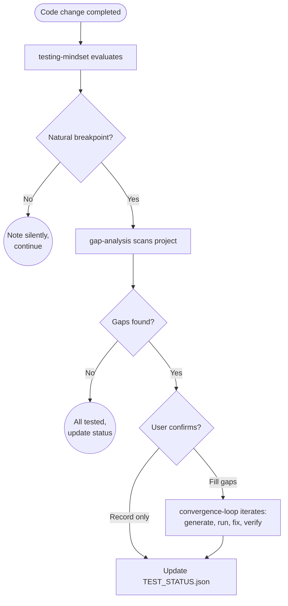

# test-driver

Teaches Claude to proactively drive thorough testing across any project type via gap analysis, convergence loops, and persistent status tracking.

## Summary

Claude doesn't systematically think about testing unless asked. This plugin installs an always-on testing mindset that evaluates whether testing is needed at natural breakpoints (feature complete, bug fixed, pre-merge), runs structured gap analysis to find what's missing, and iterates through a convergence loop to generate tests and fix issues until everything passes. Testing posture is tracked in a persistent JSON file so future sessions start with full awareness of the project's test health.

## Principles

**[P1] Test at Breakpoints, Not Every Edit**: Surface testing at natural breakpoints (feature done, bug fixed, pre-merge), never after individual edits. Silent change tracking; noisy only when it matters.

**[P2] Inline Over Delegated**: All analysis and test generation happens in the main context window for maximum code awareness. No agent delegation -- a deliberate full-context design (read source files fully, keep reasoning in one window).

**[P3] Converge, Don't Repeat**: The convergence loop drives toward all-green with oscillation detection. If the same fixes keep breaking each other, stop and surface the pattern rather than cycling forever.

**[P4] Profile-Driven Stack Knowledge**: Framework-specific testing knowledge lives in lightweight, swappable profiles. Adding support for a new stack means adding one file; the core skills stay untouched.

## Requirements

None beyond Claude Code.

Enhanced by (optional):

- `python-dev` plugin for pytest patterns
- `qt-suite` plugin for Qt/PySide6 testing
- `home-assistant-dev` plugin for HA integration testing

## Installation

```bash
/plugin marketplace add L3DigitalNet/Claude-Code-Plugins
/plugin install test-driver@l3digitalnet-plugins
```

For local development or testing without installing:

```bash
claude --plugin-dir ./plugins/test-driver
```

## How It Works



## Usage

**Automatic (always-on):** The `testing-mindset` skill loads for any implementation task and suggests gap analysis at natural breakpoints. No manual invocation needed.

**Explicit commands:**

```
/test-driver:analyze              # Full gap analysis, optionally fill gaps
/test-driver:analyze src/api/     # Scoped to a directory
/test-driver:status               # View current test posture
```

Optional CLAUDE.md reinforcement:

```markdown
## Testing

When working on code changes, always consult the `test-driver:testing-mindset` skill for testing awareness.
```

## Commands

| Command | Description |
| --- | --- |
| `/test-driver:analyze` | Force a gap analysis. Detects project type, identifies missing tests, offers to fill gaps via convergence loop. |
| `/test-driver:status` | View current test posture from TEST_STATUS.json without running tests. |

## Skills

| Skill | Loaded when |
| --- | --- |
| `testing-mindset` | Always, via broad description matching. Drives when to suggest testing. |

## References

Domain knowledge loaded on demand by the commands. These files are never auto-loaded into context.

| Reference | Purpose |
| --- | --- |
| `gap-analysis.md` | Full gap detection methodology across six test categories |
| `convergence-loop.md` | Iterative test generation and fix engine with oscillation detection |
| `test-design.md` | Universal test design principles (isolation, boundaries, assertions) |
| `test-status.md` | TEST_STATUS.json schema, read/write rules, staleness detection |
| `profiles/python-fastapi.md` | Stack profile for FastAPI/Starlette projects |
| `profiles/python-pyside6.md` | Stack profile for PySide6/PyQt6 projects |
| `profiles/python-django.md` | Stack profile for Django projects |
| `profiles/home-assistant.md` | Stack profile for HA custom integrations |
| `profiles/swift-swiftui.md` | Stack profile for Swift/SwiftUI projects |

## Design Decisions

- **No agents:** Testing benefits from full project context in the main window. Delegating to subagents loses the nuance that makes test generation accurate. This is a deliberate full-context design choice.

- **No hooks:** A behavioral skill (testing-mindset) handles proactive triggers more flexibly than a PostToolUse hook counting file edits. Hooks are mechanical; the mindset skill understands breakpoints.

- **Delegates framework knowledge:** Rather than duplicating pytest patterns from python-dev or Qt test patterns from qt-suite, test-driver identifies _what_ to test and _when_, then consults existing plugins for _how_.

## Planned Features

- Additional stack profiles (Rust, Go, TypeScript/Node)
- PreCompact hook to save test analysis state before context compaction
- Integration with CI results to correlate local gap analysis with pipeline failures

## Known Issues

- Profile detection relies on dependency names in `pyproject.toml` or `Package.swift`; non-standard project setups may need manual profile selection via the gap-analysis skill's "No Profile Match" flow.
- Coverage metrics require the project's coverage toolchain (coverage.py, llvm-cov) to be installed and configured. The plugin does not install these tools.

## Links

- Repository: [L3DigitalNet/Claude-Code-Plugins](https://github.com/L3DigitalNet/Claude-Code-Plugins)
- Changelog: [`CHANGELOG.md`](CHANGELOG.md)
- Issues and feedback: [GitHub Issues](https://github.com/L3DigitalNet/Claude-Code-Plugins/issues)
- Design document: [`docs/superpowers/specs/2026-03-16-test-driver-design.md`](../../docs/superpowers/specs/2026-03-16-test-driver-design.md)
