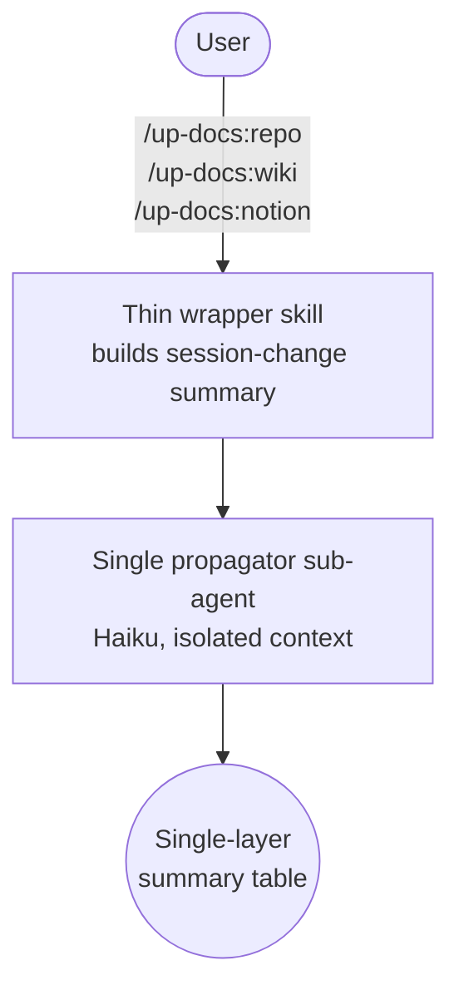
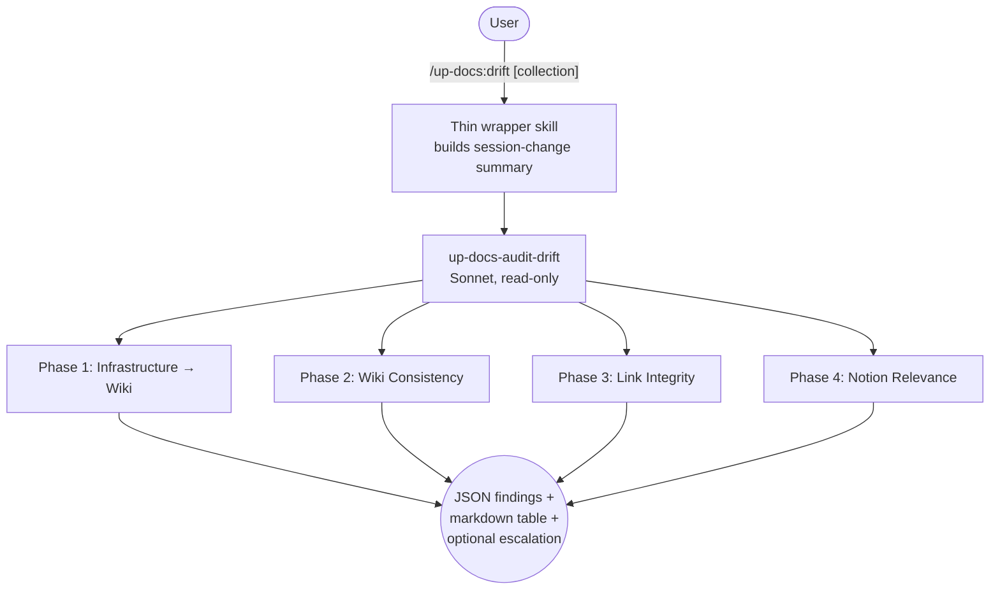

# up-docs

Update documentation across three layers (repo, Outline wiki, Notion) based on what changed during a session, plus comprehensive drift analysis for infrastructure documentation.

## Summary

Documentation lives in three places with different purposes: repo-local files capture project-specific details, the Outline wiki holds implementation-level reference material, and Notion maintains strategic context and organizational knowledge. Keeping all three in sync after a work session means explaining the same layering rules every time. up-docs encodes those rules into five slash commands, each of which dispatches a dedicated sub-agent on the model tier that fits its workload: Haiku for propagation (mechanical edits scoped to an explicit change list) and Sonnet for drift detection (search + infer against live state).

## Principles

**[P1] Right Content, Right Layer**: Each documentation layer has a defined purpose and information level. Repo docs are project-specific. Outline is implementation reference ("how"). Notion is strategic context ("what and why"). Content that belongs in one layer does not get duplicated into another.

**[P2] Infer, Don't Interrogate**: Commands assess what changed from git diffs, recent commits, and conversation context. No pre-work questionnaires or intake forms.

**[P3] Update, Don't Rewrite**: Changes are targeted edits that preserve existing tone, structure, and formatting. Full-page rewrites only happen when a page is genuinely wrong throughout.

**[P4] Ground Truth Wins**: The live server or repository is the authority. When documentation conflicts with reality, update the documentation. Both Notion and Outline may lag slightly; that's acceptable. Factual conflicts are not.

## Requirements

- Python 3.x in `$PATH` (used by all four helper scripts under `scripts/`)
- Claude Code (any recent version)
- Outline wiki accessible via MCP (mcp-outline server configured)
- Notion accessible via MCP (Notion MCP server configured)
- SSH access to infrastructure hosts (for `/up-docs:drift`)

## Security

up-docs ships with a defense-in-depth `PreToolUse` validator (`scripts/deny-guard.sh`) that blocks Bash commands matching the auditor's forbidden categories: filesystem destruction (rm, mv, cp -f, sed -i, redirect into /etc), container lifecycle (pct stop/destroy/restore/migrate, qm stop/destroy, docker stop/rm), service control (systemctl stop/restart/disable/mask, kill, killall, pkill), network/permissions (iptables, nft, ip route add/del, chmod, chown, chattr, setfacl), package edits (apt install/remove, dnf install/remove, pip install, npm install --save), git destructive (git rm, git push --force, git reset --hard), and SQL writes (INSERT/UPDATE/DELETE/DROP/ALTER/TRUNCATE).

The PreToolUse guard is grep-based and inherently incomplete — sufficiently crafted commands using Bash variable expansion, here-docs, or `eval` can evade pattern matching. For a definitively-enforced security boundary, add the following block to your **consuming project's** `.claude/settings.json`:

```json
{
  "permissions": {
    "deny": [
      "Bash(rm *)",
      "Bash(rmdir *)",
      "Bash(shred *)",
      "Bash(mv * *)",
      "Bash(cp -f *)",
      "Bash(sed -i *)",
      "Bash(git rm *)",
      "Bash(git push --force *)",
      "Bash(git push -f *)",
      "Bash(git reset --hard *)",
      "Bash(pct stop *)",
      "Bash(pct shutdown *)",
      "Bash(pct destroy *)",
      "Bash(pct restore *)",
      "Bash(pct migrate *)",
      "Bash(qm stop *)",
      "Bash(qm destroy *)",
      "Bash(docker stop *)",
      "Bash(docker rm *)",
      "Bash(docker-compose down *)",
      "Bash(systemctl stop *)",
      "Bash(systemctl restart *)",
      "Bash(systemctl disable *)",
      "Bash(systemctl mask *)",
      "Bash(kill *)",
      "Bash(killall *)",
      "Bash(pkill *)",
      "Bash(iptables *)",
      "Bash(nft *)",
      "Bash(chmod *)",
      "Bash(chown *)",
      "Bash(chgrp *)",
      "Bash(chattr *)",
      "Bash(setfacl *)",
      "Bash(apt install *)",
      "Bash(apt remove *)",
      "Bash(dnf install *)",
      "Bash(dnf remove *)",
      "Bash(pip install *)",
      "Bash(npm install --save *)"
    ]
  }
}
```

The consumer-side `permissions.deny` is enforced by Claude Code's permission engine regardless of which agent is running. See [Claude Code permission docs](https://code.claude.com/docs/en/settings) for the full deny-pattern syntax.

> Why both layers? The PreToolUse guard parses the full command line (including pipes, redirects, and `&&` chains) so it catches patterns the consumer-side `Bash(* * *)` glob misses. The consumer-side `permissions.deny` is engine-enforced and catches what the guard misses. Defense-in-depth.

## Installation

```bash
/plugin marketplace add L3DigitalNet/Claude-Code-Plugins
/plugin install up-docs@l3digitalnet-plugins
```

For local development:

```bash
claude --plugin-dir ./plugins/up-docs
```

## How It Works

### /up-docs:all Orchestration


### Individual Commands



### Drift Analysis



## Usage

Run a command at a natural pausing point or end of session:

```
/up-docs:repo                Update repo documentation only
/up-docs:wiki                Update Outline wiki only
/up-docs:notion              Update Notion only
/up-docs:all                 Update all three layers sequentially
/up-docs:drift [collection]  Full drift analysis (infrastructure → wiki → links → Notion)
```

Each command produces a summary table listing every page or file examined, the action taken, and a one-line description of changes.

### Project Setup

Add a documentation mapping section to your project's CLAUDE.md so the commands know where to look:

```markdown
## Documentation

- Outline: "Homelab" collection
- Notion: "Infrastructure" section
- Repo docs: docs/, README.md
```

The mapping is intentionally loose. It points to the general area and lets Claude search for relevant content within it.

## Skills

| Skill | Role | Invoked by |
|-------|------|------------|
| `all` | Orchestrator — builds session-change summary, dispatches propagators in parallel, then drift auditor | `/up-docs:all` |
| `repo` | Thin wrapper, dispatches `up-docs-propagate-repo` | `/up-docs:repo` |
| `wiki` | Thin wrapper, dispatches `up-docs-propagate-wiki` | `/up-docs:wiki` |
| `notion` | Thin wrapper, dispatches `up-docs-propagate-notion` | `/up-docs:notion` |
| `drift` | Thin wrapper, dispatches `up-docs-audit-drift` | `/up-docs:drift` |

## Agents

| Agent | Model | Role |
|-------|-------|------|
| `up-docs-propagate-repo` | Haiku | Mechanical edits to README.md, docs/, CLAUDE.md scoped to the session-change summary |
| `up-docs-propagate-wiki` | Haiku | Mechanical edits to Outline pages at implementation-reference level |
| `up-docs-propagate-notion` | Haiku | Mechanical edits to Notion at strategic/organizational level; never writes configs or procedures |
| `up-docs-audit-drift` | Sonnet | Read-only drift scan across all three layers with live-state verification; never auto-fixes |

Per-agent `model:` frontmatter overrides the caller's model tier, so propagation runs on Haiku (≈ 1/10 Opus cost) even when the orchestrator was invoked from an Opus session.

## Planned Features

- Per-layer dry-run mode that previews changes without pushing to Outline or Notion

## Known Issues

- Requires both Outline and Notion MCP servers to be configured and running. If only one external system is available, use the individual commands for the layers you have.
- The session context inference relies on git history; in a fresh repo with no commits, the commands have less signal to work from.
- Notion and Outline MCP servers must be accessible from the current environment. Air-gapped systems can only use `/up-docs:repo`.
- `/up-docs:drift` requires SSH access to all documented hosts. Unreachable hosts are logged and skipped, not fatal.
- Drift analysis runs on Sonnet by default (`model: sonnet` in `up-docs-audit-drift` frontmatter). The auditor's `<output_format>` flags escalation when results would benefit from Opus reasoning — large affected docs (>1000 lines), >10 findings, or cross-layer contradictions — leaving the user to opt in.

## Links

- Repository: [L3DigitalNet/Claude-Code-Plugins](https://github.com/L3DigitalNet/Claude-Code-Plugins)
- Changelog: [`CHANGELOG.md`](CHANGELOG.md)
- Issues and feedback: [GitHub Issues](https://github.com/L3DigitalNet/Claude-Code-Plugins/issues)
