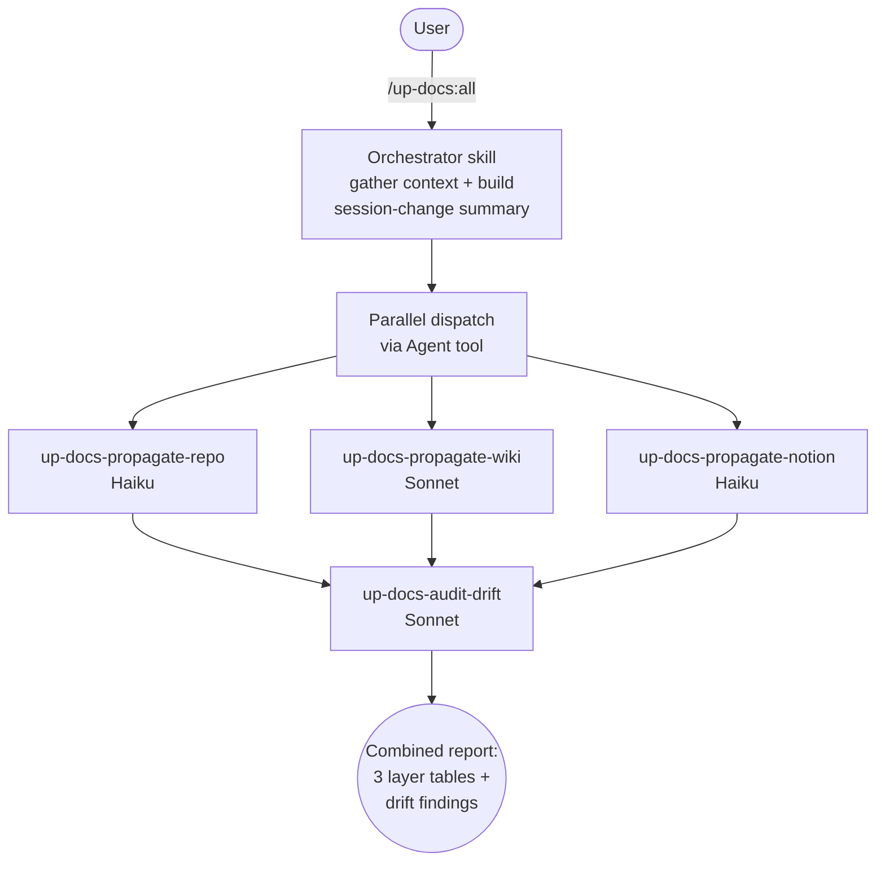
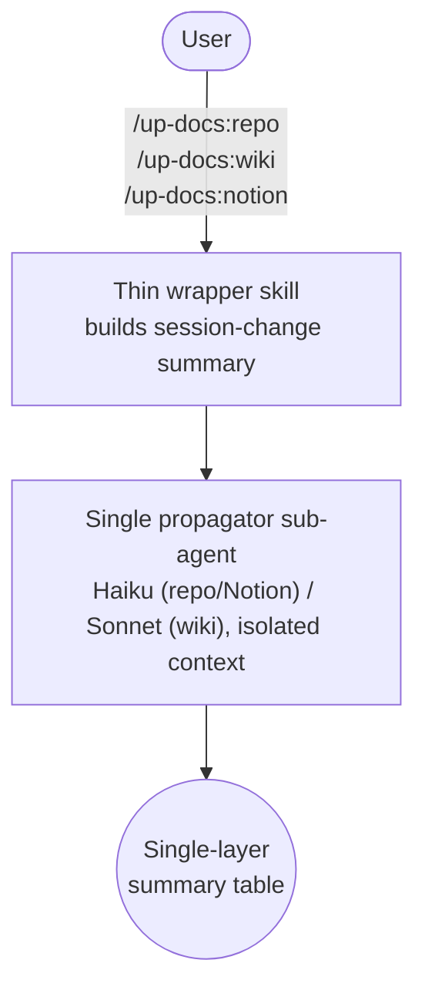
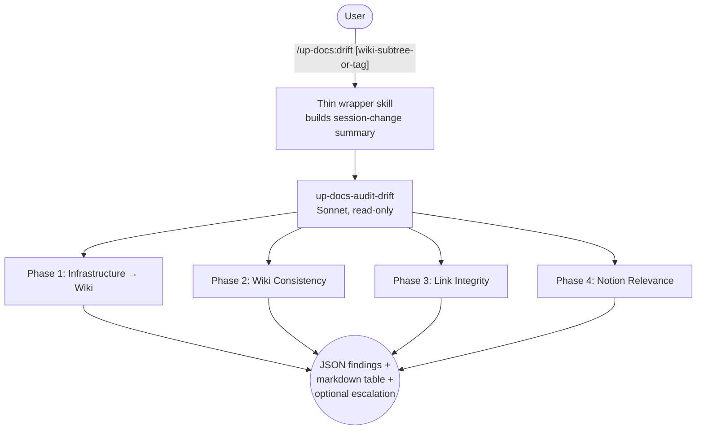

# up-docs

Update documentation across three layers (repo, llm-wiki, Notion) based on what changed during a session, plus comprehensive drift analysis for infrastructure documentation.

## Summary

Documentation lives in three places with different purposes: repo-local files capture project-specific details, llm-wiki holds implementation-level reference material, and Notion maintains strategic context and organizational knowledge. Keeping all three in sync after a work session means explaining the same layering rules every time. up-docs encodes those rules into five slash commands, each of which dispatches a dedicated sub-agent on the model tier that fits its workload: Haiku for the repo and Notion propagators (mechanical edits scoped to an explicit change list) and Sonnet for the wiki propagator and drift detection (the wiki layer's llm-wiki contract + validators, and search-plus-infer drift work).

## Principles

**[P1] Right Content, Right Layer**: Each documentation layer has a defined purpose and information level. Repo docs are project-specific. llm-wiki is implementation reference ("how"). Notion is strategic context ("what and why"). Content that belongs in one layer does not get duplicated into another.

**[P2] Infer, Don't Interrogate**: Commands assess what changed from git diffs, recent commits, and conversation context. No pre-work questionnaires or intake forms.

**[P3] Update, Don't Rewrite**: Changes are targeted edits that preserve existing tone, structure, and formatting. Full-page rewrites only happen when a page is genuinely wrong throughout.

**[P4] Ground Truth Wins**: The live server or repository is the authority. When documentation conflicts with reality, update the documentation. Both Notion and llm-wiki may lag slightly; that's acceptable. Factual conflicts are not.

## Requirements

- Python 3.x in `$PATH` (used by the helper scripts under `scripts/`)
- Claude Code (any recent version)
- SSH access to the `llm-wiki` host (the wiki repo and its `uv`/`uvx` validators live in CT 103 at `/srv/workspaces/llm-wiki`; nothing is required on the workstation's disk, no MCP)
- Notion accessible via MCP (Notion MCP server configured) — the only layer that needs a configured MCP server and network
- SSH access to infrastructure hosts (for `/up-docs:drift`)

## Security

The drift-audit agent (`up-docs-audit-drift`) is prompt-instructed to use Bash for read-only inspection only — its `<forbidden_commands>` table bans filesystem destruction, container lifecycle, service control, network/permission, package, git-destructive, and SQL-write verbs. Prompt instructions guide the model but are **not an enforced boundary**: a model can still emit a forbidden command, and nothing in the plugin stops it at the tool layer.

For a definitively-enforced boundary that holds regardless of which agent is running, add the following block to your **consuming project's** `.claude/settings.json`. This is engine-enforced by Claude Code's permission system and is the recommended way to harden up-docs (or any agent) against destructive Bash:

```json
{
	"permissions": {
		"deny": [
			"Bash(rm *)",
			"Bash(rmdir *)",
			"Bash(shred *)",
			"Bash(mv * *)",
			"Bash(cp -f *)",
			"Bash(sed -i *)",
			"Bash(git rm *)",
			"Bash(git push --force *)",
			"Bash(git push -f *)",
			"Bash(git reset --hard *)",
			"Bash(pct stop *)",
			"Bash(pct shutdown *)",
			"Bash(pct destroy *)",
			"Bash(pct restore *)",
			"Bash(pct migrate *)",
			"Bash(qm stop *)",
			"Bash(qm destroy *)",
			"Bash(docker stop *)",
			"Bash(docker rm *)",
			"Bash(docker-compose down *)",
			"Bash(systemctl stop *)",
			"Bash(systemctl restart *)",
			"Bash(systemctl disable *)",
			"Bash(systemctl mask *)",
			"Bash(kill *)",
			"Bash(killall *)",
			"Bash(pkill *)",
			"Bash(iptables *)",
			"Bash(nft *)",
			"Bash(chmod *)",
			"Bash(chown *)",
			"Bash(chgrp *)",
			"Bash(chattr *)",
			"Bash(setfacl *)",
			"Bash(apt install *)",
			"Bash(apt remove *)",
			"Bash(dnf install *)",
			"Bash(dnf remove *)",
			"Bash(pip install *)",
			"Bash(npm install --save *)"
		]
	}
}
```

The `permissions.deny` block is enforced by Claude Code's permission engine regardless of which agent is running. See [Claude Code permission docs](https://code.claude.com/docs/en/settings) for the full deny-pattern syntax.

> **Why not a bundled `PreToolUse` guard?** Versions through 0.8.1 shipped a `scripts/deny-guard.sh` `PreToolUse` hook that tried to block these commands only while an up-docs subagent was running. It was removed afterward: it ran on _every_ Bash call in _every_ session (a per-command latency tax), and its scope detection was unsound — subagents run with their own isolated transcript, so the hook could never reliably tell whether it was inside an up-docs subagent. The engine-enforced `permissions.deny` above is both simpler and strictly more reliable.

## Installation

```bash
/plugin marketplace add L3DigitalNet/Claude-Code-Plugins
/plugin install up-docs@l3digitalnet-plugins
```

For local development:

```bash
claude --plugin-dir ./plugins/up-docs
```

## How It Works

### /up-docs:all Orchestration



### Individual Commands



### Drift Analysis



## Usage

Run a command at a natural pausing point or end of session:

```text
/up-docs:repo                Update repo documentation only
/up-docs:wiki                Update llm-wiki only
/up-docs:notion              Update Notion only
/up-docs:all                 Update all three layers sequentially
/up-docs:drift [wiki-subtree-or-tag]  Full drift analysis (infrastructure → wiki → links → Notion)
```

Each command produces a summary table listing every page or file examined, the action taken, and a one-line description of changes.

### Propagation vs. drift — run both

The five commands split into two kinds, and the distinction matters:

- **Propagators** (`/up-docs:repo`, `/up-docs:wiki`, `/up-docs:notion`) push only _this session's_ named changes into their layer. They do **not** run the drift auditor, so they will not catch pre-existing drift your current session didn't introduce — a stale version string, a doc that references a renamed file, an outdated label.
- **Auditor** (`/up-docs:drift`) is the read-only Sonnet scan that finds that pre-existing drift. `/up-docs:all` runs the propagators **and** the auditor in a single pass.

Use `/up-docs:repo` for a quick post-change sync, but run `/up-docs:drift` (or `/up-docs:all`) periodically — for example after a release — to catch drift that targeted propagation cannot see. A lone `/up-docs:repo` after a release is a sync, not a full consistency check.

### Project Setup

Add a documentation mapping section to your project's CLAUDE.md so the commands know where to look:

```markdown
## Documentation

- llm-wiki: wiki/ paths (e.g. wiki/systems/, wiki/services/)
- Notion: "Infrastructure" section
- Repo docs: docs/, README.md
```

The mapping is intentionally loose. It points to the general area and lets Claude search for relevant content within it.

## Skills

| Skill | Role | Invoked by |
| --- | --- | --- |
| `all` | Orchestrator — builds session-change summary, dispatches propagators in parallel, then drift auditor | `/up-docs:all` |
| `repo` | Thin wrapper, dispatches `up-docs-propagate-repo` | `/up-docs:repo` |
| `wiki` | Thin wrapper, dispatches `up-docs-propagate-wiki` | `/up-docs:wiki` |
| `notion` | Thin wrapper, dispatches `up-docs-propagate-notion` | `/up-docs:notion` |
| `drift` | Thin wrapper, dispatches `up-docs-audit-drift` | `/up-docs:drift` |

## Agents

| Agent | Model | Role |
| --- | --- | --- |
| `up-docs-propagate-repo` | Haiku | Mechanical edits to README.md, docs/, CLAUDE.md scoped to the session-change summary |
| `up-docs-propagate-wiki` | Sonnet | Edits/creates llm-wiki wiki/ pages at implementation-reference level under the llm-wiki contract |
| `up-docs-propagate-notion` | Haiku | Mechanical edits to Notion at strategic/organizational level; never writes configs or procedures |
| `up-docs-audit-drift` | Sonnet | Read-only drift scan across all three layers with live-state verification; never auto-fixes |

Per-agent `model:` frontmatter overrides the caller's model tier, so the repo and Notion propagators run on Haiku (≈ 1/10 Opus cost); the wiki propagator runs on Sonnet given its llm-wiki contract — even when the orchestrator was invoked from an Opus session.

## Planned Features

- Per-layer dry-run mode that previews changes without pushing to llm-wiki or Notion

## Known Issues

- Only the Notion layer requires a configured MCP server. The wiki layer needs SSH reachability to the `llm-wiki` host (CT 103, `/srv/workspaces/llm-wiki`) where `uv`/`uvx` run; if a layer's backing system is unavailable, use the individual commands for the layers you have.
- The session context inference relies on git history; in a fresh repo with no commits, the commands have less signal to work from.
- Only the repo layer is fully offline-capable. Since 0.12.0 the wiki layer runs entirely over SSH on CT 103 (including its `uv`/`uvx` validators), so it needs network reachability to that host; the Notion layer needs the Notion MCP server.
- `/up-docs:drift` requires SSH access to all documented hosts. Unreachable hosts are logged and skipped, not fatal.
- Drift analysis runs on Sonnet by default (`model: sonnet` in `up-docs-audit-drift` frontmatter). The auditor's `<output_format>` flags escalation when results would benefit from Opus reasoning — large affected docs (>1000 lines), >10 findings, or cross-layer contradictions — leaving the user to opt in.

## Links

- Repository: [L3DigitalNet/Claude-Code-Plugins](https://github.com/L3DigitalNet/Claude-Code-Plugins)
- Changelog: [`CHANGELOG.md`](CHANGELOG.md)
- Issues and feedback: [GitHub Issues](https://github.com/L3DigitalNet/Claude-Code-Plugins/issues)
