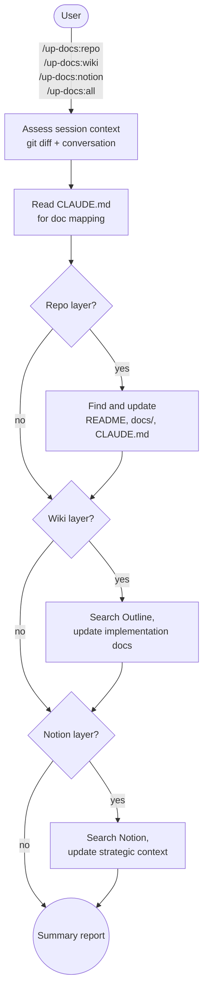
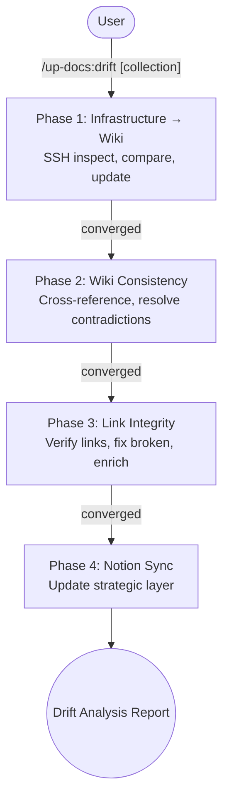

# up-docs

Update documentation across three layers (repo, Outline wiki, Notion) based on what changed during a session, plus comprehensive drift analysis for infrastructure documentation.

## Summary

Documentation lives in three places with different purposes: repo-local files capture project-specific details, the Outline wiki holds implementation-level reference material, and Notion maintains strategic context and organizational knowledge. Keeping all three in sync after a work session means explaining the same layering rules every time. up-docs encodes those rules into five slash commands: four for targeted updates that infer changes from session context, and one for comprehensive drift analysis that SSHes into live infrastructure, syncs the wiki, resolves contradictions, and verifies links before updating Notion.

## Principles

**[P1] Right Content, Right Layer**: Each documentation layer has a defined purpose and information level. Repo docs are project-specific. Outline is implementation reference ("how"). Notion is strategic context ("what and why"). Content that belongs in one layer does not get duplicated into another.

**[P2] Infer, Don't Interrogate**: Commands assess what changed from git diffs, recent commits, and conversation context. No pre-work questionnaires or intake forms.

**[P3] Update, Don't Rewrite**: Changes are targeted edits that preserve existing tone, structure, and formatting. Full-page rewrites only happen when a page is genuinely wrong throughout.

**[P4] Ground Truth Wins**: The live server or repository is the authority. When documentation conflicts with reality, update the documentation. Both Notion and Outline may lag slightly; that's acceptable. Factual conflicts are not.

## Requirements

- Claude Code (any recent version)
- Outline wiki accessible via MCP (mcp-outline server configured)
- Notion accessible via MCP (Notion MCP server configured)
- SSH access to infrastructure hosts (for `/up-docs:drift`)

## Installation

```bash
/plugin marketplace add L3DigitalNet/Claude-Code-Plugins
/plugin install up-docs@l3digitalnet-plugins
```

For local development:

```bash
claude --plugin-dir ./plugins/up-docs
```

## How It Works

### Session Update Commands



### Drift Analysis



## Usage

Run a command at a natural pausing point or end of session:

```
/up-docs:repo                Update repo documentation only
/up-docs:wiki                Update Outline wiki only
/up-docs:notion              Update Notion only
/up-docs:all                 Update all three layers sequentially
/up-docs:drift [collection]  Full drift analysis (infrastructure → wiki → links → Notion)
```

Each command produces a summary table listing every page or file examined, the action taken, and a one-line description of changes.

### Project Setup

Add a documentation mapping section to your project's CLAUDE.md so the commands know where to look:

```markdown
## Documentation

- Outline: "Homelab" collection
- Notion: "Infrastructure" section
- Repo docs: docs/, README.md
```

The mapping is intentionally loose. It points to the general area and lets Claude search for relevant content within it.

## Skills

| Skill | Invoked by |
|-------|------------|
| `up-repo` | `/up-docs:repo` or `/up-docs:all` |
| `up-wiki` | `/up-docs:wiki` or `/up-docs:all` |
| `up-notion` | `/up-docs:notion` or `/up-docs:all` |
| `up-all` | `/up-docs:all` |
| `up-drift` | `/up-docs:drift` |

## Planned Features

- Per-layer dry-run mode that previews changes without pushing to Outline or Notion

## Known Issues

- Requires both Outline and Notion MCP servers to be configured and running. If only one external system is available, use the individual commands for the layers you have.
- The session context inference relies on git history; in a fresh repo with no commits, the commands have less signal to work from.
- Notion and Outline MCP servers must be accessible from the current environment. Air-gapped systems can only use `/up-docs:repo`.
- `/up-docs:drift` requires SSH access to all documented hosts. Unreachable hosts are logged and skipped, not fatal.
- Drift analysis is designed for Opus 4.6 with 1M context. Running on smaller context models may cause truncation on large wiki collections.

## Links

- Repository: [L3DigitalNet/Claude-Code-Plugins](https://github.com/L3DigitalNet/Claude-Code-Plugins)
- Changelog: [`CHANGELOG.md`](CHANGELOG.md)
- Issues and feedback: [GitHub Issues](https://github.com/L3DigitalNet/Claude-Code-Plugins/issues)
